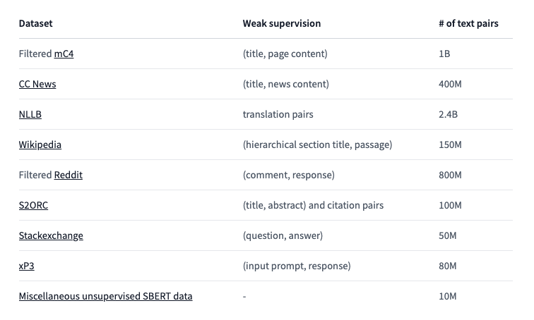

# Multilingual E5: A Machine Learning Model for Embedding Text in Multiple Languages

# Multilingual E5: A Machine Learning Model for Embedding Text in Multiple Languages

[](/@cochard-dav?source=post_page---byline--b4916cb22bda---------------------------------------)

[David Cochard](/@cochard-dav?source=post_page---byline--b4916cb22bda---------------------------------------)

3 min read

·

Jan 31, 2024

--

[Listen](/m/signin?actionUrl=https%3A%2F%2Fmedium.com%2Fplans%3Fdimension%3Dpost_audio_button%26postId%3Db4916cb22bda&operation=register&redirect=https%3A%2F%2Fmedium.com%2Faxinc-ai%2Fmultilingual-e5-a-machine-learning-model-for-embedding-text-in-multiple-languages-b4916cb22bda&source=---header_actions--b4916cb22bda---------------------post_audio_button------------------)

Share

This is an introduction to *Multilingual E5,* a machine learning model for embedding text in multiple languages, which allows for the accurate calculation of text similarity across different languages.

---

## Overview

*Multilingual E5*, released in December 2022, is a model designed for embedding text. Traditionally, for embedding multiple languages in on-premises environments, the [*SentenceTransformers*](https://www.sbert.net/) model [*paraphrase-multilingual-mpnet-base-v2*](https://huggingface.co/AIDA-UPM/mstsb-paraphrase-multilingual-mpnet-base-v2), released in 2019, was used. However, *Multilingual E5* represents a more recent and higher-precision model compared to its predecessor.

[## intfloat/multilingual-e5-base · Hugging Face

### We’re on a journey to advance and democratize artificial intelligence through open source and open science.

huggingface.co](https://huggingface.co/intfloat/multilingual-e5-base?source=post_page-----b4916cb22bda---------------------------------------)

[## Text Embeddings by Weakly-Supervised Contrastive Pre-training

### This paper presents E5, a family of state-of-the-art text embeddings that transfer well to a wide range of tasks. The…

arxiv.org](https://arxiv.org/abs/2212.03533v1?source=post_page-----b4916cb22bda---------------------------------------)

## Training dataset

Text embedding resolves the issue of keyword mismatches and enables efficient information retrieval. However, previous models were trained on limited labeled data or low-quality machine-translated data, which did not yield sufficient accuracy.

For example the dataset used for the previous *SentenceTransformers* model, *paraphrase-multilingual-mpnet-base-v2*, is the [*STSb（Semantic Textual Similarity Benchmark*](https://paperswithcode.com/sota/semantic-textual-similarity-on-sts-benchmark)*)* extended to 15 languages with Google Translator. For maintaining data quality the sentence pairs with a confidence value below 0.7 were dropped.

[## GitHub — Huertas97/Multilingual-STSB: Repository of the multilingual extension of STS Benchmark to…

### Repository of the multilingual extension of STS Benchmark to 15 languages — GitHub — Huertas97/Multilingual-STSB…

github.com](https://github.com/Huertas97/Multilingual-STSB?source=post_page-----b4916cb22bda---------------------------------------)

*Multilingual E5* has been trained on a much larger and more diverse set of data, composed of cleaned text pairs from the internet, known as the *CCPairs* dataset. This dataset is constructed by combining data sources such as community QA, [CommonCrawl](https://commoncrawl.org/), and scientific papers, followed by a filtering process. This approach in E5 ensures more accurate and reliable embeddings, as it leverages a diverse and comprehensive dataset.

Press enter or click to view image in full size


More details on the dataset composition can also be found below.

Press enter or click to view image in full size



<https://huggingface.co/intfloat/multilingual-e5-base>

## Compatibility between SentenceTransformers and Multilingual E5

The number of dimensions for embeddings in *Multilingual E5* is 768 for the base model and 1024 for the large model. *XLMRoberta* is used as the tokenizer, and since it employs the exact same *SentencePiece* model files as *SentenceTransformers*, the tokenizer can be used as is. This means you can easily replace *SentenceTransformers* with *Multilingual E5* in your applications by simply swapping out the models.

## Limitations of Multilingual E5

The maximum token length that can be input into *Multilingual E5* is 512. Exceeding this limit will result in an error during inference. It’s important to note that this is shorter than OpenAI’s[*text-embedding-ada-002*](https://platform.openai.com/docs/guides/embeddings/what-are-embeddings), which has a maximum token length of 8191. Users should be aware of this limitation when working with longer texts to ensure they are within the allowable range for *Multilingual E5*.

## Usage with ailia SDK

*Multilingual E5* can be used with ailia SDK using the following command.

```
$ python3 multilingual-e5.py -i sample.txt
```

[## ailia-models/natural\_language\_processing/multilingual-e5 at master · axinc-ai/ailia-models

### The collection of pre-trained, state-of-the-art AI models for ailia SDK …

github.com](https://github.com/axinc-ai/ailia-models/tree/master/natural_language_processing/multilingual-e5?source=post_page-----b4916cb22bda---------------------------------------)

In this sample, each line of `sample.txt` is embedded, and the text that is most similar to the input query is displayed.

## Usage with Unity

There is a sample available for using *Multilingual E5* from Unity. By using the ailia SDK to calculate the relevance between a query and text on a PC, it’s possible to implement a serverless RAG (Retrieval-Augmented Generation) system, similar to *langchain* or *llama-index*.

[## ailia-models-unity/Assets/AXIP/AILIA-MODELS/NaturalLanguageProcessing at master ·…

### Unity version of ailia models repository. Contribute to axinc-ai/ailia-models-unity development by creating an account…

github.com](https://github.com/axinc-ai/ailia-models-unity/tree/master/Assets/AXIP/AILIA-MODELS/NaturalLanguageProcessing?source=post_page-----b4916cb22bda---------------------------------------)

---

[ax Inc.](https://axinc.jp/en/) has developed [ailia SDK](https://ailia.jp/en/), which enables cross-platform, GPU-based rapid inference.

ax Inc. provides a wide range of services from consulting and model creation, to the development of AI-based applications and SDKs. Feel free to [contact us](https://axinc.jp/en/) for any inquiry.