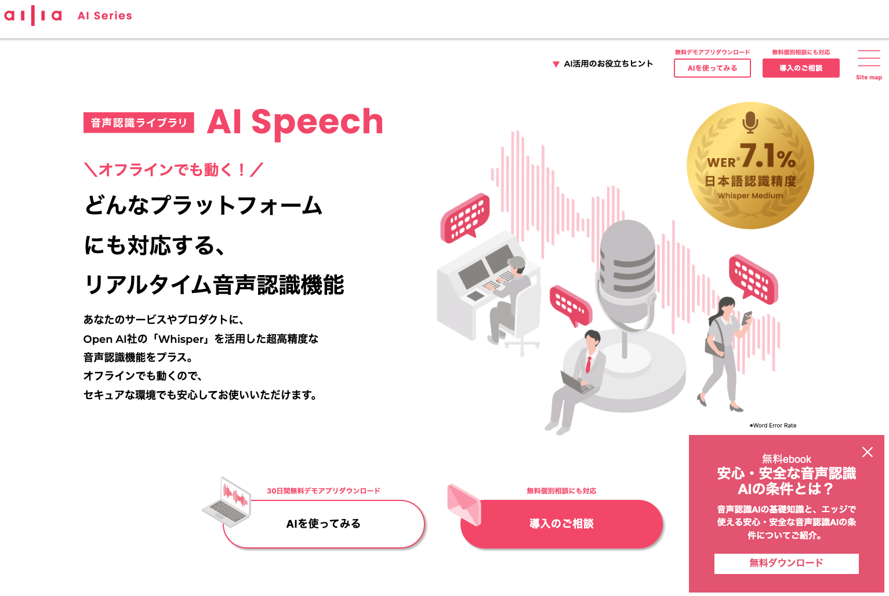
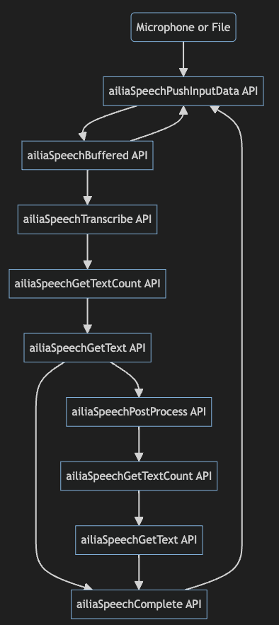

# Released ailia AI Speech 1.1.0

# Released ailia AI Speech 1.1.0

[David Cochard](/@cochard-dav?source=post_page---byline--c7f85defb04d---------------------------------------)

3 min read

·

Feb 1, 2024

--

[Listen](/m/signin?actionUrl=https%3A%2F%2Fmedium.com%2Fplans%3Fdimension%3Dpost_audio_button%26postId%3Dc7f85defb04d&operation=register&redirect=https%3A%2F%2Fmedium.com%2Faxinc-ai%2Freleased-ailia-ai-speech-1-1-0-c7f85defb04d&source=---header_actions--c7f85defb04d---------------------post_audio_button------------------)

Share

We released *ailia AI Speech 1.1.0*, which includes support for [*Whisper Large*](/axinc-ai/whisper-speech-recognition-model-capable-of-recognizing-99-languages-5b5cf0197c16), voice recognition error correction, and a Japanese translation feature.

---

## About ailia AI Speech

*ailia AI Speech* is a library that simplifies the implementation of AI-based voice recognition. It supports OpenAI’s [*Whisper*](/axinc-ai/whisper-speech-recognition-model-capable-of-recognizing-99-languages-5b5cf0197c16), enabling high-precision voice recognition to be implemented on edge devices without the need for a server.

Press enter or click to view image in full size

ailia AI Speech websit : <https://www.ailia.ai/speech>

We previously published an article presenting in details the main features of *ailia AI Speech.*

[## ailia AI Speech : Speech Recognition Library for Unity and C++

### Introducing ailia AI Speech, an AI speech recognition library which allows you to easily implement speech recognition…

medium.com](/axinc-ai/ailia-ai-speech-speech-recognition-library-for-unity-and-c-d29db1abe978?source=post_page-----c7f85defb04d---------------------------------------)

## New features added in ailia AI Speech 1.1.0

### Support of Whisper Large

We have added support for *Whisper Large V2* and *Whisper Large V3*. This enables the use of even more accurate models.

### Addition of PostProcess API

We have added a new post-processing API in *ailia AI Speech* pipeline. This makes it possible to apply different natural language processing models to the output of *Whisper*’s recognition results.

For example, it enables voice recognition error correction using [*T5*](/axinc-ai/t5-machine-learning-model-to-generate-text-from-text-ba1f819facdc), or English to Japanese translation using [*FuguMT*](/axinc-ai/fugumt-machine-learning-model-for-english-to-japanese-translation-0ac47b924244), by simply calling the `ailiaSpeechPostProcess` function right after `ailiaSpeechTranscribe` completes.

Flow of function calls in ailia AI Speech

### Voice Recognition Error Correction

For voice recognition error correction using [*T5*](/axinc-ai/t5-machine-learning-model-to-generate-text-from-text-ba1f819facdc), a model trained with a medical terminology dictionary, optimized for *Whisper Medium*, is available.

### Translation to Japanese

For translation into Japanese, [*FuguMT*](/axinc-ai/fugumt-machine-learning-model-for-english-to-japanese-translation-0ac47b924244) can be used to perform English to Japanese translation. [*Whisper*](/axinc-ai/whisper-speech-recognition-model-capable-of-recognizing-99-languages-5b5cf0197c16) supports translation from 99 languages into English, but it previously lacked the functionality to translate into Japanese. With the introduction of the *PostProcess* API, translations to unsupported language such as Japanese can be added, facilitating the development of apps such as interpreters.

In our sample below, English voice recognition (speech to text) is performed with *Whisper*, and then the sentences are translated into Japanese using [*FuguMT*](/axinc-ai/fugumt-machine-learning-model-for-english-to-japanese-translation-0ac47b924244), all of this operates on edge devices, eliminating the need for cloud services.

## Download and Samples

*ailia AI Speech* evaluation version and samples can be downloaded from the official website.

[## AI Speech ｜ailia AI Series

### オフラインでも動く！どんなプラットフォームにも対応する、リアルタイム音声認識機能「AI Speech」です。

www.ailia.ai](https://www.ailia.ai/speech?source=post_page-----c7f85defb04d---------------------------------------)

When using translation in the demo application, please select `medium` as model, `translate` for the mode, and `fugumt_en_ja` as option, as shown below.

Press enter or click to view image in full size

ailia AI Speech demo application

By setting the model to `medium`, you can achieve more accurate voice recognition than with the `small` setting. Choosing `translate` as the mode enables the use of *Whisper*’s translation mode, which can consistently convert multilingual voice recognition results into English. By selecting `fugumt_en_ja` as the option, it’s possible to translate the English output from *Whisper* into Japanese.

## Conclusion

*ailia AI Speech* is a library that simplifies the use of OpenAI’s *Whisper* on edge devices. In addition to the official *Whisper* features, it includes the following unique functionalities:

- A live conversion feature that allows you to start converting without waiting for 30 seconds.
- A Voice Activity Detection (VAD) feature that detects silence and converts only the segments with sound.
- A post-processing feature for voice recognition error correction and translation into Japanese.
- Compatibility with smartphones, including iOS and Android.

If you’re considering voice recognition solutions, please don’t hesitate to [contact us](https://axinc.jp/en/) for more information.

---

[ax Inc.](https://axinc.jp/en/) has developed [ailia SDK](https://ailia.jp/en/), which enables cross-platform, GPU-based rapid inference.

ax Inc. provides a wide range of services from consulting and model creation, to the development of AI-based applications and SDKs. Feel free to [contact us](https://axinc.jp/en/) for any inquiry.