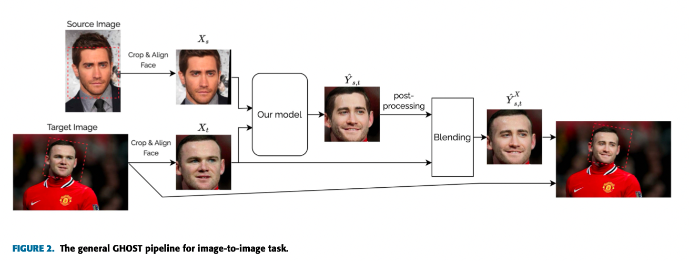
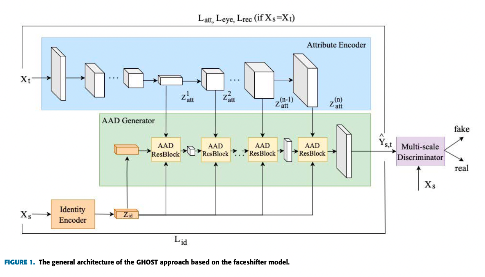
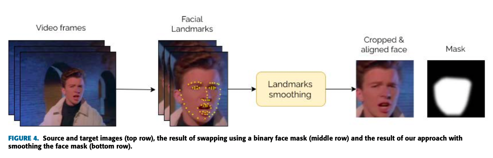
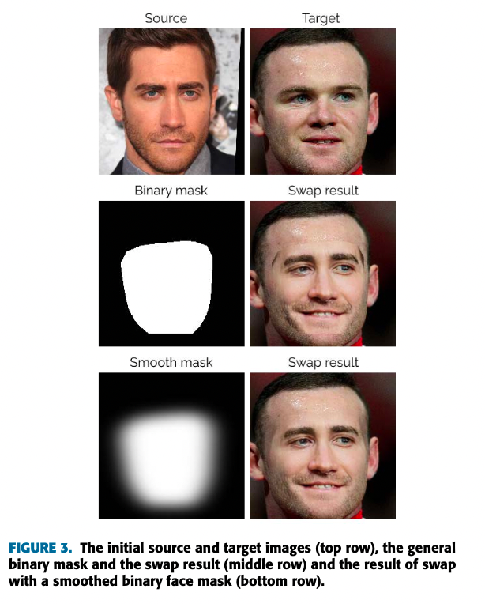
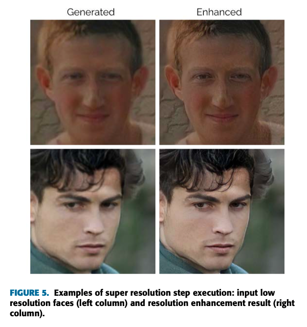
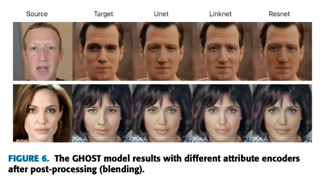
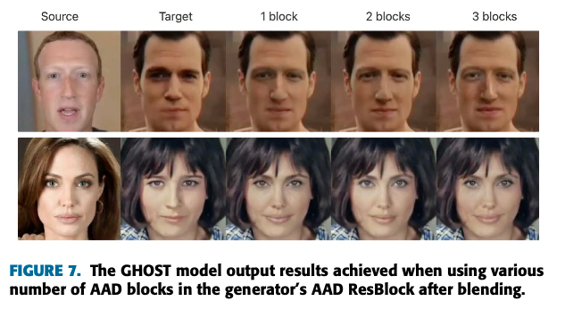
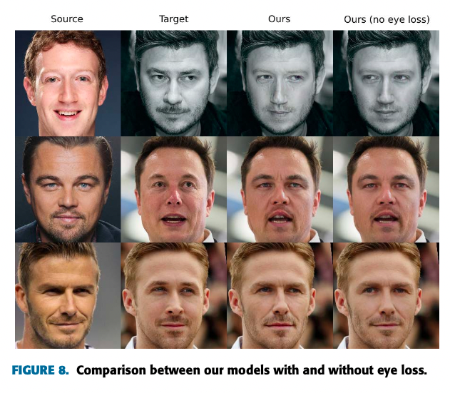

# SberSwap: High-Precision FaceSwap Powered by AI

# SberSwap: High-Precision FaceSwap Powered by AI

[](/@cochard-dav?source=post_page---byline--ef29c9639a68---------------------------------------)

[David Cochard](/@cochard-dav?source=post_page---byline--ef29c9639a68---------------------------------------)

5 min read

·

Feb 4, 2024

--

1

[Listen](/m/signin?actionUrl=https%3A%2F%2Fmedium.com%2Fplans%3Fdimension%3Dpost_audio_button%26postId%3Def29c9639a68&operation=register&redirect=https%3A%2F%2Fmedium.com%2Faxinc-ai%2Fsberswap-high-precision-faceswap-powered-by-ai-ef29c9639a68&source=---header_actions--ef29c9639a68---------------------post_audio_button------------------)

Share

This is an introduction to「SberSwap」, a machine learning model that can be used with [ailia SDK](https://ailia.jp/en/). You can easily use this model to create AI applications using [ailia SDK](https://ailia.jp/en/) as well as many other ready-to-use [ailia MODELS](https://github.com/axinc-ai/ailia-models).

## Overview

*SberSwap* is a face swap model that was released in April 2022. It has since been renamed to *Ghost*, but it is still based on the same technology.

[## GitHub — ai-forever/ghost: A new one shot face swap approach for image and video domains

### A new one shot face swap approach for image and video domains — GitHub — ai-forever/ghost: A new one shot face swap…

github.com](https://github.com/ai-forever/ghost?source=post_page-----ef29c9639a68---------------------------------------)

[## GHOST-A New Face Swap Approach for Image and Video Domains

### Deep fake stands for a face swapping algorithm where the source and target can be an image or a video. Researchers have…

ieeexplore.ieee.org](https://ieeexplore.ieee.org/abstract/document/9851423?source=post_page-----ef29c9639a68---------------------------------------)

Face-swapping is utilized in the movie industry, as well as for creating makeup effects, hairstyling, and generating datasets for training face detection and recognition models.

Traditionally, face swap has employed GANs (Generative Adversarial Networks) or auto-encoders. However, these existing methods introduced visual artifacts. Additionally, many of these technologies were designed for still images, presenting challenges when applied to video content.

*SberSwap* takes the [*FaceShifter*](https://arxiv.org/abs/1912.13457)architecture as a baseline approach but also enhance quality through various techniques, including a loss function focused on the eyes, smoothing of face masks, smoothing between adjacent frames for video content, and super-resolution of face images.

## Architecture

The faces on both the source image and the target image are detected, and affine transformations are computed. Next, both facial images are input into the AI model to generate the faceswap image. This generated image is then blended with the target image using a mask generated from facial keypoints. Finally, the faceswap image undergoes an inverse transformation and is composited back onto the original frame.

Press enter or click to view image in full size



Source: <https://ieeexplore.ieee.org/abstract/document/9851423>

The model architecture involves taking as inputs two 256x256 images as source and target. The target image is used as is, while for the source image, a 512-dimensional embedding is calculated by applying [*ArcFace*](/axinc-ai/arcface-a-machine-learning-model-for-face-recognition-5f743cdac6fa) to a resized 112x112 version of the image. In the generator, the face area from the target image and the embedding from the source image are used as inputs to output the faceswap image.

Press enter or click to view image in full size



Source: <https://ieeexplore.ieee.org/abstract/document/9851423>

The faceswap image is not used directly, instead, it is composited with the target image using a mask calculated from facial landmarks. For the detection of facial landmarks, *MXNet* at a resolution of 192x192 is used.

Press enter or click to view image in full size



Source: <https://ieeexplore.ieee.org/abstract/document/9851423>

Smoothing is applied to the mask. Here is a comparison of image quality between using a binary mask and a smooth mask. Using a smooth mask results in a smoother output.

Press enter or click to view image in full size



Source: <https://ieeexplore.ieee.org/abstract/document/9851423>

Finally, super-resolution processing using *Pix2Pix* is applied to the face image after blending. This sharpens the facial image. Both the input and output resolutions are 256x256.



Source: <https://ieeexplore.ieee.org/abstract/document/9851423>

Below is a comparison of image quality between different model architectures. Ultimately, *Unet* is used.



Source: <https://ieeexplore.ieee.org/abstract/document/9851423>

Below is a comparison of image quality based on the number of blocks within the model. Ultimately, 2 blocks are used.



Source: <https://ieeexplore.ieee.org/abstract/document/9851423>

Finally, below is a comparison of loss functions. Using Eye loss results in improved accuracy.



Source: <https://ieeexplore.ieee.org/abstract/document/9851423>

## Usage

To use SberSwap with ailia SDK, use the following command. It replaces the face in `target.jpg` with the face from `source.jpg` and outputs the result as `output.jpg`.

```
$ python3 sber-swap.py --input target.jpg --source source.jpg --savepath output.jpg
```

It can also be applied to video inputs.

```
$ python3 sber-swap.py --video target.mp4 --source source.jpg --savepath output.mp4
```

Use the `-usr_sr` option to apply face enhancement.

```
$ python3 sber-swap.py --use_sr
```

[## ailia-models/generative\_adversarial\_networks/sber-swap at master · axinc-ai/ailia-models

### The collection of pre-trained, state-of-the-art AI models for ailia SDK …

github.com](https://github.com/axinc-ai/ailia-models/tree/master/generative_adversarial_networks/sber-swap?source=post_page-----ef29c9639a68---------------------------------------)

Currently, it is only possible to perform faceswap on one person. In principle, by combining it with a tracking algorithm like [*ByteTrack*](/axinc-ai/bytetrack-tracking-model-that-also-considers-low-accuracy-bounding-boxes-17f5ed70e00c), it is possible to perform faceswap on multiple people.

## Merits of using ailia SDK

The official *SberSwap* uses three frameworks: *MXNet* (CUDA) for face detection, *ONNX Runtime* (CUDA) for landmark detection, and *Torch* (CUDA) to run [*ArcFace*](/axinc-ai/arcface-a-machine-learning-model-for-face-recognition-5f743cdac6fa) and the generator.

Notably, there may be version conflicts, such as *MXNet* requiring *numpy* 1.23 or lower, while *ONNX Runtime* requires *numpy* 1.24.2 or later. Additionally, because it operates only in a CUDA environment, there are challenges in running it on systems without CUDA support, such as macOS.

By using the ailia MODELS version of *SberSwap*, implementation can be achieved solely with the ailia SDK, unifying *numpy* and CUDA versions. This makes it ideally suited for long-term maintenance.

---

[ax Inc.](https://axinc.jp/en/) has developed [ailia SDK](https://ailia.jp/en/), which enables cross-platform, GPU-based rapid inference.

ax Inc. provides a wide range of services from consulting and model creation, to the development of AI-based applications and SDKs. Feel free to [contact us](https://axinc.jp/en/) for any inquiry.