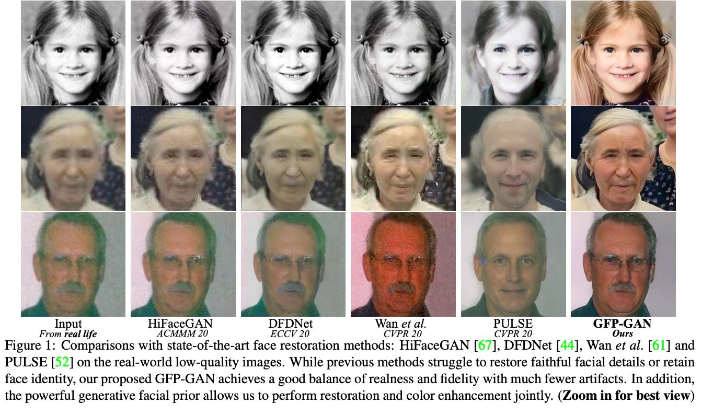
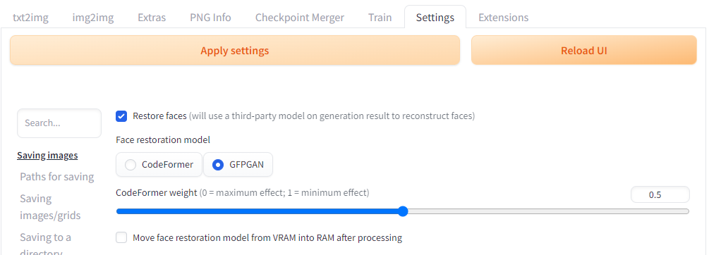
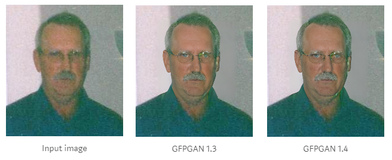
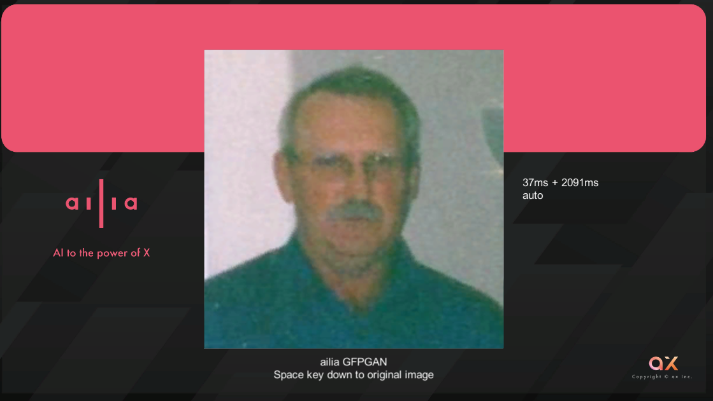
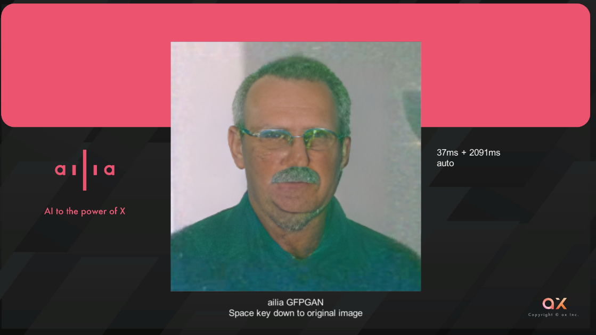

# GFPGAN: A Machine Learning Model for Enhancing the Quality of Facial Images

# GFPGAN: A Machine Learning Model for Enhancing the Quality of Facial Images

[](/@cochard-dav?source=post_page---byline--f46df488bf31---------------------------------------)

[David Cochard](/@cochard-dav?source=post_page---byline--f46df488bf31---------------------------------------)

4 min read

·

Feb 15, 2024

--

[Listen](/m/signin?actionUrl=https%3A%2F%2Fmedium.com%2Fplans%3Fdimension%3Dpost_audio_button%26postId%3Df46df488bf31&operation=register&redirect=https%3A%2F%2Fmedium.com%2Faxinc-ai%2Fgfpgan-a-machine-learning-model-for-enhancing-the-quality-of-facial-images-f46df488bf31&source=---header_actions--f46df488bf31---------------------post_audio_button------------------)

Share

This is an introduction to「GFPGAN」, a machine learning model that can be used with [ailia SDK](https://ailia.jp/en/). You can easily use this model to create AI applications using [ailia SDK](https://ailia.jp/en/) as well as many other ready-to-use [ailia MODELS](https://github.com/axinc-ai/ailia-models).

## Overview

*GFPGAN (Generative Facial Prior GAN)* is a machine learning model announced by *Tencent* in January 2021 that takes low-quality facial images as input and restores them to high-quality facial images.

[## GitHub — TencentARC/GFPGAN: GFPGAN aims at developing Practical Algorithms for Real-world Face…

### GFPGAN aims at developing Practical Algorithms for Real-world Face Restoration. — GitHub — TencentARC/GFPGAN: GFPGAN…

github.com](https://github.com/TencentARC/GFPGAN?source=post_page-----f46df488bf31---------------------------------------)

[## Towards Real-World Blind Face Restoration with Generative Facial Prior

### Blind face restoration usually relies on facial priors, such as facial geometry prior or reference prior, to restore…

arxiv.org](https://arxiv.org/abs/2101.04061?source=post_page-----f46df488bf31---------------------------------------)

## Architecture

*GFPGAN* belongs to the field of *Blind Face Restoration,* a task that involves restoring deterioration such as low resolution, noise, blur, and compression noise.

GFPGAN corrects facial details and color in a single pass.

Press enter or click to view image in full size


GFPGAN architecture (Source: <https://arxiv.org/pdf/2101.04061.pdf>)

*GFPGAN* starts by detecting the face using [*RetinaFace*](/axinc-ai/retinaface-a-face-detection-model-designed-for-high-resolution-6c3900771a01), which return 5 landmarks delimiting the face area on which to perform an affine transformation using iterative optimization with `cv2.LMEDS` through `cv2.estimateAffinePartial2D` to normalize the orientation of the face.

Press enter or click to view image in full size


Input image (Source: <https://github.com/TencentARC/GFPGAN/blob/master/inputs/whole_imgs/10045.png>)


Normalized face

Noise reduction is performed on each face using *UNet*, then *StyleGAN2* is applied to restore the images to high-resolution facial pictures.

The input for *GFPGAN* is a 512x512 image in RGB order with values in the range [-1, 1].


Input image

The output image has the same resolution, and it is transformed back using inverse affine transformation, and a Gaussian blur is applied to the edges before blending with the original image.


Mask for Boundary Blending


Output image

Press enter or click to view image in full size



GFPGAN results (Source: <https://arxiv.org/pdf/2101.04061.pdf>)

## Usage with Stable Diffusion

[StableDiffusionWebUI](/axinc-ai/generate-images-with-custom-poses-using-stablediffusionwebui-and-controlnet-c18d190cade1) comes standard with *GFPGAN* integrated. It can be activated from the settings, under the “Face restoration” parameters.

Press enter or click to view image in full size



## Usage with ailia SDK

*GFPGAN* can be used with ailia SDK using the following command.

```
$ python3 gfpgan.py --input input.jpg --savepath output.jpg
```

By adding the `-m` option, it is possible to select the version of *GFPGAN* to use. The default version is v1.3.

```
$ python3 gfpgan.py --input input.jpg --savepath output.jpg -m v1.4
```

Here is a comparison of the result between version 1.3 and 1.4



[## ailia-models/face\_restoration/gfpgan at master · axinc-ai/ailia-models

### The collection of pre-trained, state-of-the-art AI models for ailia SDK - ailia-models/face\_restoration/gfpgan at…

github.com](https://github.com/axinc-ai/ailia-models/tree/master/face_restoration/gfpgan?source=post_page-----f46df488bf31---------------------------------------)

## Usage with Unity

There is a sample available for using *GFPGAN* from *Unity*. In this sample, [*BlazeFace*](/axinc-ai/blazeface-a-machine-learning-model-for-fast-detection-of-face-positions-and-key-points-5dcfb9429d72)is used instead of *RetinaFace*.

[## ailia-models-unity/Assets/AXIP/AILIA-MODELS/GenerativeAdversarialNetworks at master ·…

### Unity version of ailia models repository. Contribute to axinc-ai/ailia-models-unity development by creating an account…

github.com](https://github.com/axinc-ai/ailia-models-unity/tree/master/Assets/AXIP/AILIA-MODELS/GenerativeAdversarialNetworks?source=post_page-----f46df488bf31---------------------------------------)

Press enter or click to view image in full size



Input

Press enter or click to view image in full size



Output

---

[ax Inc.](https://axinc.jp/en/) has developed [ailia SDK](https://ailia.jp/en/), which enables cross-platform, GPU-based rapid inference.

ax Inc. provides a wide range of services from consulting and model creation, to the development of AI-based applications and SDKs. Feel free to [contact us](https://axinc.jp/en/) for any inquiry.