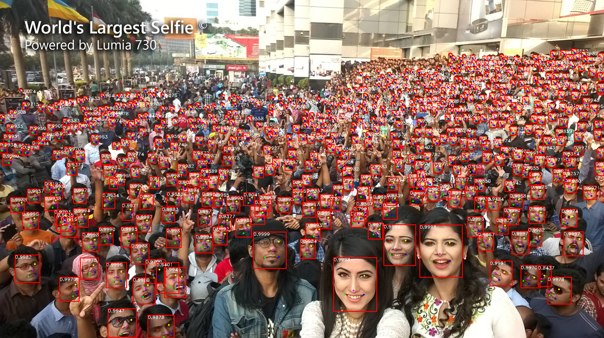
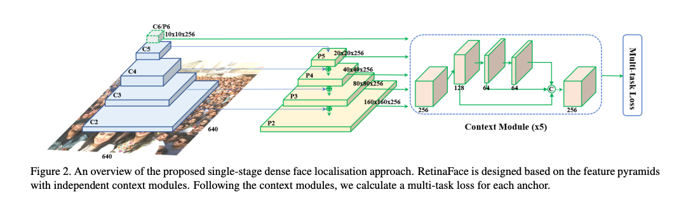
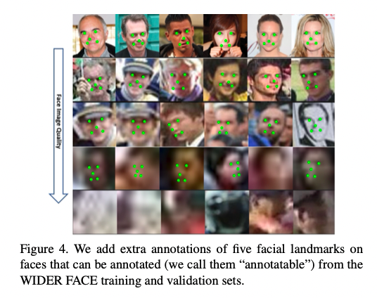
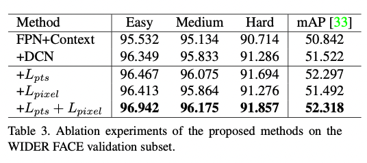
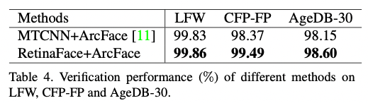

# RetinaFace: A Face Detection Model for High Resolution Images

# RetinaFace: A Face Detection Model for High Resolution Images

[](/@cochard-dav?source=post_page---byline--6c3900771a01---------------------------------------)

[David Cochard](/@cochard-dav?source=post_page---byline--6c3900771a01---------------------------------------)

5 min read

·

Feb 16, 2024

--

1

[Listen](/m/signin?actionUrl=https%3A%2F%2Fmedium.com%2Fplans%3Fdimension%3Dpost_audio_button%26postId%3D6c3900771a01&operation=register&redirect=https%3A%2F%2Fmedium.com%2Faxinc-ai%2Fretinaface-a-face-detection-model-designed-for-high-resolution-6c3900771a01&source=---header_actions--6c3900771a01---------------------post_audio_button------------------)

Share

This is an introduction to「RetinaFace」, a machine learning model that can be used with [ailia SDK](https://ailia.jp/en/). You can easily use this model to create AI applications using [ailia SDK](https://ailia.jp/en/) as well as many other ready-to-use [ailia MODELS](https://github.com/axinc-ai/ailia-models).

## Overview

*RetinaFace* is a high-precision face detection model released in May 2019, developed by the *Imperial College London* in collaboration with *InsightFace*, well-known for its [face recognition library](https://insightface.ai/).

The model computes the bounding boxes of faces as well as keypoints for eyes and mouth. It also works flawlessly on high-resolution images without resizing and performs hierarchical detection processes, allowing for the robust detection of small faces within the image.

Press enter or click to view image in full size



RetinaFace output on the “World’s Largest Selfie” (Source: <https://github.com/riganxu/selfieBenchmark>)

[## GitHub — biubug6/Pytorch\_Retinaface: Retinaface get 80.99% in widerface hard val using…

### Retinaface get 80.99% in widerface hard val using mobilenet0.25. — GitHub — biubug6/Pytorch\_Retinaface: Retinaface get…

github.com](https://github.com/biubug6/Pytorch_Retinaface?source=post_page-----6c3900771a01---------------------------------------)

[## RetinaFace: Single-stage Dense Face Localisation in the Wild

### Though tremendous strides have been made in uncontrolled face detection, accurate and efficient face localisation in…

arxiv.org](https://arxiv.org/abs/1905.00641?source=post_page-----6c3900771a01---------------------------------------)

## Architecture

*RetinaFace* enables the detection of small faces through hierarchical processing using a feature pyramid. It uses *ResNet50* as its backbone, supplying feature vectors from multiple layers of *ResNet50* to the detection stage.

Press enter or click to view image in full size



RetinaFace architecture (Source: <https://arxiv.org/pdf/1905.00641.pdf>)

The training was performed on the dataset [*Wider Face*](http://shuoyang1213.me/WIDERFACE/) with the addition of 5-point facial landmarks.



Annotations (Source: <https://arxiv.org/pdf/1905.00641.pdf>)

The input images are processed by subtracting the mean RGB values `(104, 117, 123)` from the 0–255 range before being supplied to the AI model. The output consists of three components: `loc = (1, 16800, 4)`, `conf = (1, 16800, 2)`, and `landms = (1, 16800, 10)`. The value 16800 represents the number of anchors, which varies based on the input resolution.

The shape of the *PriorBox* (aka. anchor box), which serves as the anchor, is `(16800, 4)`, storing the center points `(cx, cy)` and sizes `(cw, ch)`. These values can be uniquely determined from the input image size, allowing *RetinaFace* to be executed on images of any size and to process high-resolution images directly. The PriorBox is structured into three layers, totaling `12800 + 3200 + 800 = 16800` for the three layers.

```
[[0.00195312 0.00347826 0.0078125  0.01391304]  
 [0.00195312 0.00347826 0.015625   0.02782609]  
 [0.00585938 0.00347826 0.0078125  0.01391304]  
 ...  
 [0.9765625  0.98782609 0.25       0.44521739]  
 [0.9921875  0.98782609 0.125      0.2226087 ]  
 [0.9921875  0.98782609 0.25       0.44521739]]
```


Anchor overview (Source: <https://arxiv.org/pdf/1905.00641.pdf>)

To calculate the coordinates of the bounding box, the model output `loc` is used, which contains `x, y, w, h`. By adding the scaled versions of the model output `loc`'s `x, y` (multiplied by the variance of 0.1) to the anchors' priors' `cx, cy`, and then scaling the anchors' priors' `cw, ch` by multiplying them by the exponential of `loc`'s `w, h` (scaled by the variance of 0.2), you get the bounding box's `cx, cy, w, h`. Thus, by adjusting the coordinates of the anchors' priors with the model output `loc`, the bounding box can be computed.

```
boxes = np.concatenate((  
        priors[:, :2] + loc[:, :2] * variances[0] * priors[:, 2:],  
        priors[:, 2:] * np.exp(loc[:, 2:] * variances[1])), axis = 1)  
    boxes[:, :2] -= boxes[:, 2:] / 2  
    boxes[:, 2:] += boxes[:, :2]  
    return boxes
```

To calculate the landmarks, the model output `landms`, which contains x and y coordinates, is used and a similar computation logic is applied.

```
landms = np.concatenate((priors[:, :2] + pre[:, :2] * variances[0] * priors[:, 2:],  
                        priors[:, :2] + pre[:, 2:4] * variances[0] * priors[:, 2:],  
                        priors[:, :2] + pre[:, 4:6] * variances[0] * priors[:, 2:],  
                        priors[:, :2] + pre[:, 6:8] * variances[0] * priors[:, 2:],  
                        priors[:, :2] + pre[:, 8:10] * variances[0] * priors[:, 2:],  
                        ), axis = 1)  
    return landms
```

Finally, the bounding boxes are filtered based on `conf.`

## Precision

*RetinaFace* has achieved an mAP (mean Average Precision) of 52.318 in face detection. It is worth noting that the backbone used in the numerical evaluation within the paper is *ResNet151*.



Benchmark (Source: <https://arxiv.org/pdf/1905.00641.pdf>)

## Application to face authentification

[*ArcFace*](/axinc-ai/arcface-a-machine-learning-model-for-face-recognition-5f743cdac6fa) is widely used as a face authentication algorithm but it does not define a method for face detection. By introducing *RetinaFace* as preprocessing and using aligned images for training and inference, it has been demonstrated that face authentication accuracy can be improved from 98.37% to 99.49%.



Benchmark (Source: <https://arxiv.org/pdf/1905.00641.pdf>)

## Usage

*RetinaFace* can be used with ailia SDK with the following command. By default, it uses *ResNet50* as the backbone. Since *RetinaFace* uses input images without resizing, the processing time increases with the resolution of the image.

```
$ python3 retinaface.py  --input input.jpg --savepath output.jpg
```

The backbone can be changed to *MobileNet* using the `arch` option. This can speed up the processing for high-resolution images.

```
$ python3 retinaface.py  --input input.jpg --savepath output.jpg --arch mobile0.25
```

[## ailia-models/face\_detection/retinaface at master · axinc-ai/ailia-models

### The collection of pre-trained, state-of-the-art AI models for ailia SDK — ailia-models/face\_detection/retinaface at…

github.com](https://github.com/axinc-ai/ailia-models/tree/master/face_detection/retinaface?source=post_page-----6c3900771a01---------------------------------------)

Press enter or click to view image in full size


ResNet50 Backbone output (2048x1150, 712ms / M2 Mac GPU)

Press enter or click to view image in full size


MobileNet Backbone output (2048x1150, 58.5ms / M2 Mac GPU）

---

[ax Inc.](https://axinc.jp/en/) has developed [ailia SDK](https://ailia.jp/en/), which enables cross-platform, GPU-based rapid inference.

ax Inc. provides a wide range of services from consulting and model creation, to the development of AI-based applications and SDKs. Feel free to [contact us](https://axinc.jp/en/) for any inquiry.