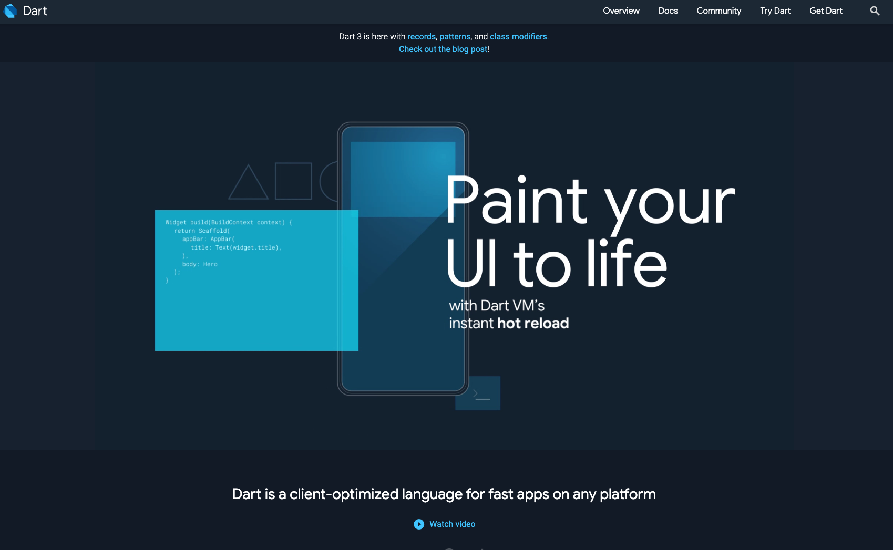
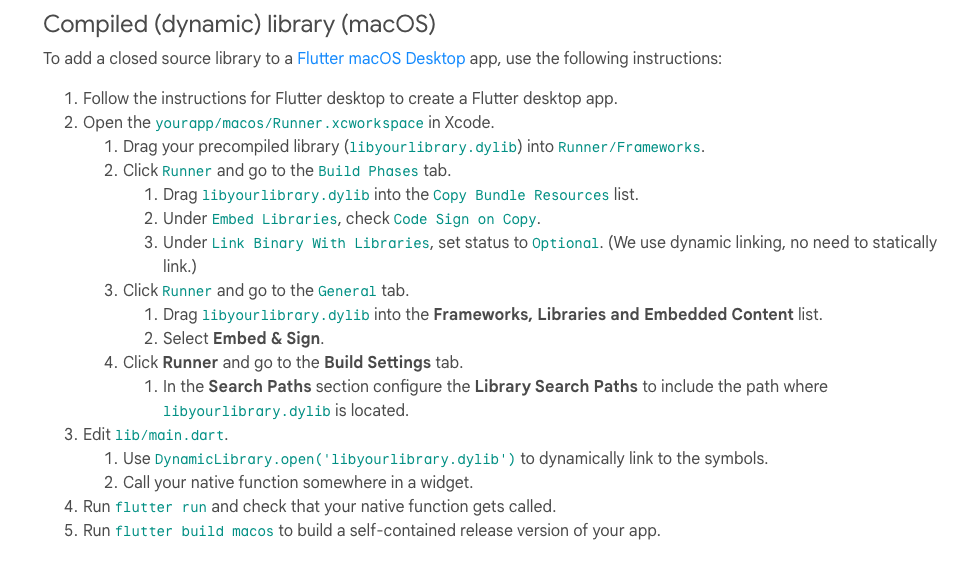
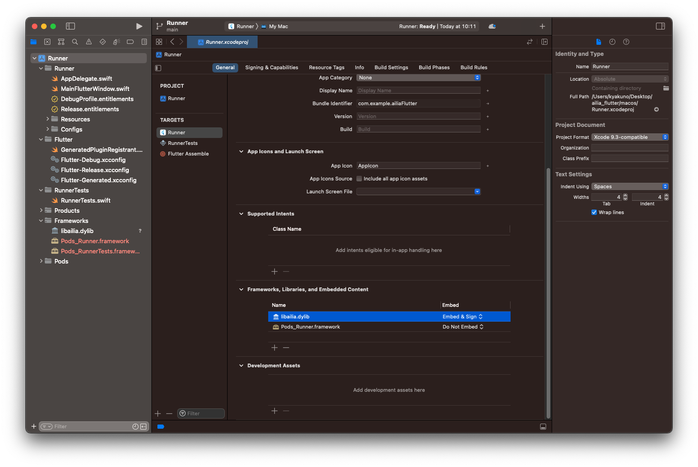
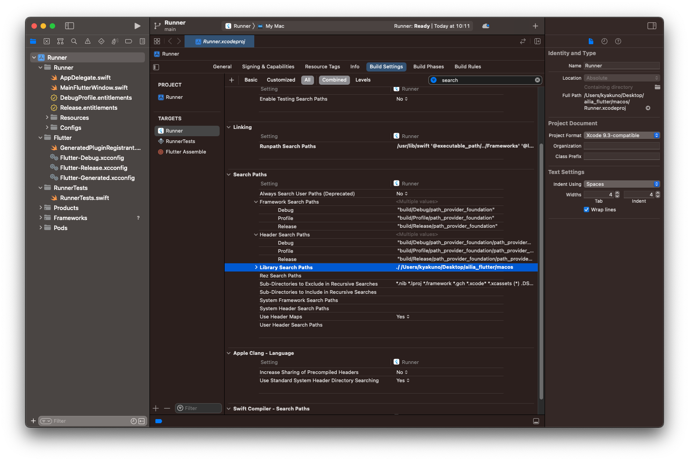
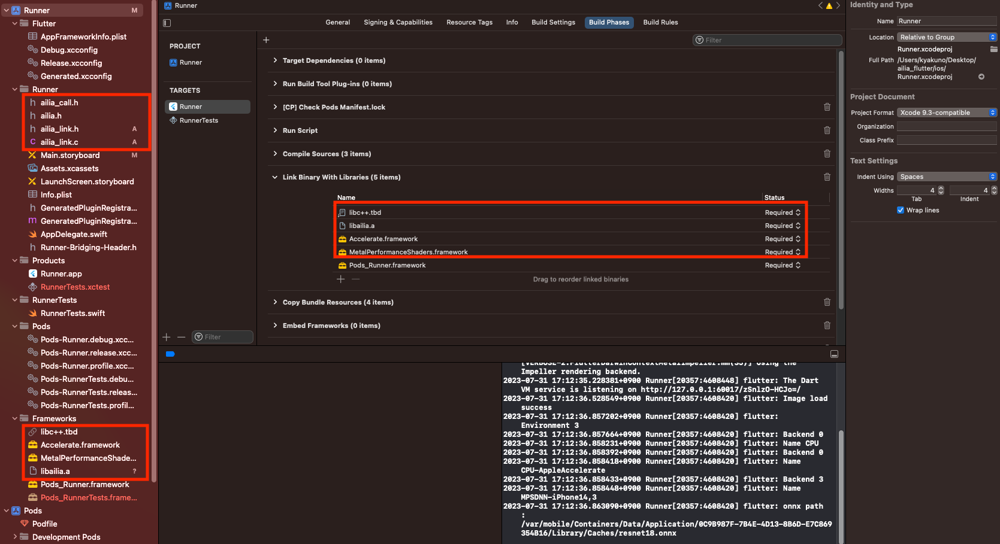
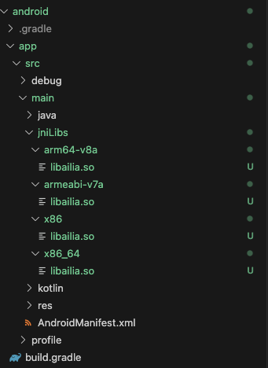
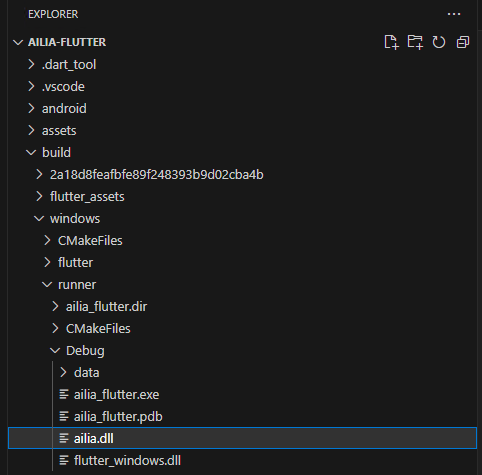
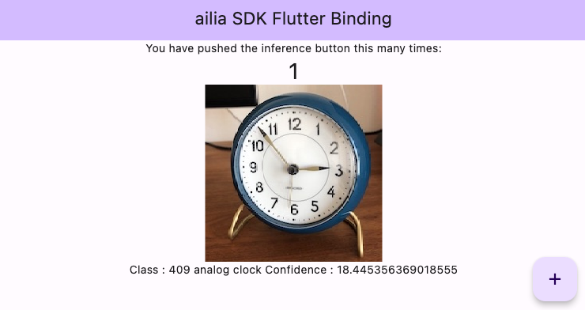

# ailia SDK Tutorial (Flutter)

# ailia SDK Tutorial (Flutter)

[](/@cochard-dav?source=post_page---byline--3fa7009f12b7---------------------------------------)

[David Cochard](/@cochard-dav?source=post_page---byline--3fa7009f12b7---------------------------------------)

7 min read

·

Feb 22, 2024

--

[Listen](/m/signin?actionUrl=https%3A%2F%2Fmedium.com%2Fplans%3Fdimension%3Dpost_audio_button%26postId%3D3fa7009f12b7&operation=register&redirect=https%3A%2F%2Fmedium.com%2Faxinc-ai%2Failia-sdk-tutorial-flutter-3fa7009f12b7&source=---header_actions--3fa7009f12b7---------------------post_audio_button------------------)

Share

This is a tutorial on using [ailia SDK](https://ailia.jp/en/) to perform inference with ONNX in Flutter by using FFI to translate the ailia SDK’s C API into Dart.

---

## About Flutter

Flutter is a cross-platform development environment developed by Google. It uses Dart as its programming language, enabling the development of GUI applications for Windows, macOS, iOS, Android, and the web.

Press enter or click to view image in full size


<https://flutter.dev/>

## About Dart

Dart is a programming language developed by Google. Its language specifications resemble a combination of C, C#, and JavaScript.

Press enter or click to view image in full size



<https://dart.dev/>

## About ailia SDK

ailia SDK is a cross-platform AI inference engine developed by [ax Inc](https://axinc.jp/en/). which allows you to perform inference of AI models in ONNX format using C, C++, C#, Python, and JNI. Apps developed with it can run on Windows, macOS, iOS, Android, Linux, Raspberry Pi, and Jetson. An evaluation version can be downloaded from the link below.

[## ax Inc.

### A future in which all devices carry AI We believe such a future is on the way. To usher in that day, we will keep…

axinc.jp](https://axinc.jp/en/trial/?source=post_page-----3fa7009f12b7---------------------------------------)

## Converting ailia.h to ailia.dart Using FFI

To use ailia SDK from Flutter, you need to convert ailia SDK C API into Dart callable functions using Dart’s FFI (Foreign Function Interface). FFI allows Dart to call native APIs. For the conversion, the Dart package `ffigen` is used.

The following steps are necessary to generate a Dart file for ailia. If you’re using a Dart file that has already been converted and provided by our company, these steps are not required.

`ffigen` requires LLVM, so on macOS, LLVM is installed using brew. The latest version of LLVM is `llvm@16`, but if you're using an M1 Mac, the installation might fail, so `llvm@15` is used instead.

```
brew install llvm@15
```

If installed via brew, specifying `arch arm64` still results in the installation of the x86\_64 version, causing an architecture error with `libclang.dylib`. Therefore, the x86\_64 version of Flutter was also used.

After installing LLVM, add `ffigen` to `pubspec.yaml`, and convert `.h` to `.dart` using the command below.

```
dart run ffigen --config ffigen_ailia.yaml
```

`ffigen_ailia.yaml` is written as follows. Set the path to the source header file and the path to the destination Dart file.

```
name: 'ailiaFFI'  
description: 'Written for the FFI article'  
output: 'lib/ffi/ailia.dart'  
headers:  
  entry-points:  
    - 'native/ailia.h'  
    - 'native/ailia_classifier.h'  
    - 'native/ailia_detector.h'  
    - 'native/ailia_feature_extractor.h'  
    - 'native/ailia_format.h'  
    - 'native/ailia_pose_estimator.h'  
llvm-path:  
  - '/usr/local/opt/llvm@15'
```

The generated interface is output to `lib/ffi/ailia.dart`.

In Dart, functions starting with an underscore (\_) are considered private functions. Therefore, ailia structures starting with an underscore do not have `final` added after conversion, resulting in a compile error. For any structures that cause an error, please manually add `final`.

## Registering the DLL with the Project

To load ailia from Dart, the `DynamicLibrary` class is used. Therefore, download the evaluation version of the ailia SDK and incorporate the library from the `library` folder into your Flutter project.

### macOS

For macOS, after registering `libailia.dylib` in the `macos` folder, open `macos/Runner.xcworkspace` and follow the steps below to register `libailia.dylib`.

Press enter or click to view image in full size



macOS library registration (<https://docs.flutter.dev/platform-integration/macos/c-interop>)

Specifically, add `libailia.dylib` to `Runner/Frameworks` and set it to `Embed & Sign`. Also, add the library's folder path to the `Library Search Paths` in `Build Settings`.

Press enter or click to view image in full size



Framework registration

Press enter or click to view image in full size



SearchPath settings

### iOS

For iOS, after placing `libailia.a` in the `ios` folder, open `ios/Runner.xcworkspace` and add `libailia.a`, `libc++.tbd`, `Accelerate.framework`, and `MetalPerformanceShaders` to Frameworks.

Press enter or click to view image in full size



iOS library registration

For iOS, if no function within `libailia.a` is called even once, it will not be linked by the linker, resulting in a "Symbol not found" error with `dlopen`. Therefore, add `ailia_link.c` and make a dummy call to `ailiaGetVersion()` to ensure it gets linked.

### Android

For Android, copy the library into `android/app/src/main/jniLibs`.



Android library registration

### Windows

For Windows, after building, copy `ailia.dll` into `build/windows/runner/Debug`.



Windows library registration

## Model Files

Place the model file in the `assets` folder and include it in the app by specifying it in `pubspec.yaml`.

```
assets:  
    - assets/resnet18.onnx  
    - assets/clock.jpg
```

Since assets are packed into a single file, when using them with ailia SDK, copy them to the `TemporaryDirectory` before use.

```
Future<File> copyFileFromAssets(String path) async {  
    final byteData = await rootBundle.load('assets/$path');  
    final buffer = byteData.buffer;  
    Directory tempDir = await getTemporaryDirectory();  
    String tempPath = tempDir.path;  
    var filePath =  
      tempPath + '/${path}';  
    return File(filePath)  
      .writeAsBytes(buffer.asUint8List(byteData.offsetInBytes,   
    byteData.lengthInBytes));  
  }
```

## Inference Code

The inference code is located in `lib/ailia_predict_sample.dart`. It can directly call the C API.

The DLL is loaded using the `DynamicLibrary` interface. For iOS, since a Static Link Library is used, `process` is utilized.

```
DynamicLibrary ailiaGetLibrary(){  
    final DynamicLibrary library;  
    if (Platform.isIOS){  
      library = DynamicLibrary.process();  
    }else{  
      library = DynamicLibrary.open(_getPath());  
    }  
    return library;  
}
```

Connect to the C API using the `Pointer` type.

```
void ailiaEnvironmentSample(){  
    final ailia = ailia_dart.ailiaFFI(ailiaGetLibrary());  
    final Pointer<Uint32> count = malloc<Uint32>();  
    count.value = 0;  
    ailia.ailiaGetEnvironmentCount(count);  
    print("Environment ${count.value}");  
    malloc.free(count);  
}
```

Structures can be referenced by members using `.ref`.

```
Pointer<Pointer<ailia_dart.AILIAEnvironment>> pp_env = malloc<Pointer<ailia_dart.AILIAEnvironment>>();  
ailia.ailiaGetEnvironment(pp_env, env_idx, ailia_dart.AILIA_ENVIRONMENT_VERSION);  
Pointer<ailia_dart.AILIAEnvironment> p_env = pp_env.value;  
print("Backend ${p_env.ref.backend}");  
print("Name ${p_env.ref.name.cast<Utf8>().toDartString()}");  
malloc.free(pp_env);
```

For inference, you can allocate a buffer for Float, write the input data into it, and obtain the inference result by calling `ailiaPredict`.

```
Pointer<Float> dest = malloc<Float>(1000);  
  Pointer<Float> src = malloc<Float>(image_size * image_size * image_channels);  
  
  List pixel = data.buffer.asUint8List().toList();  
  
  List mean = [0.485, 0.456, 0.406];  
  List std = [0.229, 0.224, 0.225];  
  
  for (int y = 0; y < image_size; y++){  
    for (int x = 0; x < image_size; x++){  
      for (int rgb = 0; rgb < 3; rgb++){  
        src[y * image_size + x + rgb * image_size * image_size] = (pixel[(image_size * y + x) * 4 + rgb] / 255.0 - mean[rgb])/std[rgb];  
      }  
    }  
  }  
  
  int sizeof_float = 4;  
  status = ailia.ailiaPredict(pp_ailia.value, dest.cast<Void>(), sizeof_float * num_class, src.cast<Void>(), sizeof_float * image_size * image_size * image_channels);  
  
  double max_prob = 0.0;  
  int max_i = 0;  
  for (int i = 0; i < num_class; i++){  
    if (max_prob < dest[i]){  
      max_prob = dest[i];  
      max_i = i;  
    }  
  }  
  
  malloc.free(dest);  
  malloc.free(src);
```

## Sample Project

A sample project for using ailia SDK from Flutter has been uploaded below.

[## GitHub — axinc-ai/ailia-flutter: Example use ailia SDK on Flutter

### Example use ailia SDK on Flutter. Contribute to axinc-ai/ailia-flutter development by creating an account on GitHub.

github.com](https://github.com/axinc-ai/ailia-flutter?source=post_page-----3fa7009f12b7---------------------------------------)

By running the sample and pressing the button at the bottom right, you can perform inference with *resnet18* and obtain the inference results.

Press enter or click to view image in full size



Inference result

## About ailia SDK API

All C APIs of the ailia SDK can be called from Flutter. Please refer to the following for the reference of the ailia SDK C API.

[## ailia: ailia SDK Document

### ailia is a multi-platform, high-performance neural-network inference engine for deep neural networks (DNN). It can load…

axinc-ai.github.io](https://axinc-ai.github.io/ailia-sdk/api/cpp/en/?source=post_page-----3fa7009f12b7---------------------------------------)

Please refer to the following for sample usage examples of ailia SDK in C.

[## GitHub — axinc-ai/ailia-models-cpp: C++ version of ailia models repository

### C++ version of ailia models repository. Contribute to axinc-ai/ailia-models-cpp development by creating an account on…

github.com](https://github.com/axinc-ai/ailia-models-cpp?source=post_page-----3fa7009f12b7---------------------------------------)

For an implementation example of using ailia SDK to perform inference with a model that has multiple inputs and outputs, please refer to the following article.

[## ailia SDK Tutorial (Predict API)

### The Predict API is the core function of the ailia SDK, an AI inference engine that allows you to perform fast deep…

medium.com](/axinc-ai/ailia-sdk-tutorial-predict-api-c0f1f72cd437?source=post_page-----3fa7009f12b7---------------------------------------)

## Troubleshooting

### Xcode build failures

Try running the following clean commands and rebuild.

```
flutter clean  
flutter pub get
```

### Error “ailiaCreate failed -20”

This occurs when using the evaluation version of the ailia SDK and the license file does not exist.

For macOS, ensure that the license file is placed in `~/Library/SHALO/`. For Windows, verify that the license file is located in the same place as `ailia.dll`.

Additionally, to read the license file, for the macOS evaluation version, it is necessary to disable `com.apple.security.app-sandbox` in `DebugProfile.entitlements`. For the macOS production version, development with `app-sandbox` enabled is also possible.

---

[ax Inc.](https://axinc.jp/en/) has developed [ailia SDK](https://ailia.jp/en/), which enables cross-platform, GPU-based rapid inference.

ax Inc. provides a wide range of services from consulting and model creation, to the development of AI-based applications and SDKs. Feel free to [contact us](https://axinc.jp/en/) for any inquiry.