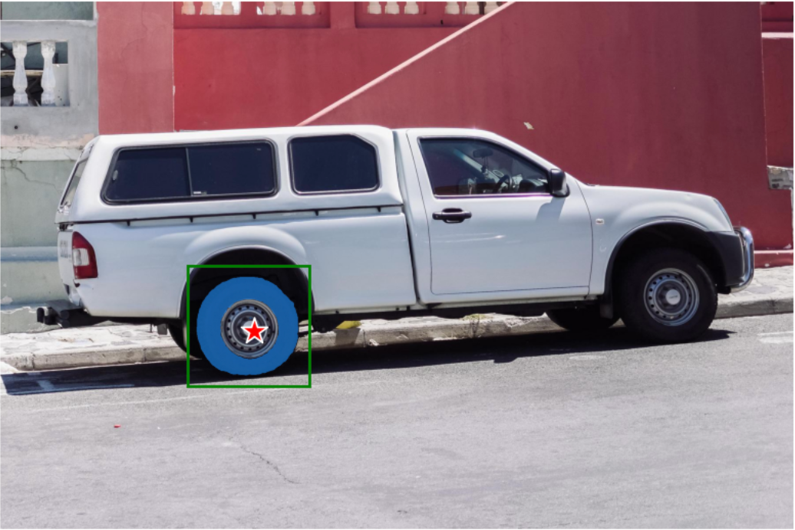
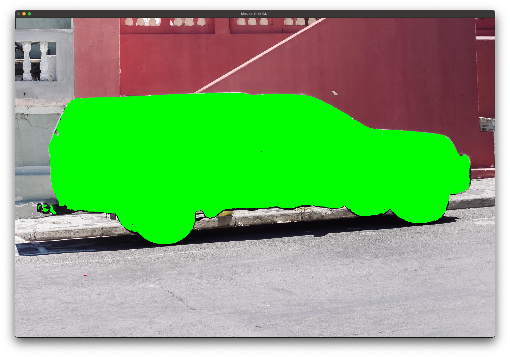

# SegmentAnything: A Segmentation Model with Target Specification

# SegmentAnything: A Segmentation Model with Target Specification

[](/@cochard-dav?source=post_page---byline--50514d9908e9---------------------------------------)

[David Cochard](/@cochard-dav?source=post_page---byline--50514d9908e9---------------------------------------)

4 min read

·

Feb 29, 2024

--

1

[Listen](/m/signin?actionUrl=https%3A%2F%2Fmedium.com%2Fplans%3Fdimension%3Dpost_audio_button%26postId%3D50514d9908e9&operation=register&redirect=https%3A%2F%2Fmedium.com%2Faxinc-ai%2Fsegmentanything-a-segmentation-model-with-target-specification-50514d9908e9&source=---header_actions--50514d9908e9---------------------post_audio_button------------------)

Share

This is an introduction to「SegmentAnything」, a machine learning model that can be used with [ailia SDK](https://ailia.jp/en/). You can easily use this model to create AI applications using [ailia SDK](https://ailia.jp/en/) as well as many other ready-to-use [ailia MODELS](https://github.com/axinc-ai/ailia-models).

## Overview

*SegmentAnything* is a segmentation model developed by Meta, released in April 2023. It can produce high quality object masks from input prompts such as points or boxes, making it ideal for image editing tasks such as background removal.

[## GitHub — facebookresearch/segment-anything: The repository provides code for running inference with…

### The repository provides code for running inference with the SegmentAnything Model (SAM), links for downloading the…

github.com](https://github.com/facebookresearch/segment-anything?source=post_page-----50514d9908e9---------------------------------------)

[## Segment Anything

### We introduce the Segment Anything (SA) project: a new task, model, and dataset for image segmentation. Using our…

ai.meta.com](https://ai.meta.com/research/publications/segment-anything/?source=post_page-----50514d9908e9---------------------------------------)

## Architecture

In recent years, language models and foundational models of significantly higher accuracy have emerged through training with vast amounts of data available on the Internet. However, there was no large-scale dataset available for segmentation. *SegmentAnything* addresses this gap by creating a new large-scale dataset, comprising over 11 million images and more than 1 billion masks, to build a foundational model for segmentation.

*SegmentAnything* achieves segmentation based on prompts such as point location, bounding boxes, or text by training on this new large dataset.

Here’s an overview of *SegmentAnything* architecture. It converts images to embeddings using an image encoder, then generates segmentation with a mask decoder based on the prompt. The architecture utilizes [Vision Transformers (ViT)](/axinc-ai/vision-transformer-state-of-the-art-image-identification-technology-without-convolutional-fd10097ae9c2) for the image encoder, [CLIP](/axinc-ai/clip-learning-transferable-visual-models-from-natural-language-supervision-4508b3f0ea46) text encoder for the prompt encoder, and combines transformer and Multilayer Perceptron (MLP) for the mask decoder.

Press enter or click to view image in full size


SegmentAnything architecture (Source: <https://github.com/facebookresearch/segment-anything>)

Below is an example of segmentation based on a box input. Only the tire that is within the specified box is segmented.

Press enter or click to view image in full size



Result of constrained segmentation (Source: <https://github.com/facebookresearch/segment-anything>)

The output embeddings of the image encoder are unique to an input image, therefore they only need to be computed once, then the mask decoder can be executed multiple times while changing the segmentation constraints. The computational load is quite high for the image encoder, while the mask decoder is relatively lightweight.

By default, input images are RGB order and resized to have a maximum dimension of 1024 before being input into the image encoder. The preprocessing follows the *ImageNet* format, subtracting the mean and then dividing by the standard deviation.

The output of the mask decoder consists of multiple masks, and by default, the mask with the highest score is selected.

## Applications

By combining *SegmentAnything* with object detection or pose estimation models to compute the segmentation target, it can be used to automate tasks such as layer separation.

## Usage

From version 1.2.16 onwards, *SegmentAnything* can be used with ailia SDK using the following command.

```
$ python3 segment-anything.py - input intput.jpg - savepath output.jpg
```

By adding the gui option, it is also possible to interactively segment the area around the location clicked in the image.

```
$ python3 segment-anything.py --gui
```

[## ailia-models/image\_segmentation/segment-anything at master · axinc-ai/ailia-models

### The collection of pre-trained, state-of-the-art AI models for ailia SDK …

github.com](https://github.com/axinc-ai/ailia-models/tree/master/image_segmentation/segment-anything?source=post_page-----50514d9908e9---------------------------------------)

Press enter or click to view image in full size


Segmentation of the tire only

Press enter or click to view image in full size



Segmentation of the entire vehicle

## Output Examples

Here are some output example on images generated using [SDXL](/axinc-ai/generating-high-quality-images-with-sdxl-ec586e4a63f9) on which we try to segment the background or the character.

Press enter or click to view image in full size


Background Segmentation

Press enter or click to view image in full size


Character Segmentation

Press enter or click to view image in full size


Background Segmentation （© Unity Technologies Japan/UCL）

Press enter or click to view image in full size


Character Segmentation （© Unity Technologies Japan/UCL）

---

[ax Inc.](https://axinc.jp/en/) has developed [ailia SDK](https://ailia.jp/en/), which enables cross-platform, GPU-based rapid inference.

ax Inc. provides a wide range of services from consulting and model creation, to the development of AI-based applications and SDKs. Feel free to [contact us](https://axinc.jp/en/) for any inquiry.