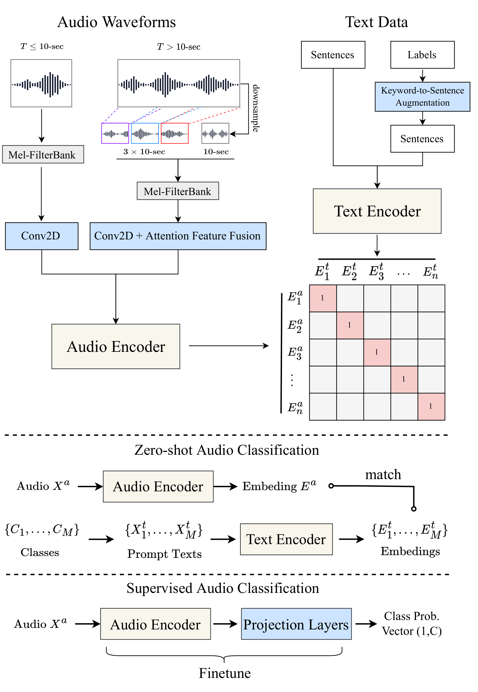
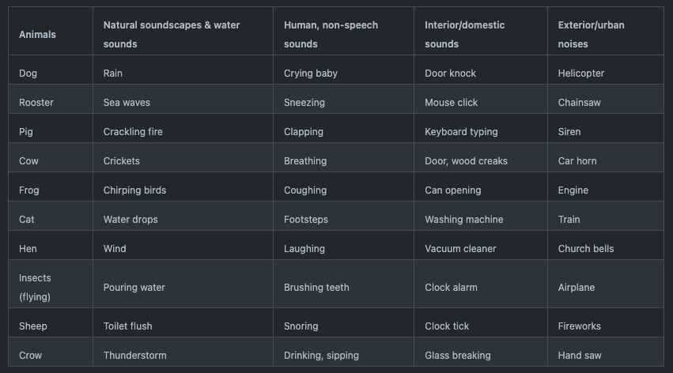
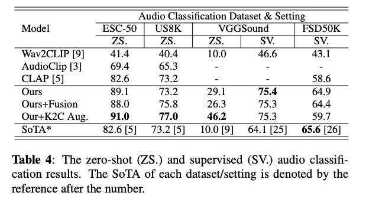
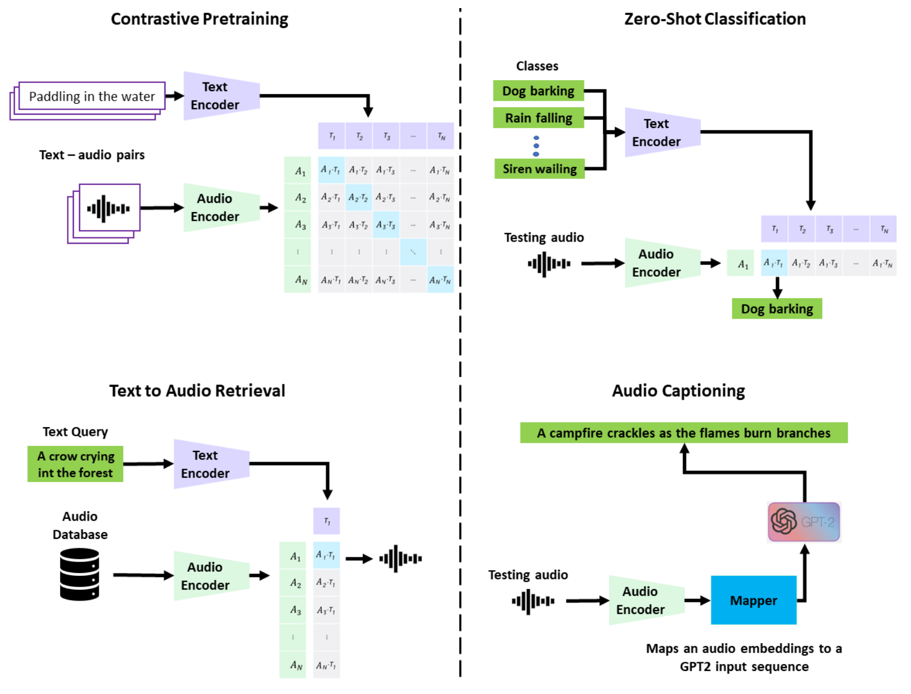

# CLAP: Feature Extraction Model for Searching Audio From Text

# CLAP: Feature Extraction Model for Searching Audio From Text

[](/@cochard-dav?source=post_page---byline--dcfd4c93756e---------------------------------------)

[David Cochard](/@cochard-dav?source=post_page---byline--dcfd4c93756e---------------------------------------)

6 min read

·

Mar 6, 2024

--

[Listen](/m/signin?actionUrl=https%3A%2F%2Fmedium.com%2Fplans%3Fdimension%3Dpost_audio_button%26postId%3Ddcfd4c93756e&operation=register&redirect=https%3A%2F%2Fmedium.com%2Faxinc-ai%2Fclap-feature-extraction-model-for-searching-audio-from-text-dcfd4c93756e&source=---header_actions--dcfd4c93756e---------------------post_audio_button------------------)

Share

This is an introduction to「CLAP」, a machine learning model that can be used with [ailia SDK](https://ailia.jp/en/). You can easily use this model to create AI applications using [ailia SDK](https://ailia.jp/en/) as well as many other ready-to-use [ailia MODELS](https://github.com/axinc-ai/ailia-models).

## Overview

*CLAP* is a feature extraction model released by LAION-AI in November 2022, which enables the search for audio from text. It can be seen as the audio version of[*CLIP*](/axinc-ai/clip-learning-transferable-visual-models-from-natural-language-supervision-4508b3f0ea46), which allows for searching images from text.

Press enter or click to view image in full size


Source: <https://github.com/LAION-AI/CLAP>

The [*CLIP*](/axinc-ai/clip-learning-transferable-visual-models-from-natural-language-supervision-4508b3f0ea46)model for images was trained by OpenAI using the LAION-5B dataset, created by LAION-AI, developer of *CLAP*.

Using *CLAP*, it is possible to extract feature vectors from the input text and audio, then based on the distance between these feature vectors, the similarity between the text and audio can be computed.

[## GitHub — LAION-AI/CLAP: Contrastive Language-Audio Pretraining

### Contrastive Language-Audio Pretraining. Contribute to LAION-AI/CLAP development by creating an account on GitHub.

github.com](https://github.com/LAION-AI/CLAP?source=post_page-----dcfd4c93756e---------------------------------------)

## Architecture

In recent years, training using large-scale data from the entire Internet has been done successfully. A notable example is [*CLIP*](/axinc-ai/clip-learning-transferable-visual-models-from-natural-language-supervision-4508b3f0ea46), which achieves a significant success by training with large-scale pairs of text and images, enabling the search of images from text.

It is believed that this approach can also be realized with text and audio. Related research includes proposals such as *AudioCLIP* and *WaveCLIP*, which have been trained on pairs of images and audio, or text, images, and audio, but not specifically on pairs of text and audio. Additionally, these have been trained on small datasets and have not fully demonstrated the potential of a large-scale training.

*CLAP* has been trained using the large-scale LAION-Audio-630K, which is composed of 633,526 text/audio pairs.

The architecture of *CLAP* is as follows. Similar to *CLIP*, it has been trained to minimize the distance between pairs of text and audio, making it possible to compute feature vectors by providing either text or audio. By calculating the distance between these feature vectors, it is possible to search for audio from any given text.

Press enter or click to view image in full size



Source: <https://github.com/LAION-AI/CLAP>

*RobertaTokenizer* is used for tokenizing text, which is a Byte Pair Encoding (BPE)-based tokenizer, similar to the one used in *CLIP*.

Audio is processed in the Mel Spectrum space using *librosa*. The number of `mel_bins` is set to 64, with a `window_size` of 1024 and a `hop_size` of 480.

If the audio is less than 10 seconds, it is repeated N times, and the remainder is zero-padded. Then, the same waveform stacked four times is used as input. For audio longer than 10 seconds, three segments are randomly selected from the beginning, middle, and end of the audio, in addition to a resampled version of the entire audio, totaling four waveforms to be stacked. Consequently, the shape of the audio data input into the AI model becomes (4, 1001, 64), where 4 corresponds to the stacked segments, 1001 represents the duration of 10 seconds, and 64 corresponds to `mel_bins`.

This approach of stacking four waveforms is referred to as a *Fusion* model. For models that do not use *Fusion*, the audio is randomly cropped to ensure a duration of 10 seconds.

The feature vectors output by the model have a dimensionality of 512. For distance calculation, cosine similarity is used.

## Precision

The accuracy of *CLAP* is measured based on the recognition accuracy in a zero-shot (without retraining) scenario on the [ESC-50 dataset](https://github.com/karolpiczak/ESC-50), which is used for classifying environmental sounds. Since *CLAP* can classify using any text, it is capable of recognizing categories beyond those included in the ESC-50 dataset.

Press enter or click to view image in full size



ESC50 dataset categories (Source: <https://github.com/karolpiczak/ESC-50>)

Apart from the LAION version, there are multiple versions of *CLAP* authored by various researchers. The conventional *CLAP [5]*, used for comparison, is a model trained on the *WavText5K* dataset comprising 5,000 entries. The LAION version of *CLAP*, by utilizing a dataset of 630,000 entries, has improved the zero-shot classification accuracy from 82.6% to 89.1%.



Benchmark (Source: <https://arxiv.org/pdf/2211.06687.pdf>)

## Version 2023

On April 7 2023, a large model was released. This model is not a Fusion model but a standard model, which, instead of stacking four waveforms, use random cropping to fit audio within 10 seconds. It was trained not only on the LAION-Audio-630k dataset but also include datasets for music and speech. Furthermore, this model utilizes an audio token-based HTSAT as the audio encoder.

[## GitHub - RetroCirce/HTS-Audio-Transformer: The official code repo of "HTS-AT: A Hierarchical…

### The official code repo of "HTS-AT: A Hierarchical Token-Semantic Audio Transformer for Sound Classification and…

github.com](https://github.com/RetroCirce/HTS-Audio-Transformer?source=post_page-----dcfd4c93756e---------------------------------------)

## Microsoft version

*Microsoft* has also released its version of *CLAP*, trained on 128,000 pairs of audio and text.

[## GitHub — microsoft/CLAP: Learning audio concepts from natural language supervision

### Learning audio concepts from natural language supervision — GitHub — microsoft/CLAP: Learning audio concepts from…

github.com](https://github.com/microsoft/CLAP?source=post_page-----dcfd4c93756e---------------------------------------)

The Microsoft version of CLAP shares the same architecture as the LAION version and has achieved an accuracy of 93.9% on the ESC-50 dataset.

Press enter or click to view image in full size



Source: <https://github.com/microsoft/CLAP>

## Usage

*CLAP* can be used with ailia SDK using the following command.

```
$ python3 clap.py --input dog_bark.wav
```

[## ailia-models/audio\_processing/clap at master · axinc-ai/ailia-models

### The collection of pre-trained, state-of-the-art AI models for ailia SDK — ailia-models/audio\_processing/clap at master…

github.com](https://github.com/axinc-ai/ailia-models/tree/master/audio_processing/clap?source=post_page-----dcfd4c93756e---------------------------------------)

The output results are displayed with probabilities for the specified text labels, indicating that “dog” and “dog barking” are the closest matches.

```
===== cosine similality between text and audio =====  
cossim=0.1514, word=applause applaud clap  
cossim=0.2942, word=The crowd is clapping.  
cossim=0.0391, word=I love the contrastive learning  
cossim=0.0755, word=bell  
cossim=-0.0926, word=soccer  
cossim=0.0309, word=open the door.  
cossim=0.0849, word=applause  
cossim=0.4183, word=dog  
cossim=0.3819, word=dog barking
```

To change the target tags for detection, you can modify the `text_inputs` in `clap.py`

```
text_inputs = [  
        "applause applaud clap",   
        "The crowd is clapping.",  
        "I love the contrastive learning",   
        "bell",   
        "soccer",   
        "open the door.",  
        "applause",  
        "dog",  
        "dog barking"  
    ]
```

By adding the “voice” and “song” categories and processing for human voice, the result shows that the score for the “voice” category becomes the highest.

```
===== cosine similality between text and audio =====  
audio: BASIC5000_0001.wav  
cossim=0.0891, word=applause applaud clap  
cossim=0.1216, word=The crowd is clapping.  
cossim=0.0633, word=I love the contrastive learning  
cossim=0.1159, word=bell  
cossim=-0.0559, word=soccer  
cossim=-0.0210, word=open the door.  
cossim=0.0098, word=applause  
cossim=-0.0106, word=dog  
cossim=-0.0605, word=dog barking  
cossim=0.2877, word=voice  
cossim=0.1041, word=song
```

When a song is input, the score for the “song” category becomes the highest.

```
===== cosine similality between text and audio =====  
audio: 049 - Young Griffo - Facade.wav  
cossim=0.0767, word=applause applaud clap  
cossim=0.0737, word=The crowd is clapping.  
cossim=-0.0014, word=I love the contrastive learning  
cossim=-0.0110, word=bell  
cossim=-0.0063, word=soccer  
cossim=-0.0065, word=open the door.  
cossim=0.0440, word=applause  
cossim=0.0031, word=dog  
cossim=-0.0542, word=dog barking  
cossim=0.0625, word=voice  
cossim=0.2091, word=song
```

---

[ax Inc.](https://axinc.jp/en/) has developed [ailia SDK](https://ailia.jp/en/), which enables cross-platform, GPU-based rapid inference.

ax Inc. provides a wide range of services from consulting and model creation, to the development of AI-based applications and SDKs. Feel free to [contact us](https://axinc.jp/en/) for any inquiry.