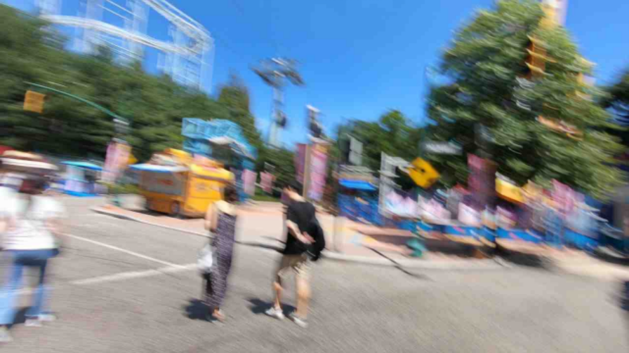
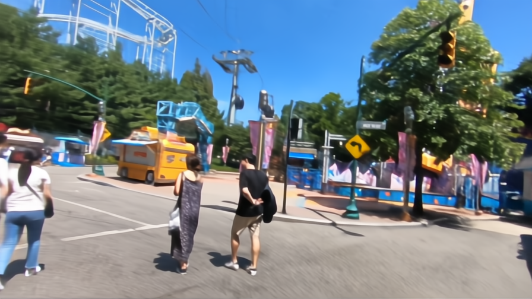
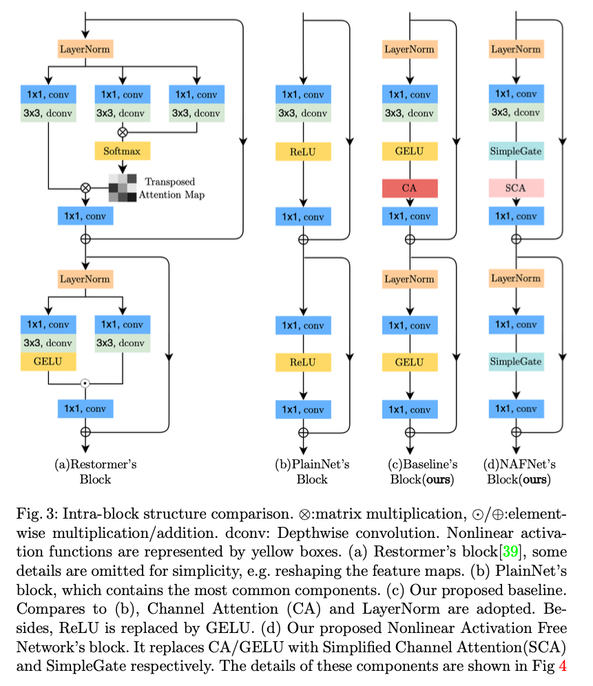
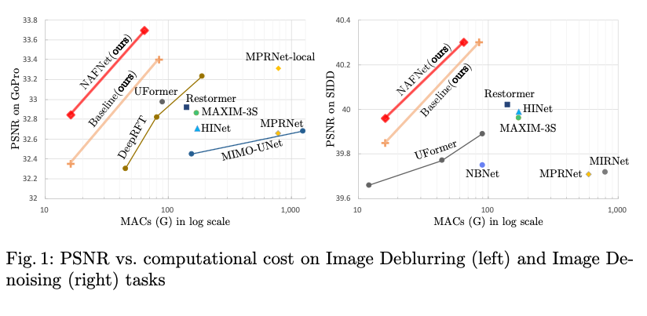
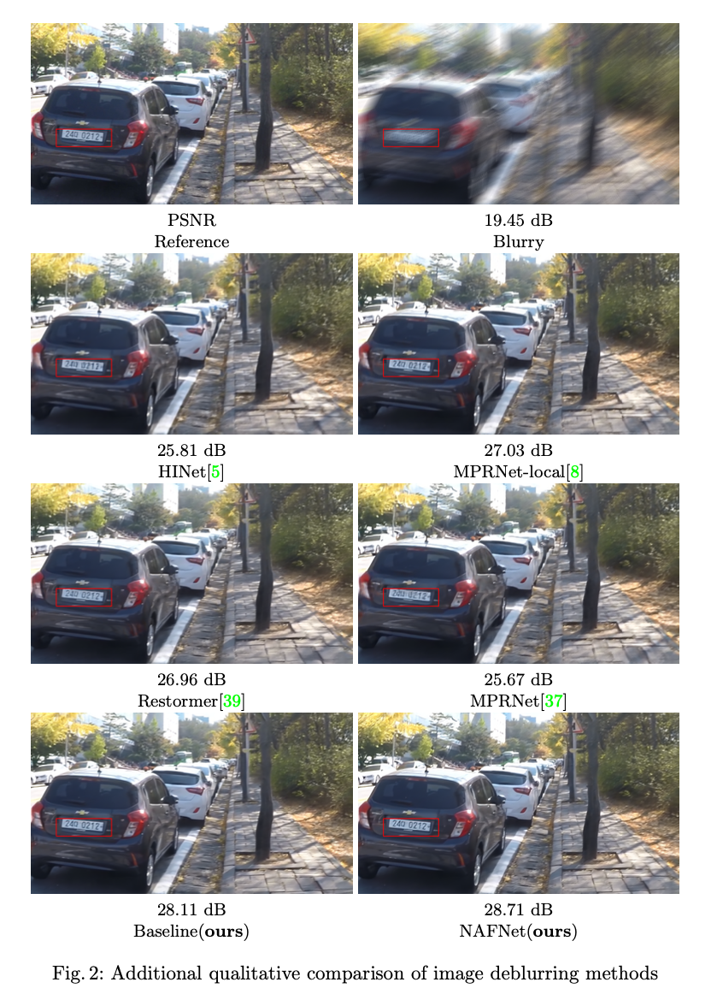
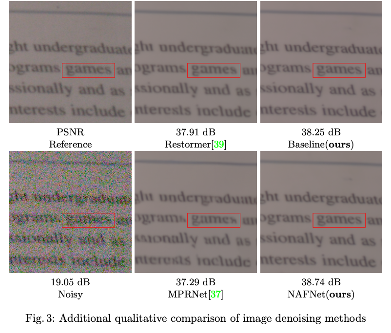
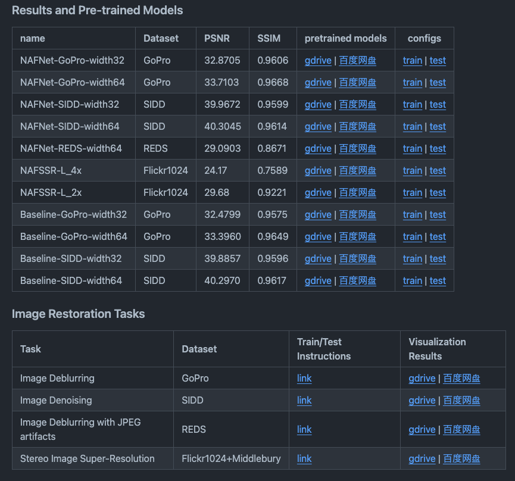

# NAFNET : A Machine Learning Model to Deblur Images

# NAFNET : A Machine Learning Model to Deblur Images

[](/@cochard-dav?source=post_page---byline--a0a03e94feae---------------------------------------)

[David Cochard](/@cochard-dav?source=post_page---byline--a0a03e94feae---------------------------------------)

4 min read

·

Mar 29, 2024

--

[Listen](/m/signin?actionUrl=https%3A%2F%2Fmedium.com%2Fplans%3Fdimension%3Dpost_audio_button%26postId%3Da0a03e94feae&operation=register&redirect=https%3A%2F%2Fmedium.com%2Faxinc-ai%2Fnafnet-a-machine-learning-model-to-deblur-images-a0a03e94feae&source=---header_actions--a0a03e94feae---------------------post_audio_button------------------)

Share

This is an introduction to「NAFNET」, a machine learning model that can be used with [ailia SDK](https://ailia.jp/en/). You can easily use this model to create AI applications using [ailia SDK](https://ailia.jp/en/) as well as many other ready-to-use [ailia MODELS](https://github.com/axinc-ai/ailia-models).

## Overview

*NAFNET* is a model that became the baseline for image restoration, published in April 2022 by *MEGVII Technology*. It is capable of deblurring and denoising images.

Press enter or click to view image in full size



Blurred image (Source: https://github.com/megvii-research/NAFNet/blob/main/demo/denoise\_img.png)

Press enter or click to view image in full size



Model output (Source: https://github.com/megvii-research/NAFNet/blob/main/demo/denoise\_img.png)

[## Simple Baselines for Image Restoration

### Although there have been significant advances in the field of image restoration recently, the system complexity of the…

arxiv.org](https://arxiv.org/abs/2204.04676?source=post_page-----a0a03e94feae---------------------------------------)

[## GitHub — megvii-research/NAFNet: The state-of-the-art image restoration model without nonlinear…

### The state-of-the-art image restoration model without nonlinear activation functions. — GitHub — megvii-research/NAFNet…

github.com](https://github.com/megvii-research/nafnet?source=post_page-----a0a03e94feae---------------------------------------)

## Architecture

*NAFNET* offers a computationally efficient and simple method for establishing a baseline for image restoration.

To achieve this, it introduces a Nonlinear Activation Free Network (NAFNet) by eliminating nonlinear activation functions such as *ReLU* and *GELU*. This allows it to deliver high performance at half the computational cost of traditional methods.

Since *Batch Normalization* can become unstable with small batch sizes, it uses *Layer Normalization*, which is commonly used in *Transformers*.

Regarding the model architecture, it replaces *GELU*, which was traditionally used, with a simple multiplication combined with *Layer Normalization*.

Press enter or click to view image in full size



NAFNET architecture (Source: <https://arxiv.org/abs/2204.04676>)

The model structure uses *UNet*.

Press enter or click to view image in full size


NAFNETのアーキテクチャ（出典：<https://arxiv.org/abs/2204.04676>）

The model was trained using a batch size of 64 and 400K epochs, with learning performed using random cropping.

## Precision

The GoPro and REDS datasets were used for image deblurring, and the SIDD dataset was used for image noise reduction. NAFNET achieves higher image quality (PSNR) with fewer operations (MACs) than previous technologies.

Press enter or click to view image in full size



Below is a qualitative comparison of various image deblurring methods.

Press enter or click to view image in full size



Benchmark (Source: <https://arxiv.org/abs/2204.04676>)

Same for image denoising methods.

Press enter or click to view image in full size



Benchmark (Source: <https://arxiv.org/abs/2204.04676>)

## Model variants

NAFNET offers multiple model variants trained on different datasets. The “width” indicates the number of layer blocks stacked, with 64 having a higher load but also higher performance than 32. Moreover, when using a model trained on the REDS dataset, JPEG noise is also removed.

Press enter or click to view image in full size



Model variants (Source: <https://github.com/megvii-research/NAFNet/tree/main>)

## Usage

You can use this model with ailia SDK using the following command to deblur images.

```
python3 nafnet.py --arch NAFNet-REDS-width64 -i input.jpg
```

The command below can be used for denoising.

```
python3 nafnet.py --arch NAFNet-SIDD-width32 -i input.jpg
```

You can also choose between variants to be used.

```
BLUR_LISTS = ['Baseline-GoPro-width32' ,'NAFNet-GoPro-width32', 'NAFNet-REDS-width64', 'Baseline-GoPro-width64','NAFNet-GoPro-width64']  
NOISE_LISTS = ['Baseline-SIDD-width32', 'NAFNet-SIDD-width64', 'Baseline-SIDD-width64' ,'NAFNet-SIDD-width32']
```

[## ailia-models/image\_restoration/nafnet at master · axinc-ai/ailia-models

### The collection of pre-trained, state-of-the-art AI models for ailia SDK — ailia-models/image\_restoration/nafnet at…

github.com](https://github.com/axinc-ai/ailia-models/tree/master/image_restoration/nafnet?source=post_page-----a0a03e94feae---------------------------------------)

This model has been quite effective in extreme case such as vigorously moving an iPhone in front of a webcam.

```
python3 nafnet.py --arch NAFNet-REDS-width64 -i iphone.jpg
```


Input image


Output image

---

[ax Inc.](https://axinc.jp/en/) has developed [ailia SDK](https://ailia.jp/en/), which enables cross-platform, GPU-based rapid inference.

ax Inc. provides a wide range of services from consulting and model creation, to the development of AI-based applications and SDKs. Feel free to [contact us](https://axinc.jp/en/) for any inquiry.