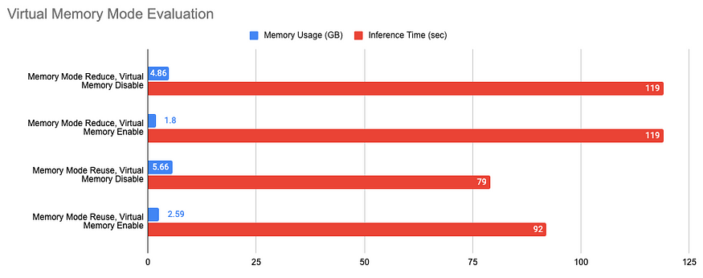
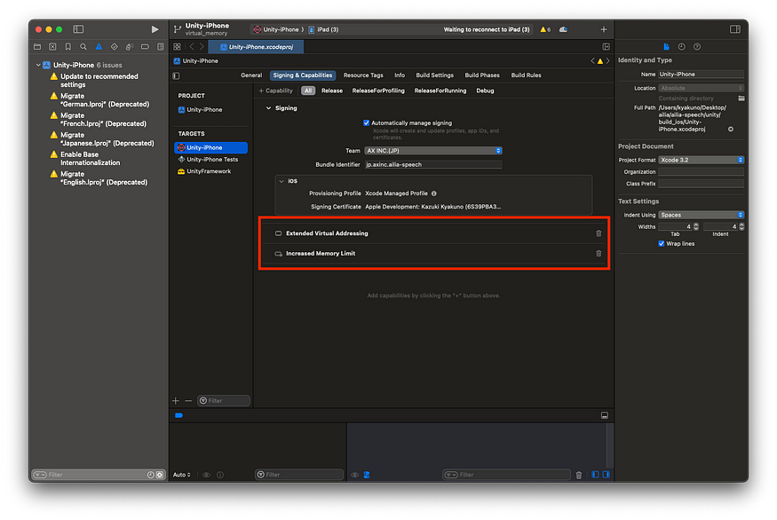
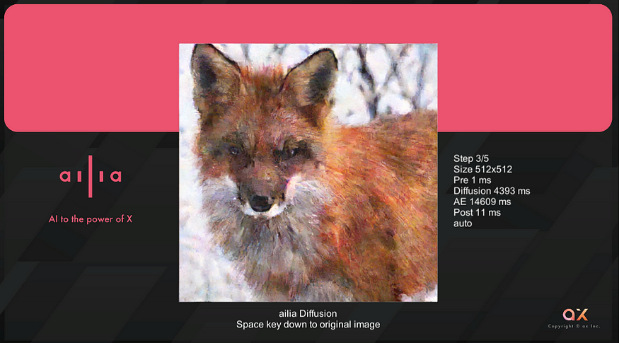

# Released ailia SDK 1.3.0

# Released ailia SDK 1.3.0

[](/@terada_80332?source=post_page---byline--a5c91db28201---------------------------------------)

[Takehiko TERADA](/@terada_80332?source=post_page---byline--a5c91db28201---------------------------------------)

4 min read

·

Apr 1, 2024

--

[Listen](/m/signin?actionUrl=https%3A%2F%2Fmedium.com%2Fplans%3Fdimension%3Dpost_audio_button%26postId%3Da5c91db28201&operation=register&redirect=https%3A%2F%2Fmedium.com%2Faxinc-ai%2Freleased-ailia-sdk-1-3-0-a5c91db28201&source=---header_actions--a5c91db28201---------------------post_audio_button------------------)

Share

Introducing ailia SDK 1.3.0, which has been enhanced with support for virtual memory and improved support for mobile GPUs. You can find more information about ailia SDK on the [official website](https://ailia.jp/en/).

---

## About ailia SDK 1.3.0

ailia SDK 1.3.0 is a release that addresses virtual memory and supports large tensors in mobile GPUs to operate the increasingly large AI models in recent years.


ailia SDK 1.3.0

## Support for Virtual Memory

Traditionally, all tensors and weights of AI models were placed on physical memory. Therefore, when trying to infer large models, there could be a shortage of memory.

In ailia SDK 1.3.0, AILIA\_MEMORY\_REDUCE\_CONSTANT\_WITH\_FILE\_MAPPED was added to memory\_mode, making it possible to place the weights of AI models in virtual memory on storage.

As a result, it is now possible to run larger models than before in environments with limited memory, such as iOS. For example, large models like Whisper Medium can be executed on an iPad Mini 6 with 4GB of RAM.

To use the virtual memory feature from the C API, add AILIA\_MEMORY\_REDUCE\_CONSTANT\_WITH\_FILE\_MAPPED to memory\_mode. For the Python API, set use\_memory\_mapped to True in the get\_memory\_mode API. To save the weights on storage, it is necessary to call the set\_temporary\_cache\_path API in advance.

```
ailia.set_temporary_cache_path("./")  
memory_mode = ailia.get_memory_mode(reduce_constant=True, ignore_input_with_initializer=True, reduce_interstage=False, reuse_interstage=True, use_memory_mapped=True)  
ailia.Net(weight_path="input.onnx", memory_mode=memory_mode)
```

This is an evaluation of running inference with Whisper Medium on an M2 MacBook Air.

Press enter or click to view image in full size



Evaluation of virtual memory

When used in conjunction with AILIA\_MEMORY\_REDUCE\_INTERSTAGE (memory release mode), the necessary memory of 4.86GB can be reduced to 1.8GB. Additionally, the time required to infer a 40-second audio file remains at 119 seconds, and performance does not change even when using virtual memory.

When used in conjunction with AILIA\_MEMORY\_REUSE\_INTERSTATE (memory reuse mode), the necessary memory of 5.66GB can be reduced to 2.59GB. The time required to infer a 40-second audio file ranges from 79 to 92 seconds, and using virtual memory results in a performance decrease of about 16%.

Note that on iOS, there are restrictions on the size of the virtual memory space by default. Therefore, please add [Extended Virtual Addressing](https://developer.apple.com/documentation/bundleresources/entitlements/com_apple_developer_kernel_extended-virtual-addressing) in Xcode’s Capability.

Press enter or click to view image in full size



Setting up iOS Capability

## Enhanced support for mobile GPUs

Traditionally, the ailia SDK has been compatible with mobile GPUs such as Adreno, enabling fast inference of models such as YOLOX.

However, recent Diffusion models have seen an increase in model size, with large tensors of 512MB appearing in the graph.

In Vulkan, a maxStorageBufferRange is specified, and on Adreno GPUs, it is set to about 256MB. Therefore, there was a problem that writing to tensors exceeding this size could not be performed due to exceeding the maxStorageBufferRange.

With ailia SDK 1.3.0, it now supports split execution of Vulkan kernels, and thus, writing to tensors exceeding the maxStorageBufferRange. This makes it possible to run Diffusion models on Adreno GPUs.

Press enter or click to view image in full size



A practical example of diffusion model

We also provide samples for running Diffusion models, including Stable Diffusion, from Unity.

[## ailia-models-unity/Assets/AXIP/AILIA-MODELS/Diffusion at master · axinc-ai/ailia-models-unity

### Unity version of ailia models repository. Contribute to axinc-ai/ailia-models-unity development by creating an account…

github.com](https://github.com/axinc-ai/ailia-models-unity/tree/master/Assets/AXIP/AILIA-MODELS/Diffusion?source=post_page-----a5c91db28201---------------------------------------)

## GPU support for memory reuse

Improvements to memory reuse introduced in ailia SDK 1.2.16 have resulted in reduced memory consumption on CPUs. With ailia SDK 1.3.0, there is now support for memory reuse on GPUs as well, improving the efficiency of memory reuse on GPUs.

Memory reuse can be utilized by specifying AILIA\_MEMORY\_REUSE\_INTERSTAGE in memory\_mode.

## Acceleration of the operator

We are accelerating 1DPool, ScatterElement, Pad, Reduce, LRN, and Gemm for CPUs and SIMD. In addition, we have enhanced the fusion of Activations, allowing Gelu, Swish, Hardswish, and Mish to be fused with Convolution, which speeds up models using these Activations.

## Accelerating model loading

The model loading time has been sped up. On an M2 macOS doing CPU inference, the model loading time for Detic is 3339ms with ONNX Runtime and 1609ms with ailia SDK 1.2.16, but with ailia SDK 1.3.0 it speeds up to 1152ms.

## Improvements in ailia SDK versioning rules

Traditionally, we have been incrementing the version number of y in 1.x.y, but going forward, we have decided to increment the version number of x. This will allow us to separate the patch version and build version, enabling operations that more closely match the actual situation.

---

ax Corporation is developing the ailia SDK, which enables fast inference using GPUs across platforms, as a company that commercializes AI. At ax Corporation, we offer a total solution for AI, ranging from consulting, model creation, providing SDKs, to developing applications and systems utilizing AI, and support. Please feel free to [contact us](https://www.ailia.ai/en-contact-product).