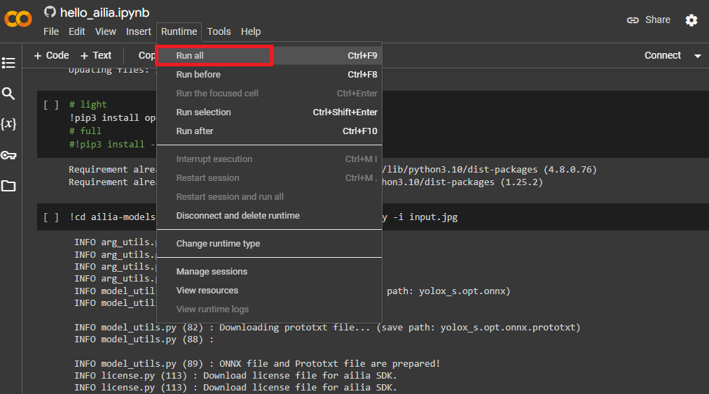
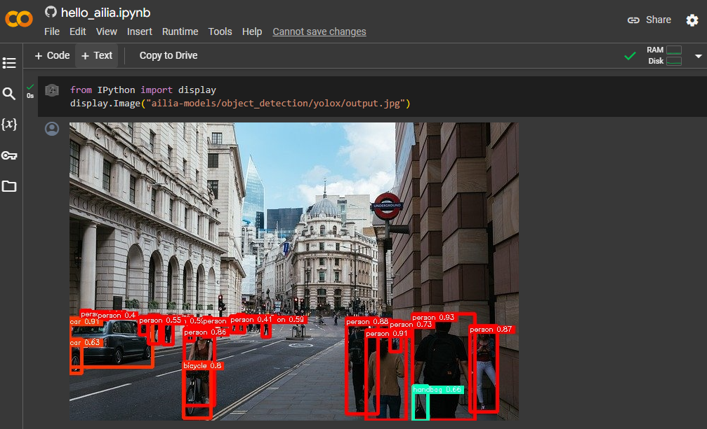
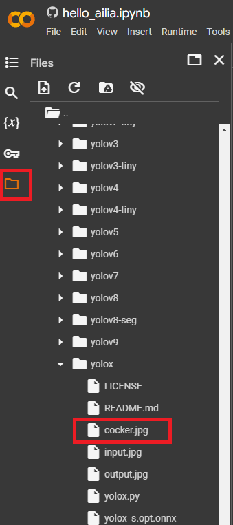
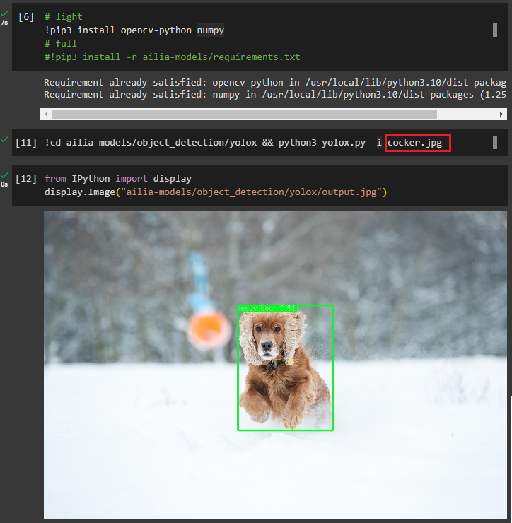
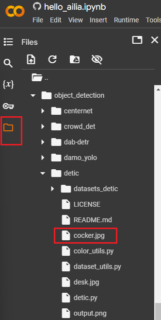
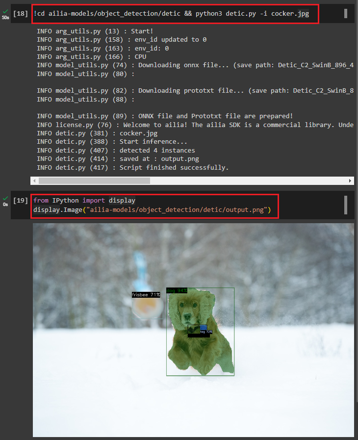
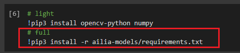

# Google Colab and ailia MODELS to Perform AI in the Browser

# Google Colab and ailia MODELS to Perform AI in the Browser

[](/@cochard-dav?source=post_page---byline--68e4bd3bc83a---------------------------------------)

[David Cochard](/@cochard-dav?source=post_page---byline--68e4bd3bc83a---------------------------------------)

3 min read

·

Apr 22, 2024

--

[Listen](/m/signin?actionUrl=https%3A%2F%2Fmedium.com%2Fplans%3Fdimension%3Dpost_audio_button%26postId%3D68e4bd3bc83a&operation=register&redirect=https%3A%2F%2Fmedium.com%2Faxinc-ai%2Fgoogle-colab-and-ailia-models-to-perform-ai-in-the-browser-68e4bd3bc83a&source=---header_actions--68e4bd3bc83a---------------------post_audio_button------------------)

Share

This explains how to easily perform AI processing in the browser alone using [Google Colab](https://colab.research.google.com/) and [ailia MODELS](https://github.com/axinc-ai/ailia-models).


## About Google Colab

Google Colaboratory is a virtual environment that allows you to run Python in the browser. It enables you to execute AI models on a server for free.

## About ailia MODELS

ailia MODELS is a library of AI models provided by [ax Inc.](https://axinc.jp/en/) With over 300 models available, it allows you to perform a large variety of AI tasks.

[## GitHub — axinc-ai/ailia-models: The collection of pre-trained, state-of-the-art AI models for ailia…

### The collection of pre-trained, state-of-the-art AI models for ailia SDK — axinc-ai/ailia-models

github.com](https://github.com/axinc-ai/ailia-models?source=post_page-----68e4bd3bc83a---------------------------------------)

## Using ailia MODELS in Google Colab

ailia MODELS includes sample programs for Google Colab available at the link below.

[## ailia MODELS sample for Google Colab

colab.research.google.com](https://colab.research.google.com/github/axinc-ai/ailia-models/blob/master/hello_ailia.ipynb?source=post_page-----68e4bd3bc83a---------------------------------------)

You can run the program from the menu below.

Press enter or click to view image in full size



The sample downloads all the necessary resources, run the inference and display the detection result.

Press enter or click to view image in full size



## Run the inference on your own image

To infer with other images, browse the colab files from the left side menu`File` icon and select the folder`ailia-models/object_detection/yolox`. You can upload your own image using the 3-dot menu attached to the folder.



Image upload

Press enter or click to view image in full size


Sample image (Source: <https://pixabay.com/ja/photos/%E3%82%B3%E3%83%83%E3%82%AB%E3%83%BC-%E3%82%B9%E3%83%91%E3%83%8B%E3%82%A8%E3%83%AB-%E7%8A%AC-5996316/>)

Change the script `input.jpg` to the uploaded file, `cocker.jpg` in this example, and run the two last cells to update the inference result.

Press enter or click to view image in full size



Inference result on cocker.jpg

## Use other ailia MODELS in Google Colab

You can edit the colab notebook to run inference using other AI models. Let’s see how to do it to use the segmentation model [Detic](https://github.com/axinc-ai/ailia-models/tree/master/object_detection/detic).

First upload the sample image in the `ailia-models/object_detection/detic`folder as we did previously.



Then adapt the inference command from

```
!cd ailia-models/object_detection/yolox && python3 yolox.py
```

to

```
!cd ailia-models/object_detection/detic && python3 detic.py -i cocker.jpg
```

Make sure not to forget the `!` mark at the beginning for the command to be executed in the system shell rather than in the Python environment.

Also edit the command in the last cell from

```
from IPython import display  
display.Image("ailia-models/object_detection/yolox/output.jpg")
```

to

```
from IPython import display  
display.Image("ailia-models/object_detection/detic/output.png")
```

Press enter or click to view image in full size



## Installation of all dependencies

By default, only `opencv-python` and `numpy` are installed to make the first execution faster. If an error occurs during execution of other models, most likely due to missing libraries, please uncomment and `run pip3 install -r ailia-models/requirements.txt` to install all the necessary dependencies.



---

[ax Inc.](https://axinc.jp/en/) has developed [ailia SDK](https://ailia.jp/en/), which enables cross-platform, GPU-based rapid inference.

ax Inc. provides a wide range of services from consulting and model creation, to the development of AI-based applications and SDKs. Feel free to [contact us](https://axinc.jp/en/) for any inquiry.