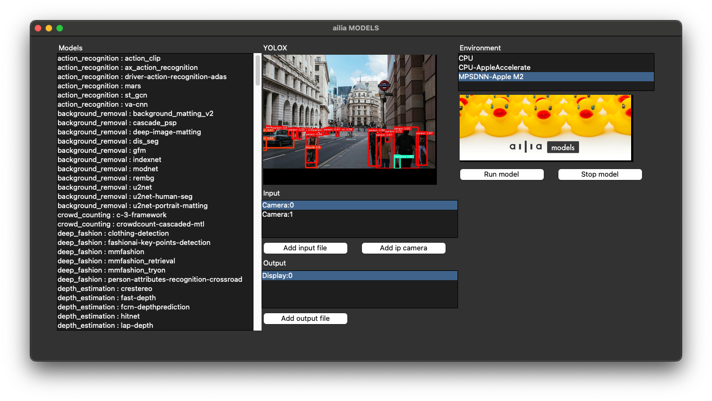
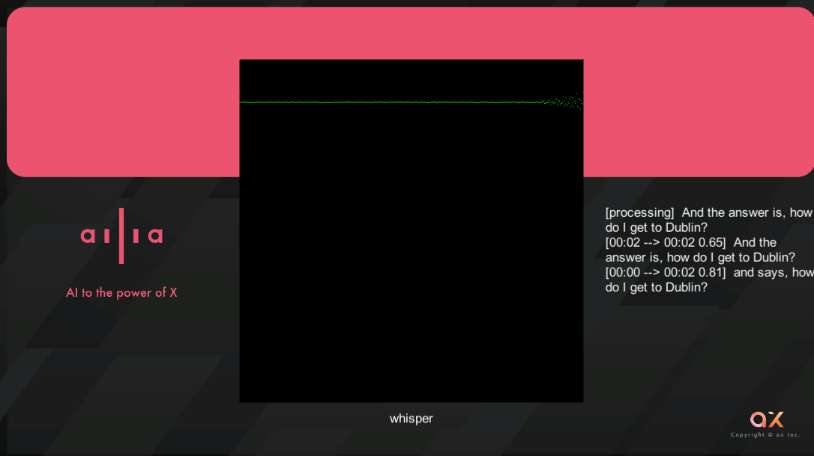

# How to install the ailia SDK

# How to install the ailia SDK

[](/@kyakuno?source=post_page---byline--0b231ffc1b1f---------------------------------------)

[Kazuki Kyakuno](/@kyakuno?source=post_page---byline--0b231ffc1b1f---------------------------------------)

4 min read

·

Jun 3, 2024

--

[Listen](/m/signin?actionUrl=https%3A%2F%2Fmedium.com%2Fplans%3Fdimension%3Dpost_audio_button%26postId%3D0b231ffc1b1f&operation=register&redirect=https%3A%2F%2Fmedium.com%2Faxinc-ai%2Fhow-to-install-the-ailia-sdk-0b231ffc1b1f&source=---header_actions--0b231ffc1b1f---------------------post_audio_button------------------)

Share

We will explain how to install the ailia SDK and how to run the samples. We will explain in order for Python, Unity, Flutter, and C++.

---

## About ailia SDK

ailia SDK is a cross-platform AI inference library. By using ailia SDK and ailia MODELS, AI functions can be easily integrated into applications.

Press enter or click to view image in full size


## Installation methods by platform

### Python

Run the following command in an environment where Python is installed to install the ailia SDK.

```
pip3 install ailia
```

Clone the ailia MODELS repository.

```
git clone https://github.com/ailia-ai/ailia-models.git
```

[## GitHub — axinc-ai/ailia-models: The collection of pre-trained, state-of-the-art AI models for ailia…

### The collection of pre-trained, state-of-the-art AI models for ailia SDK — axinc-ai/ailia-models

github.com](https://github.com/axinc-ai/ailia-models?source=post_page-----0b231ffc1b1f---------------------------------------)

Install dependent libraries.

```
pip3 install -r requirements.txt
```

Launching the launcher.

```
python3 launchar.py
```

To run a model, select the model you want to run and press the “Run model” button.

Press enter or click to view image in full size



The tutorial is as follows.

[## ailia SDK Tutorial (Python)

### Here is a tutorial on how to use ailia SDK in Python. ailia SDK allows you to perform deep learning inference using…

medium.com](/axinc-ai/ailia-sdk-tutorial-python-ea29ae990cf6?source=post_page-----0b231ffc1b1f---------------------------------------)

It is also possible to use it with just a browser.

[## Google Colab and ailia MODELS to Perform AI in the Browser

### This explains how to easily perform AI processing in the browser alone using Google Colab and ailia MODELS.

medium.com](/axinc-ai/google-colab-and-ailia-models-to-perform-ai-in-the-browser-68e4bd3bc83a?source=post_page-----0b231ffc1b1f---------------------------------------)

### Unity

Clone the repository of ailia MODELS Unity.

```
git clone https://github.com/ailia-ai/ailia-models-unity.git
```

[## GitHub — axinc-ai/ailia-models-unity: Unity version of ailia models repository

### Unity version of ailia models repository. Contribute to axinc-ai/ailia-models-unity development by creating an account…

github.com](https://github.com/axinc-ai/ailia-models-unity?source=post_page-----0b231ffc1b1f---------------------------------------)

Open and execute it in Unity. The ailia SDK will be automatically downloaded via the Package Manager.

Scenes are stored by category.

Press enter or click to view image in full size


After opening the scene, the AI model can be modified in the Controller’s Inspector.

Press enter or click to view image in full size


Execute the scene.

Press enter or click to view image in full size



Example of speech recognition

### Flutter

Clone the ailia MODELS Flutter repository.

```
git clone https://github.com/ailia-ai/ailia-models-flutter.git
```

[## GitHub — axinc-ai/ailia-models-flutter: ONNX Model Library for Flutter

### ONNX Model Library for Flutter. Contribute to axinc-ai/ailia-models-flutter development by creating an account on…

github.com](https://github.com/axinc-ai/ailia-models-flutter?source=post_page-----0b231ffc1b1f---------------------------------------)

Open the project in VSCode and execute flutter pub get. The ailia SDK will be automatically downloaded via pubspec.yaml.

Run the sample, select a model, and execute the AI with the plus button.

Press enter or click to view image in full size


Select model

Press enter or click to view image in full size


Example of running Whisper

### C++

Clone the ailia MODELS cpp repository.

```
git clone https://github.com/ailia-ai/ailia-models-cpp.git
```

[## GitHub — axinc-ai/ailia-models-cpp: C++ version of ailia models repository

### C++ version of ailia models repository. Contribute to axinc-ai/ailia-models-cpp development by creating an account on…

github.com](https://github.com/axinc-ai/ailia-models-cpp?source=post_page-----0b231ffc1b1f---------------------------------------)

Download the ailia SDK via submodule.

```
git subomdule init  
git submodule update
```

Download the license file for ailia SDK.

```
cd ailia  
python3 download_license.py
```

For macOS, install cmake and opencv with brew.

```
brew install cmake  
brew install opencv
```

Building.

```
cmake .  
cmake --build .
```

I will execute it.

```
cd object_detection/yolox  
./yolox.sh
```

If you enable the -v 0 option, you can also use the web camera.

```
cd object_detection/yolox  
./yolox.sh -v 0
```

## Additional information

### ailia SDK license

Please refer to the following for ailia SDK license information.

[## ailia SDK License

### ailia SDK License Information [Japanese] [English] About license !! CAUTION !! "ailia" IS NOT OPEN SOURCE SOFTWARE…

ailia.ai](https://ailia.ai/license/en/?source=post_page-----0b231ffc1b1f---------------------------------------)

### For other environments

Please refer to the following samples for Rust, MSVC C#, and Kotlin.

Rust

[## GitHub — axinc-ai/ailia-models-rust

### Contribute to axinc-ai/ailia-models-rust development by creating an account on GitHub.

github.com](https://github.com/axinc-ai/ailia-models-rust?source=post_page-----0b231ffc1b1f---------------------------------------)

MSVC C#

[## GitHub — axinc-ai/ailia-csharp: ailia SDK example for Visual Studio C#

### ailia SDK example for Visual Studio C#. Contribute to axinc-ai/ailia-csharp development by creating an account on…

github.com](https://github.com/axinc-ai/ailia-csharp?source=post_page-----0b231ffc1b1f---------------------------------------)

Kotlin

[## GitHub — axinc-ai/ailia-android-studio-kotlin: Sample project of kotlin

### Sample project of kotlin. Contribute to axinc-ai/ailia-android-studio-kotlin development by creating an account on…

github.com](https://github.com/axinc-ai/ailia-android-studio-kotlin?source=post_page-----0b231ffc1b1f---------------------------------------)

---

ax Inc. provides a wide range of services from consulting and model creation, to the development of AI-based applications and SDKs. Feel free to [contact us](https://axinc.jp/en/) for any inquiry.