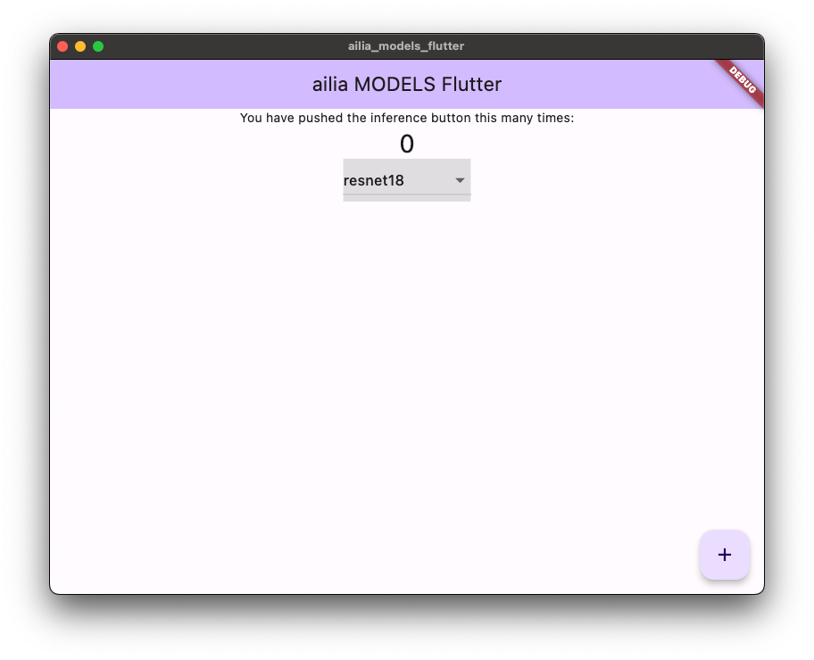
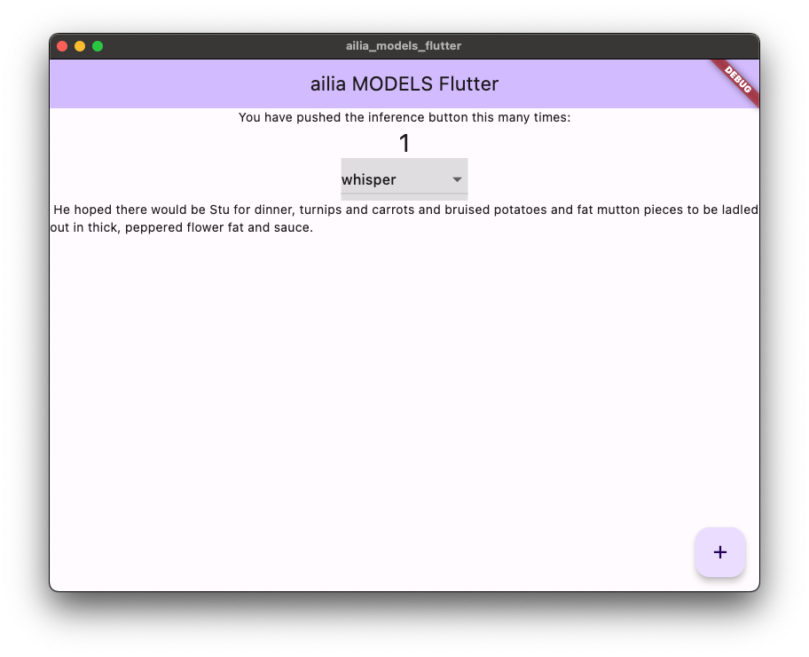

# ailia SDK Now Available Through Flutter pubspec

# ailia SDK Now Available Through Flutter pubspec

[](/@cochard-dav?source=post_page---byline--7e859dad842d---------------------------------------)

[David Cochard](/@cochard-dav?source=post_page---byline--7e859dad842d---------------------------------------)

4 min read

·

Jun 14, 2024

--

[Listen](/m/signin?actionUrl=https%3A%2F%2Fmedium.com%2Fplans%3Fdimension%3Dpost_audio_button%26postId%3D7e859dad842d&operation=register&redirect=https%3A%2F%2Fmedium.com%2Faxinc-ai%2Failia-sdk-now-available-through-flutter-pubspec-7e859dad842d&source=---header_actions--7e859dad842d---------------------post_audio_button------------------)

Share

[ailia SDK](https://ailia.jp/en/) now supports installation using Flutter’s pubspec. This allows you to easily integrate the ailia SDK into your Flutter applications.

Press enter or click to view image in full size


## About ailia SDK

ailia SDK is an AI inference engine that allows you to easily integrate various AI models published on [ailia MODELS](https://github.com/axinc-ai/ailia-models) into Unity. The applications developed with it can run on Windows, macOS, iOS, Android, and Linux.

[## ailia SDK

### A future in which all devices carry AI We believe such a future is on the way. To usher in that day, we will keep…

axinc.jp](https://axinc.jp/en/solutions/ailia_sdk.html?source=post_page-----7e859dad842d---------------------------------------)

[## ailia MODELS

### The collection of pre-trained, state-of-the-art AI models for ailia SDK — axinc-ai/ailia-models

github.com](https://github.com/axinc-ai/ailia-models?source=post_page-----7e859dad842d---------------------------------------)

## About Flutter

Flutter is a cross-platform application development environment developed by *Google*. It allows for unified development of applications for Windows, macOS, iOS, Android, and Linux using the Dart programming language.

[## Flutter — Build apps for any screen

### Flutter transforms the entire app development process. Build, test, and deploy beautiful mobile, web, desktop, and…

flutter.dev](https://flutter.dev/?source=post_page-----7e859dad842d---------------------------------------)

## About pubspec

The pubspec file is the package management file in Flutter. By registering the library URL in the pubspec file, you can easily add libraries to your application.

## Installing ailia SDK via pubspec

Add the following to your `pubspec.yaml` file. Then, run `flutter pub get` to install the necessary libraries.

```
  ailia:  
    git:  
      url: https://github.com/ailia-ai/ailia-sdk-flutter.git  
      ref: main  
  
  ailia_audio:  
    git:  
      url: https://github.com/ailia-ai/ailia-audio-flutter.git  
      ref: main  
  
  ailia_tokenizer:  
    git:  
      url: https://github.com/ailia-ai/ailia-tokenizer-flutter.git  
      ref: main  
  
  ailia_speech:  
    git:  
      url: https://github.com/ailia-ai/ailia-speech-flutter.git  
      ref: main
```

For macOS, to access the license file, set `com.apple.security.app-sandbox` to `false` in `macos/Runner/Release.entitlements` and `macos/Runner/Debug.entitlements`.

## Usage of ailia SDK with Flutter

Please refer to the following repository to have access to ailia MODELS samples in Flutter.

[## GitHub — axinc-ai/ailia-models-flutter: ONNX Model Library for Flutter

### ONNX Model Library for Flutter. Contribute to axinc-ai/ailia-models-flutter development by creating an account on…

github.com](https://github.com/axinc-ai/ailia-models-flutter?source=post_page-----7e859dad842d---------------------------------------)

Currently, the following four models are supported, with more to be added in the future:

- Object identification using `ResNet18`
- Object recognition using `YOLOX`
- Speech recognition using `Whisper`
- Text embedding using `MultilingualE5`

When launched, the screen will look like this:

Press enter or click to view image in full size



Select a model from the list and press the plus button to download the model and enable inference.

Press enter or click to view image in full size



For example, `Whisper` can be executed with very short code, making it easy to implement speech recognition in your Flutter application.

```
import 'dart:io';  
  
import 'package:flutter/material.dart';  
import 'package:wav/wav.dart';  
  
import 'package:flutter/services.dart';  
import 'package:ailia_speech/ailia_speech.dart' as ailia_speech_dart;  
import 'package:ailia_speech/ailia_speech_model.dart';  
  
class AudioProcessingWhisper {  
  final AiliaSpeechModel _ailiaSpeechModel = AiliaSpeechModel();  
  
  void _intermediateCallback(String text){  
  }  
  
  Future<String> transcribe(Wav wav, File onnx_encoder_file, File onnx_decoder_file, int env_id) async{  
    _ailiaSpeechModel.create(false, false, env_id);  
    _ailiaSpeechModel.open(onnx_encoder_file, onnx_decoder_file, null, "auto", ailia_speech_dart.AILIA_SPEECH_MODEL_TYPE_WHISPER_MULTILINGUAL_TINY);  
  
    List<double> pcm = List<double>.empty(growable: true);  
  
    for (int i = 0; i < wav.channels[0].length; ++i) {  
      for (int j = 0; j < wav.channels.length; ++j){  
        pcm.add(wav.channels[j][i]);  
      }  
    }  
  
    //_ailiaSpeechModel.setIntermediateCallback(_intermediateCallback);  
    _ailiaSpeechModel.pushInputData(pcm, wav.samplesPerSecond, wav.channels.length);  
  
    _ailiaSpeechModel.finalizeInputData();  
  
    String transcribe_result = "";  
  
    List<SpeechText> texts = _ailiaSpeechModel.transcribeBatch();  
    for (int i = 0; i < texts.length; i++){  
      transcribe_result = transcribe_result + texts[i].text;  
    }  
  
    _ailiaSpeechModel.close();  
  
    return transcribe_result;  
  }  
  
}
```

[## ailia-models-flutter/lib/audio\_processing/whisper.dart at main · axinc-ai/ailia-models-flutter

### ONNX Model Library for Flutter. Contribute to axinc-ai/ailia-models-flutter development by creating an account on…

github.com](https://github.com/axinc-ai/ailia-models-flutter/blob/main/lib/audio_processing/whisper.dart?source=post_page-----7e859dad842d---------------------------------------)

Additionally, by using `Multilingual E5`, you can easily implement Retrieval-Augmented Generation (RAG) in Flutter. The ailia SDK provides ailia Tokenizer, which allows you to easily obtain embeddings from Japanese text.

[## ailia-models-flutter/lib/natural\_language\_processing/multilingual\_e5.dart at main ·…

### ONNX Model Library for Flutter. Contribute to axinc-ai/ailia-models-flutter development by creating an account on…

github.com](https://github.com/axinc-ai/ailia-models-flutter/blob/main/lib/natural_language_processing/multilingual_e5.dart?source=post_page-----7e859dad842d---------------------------------------)

## Setup of the license file

To use the evaluation version of the ailia SDK, a license file is required. The license file can be downloaded with the following code. This code is included in ailia MODELS Flutter.

```
import 'package:ailia/ailia_license.dart';  
await AiliaLicense.checkAndDownloadLicense();
```

---

[ax Inc.](https://axinc.jp/en/) has developed [ailia SDK](https://ailia.jp/en/), which enables cross-platform, GPU-based rapid inference.

ax Inc. provides a wide range of services from consulting and model creation, to the development of AI-based applications and SDKs. Feel free to [contact us](https://axinc.jp/en/) for any inquiry.