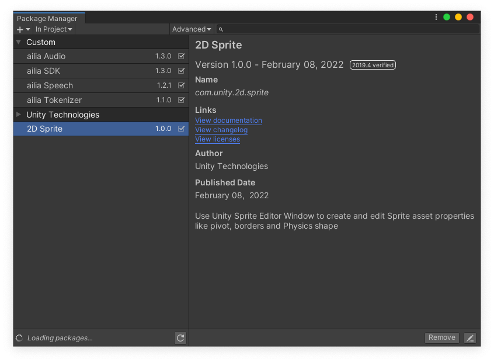
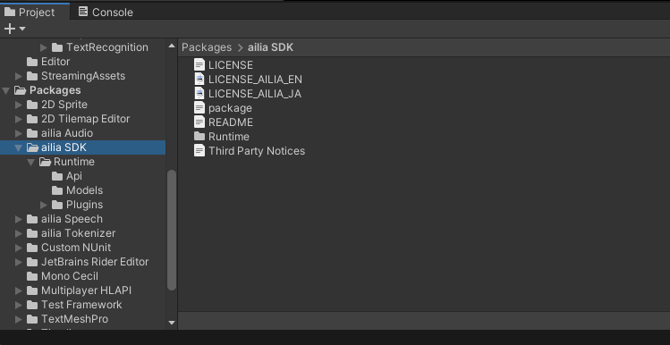
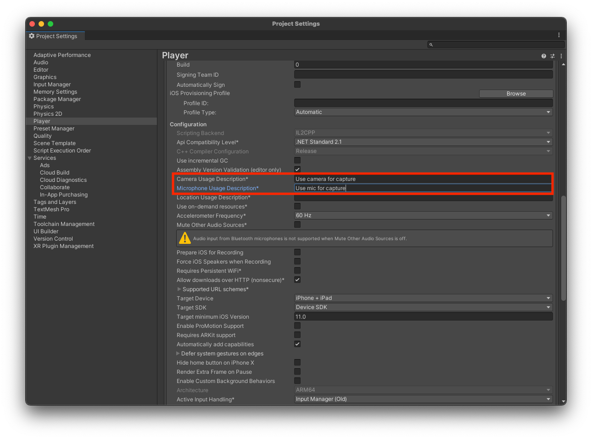

# ailia SDK Now Available Through the Unity Package Manager

# ailia SDK Now Available Through the Unity Package Manager

[](/@cochard-dav?source=post_page---byline--3b47888f6c9e---------------------------------------)

[David Cochard](/@cochard-dav?source=post_page---byline--3b47888f6c9e---------------------------------------)

4 min read

·

Jun 14, 2024

--

[Listen](/m/signin?actionUrl=https%3A%2F%2Fmedium.com%2Fplans%3Fdimension%3Dpost_audio_button%26postId%3D3b47888f6c9e&operation=register&redirect=https%3A%2F%2Fmedium.com%2Faxinc-ai%2Failia-sdk-now-available-through-the-unity-package-manager-3b47888f6c9e&source=---header_actions--3b47888f6c9e---------------------post_audio_button------------------)

Share

[ailia SDK](https://ailia.jp/en/) is now available through the Unity Package Manager to make it easier than ever to integrate ailia SDK into your Unity applications.

---

## About ailia SDK

ailia SDK is an AI inference engine that allows you to easily integrate various AI models published on [ailia MODELS](https://github.com/axinc-ai/ailia-models) into Unity. The applications developed with it can run on Windows, macOS, iOS, Android, and Linux.

[## ailia SDK

### A future in which all devices carry AI We believe such a future is on the way. To usher in that day, we will keep…

axinc.jp](https://axinc.jp/en/solutions/ailia_sdk.html?source=post_page-----3b47888f6c9e---------------------------------------)

[## ailia MODELS

### The collection of pre-trained, state-of-the-art AI models for ailia SDK - axinc-ai/ailia-models

github.com](https://github.com/axinc-ai/ailia-models?source=post_page-----3b47888f6c9e---------------------------------------)

## About the Unity Package Manager (UPM)

The Unity Package Manager is the official package management tool for Unity. By registering the GitHub URL, you can easily install various packages.

## Installing ailia SDK via UPM

Previously, the ailia SDK was provided as a Unity Package, requiring the download of the evaluation version and the configuration of a license file. By using the Unity Package Manager, you can now use the ailia SDK by simply registering the URL within Unity.

Press enter or click to view image in full size


ailia x Unity Package Manager

Open the Package Manager from the Window menu.

Press enter or click to view image in full size



From the top left, click the `+` button and select `Add package from git URL,` then add the necessary URLs from the list below and then click “Add”.

[ailia SDK](https://github.com/axinc-ai/ailia-sdk-unity) (Core Module)  
https://github.com/ailia-ai/ailia-sdk-unity.git

[ailia Audio](https://github.com/axinc-ai/ailia-audio-unity) (Required for audio processing)  
https://github.com/ailia-ai/ailia-audio-unity.git

[ailia Tokenizer](https://github.com/axinc-ai/ailia-tokenizer-unity) (Required for natural language processing)  
https://github.com/ailia-ai/ailia-tokenizer-unity.git

[ailia Speech](https://github.com/axinc-ai/ailia-speech-unity) (Required for speech recognition)  
https://github.com/ailia-ai/ailia-speech-unity.git

[ailia TFLite Runtime](https://github.com/axinc-ai/ailia-tflite-unity) (Required for NPU inference on Android)  
https://github.com/ailia-ai/ailia-tflite-unity.git

Press enter or click to view image in full size


Unity Package Manager with ailia modules installed

The installed packages will be displayed in the “Packages” section of your project.

Press enter or click to view image in full size



## Features of ailia SDK within Unity

With the ailia SDK, you can perform not only image recognition but also speech recognition, translation, OCR, and more.

Press enter or click to view image in full size


Speech recognition

Press enter or click to view image in full size


Translation

Press enter or click to view image in full size


OCR

## Usage with ailia MODELS Unity

The sample programs for Unity using the ailia SDK are available in the repository below.

[## GitHub — axinc-ai/ailia-models-unity: Unity version of ailia models repository

### Unity version of ailia models repository. Contribute to axinc-ai/ailia-models-unity development by creating an account…

github.com](https://github.com/axinc-ai/ailia-models-unity?source=post_page-----3b47888f6c9e---------------------------------------)

Since `ailia-models-unity` also loads the ailia SDK via the Unity Package Manager, it is self-contained and can be run it by simply cloning the repository and opening the sample scene.

```
git clone https://github.com/axinc-ai/ailia-models-unity
```

Scenes are organized by category.

Press enter or click to view image in full size


After opening a scene, the AI model can be changed in the Inspector of the Controller.

Press enter or click to view image in full size


The project also includes a sample of yolox using Android’s NPU. In the ObjectDetection sample, set the model to either `yolox_tiny_nnapi` or `yolox_s_nnapi`.

[## ailia-models-unity/Assets/AXIP/AILIA-MODELS/ObjectDetection/AiliaTFLiteYoloxSample.cs at master ·…

### Unity version of ailia models repository. Contribute to axinc-ai/ailia-models-unity development by creating an account…

github.com](https://github.com/axinc-ai/ailia-models-unity/blob/master/Assets/AXIP/AILIA-MODELS/ObjectDetection/AiliaTFLiteYoloxSample.cs?source=post_page-----3b47888f6c9e---------------------------------------)

Press enter or click to view image in full size


Run sample on Android NPU

## Points to Note for Each Platform

For Android, it is built by default with Mono + armv7a as 32-bit. Since AI models often handle models larger than 2GB, please build with il2cpp + arm64 for 64-bit.

When using the camera and microphone on iOS, you need to specify the Camera Usage Description and Microphone Usage Description in the Project Settings

Press enter or click to view image in full size



## ailia SDK API

Please refer to the following page for the APIs available for use with the ailia SDK:

[## GitHub — axinc-ai/ailia-sdk: cross-platform high speed inference SDK

### cross-platform high speed inference SDK. Contribute to axinc-ai/ailia-sdk development by creating an account on GitHub.

github.com](https://github.com/axinc-ai/ailia-sdk?source=post_page-----3b47888f6c9e---------------------------------------)

---

[ax Inc.](https://axinc.jp/en/) has developed [ailia SDK](https://ailia.jp/en/), which enables cross-platform, GPU-based rapid inference.

ax Inc. provides a wide range of services from consulting and model creation, to the development of AI-based applications and SDKs. Feel free to [contact us](https://axinc.jp/en/) for any inquiry.