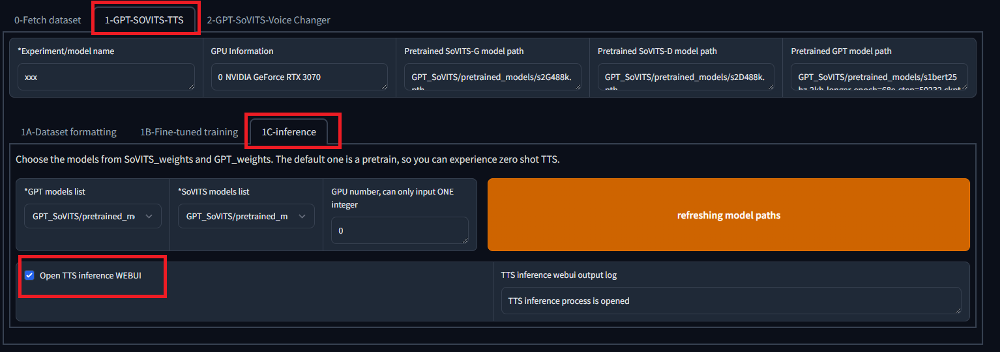
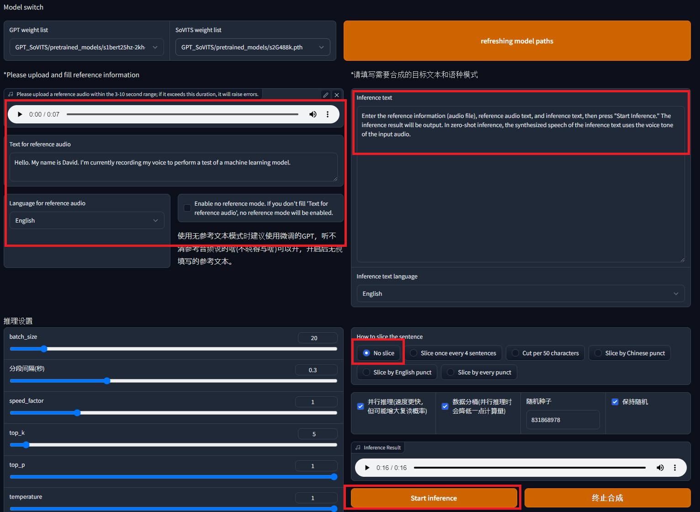
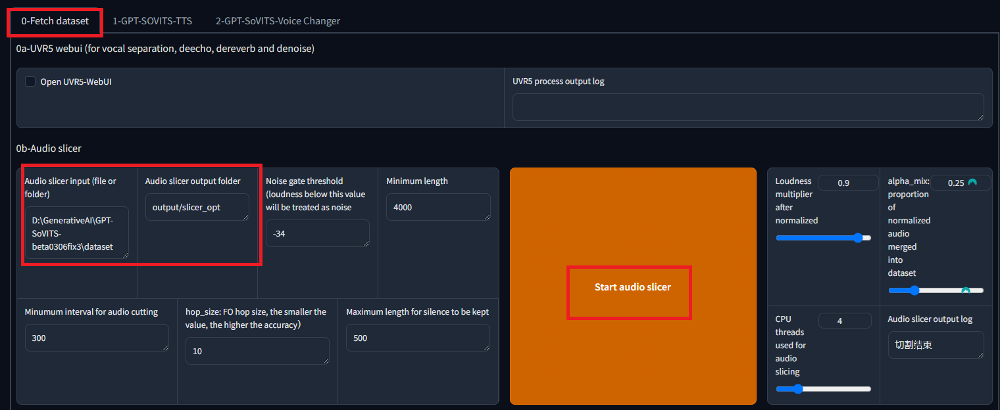
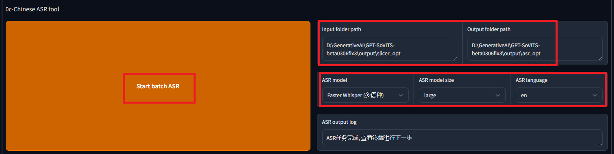
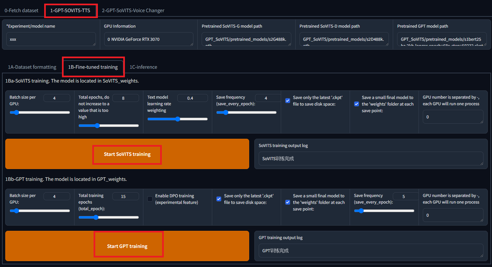
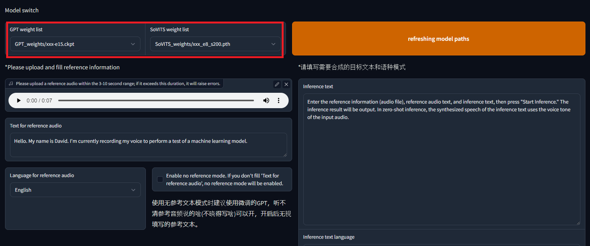

# GPT-SoVITS: A Zero-Shot Speech Synthesis Model with Customizable Fine-Tuning

# GPT-SoVITS: A Zero-Shot Speech Synthesis Model with Customizable Fine-Tuning

[](/@cochard-dav?source=post_page---byline--e4c72cd75d87---------------------------------------)

[David Cochard](/@cochard-dav?source=post_page---byline--e4c72cd75d87---------------------------------------)

9 min read

·

Jul 10, 2024

--

2

[Listen](/m/signin?actionUrl=https%3A%2F%2Fmedium.com%2Fplans%3Fdimension%3Dpost_audio_button%26postId%3De4c72cd75d87&operation=register&redirect=https%3A%2F%2Fmedium.com%2Faxinc-ai%2Fgpt-sovits-a-zero-shot-speech-synthesis-model-with-customizable-fine-tuning-e4c72cd75d87&source=---header_actions--e4c72cd75d87---------------------post_audio_button------------------)

Share

This is an introduction to「GPT-SoVITS」, a machine learning model that can be used with [ailia SDK](https://ailia.jp/en/). You can easily use this model to create AI applications using [ailia SDK](https://ailia.jp/en/) as well as many other ready-to-use [ailia MODELS](https://github.com/axinc-ai/ailia-models).

## Overview

*GPT-SoVITS* is a speech synthesis model released on February 18, 2024. It supports zero-shot speech synthesis using reference audio and can be fine-tuned for improved performance.

Press enter or click to view image in full size


GPT-SoVITS : <https://github.com/RVC-Boss/GPT-SoVITS>

[## GitHub — RVC-Boss/GPT-SoVITS: 1 min voice data can also be used to train a good TTS model! (few…

### 1 min voice data can also be used to train a good TTS model! (few shot voice cloning) — RVC-Boss/GPT-SoVITS

github.com](https://github.com/RVC-Boss/GPT-SoVITS?source=post_page-----e4c72cd75d87---------------------------------------)

## Features of GPT-SoVITS

### Zero-Shot TTS

Instantly synthesizes speech by inputting a 5-second audio sample.

### Few-Shot TTS

Fine-tunes the model with just 1 minute of training data to enhance voice similarity and realism.

### Cross-Lingual Support

Supports inference in different languages from the training data, currently supporting English, Japanese, and Chinese.

### WebUI Tools

Provides integrated tools for voice and accompaniment separation, automatic training set segmentation, Chinese ASR (automatic speech recognition), and text labeling, supporting in the creation of training datasets and the construction of *GPT/SoVITS* models.

## Previous Research

*GPT-SoVITS* is based on recent research in speech synthesis and voice changer models.

VITS is an end-to-end speech synthesis model released in January 2021. Traditional end-to-end speech synthesis models had lower performance compared to two-stage TTS systems that convert text into intermediate representations. VITS improves speech synthesis performance by introducing a Flow model, incorporating a normalization flow to remove speaker characteristics, and using an adversarial training process.

Press enter or click to view image in full size


Source: <https://arxiv.org/abs/2106.06103>

[## GitHub — jaywalnut310/vits: VITS: Conditional Variational Autoencoder with Adversarial Learning for…

### VITS: Conditional Variational Autoencoder with Adversarial Learning for End-to-End Text-to-Speech — jaywalnut310/vits

github.com](https://github.com/jaywalnut310/vits?source=post_page-----e4c72cd75d87---------------------------------------)

VITS2 is an end-to-end speech synthesis model released in July 2023, with Jungil Kong, one of the developers of VITS, as a second author. It replaces the Flow model in VITS with a Transformer Flow. Traditional end-to-end speech synthesis models faced issues with unnaturalness, computational efficiency, and dependency on phoneme conversion. VITS2 proposes improved architecture and training mechanisms over VITS, reducing the strong dependency on phoneme conversion.

[## GitHub — daniilrobnikov/vits2: VITS2: Improving Quality and Efficiency of Single-Stage…

### VITS2: Improving Quality and Efficiency of Single-Stage Text-to-Speech with Adversarial Learning and Architecture…

github.com](https://github.com/daniilrobnikov/vits2?source=post_page-----e4c72cd75d87---------------------------------------)

*Bert-VITS2* is an end-to-end speech synthesis model released in September 2023, which replaces the text encoder in VITS2 with a Multilingual BERT.


Source: <https://github.com/fishaudio/Bert-VITS2>

[## GitHub — fishaudio/Bert-VITS2: vits2 backbone with multilingual-bert

### vits2 backbone with multilingual-bert. Contribute to fishaudio/Bert-VITS2 development by creating an account on GitHub.

github.com](https://github.com/fishaudio/Bert-VITS2?source=post_page-----e4c72cd75d87---------------------------------------)

*SoVITS (SoftVC VITS)* is a model released in July 2023 that replaces the Text Encoder in VITS with the Content Encoder from SoftVC, enabling Speech2Speech synthesis similar to RVC, instead of Text2Speech.


Source: <https://github.com/svc-develop-team/so-vits-svc>

[## GitHub — svc-develop-team/so-vits-svc: SoftVC VITS Singing Voice Conversion

### SoftVC VITS Singing Voice Conversion. Contribute to svc-develop-team/so-vits-svc development by creating an account on…

github.com](https://github.com/svc-develop-team/so-vits-svc?source=post_page-----e4c72cd75d87---------------------------------------)

*GPT-SoVITS* is based on these successive improvements, combining the high-quality speech synthesis of VITS with the zero-shot voice adaptation capabilities of SoVITS.

## Architecture

*GPT-SoVITS* is a modern token-based speech synthesis model. It generates acoustic tokens using a seq2seq model and then converts these acoustic tokens back into waveforms to obtain the synthesized speech waveform.

*GPT-SoVITS* is composed of the following models:

- **cnhubert**: Converts input waveforms into feature vectors.
- **t2s\_encoder**: Generates acoustic tokens from input text, reference text, and feature vectors.
- **t2s\_decoder**: Synthesizes acoustic tokens from the generated acoustic tokens.
- **vits**: Converts acoustic tokens into waveforms.

The inputs for GPT-SoVITS are as follows:

- **text\_seq**: The text to be synthesized into speech.
- **ref\_seq**: The text from the reference audio file.
- **ref\_audio**: The waveform of the reference audio file.

After converting **text\_seq** and **ref\_seq** to phonemes using g2p, they are converted to token sequences in `symbols.py`. For Japanese, g2p conversion is done without accent marks. For Chinese, BERT embeddings (**ref\_bert** and **text\_bert**) are additionally used, but for Japanese and English, these embeddings are zero-padded.

**ref\_audio** has 0.3 seconds of silence appended to the end, then it is converted into feature vectors called **ssl\_content** using **cnhubert**.

The **t2s\_encoder** takes **ref\_seq**, **text\_seq**, and **ssl\_content** as inputs and generates acoustic tokens.

The **t2s\_decoder** takes these acoustic tokens as input and outputs subsequent acoustic tokens using a seq2seq model. This output corresponds to the acoustic tokens for the synthesized text. There are 1025 types of tokens, with 1024 representing EOS (End of Sequence). Tokens are output one by one using top-k and top-p sampling methods, and the process stops when the EOS token appears.

Finally, the acoustic tokens are input into **vits**, which generates the speech waveform.

## Phoneme Conversion

In GPT-SoVITS, Japanese text is converted to phonemes using g2p from `pyopenjtalk`, and English text is converted using `g2p_en`.

For Japanese, the text "`ax株式会社ではAIの実用化のための技術を開発しています。"` results in the phonemes "`e i e cl k U s u k a b u sh I k i g a i sh a d e w a e e a i n o j i ts u y o o k a n o t a m e n o g i j u ts u o k a i h a ts u sh I t e i m a s U ."`. Unlike typical g2p, punctuation is included.

For English, inputting `“Hello world. We are testing speech synthesis.”` results in the phonemes `“HH AH0 L OW1 W ER1 L D . W IY1 AA1 R T EH1 S T IH0 NG S P IY1 CH S IH1 N TH AH0 S AH0 S .”` In `g2p_en`, words are converted to phonemes using the `cmudict` dictionary, and for words not found in the dictionary, a neural network is used for phoneme conversion.

[## g2p/g2p\_en/g2p.py at master · Kyubyong/g2p

### g2p: English Grapheme To Phoneme Conversion. Contribute to Kyubyong/g2p development by creating an account on GitHub.

github.com](https://github.com/Kyubyong/g2p/blob/master/g2p_en/g2p.py?source=post_page-----e4c72cd75d87---------------------------------------)

## Zero-Shot Inference

To perform zero-shot inference, select `1-GPT-SoVITS-TTS` in the WebUI, tab `1C-inference`. Check the box `Open TTS inference WEBUI`, and after a short while, a new window will open.

Press enter or click to view image in full size



Enter the reference audio file, reference audio text, and inference text, then press `“Start Inference” .` In zero-shot inference, the synthesized speech of the inference text uses the voice tone of the input audio.

Press enter or click to view image in full size



## Custom Training

If the voice has distinct features, it is possible to obtain reasonably good speech even with zero-shot inference. For higher accuracy, fine-tuning is necessary.

First, create a dataset. Use the tools in the`“0-Fetch Dataset”` in the pre-processing section of to specify the path of the audio file and split the audio.

Press enter or click to view image in full size



Next, perform speech recognition using the ASR tool to generate the reference text. By selecting Faster Whisper, you can specify the language for speech recognition.

Press enter or click to view image in full size



The format of the output list file is as follows:

```
The TTS annotation .list file format:  
  
```  
vocal_path|speaker_name|language|text  
```  
  
Language dictionary:  
  
- 'zh': Chinese  
- 'ja': Japanese  
- 'en': English  
  
Example:  
  
```  
D:\GPT-SoVITS\xxx/xxx.wav|xxx|en|I like playing Genshin.  
```
```

After creating the dataset, format the training data in the tab`1-GPT-SOVITS-TTS,` subtab `1A-Dataset formatting` . Specify the text annotation file and the directory of the training data audio files, then click `“Start one-click formatting”`

Press enter or click to view image in full size


In the next tab `1B-Fine-tuned training,` train both SoVITS and GPT models.

Press enter or click to view image in full size



Training on an RTX 3080 for approximately 1 minute of audio takes about 78 seconds for SoVITS at 8 epochs and about 60 seconds for GPT at 15 epochs. The size of the trained models was 151,453 KB for GPT and 82,942 KB for SoVITS.

After training, open the inference WebUI as we did before, select the newly trained model, and perform speech synthesis. The default temperature is 1.0, but lowering it to around 0.5 seems to provide more stability.

Press enter or click to view image in full size



## Convert to ONNX

The export code to ONNX is included in the official repository. However, this code does not include the export to **cnhubert** and the inference code, so it needs to be implemented.

[## GPT-SoVITS/GPT\_SoVITS/onnx\_export.py at main · RVC-Boss/GPT-SoVITS

### 1 min voice data can also be used to train a good TTS model! (few shot voice cloning) …

github.com](https://github.com/RVC-Boss/GPT-SoVITS/blob/main/GPT_SoVITS/onnx_export.py?source=post_page-----e4c72cd75d87---------------------------------------)

Additionally, the ONNX version has lower output audio accuracy compared to the torch version. Upon investigation, the following differences between the ONNX and torch versions were found, requiring implementation:

1. Introduction of `exp` to `multinomial_sample_one_no_sync` in sampling.
2. Correction of `pe` in `SinePositionalEmbedding`.
3. Introduction of `noise_scale` in `vq_decode`.
4. Removal of EOS in `first_stage_decode`.

Furthermore, since topK and topP are embedded in the model and cannot be controlled externally, adding them to the input would be convenient.

The repository with these adjustments is available at the link below.

[## GitHub — axinc-ai/GPT-SoVITS: 1 min voice data can also be used to train a good TTS model! (few…

### 1 min voice data can also be used to train a good TTS model! (few shot voice cloning) — axinc-ai/GPT-SoVITS

github.com](https://github.com/axinc-ai/GPT-SoVITS?source=post_page-----e4c72cd75d87---------------------------------------)

Additionally, here is a link to a PR to the official repository.

[## Improve the consistency between ONNX and torch by kyakuno · Pull Request #835 · RVC-Boss/GPT-SoVITS

### Thank you for making available an excellent repository on speech synthesis. Upon using the included script for…

github.com](https://github.com/RVC-Boss/GPT-SoVITS/pull/835?source=post_page-----e4c72cd75d87---------------------------------------)

## Intonation in Japanese

Currently, g2p without accent marks is used in Japanese, which can cause some unnatural intonation in Japanese. The introduction of accent marks is being considered in the following issue, so there is a possibility of improvement in the future.

[## 建议增加对日语韵律音高信息的支持以提高语音合成质量 · Issue #326 · RVC-Boss/GPT-SoVITS

### 目前项目的日语语音合成前端直接使用pyopenjtalk的g2p函数来获取分词结果，然后将其直接输入模型。惊人的是，当前GPT模型已经在没有音高标注的情况下，通过自身的学习能力，实现了对音高的建模，取得了令人满意的韵律效果。…

github.com](https://github.com/RVC-Boss/GPT-SoVITS/issues/326?source=post_page-----e4c72cd75d87---------------------------------------)

## Usage in ailia SDK

*GPT-SoVITS* can be used with ailia SDK 1.4.0 or later. The following command performs speech synthesis based on `reference_audio_captured_by_ax.wav`.

```
python3 gpt-sovits.py -i "音声合成のテストを行なっています。" --ref_audio reference_audio_captured_by_ax.wav --ref_text "水をマレーシアから買わなくてはならない。"
```

[## ailia-models/audio\_processing/gpt-sovits at master · axinc-ai/ailia-models

### The collection of pre-trained, state-of-the-art AI models for ailia SDK - ailia-models/audio\_processing/gpt-sovits at…

github.com](https://github.com/axinc-ai/ailia-models/tree/master/audio_processing/gpt-sovits?source=post_page-----e4c72cd75d87---------------------------------------)

You can also run it in Google Colab.

[## Hello GPT-SoVITS — Google Colab

colab.research.google.com](https://colab.research.google.com/github/axinc-ai/ailia-models/blob/master/audio_processing/gpt-sovits/colab.ipynb?source=post_page-----e4c72cd75d87---------------------------------------)

## Conclusion

By using GPT-SoVITS, we have confirmed that it can perform higher quality Japanese speech synthesis compared to VALLE-X that we described [here](/axinc-ai/vall-e-x-zero-shot-text-to-speech-cross-lingual-model-9686ada19131). The fine-tuning time is shorter than expected, making it practical for use. Additionally, inference time is short and CPU inference is possible, suggesting it will be widely used in the future.

## Troubleshooting

If you encounter the error `SystemError: initialization of _internal failed without raising an exception` when obtaining semantic tokens, please update `numba`.

```
pip install -U numba
```

[## How to remove the error “SystemError: initialization of \_internal failed without raising an…

### I am trying to import Top2Vec package for nlp topic modelling. But even after upgrading pip, numpy this error is…

stackoverflow.com](https://stackoverflow.com/questions/74947992/how-to-remove-the-error-systemerror-initialization-of-internal-failed-without?source=post_page-----e4c72cd75d87---------------------------------------)

---

[ax Inc.](https://axinc.jp/en/) has developed [ailia SDK](https://ailia.jp/en/), which enables cross-platform, GPU-based rapid inference.

ax Inc. provides a wide range of services from consulting and model creation, to the development of AI-based applications and SDKs. Feel free to [contact us](https://axinc.jp/en/) for any inquiry.