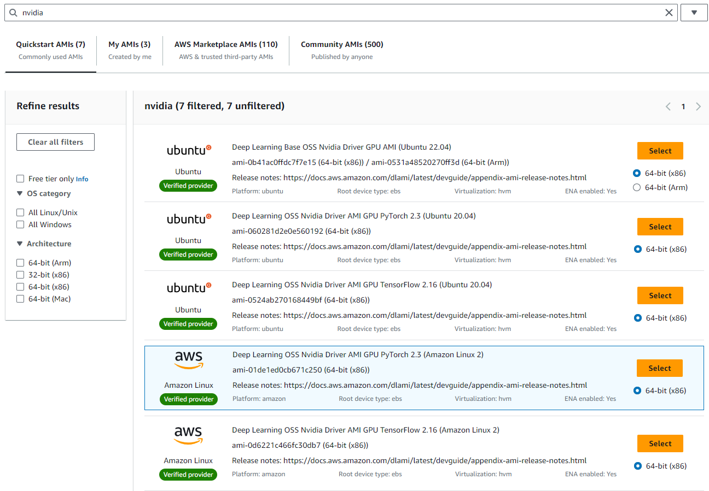
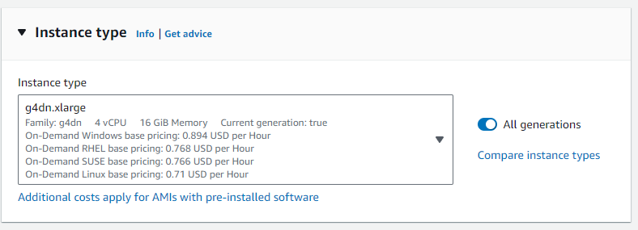
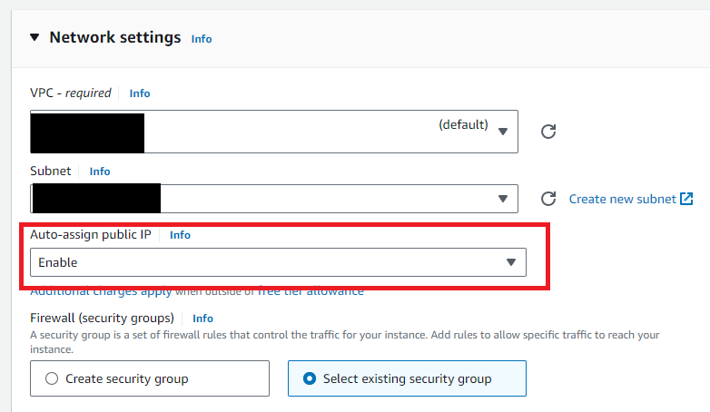
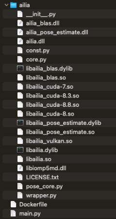

# Deploying ailia SDK on AWS GPU Instances

# Deploying ailia SDK on AWS GPU Instances

[](/@cochard-dav?source=post_page---byline--a71c544c9777---------------------------------------)

[David Cochard](/@cochard-dav?source=post_page---byline--a71c544c9777---------------------------------------)

8 min read

·

Jul 16, 2024

--

[Listen](/m/signin?actionUrl=https%3A%2F%2Fmedium.com%2Fplans%3Fdimension%3Dpost_audio_button%26postId%3Da71c544c9777&operation=register&redirect=https%3A%2F%2Fmedium.com%2Faxinc-ai%2Fdeploying-ailia-sdk-on-aws-gpu-instances-a71c544c9777&source=---header_actions--a71c544c9777---------------------post_audio_button------------------)

Share

This article explains how to deploy the [ailia SDK](https://ailia.jp/en/) on AWS GPU instances. By using the ailia SDK and [ailia MODELS](https://github.com/axinc-ai/ailia-models), you can easily run various AI models on AWS.

---

## About ailia SDK

ailia SDK is a cross-platform inference engine. It enables fast inference using both CPU and GPU, optimized according to your environment. By using the ailia SDK, you can develop on macOS with Metal and perform fast inference on AWS EC2 using NVIDIA’s cuDNN. ailia SDK has few dependencies, so it can be used simply by including it in a Docker image.

Press enter or click to view image in full size


<https://axinc.jp/en/solutions/ailia_sdk.html>

## Our target

We want to setup a GPU instance on AWS with the ailia SDK installed. The network configuration will be as follows.

```
Internet Gateway  
-> Load Balancer  
-> EC2 Target Group  
-> EC2 Instances
```

## About Docker

Docker is a container-based virtualization environment. By building a Docker Image from a configuration file called `Dockerfile` and pushing the Docker Image to a container repository, you can run the same program in any environment.

```
Local development PC  
Dockerfile -> [docker build] -> Docker Image -> [docker push]  
  
EC2  
[docker pull] -> [docker run]
```

## Creation of the EC2 instance

EC2 (Elastic Compute Cloud) is a virtual server service on AWS. Servers can be launched by specifying an initial image that includes the operating system, known as an AMI (Amazon Machine Image).

For this project which requires a GPU, we will create an EC2 instance by specifying the Amazon Deep Learning AMI. This AMI includes NVIDIA drivers and NVIDIA Docker. Installing NVIDIA drivers and NVIDIA Docker yourself can be challenging, but using the Amazon Deep Learning AMI makes setup easy.

Press enter or click to view image in full size



For the EC2 instance type, specify `g4dn.xlarge`, which comes with an NVIDIA GPU. The g4dn is the most cost-effective GPU instance on AWS, featuring an NVIDIA T4 GPU, at a cost of about 0.71 USD per hour, or a little more than $500 per month (pricing depending on your deployment region).

Press enter or click to view image in full size



[## Amazon EC2 G4 Instances - Amazon Web Services (AWS)

### The industry's most cost-effective GPU instances for machine learning inference and graphics-intensive applications…

aws.amazon.com](https://aws.amazon.com/ec2/instance-types/g4/?nc1=h_ls&source=post_page-----a71c544c9777---------------------------------------)

[## NVIDIA T4 Tensor Core GPUs for Accelerating Inference

### The world's most efficient accelerator for all AI inference workloads provides revolutionary multi-precision inference…

www.nvidia.com](https://www.nvidia.com/en-us/data-center/tesla-t4/?source=post_page-----a71c544c9777---------------------------------------)

When creating the instance, configure the key pair to be used for SSH login, the VPC (Virtual Private Cloud) and subnet where the instance will be launche. Make sure to enable the automatic assignment of a public IP. Note that some of these settings must be enabled during instance creation, as they cannot be changed afterward.

Press enter or click to view image in full size



## Including ailia SDK in a Docker Image

Next, we will create the Docker Image on a local PC to run on an EC2 instance.

To include the ailia SDK in the Docker Image, copy the `python/ailia` folder from the ailia SDK to your project directory. Inside the `python/ailia` folder, copy the `library/linux/*.so` files that we’ll use for the EC2 environment, as well as the files `library/mac/*.dylib` and `library/windows/x64/*.dll` used for development on Mac and Windows machines.



This allows you to import the ailia SDK from `main.py` and use it in your project.

Specify an NVIDIA image as the base image in the `FROM` instruction in the Dockerfile. The list of available images can be found at the link below. Ensure that you use an image that includes cuDNN.

[## doc/supported-tags.md · master · nvidia / container-images / cuda · GitLab

### GitLab.com

gitlab.com](https://gitlab.com/nvidia/container-images/cuda/blob/master/doc/supported-tags.md?source=post_page-----a71c544c9777---------------------------------------)

This time, we will use `nvidia/cuda:12.2.2-cudnn8-devel-ubuntu22.04` as the base image. This image includes both CUDA and cuDNN.

When building on a macOS Arm environment, explicitly specify `linux/amd64` using the `platform` flag. If you build on an Arm environment without this specification, it will create an image for Arm, which cannot be executed on EC2’s x86 instances.

```
FROM --platform=linux/amd64 nvidia/cuda:12.2.2-cudnn8-devel-ubuntu22.04  
  
RUN apt-get -y update && apt-get -y install python3 python3-pip  
  
RUN mkdir -p /usr/share/app  
WORKDIR /usr/share/app  
  
COPY requirements.txt .  
RUN pip3 install -r requirements.txt  
  
COPY *.py ./  
COPY ailia/ ailia/  
RUN find . -type f -exec chmod 644 {} +  
  
ENTRYPOINT gunicorn --bind 0.0.0.0:8080 main:app  
EXPOSE 8080/tcp
```

Add `COPY ailia` to the Dockerfile. This will include the ailia binaries in the Docker Image.

Since we are using Flask to set up a web server, the `requirements.txt` file will look as follows. `Gunicorn` serves as the interface between `NGINX` and `Flask`, handling the web server startup.

```
WebOb  
Paste  
grpcio  
Flask==2.2.5  
unstructured  
gunicorn  
numpy  
opencv-python  
pillow  
scikit-image  
ftfy
```

Build the Docker Image from the Dockerfile.

```
docker build -t ailia-test .
```

Delete any unused Docker Images.

```
docker image prune -f
```

Test the Docker Image in the local environment.

```
docker run -it --rm --name ailia-test --publish 8080:8080/tcp ailia-test
```

## Push the Docker Image to ECR

Push the Docker Image to Amazon’s ECR (Elastic Container Registry) so that it can be downloaded from EC2. ECR acts as a container repository, similar to GitHub for containers.

If the AWS CLI is version 1, you won’t be able to use SSO, so update to version 2. If using version 1, you will see a message below:

```
Note: AWS CLI version 2, the latest major version of the AWS CLI, is now stable and recommended for general use. For more information, see the AWS CLI version 2
```

Following the [official procedure](https://docs.aws.amazon.com/en_us/cli/latest/userguide/getting-started-install.html), the symbolic link is not created for some reason, so create the symbolic link manually.

```
sudo yum remove awscli  
curl "https://awscli.amazonaws.com/awscli-exe-linux-x86_64.zip" -o "awscliv2.zip"  
unzip awscliv2.zip  
sudo ./aws/install  
sudo ./aws/install —update  
sudo ln -s /usr/local/aws-cli/v2/2.15.0/bin/aws /usr/bin/aws
```

Obtain authentication credentials for EC2 using SSO (Single Sign On). This command will grant access to ECR for a certain period. When you run the command, you will be prompted for an AWS start URL. Set the start URL to something like `https://d-xxx.awsapps.com/start/`. This will open a browser where you can complete the authentication.

```
aws configure sso
```

Push the Docker Image to ECR. Specify the profile name returned by the SSO command in `SSO_PROFILE`.

```
export AILIA_SSO_PROFILE="AdministratorAccess-xxx"  
export AILIA_ECR_URI="xxx.dkr.ecr.ap-northeast-1.amazonaws.com"  
  
aws ecr get-login-password --profile ${AILIA_SSO_PROFILE} --region ap-northeast-1 | docker login --username AWS --password-stdin ${AILIA_ECR_URI}  
docker tag ailia-test:latest ${AILIA_ECR_URI}/ailia-test:latest  
docker push ${AILIA_ECR_URI}/ailia-testlatest
```

## Pull and run the Docker Image on EC2

Log in to EC2 instance previously created. The connection destination will be the global IP address of the EC2 instance. Use the key pair that was used during the instance creation for authentication.

```
ssh -i "../your_key.pem" ec2-user@${IP_ADDR}
```

Obtain authentication credentials using SSO.

```
aws configure sso
```

Perform a `docker pull` from ECR to download the Docker Image.

```
export AILIA_SSO_PROFILE="AdministratorAccess-xxx"  
export AILIA_ECR_URI="xxx.dkr.ecr.ap-northeast-1.amazonaws.com"  
  
aws ecr get-login-password --region ap-northeast-1 --profile ${AILIA_SSO_PROFILE} | docker login --username AWS --password-stdin ${AILIA_ECR_URI}  
docker pull ${AILIA_ECR_URI}/ailia-test:latest  
docker tag ${AILIA_ECR_URI}/ailia-test ailia-test
```

When running `docker run`, add the `--gpus all` command to enable GPU support. Additionally, add `--restart always` to ensure the container automatically starts after a reboot.

```
docker run --gpus all --restart always --detach --name ailia-test --publish 8080:8080/tcp ailia-test
```

## Logging

To view the web server logs, connect the logs to AWS CloudWatch. To do this, specify the `--log-driver` option in the `docker run` command.

```
docker run --gpus all--restart always --detach --name ailia-test --publish 8080:8080/tcp --log-driver=awslogs --log-opt awslogs-region=ap-northeast-1 --log-opt awslogs-group=ailia-test-log ailia-test
```

To use CloudWatch, ensure that the IAM Role of the EC2 instance is set to `CloudWatchAgentServerRole`. If the role is not set correctly, the following error will occur.

```
docker: Error response from daemon: failed to initialize logging driver: failed to create Cloudwatch log stream: NoCredentialProviders: no valid providers in chain. Deprecated.  
 For verbose messaging see aws.Config.CredentialsChainVerboseErrors.
```

With this setup, you can now check the logs from the EC2 console’s CloudWatch log groups.

Additionally, if you want to monitor memory and disk usage, you need to install the CloudWatch Agent. On Amazon Linux 2013, the CloudWatch Agent is installed by default, so create the configuration file using the following command.

```
sudo /opt/aws/amazon-cloudwatch-agent/bin/amazon-cloudwatch-agent-config-wizard
```

The questions “Do you want to specify any additional log files to monitor?” and “Do you want to store the config in the SSM parameter store?” should appear, answer “no” to both.

Then install `collectd`.

```
sudo amazon-linux-extras install collectd
```

Start CloudWatch using the following command:

```
sudo /opt/aws/amazon-cloudwatch-agent/bin/amazon-cloudwatch-agent-ctl -a fetch-config -m ec2 -s -c file:/opt/aws/amazon-cloudwatch-agent/bin/config.json
```

All metrics will now be accessible under CWAgent in CloudWatch, as well as all logs issued using the Python logger.

```
logger.info("info test")  
logger.warning("warning test")  
logger.error("error test")
```

## Inspect the deployed image

With the previous steps, ailia SDK is now usable on EC2. Next, let’s check which libraries are installed.

After logging into EC2 via SSH, you can verify if the NVIDIA driver is installed by running `nvidia-smi`.

```
nvidia-smi
```

Start by entering the running docker container.

```
docker exec -it ailia-test /bin/bash
```

Using the `ldd` command to check the dependent libraries of `libailia_cuda-8.8.so`, you can see that cuDNN is located in `/usr/lib/x86_64-linux-gnu`, and CUDA is located in `/usr/local/cuda/targets/x86_64-linux/lib`.

```
/usr/share/app/ailia# ldd libailia_cuda-8.8.so  
 linux-vdso.so.1 (0x00007ffff9fdd000)  
 libdl.so.2 => /usr/lib/x86_64-linux-gnu/libdl.so.2 (0x00007fc07d0e2000)  
 librt.so.1 => /usr/lib/x86_64-linux-gnu/librt.so.1 (0x00007fc07d0dd000)  
 libcudnn_cnn_infer.so.8 => /usr/lib/x86_64-linux-gnu/libcudnn_cnn_infer.so.8 (0x00007fc059e00000)  
 libcudnn_ops_infer.so.8 => /usr/lib/x86_64-linux-gnu/libcudnn_ops_infer.so.8 (0x00007fc054400000)  
 libcudnn_ops_train.so.8 => /usr/lib/x86_64-linux-gnu/libcudnn_ops_train.so.8 (0x00007fc04fe00000)  
 libcudart.so.12 => /usr/local/cuda/targets/x86_64-linux/lib/libcudart.so.12 (0x00007fc04fa00000)  
 libcublas.so.12 => /usr/local/cuda/targets/x86_64-linux/lib/libcublas.so.12 (0x00007fc049200000)  
 libcublasLt.so.12 => /usr/local/cuda/targets/x86_64-linux/lib/libcublasLt.so.12 (0x00007fc026200000)  
 libm.so.6 => /usr/lib/x86_64-linux-gnu/libm.so.6 (0x00007fc07cff4000)  
 libpthread.so.0 => /usr/lib/x86_64-linux-gnu/libpthread.so.0 (0x00007fc07cfef000)  
 libstdc++.so.6 => /usr/lib/x86_64-linux-gnu/libstdc++.so.6 (0x00007fc025fd4000)  
 libgcc_s.so.1 => /usr/lib/x86_64-linux-gnu/libgcc_s.so.1 (0x00007fc07cfcd000)  
 libc.so.6 => /usr/lib/x86_64-linux-gnu/libc.so.6 (0x00007fc025dac000)  
 /lib64/ld-linux-x86-64.so.2 (0x00007fc07d0f4000)  
 libz.so.1 => /usr/lib/x86_64-linux-gnu/libz.so.1 (0x00007fc07cfb1000)
```

## Usage in an Intel environment

NVIDIA Docker Images with cuDNN and CUDA can run on Intel environments, allowing direct deployment. However, these NVIDIA images are about 20GB larger than standard Ubuntu images. If you want to reduce the image size, use a standard Ubuntu image. Although this will switch to CPU inference, the ailia SDK will still function correctly on a standard Ubuntu image.

```
FROM --platform=linux/amd64 ubuntu:22.04
```

## What’s next?

By deploying the ailia SDK on AWS GPU instances, you gain access to a rich library of over 300 models available at the repository below.

[## GitHub — axinc-ai/ailia-models: The collection of pre-trained, state-of-the-art AI models for ailia…

### The collection of pre-trained, state-of-the-art AI models for ailia SDK — GitHub — axinc-ai/ailia-models: The…

github.com](https://github.com/axinc-ai/ailia-models?source=post_page-----a71c544c9777---------------------------------------)

---

[ax Inc.](https://axinc.jp/en/) has developed [ailia SDK](https://ailia.jp/en/), which enables cross-platform, GPU-based rapid inference.

ax Inc. provides a wide range of services from consulting and model creation, to the development of AI-based applications and SDKs. Feel free to [contact us](https://axinc.jp/en/) for any inquiry.