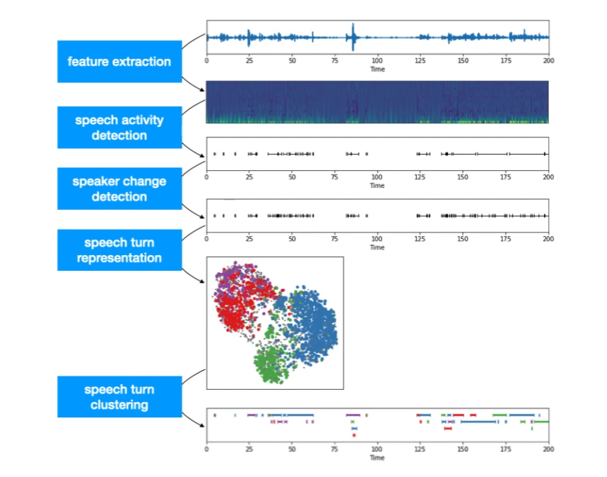
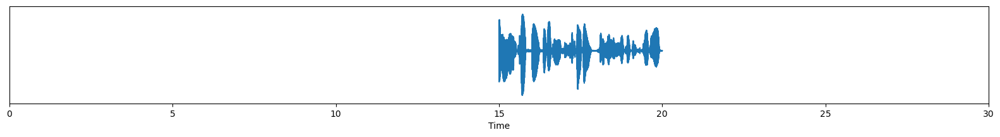
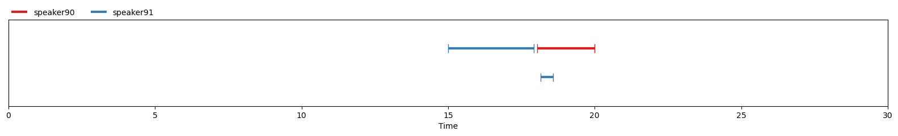

# PyannoteAudio: A Machine Learning Model for Speaker Diarization

# PyannoteAudio: A Machine Learning Model for Speaker Diarization

[](/@cochard-dav?source=post_page---byline--dd3902447bd2---------------------------------------)

[David Cochard](/@cochard-dav?source=post_page---byline--dd3902447bd2---------------------------------------)

3 min read

·

Aug 1, 2024

--

[Listen](/m/signin?actionUrl=https%3A%2F%2Fmedium.com%2Fplans%3Fdimension%3Dpost_audio_button%26postId%3Ddd3902447bd2&operation=register&redirect=https%3A%2F%2Fmedium.com%2Faxinc-ai%2Fpyannoteaudio-a-machine-learning-model-for-speaker-diarization-dd3902447bd2&source=---header_actions--dd3902447bd2---------------------post_audio_button------------------)

Share

This is an introduction to「PyannoteAudio」, a machine learning model that can be used with [ailia SDK](https://ailia.jp/en/). You can easily use this model to create AI applications using [ailia SDK](https://ailia.jp/en/) as well as many other ready-to-use [ailia MODELS](https://github.com/axinc-ai/ailia-models).

## Overview

*Speaker diarisation* (or diarization) is the process of partitioning an audio stream containing human speech into homogeneous segments according to the identity of each speaker. *PyannoteAudio* can output the speaker’s ID for each time segment, indicating who is speaking.

Press enter or click to view image in full size



Source: <https://www.youtube.com/watch?v=37R_R82lfwA>

[## GitHub — pyannote/pyannote-audio: Neural building blocks for speaker diarization: speech activity…

### Neural building blocks for speaker diarization: speech activity detection, speaker change detection, overlapped speech…

github.com](https://github.com/pyannote/pyannote-audio?source=post_page-----dd3902447bd2---------------------------------------)

## Architecture

I am going to summarize the information contained in the blog below in a very succinct list of steps.

[## One speaker segmentation model to rule them all

### CNRS / IRIT / SAMoVA

herve.niderb.fr](https://herve.niderb.fr/fastpages/2022/10/23/One-speaker-segmentation-model-to-rule-them-all?source=post_page-----dd3902447bd2---------------------------------------)

We have an input waveform.

Press enter or click to view image in full size



Source: <https://herve.niderb.fr/fastpages/2022/10/23/One-speaker-segmentation-model-to-rule-them-all>

A segmentation model outputs the probability values of conversations for three speakers.

Press enter or click to view image in full size


Source: <https://herve.niderb.fr/fastpages/2022/10/23/One-speaker-segmentation-model-to-rule-them-all>

Based on the probability values, binary conversion is performed, and IDs are assigned to the conversations.

Press enter or click to view image in full size



Source: <https://herve.niderb.fr/fastpages/2022/10/23/One-speaker-segmentation-model-to-rule-them-all>

For long audio files, a 5-second sliding window is used to calculate the probability values on each segment, and then combine the results.

Press enter or click to view image in full size


Source: <https://herve.niderb.fr/fastpages/2022/10/23/One-speaker-segmentation-model-to-rule-them-all>

Additionally, by using the speaker-embedding model, embeddings can be calculated from the audio to identify the same person.

## Usage

*PyannoteAudio* can be used with ailia SDK using the following command.

```
python pyannote-audio.py -i ./data/sample.wav
```

Here is what the output looks like.

Press enter or click to view image in full size


```
[ 00:00:06.714 -->  00:00:07.003] A speaker91  
[ 00:00:07.003 -->  00:00:07.173] B speaker90  
[ 00:00:07.580 -->  00:00:08.310] C speaker91  
[ 00:00:08.310 -->  00:00:09.923] D speaker90  
[ 00:00:09.923 -->  00:00:10.976] E speaker91  
[ 00:00:10.466 -->  00:00:14.745] F speaker90  
[ 00:00:14.303 -->  00:00:17.886] G speaker91  
[ 00:00:18.022 -->  00:00:21.502] H speaker90  
[ 00:00:18.157 -->  00:00:18.446] I speaker91  
[ 00:00:21.774 -->  00:00:28.531] J speaker91  
[ 00:00:27.886 -->  00:00:29.991] K speaker90
```

[## ailia-models/audio\_processing/pyannote-audio at master · axinc-ai/ailia-models

### The collection of pre-trained, state-of-the-art AI models for ailia SDK — ailia-models/audio\_processing/pyannote-audio…

github.com](https://github.com/axinc-ai/ailia-models/tree/master/audio_processing/pyannote-audio?source=post_page-----dd3902447bd2---------------------------------------)

---

[ax Inc.](https://axinc.jp/en/) has developed [ailia SDK](https://ailia.jp/en/), which enables cross-platform, GPU-based rapid inference.

ax Inc. provides a wide range of services from consulting and model creation, to the development of AI-based applications and SDKs. Feel free to [contact us](https://axinc.jp/en/) for any inquiry.