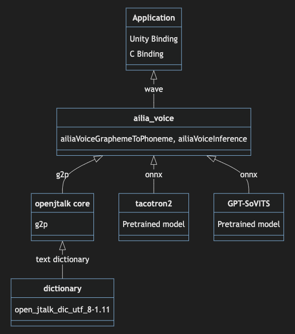
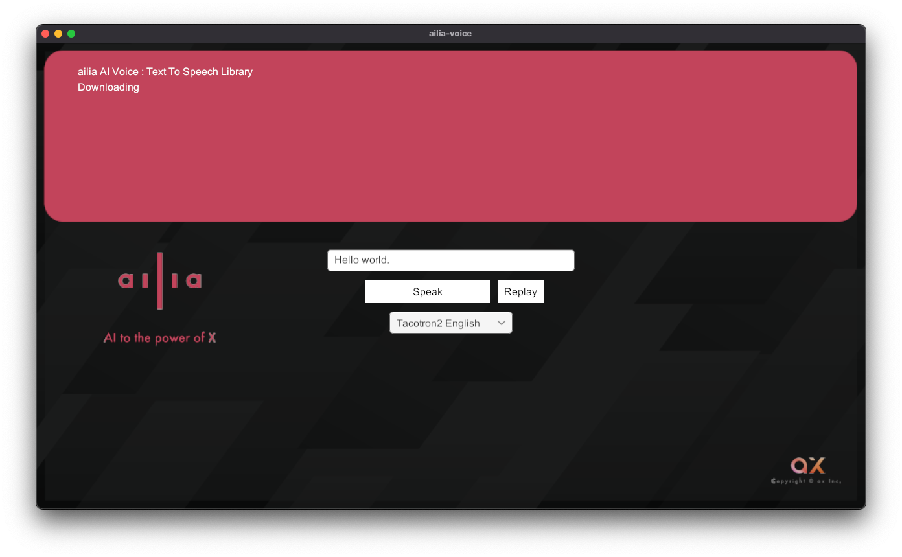
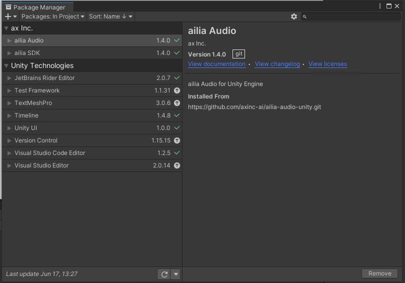
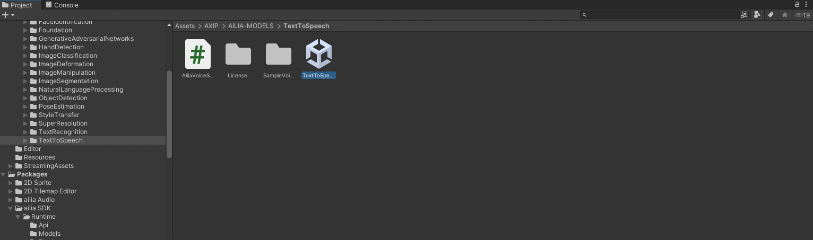
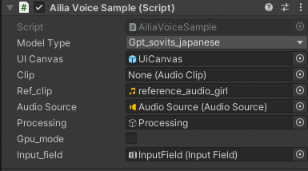
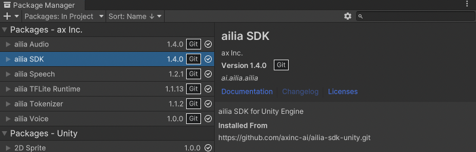

# ailia AI Voice: Voice Synthesis Library for Unity and C++

# ailia AI Voice: Voice Synthesis Library for Unity and C++

[](/@cochard-dav?source=post_page---byline--76cd9137a06d---------------------------------------)

[David Cochard](/@cochard-dav?source=post_page---byline--76cd9137a06d---------------------------------------)

7 min read

·

Aug 13, 2024

--

[Listen](/m/signin?actionUrl=https%3A%2F%2Fmedium.com%2Fplans%3Fdimension%3Dpost_audio_button%26postId%3D76cd9137a06d&operation=register&redirect=https%3A%2F%2Fmedium.com%2Faxinc-ai%2Failia-ai-voice-voice-synthesis-library-for-unity-and-c-76cd9137a06d&source=---header_actions--76cd9137a06d---------------------post_audio_button------------------)

Share

Press enter or click to view image in full size


## Overview

*ailia AI Voice* is a library for performing AI-based voice synthesis. It provides a C# API for Unity and a C API for native applications.

*ailia AI Voice* allows for offline voice synthesis on edge devices without requiring any internet connection. Additionally, it supports the latest *GPT-SoVITS*, enabling voice synthesis with any desired voice tone.

[## GPT-SoVITS: A Zero-Shot Speech Synthesis Model with Customizable Fine-Tuning

### This is an introduction to「GPT-SoVITS」, a machine learning model that can be used with ailia SDK. You can easily use…

medium.com](/axinc-ai/gpt-sovits-a-zero-shot-speech-synthesis-model-with-customizable-fine-tuning-e4c72cd75d87?source=post_page-----76cd9137a06d---------------------------------------)

## Features

**Multilingual Support**  
You can use both English and Japanese voice synthesis models. For English, NVIDIA’s official [*Tacotron2*](https://github.com/NVIDIA/tacotron2) model is used, and for Japanese, we integrated the official [*GPT-SoVITS*](https://github.com/RVC-Boss/GPT-SoVITS)model.

**Offline Operation**  
Voice synthesis can be executed on the device without requiring a cloud connection. Inference can also be performed using just the CPU.

**Mobile Device Support**  
Voice synthesis is possible not only on PCs but also on iOS and Android mobile devices.

**Unity Support**  
In addition to the C API, a Unity Plugin is provided, making it easy to implement voice synthesis in applications using Unity.

**Custom Voice Tone Synthesis**  
By using *GPT-SoVITS*, you can perform voice synthesis with any desired tone by providing a short audio file of around 10 seconds.

## Architecture

*ailia AI Voice* supports [*Tacotron2*](https://github.com/NVIDIA/tacotron2)and [*GPT-SoVITS*](https://github.com/RVC-Boss/GPT-SoVITS)for voice synthesis. To use Japanese with *Tacotron2* and *GPT-SoVITS*, the Japanese text needs to be converted into phonemes. *ailia AI Voice* includes a built-in G2P (Grapheme-to-Phoneme) function to handle this conversion which makes it available on Windows, macOS, Linux, iOS, and Android.

Press enter or click to view image in full size



## Usage

Below is an example of performing voice synthesis in C#. First, create an instance of `AiliaVoiceModel`, then load the dictionary with `OpenDictionary`, and the AI model with `OpenModel`. Use `G2P` to convert the text into phonemes, and call `Inference` to obtain an `AudioClip`. In the case of *GPT-SoVITS*, by providing a reference audio file of about 10 seconds and the corresponding text, you can synthesize voice with any desired tone.

```
void Initialize(){  
    bool status = voice.Create(Ailia.AILIA_ENVIRONMENT_ID_AUTO, AiliaVoice.AILIA_VOICE_FLAG_NONE);  
  
    string asset_path=Application.streamingAssetsPath;  
  
    string path = asset_path+"/AiliaVoice/";  
    status = voice.OpenDictionary(path+"open_jtalk_dic_utf_8-1.11", AiliaVoice.AILIA_VOICE_DICTIONARY_TYPE_OPEN_JTALK);  
  
    switch(model){  
    case MODEL_TACOTRON2_ENGLISH:  
        status = voice.OpenModel(path+"onnx/nvidia/encoder.onnx", path+"onnx/nvidia/decoder_iter.onnx", path+"onnx/nvidia/postnet.onnx", path+"onnx/nvidia/waveglow.onnx", null, AiliaVoice.AILIA_VOICE_MODEL_TYPE_TACOTRON2, AiliaVoice.AILIA_VOICE_CLEANER_TYPE_BASIC);  
        break;  
    case MODEL_GPT_SOVITS_JAPANESE:  
        status = voice.OpenModel(path+"onnx/gpt-sovits/t2s_encoder.onnx", path+"onnx/gpt-sovits/t2s_fsdec.onnx", path+"onnx/gpt-sovits/t2s_sdec.opt.onnx", path+"onnx/gpt-sovits/vits.onnx", path+"onnx/gpt-sovits/cnhubert.onnx", AiliaVoice.AILIA_VOICE_MODEL_TYPE_GPT_SOVITS, AiliaVoice.AILIA_VOICE_CLEANER_TYPE_BASIC);  
        break;  
    }  
 }  
  
 void Infer(string text){  
    if (model == MODEL_GPT_SOVITS_JAPANESE){  
        text = voice.G2P(text, AiliaVoice.AILIA_VOICE_G2P_TYPE_GPT_SOVITS_JA);  
        string ref_text = voice.G2P("水をマレーシアから買わなくてはならない。", AiliaVoice.AILIA_VOICE_G2P_TYPE_GPT_SOVITS_JA);  
        voice.SetReference(ref_clip, ref_text);  
    }  
  
    voice.Inference(text);  
      
    audioSource.clip = voice.GetAudioClip();  
    audioSource.Play();  
}  
  
void Uninitialize(){  
    voice.Close();  
}
```

If you want to perform voice synthesis asynchronously, you can use `Task`. However, be aware that if you call `Inference` simultaneously from multiple threads, an exception will occur, so make sure to implement thread synchronization at a higher level. Additionally, since `AudioClip` can only be manipulated from the Unity main thread, you must handle `SetReference` and `GetAudioClip` from this same main thread.

```
using System.Threading;  
using System.Threading.Tasks;  
  
void Infer(string text){  
  var context = SynchronizationContext.Current;  
  Task.Run(async () =>  
  {  
   string feature = voice.G2P(text, AiliaVoice.AILIA_VOICE_G2P_TYPE_GPT_SOVITS_JA);  
   bool status = voice.Inference(feature);  
   context.Post(state =>  
   {  
    clip = voice.GetAudioClip();  
    audioSource.clip = clip;  
    audioSource.Play();  
   }, null);     
  });//.Wait();  
}
```

## Output samples

- English voice sample using *Tacotron2*

<https://storage.googleapis.com/ailia-models/blog/tacotron2.wav>

- Japanese voice sample using *GPT-SoVITS*

<https://storage.googleapis.com/ailia-models/blog/gpt-sovits.wav>

## Reference audio file

With *GPT-SoVITS*, you can perform voice synthesis using a reference audio of about 10 seconds, replicating the voice quality of the provided sample. However, if the audio contains long periods of silence, the synthesis may become unstable. Therefore, it’s recommended to manually remove the silent portions from the audio file before using it. Additionally, having a period punctuation (. or 。)at the end of the spoken text can contribute to more stable synthesis.

## Model size and inference speed

For *Tacotron2*, the model that calculates the power spectrum from phonemes is 112MB, and the model that calculates the phase from the power spectrum and converts it back to a waveform is 312MB.

For *GPT-SoVITS*, the feature extraction model is 377MB, the encoder is 11MB, the decoder is 615MB, and the voice conversion model is 162MB.

On a macOS M3 CPU, *GPT-SoVITS* can synthesize a 2.9-second audio clip in approximately 2.8 seconds. Additionally, efforts are ongoing to further accelerate the inference speed to enable real-time synthesis on a wider range of devices.

## Download and documentation

You can download the evaluation version of the library with the form below.

[## AILIA-VOICE Request Evaluation License

### "ailia" EVALUATION LICENSE AGREEMENT PLEASE READ THIS "ailia" EVALUATION LICENSE AGREEMENT (HEREINAFTER REFERRED TO AS…

axip-console.appspot.com](https://axip-console.appspot.com/trial/terms/AILIA-VOICE?lang=en&source=post_page-----76cd9137a06d---------------------------------------)

Here is the documentation:

[## GitHub — axinc-ai/ailia-sdk: cross-platform high speed inference SDK

### cross-platform high speed inference SDK. Contribute to axinc-ai/ailia-sdk development by creating an account on GitHub.

github.com](https://github.com/axinc-ai/ailia-sdk?source=post_page-----76cd9137a06d---------------------------------------)

## Demo application

You can download the demo application for macOS from the link below. After downloading, unzip the file, and then right-click to open and run the application.

[## AILIA-VOICE 1.0.0\_demo\_mac ダウンロード

axip-console.appspot.com](https://axip-console.appspot.com/binary/download/ndb_MTcxODc1OTQ4NC40NDUxMTFfOTcyNDk5MjUz?source=post_page-----76cd9137a06d---------------------------------------)

After launching the application, the model will be automatically downloaded. You can input text into the text box and use the “Speak” button to perform voice synthesis. *Tacotron2* supports English, while *GPT-SoVITS* supports Japanese.

Press enter or click to view image in full size



If `“Invalid Binary”` is displayed when starting the application, please use the following command.

```
xattr -d com.apple.quarantine ailia_voice_sample.app
```

## Tutorial

### Usage as a Unity package

The evaluation version of ailia AI Voice includes a Unity Package. The sample in the Unity Package allows you to perform voice synthesis from any text and play it back.

After importing the ailia AI Voice Unity Package, please install the following dependency libraries using the Package Manager. The license file will be automatically downloaded.

[ailia SDK](https://github.com/axinc-ai/ailia-sdk-unity) (core module)  
https://github.com/axinc-ai/ailia-sdk-unity.git

[ailia Audio](https://github.com/axinc-ai/ailia-audio-unity) (required for audio processing)  
https://github.com/axinc-ai/ailia-audio-unity.git

Press enter or click to view image in full size



ailia SDKとailia AudioをPackage Managerに追加

### Usage as a Unity package combined with ailia MODELS

ailia MODELS can also be used with Unity.

[## GitHub — axinc-ai/ailia-models-unity: Unity version of ailia models repository

### Unity version of ailia models repository. Contribute to axinc-ai/ailia-models-unity development by creating an account…

github.com](https://github.com/axinc-ai/ailia-models-unity?source=post_page-----76cd9137a06d---------------------------------------)

The following package is referenced:

[ailia Voice](https://github.com/axinc-ai/ailia-voice-unity) (voice synthesis module)  
https://github.com/axinc-ai/ailia-voice-unity.git

By using the `TextToSpeech.scene` included in ailia MODELS Unity, you can enable voice synthesis.

Press enter or click to view image in full size



TextToSpeech.scene

In ailia MODELS Unity, you can switch between *Tacotron2* and *GPT-SoVITS* using the Inspector. Additionally, you can set a reference audio clip for voice quality in the `ref_clip` field. If you want to set the voice quality using a different text, replace the text in `AiliaVoiceSample.cs` with the text that is being spoken in the reference audio.



Setting a reference clip

Additionally, due to the fact that the model input shape changes every frame with *GPT-SoVITS*, the current implementation runs faster on the CPU than on the GPU. GPU optimizations are planned for future updates.

To use *ailia AI Voice*, ailia SDK version 1.4.0 or later is required. If you encounter any errors during execution, please check in the Package Manager to ensure that you are using version 1.4.0 or higher.

Press enter or click to view image in full size



### Usage from C++

After extracting the SDK, navigate to the `cpp` folder and build it using the following command. If the license file is not present, an error (-20) will occur, so please copy the license file into the `cpp` folder.

Build on Windows

```
cl ailia_voice_sample.cpp wave_writer.cpp wave_reader.cpp ailia_voice.lib ailia.lib ailia_audio.lib
```

Build on macOS

```
clang++ -o ailia_voice_sample ailia_voice_sample.cpp wave_writer.cpp wave_reader.cpp libailia_voice.dylib libailia.dylib libailia_audio.dylib -Wl,-rpath,./ -std=c++17
```

Build on Linux

```
g++ -o ailia_voice_sample ailia_voice_sample.cpp wave_writer.cpp wave_reader.cpp libailia_voice.so libailia.so libailia_audio.so
```

Execution

```
./ailia_voice_sample tacotron2  
./ailia_voice_sample gpt-sovits
```

### Usage from Flutter (pubspec)

Add the following to your *pubspec.yaml*

```
ailia:  
    git:  
      url: https://github.com/axinc-ai/ailia-sdk-flutter.git  
  
  ailia_audio:  
    git:  
      url: https://github.com/axinc-ai/ailia-audio-flutter.git  
  
  ailia_voice:  
    git:  
      url: https://github.com/axinc-ai/ailia-voice-flutter.git
```

Below is a sample code to perform voice synthesis:

```
Future<void> inference(  
      String targetText,  
      String outputPath,  
      String encoderFile,  
      String decoderFile,  
      String postnetFile,  
      String waveglowFile,  
      String? sslFile,  
      String dicFolder,  
      int modelType) async {  
    _ailiaVoiceModel.open(  
        encoderFile,  
        decoderFile,  
        postnetFile,  
        waveglowFile,  
        sslFile,  
        dicFolder,  
        modelType,  
        ailia_voice_dart.AILIA_VOICE_CLEANER_TYPE_BASIC,  
        ailia_voice_dart.AILIA_VOICE_DICTIONARY_TYPE_OPEN_JTALK,  
        ailia_voice_dart.AILIA_ENVIRONMENT_ID_AUTO);  
  
    if (modelType == ailia_voice_dart.AILIA_VOICE_MODEL_TYPE_GPT_SOVITS) {  
      ByteData data = await rootBundle.load("assets/reference_audio_girl.wav");  
      final wav = Wav.read(data.buffer.asUint8List());  
  
      List<double> pcm = List<double>.empty(growable: true);  
  
      for (int i = 0; i < wav.channels[0].length; ++i) {  
        for (int j = 0; j < wav.channels.length; ++j) {  
          pcm.add(wav.channels[j][i]);  
        }  
      }  
  
      String referenceFeature = _ailiaVoiceModel.g2p("水をマレーシアから買わなくてはならない。",  
          ailia_voice_dart.AILIA_VOICE_G2P_TYPE_GPT_SOVITS_JA);  
      _ailiaVoiceModel.setReference(  
          pcm, wav.samplesPerSecond, wav.channels.length, referenceFeature);  
    }  
  
    String targetFeature = targetText;  
    if (modelType == ailia_voice_dart.AILIA_VOICE_MODEL_TYPE_GPT_SOVITS) {  
      targetFeature = _ailiaVoiceModel.g2p(targetText,  
          ailia_voice_dart.AILIA_VOICE_G2P_TYPE_GPT_SOVITS_JA);  
    }  
    final audio = _ailiaVoiceModel.inference(targetFeature);  
    _speaker.play(audio, outputPath);  
  
    _ailiaVoiceModel.close();  
  }  
}
```

[## ailia-voice-flutter/example/lib at main · axinc-ai/ailia-voice-flutter

### ailia AI Voice Flutter Binding. Contribute to axinc-ai/ailia-voice-flutter development by creating an account on…

github.com](https://github.com/axinc-ai/ailia-voice-flutter/tree/main/example/lib?source=post_page-----76cd9137a06d---------------------------------------)

### Usage from Flutter combined with ailia MODELS

ailia MODELS is available for flutter at the repository below:

[## GitHub — axinc-ai/ailia-models-flutter: ONNX Model Library for Flutter

### ONNX Model Library for Flutter. Contribute to axinc-ai/ailia-models-flutter development by creating an account on…

github.com](https://github.com/axinc-ai/ailia-models-flutter?source=post_page-----76cd9137a06d---------------------------------------)

To use ailia AI Voice, ailia SDK version 1.4.0 or later is required. Please update it using the following command:

```
flutter pub upgrade
```

When running ailia MODELS Flutter, you can select *Tacotron2* and *GPT-SoVITS* from the model list. Press the plus button to start the inference.

---

[ax Inc.](https://axinc.jp/en/) has developed [ailia SDK](https://ailia.jp/en/), which enables cross-platform, GPU-based rapid inference.

ax Inc. provides a wide range of services from consulting and model creation, to the development of AI-based applications and SDKs. Feel free to [contact us](https://axinc.jp/en/) for any inquiry.