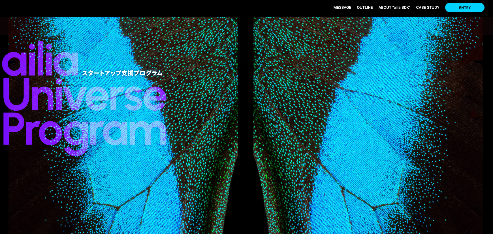

# Expansion of ailia SDK Free Version Usage Scope

# Expansion of ailia SDK Free Version Usage Scope

[David Cochard](/@cochard-dav?source=post_page---byline--bbee980e0155---------------------------------------)

3 min read

·

Aug 13, 2024

--

[Listen](/m/signin?actionUrl=https%3A%2F%2Fmedium.com%2Fplans%3Fdimension%3Dpost_audio_button%26postId%3Dbbee980e0155&operation=register&redirect=https%3A%2F%2Fmedium.com%2Faxinc-ai%2Fexpansion-of-ailia-sdk-free-version-usage-scope-bbee980e0155&source=---header_actions--bbee980e0155---------------------post_audio_button------------------)

Share

The free usage scope for personal use of the ailia SDK has been expanded. Individuals can now use it for small-scale commercial purposes at no cost. ailia SDK enables AI without API usage fees, contributing to the democratization of AI.

As of July 16, 2024, the ailia SDK license has been revised, expanding the scope of free usage for personal use.

For *individual small-scale commercial purposes*, ailia SDK can now be used free of charge. We set the limitation of a *small-scale commercial purpose* to a total revenue under $100,000 over 12 months (including revenue, advertising income, and other financial gains) .

This allows indie games and projects to use ailia SDK, as well as the distribution of AI applications that include advertisements.

For detailed licensing information, please refer to the following website.

[## ax Inc.

### A future in which all devices carry AI We believe such a future is on the way. To usher in that day, we will keep…

ailia.ai](https://ailia.ai/en/license/?source=post_page-----bbee980e0155---------------------------------------)

## Challenges of using cloud AI for personal use

When running cloud AI, API usage fees are required based on the amount of use. If an AI application developed by an individual reaches a user base of hundreds of thousands, the API fees can become extremely expensive. As a result, there has been a challenge in developing and distributing AI-enabled applications for individual developers.

## Democratization of edge AI

When using edge AI with the ailia SDK, models run directly on the user’s device. As a result, there are no API fees involved, regardless of how much the user base expands.

As AI expands to the B2C sector, ailia SDK contributes to the democratization of AI.

## Features of ailia SDK

ailia SDK allows you to perform tasks such as image recognition, speech recognition, voice synthesis, OCR, and translation on edge devices.

ailia SDK supports Python, Unity, Flutter, and C++. This includes official bindings for each language along with sample programs for various models. This ensures a consistent interface and a comfortable development environment.

The core of ailia SDK is designed with a simple architecture, making it easy to integrate into any application. Additionally, as part of ailia MODELS, it offers easy implementations that allow you to quickly find and incorporate the features you need.

For more information on how to use ailia SDK, please refer to the following article.

[## How to install the ailia SDK

### We will explain how to install the ailia SDK and how to run the samples. We will explain in order for Python, Unity…

medium.com](/axinc-ai/how-to-install-the-ailia-sdk-0b231ffc1b1f?source=post_page-----bbee980e0155---------------------------------------)

## ailia Universe Program

We have also launched the ailia Universe Program, a startup support program that helps the commercialization of applications developed using the ailia SDK. If you are considering publishing your AI application, please feel free to contact us through the website below. It is only available in Japanese for now, but you can access the form using the `Entry` button at the top-right corner.

Press enter or click to view image in full size

ailia Universe Program

[## ailia Universe Program｜ailia AI Series

### ailia Universe ProgramはあなたのAIを事業化し、具現化するための共創パートナーシップ・プログラムです。

ailia.ai](https://ailia.ai/universe/?source=post_page-----bbee980e0155---------------------------------------)

---

[ax Inc.](https://axinc.jp/en/) has developed [ailia SDK](https://ailia.jp/en/), which enables cross-platform, GPU-based rapid inference.

ax Inc. provides a wide range of services from consulting and model creation, to the development of AI-based applications and SDKs. Feel free to [contact us](https://axinc.jp/en/) for any inquiry.