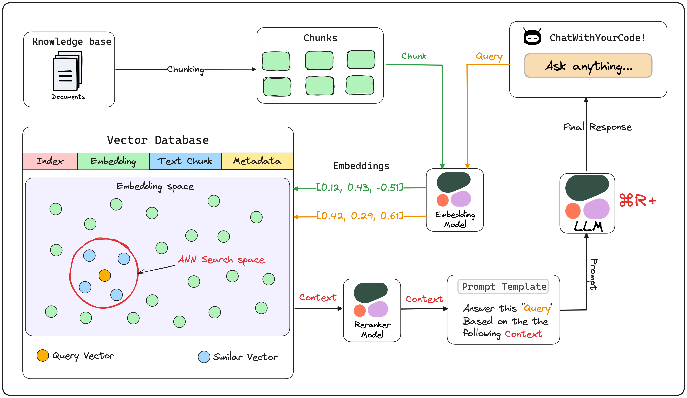
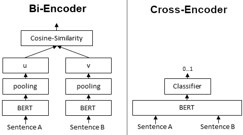

# CrossEncoderMmarco: Machine Learning Model that Calculates the Similarity Between a Question and an Answer

# CrossEncoderMmarco: Machine Learning Model that Calculates the Similarity Between a Question and an Answer

[](/@cochard-dav?source=post_page---byline--1906f716f8ef---------------------------------------)

[David Cochard](/@cochard-dav?source=post_page---byline--1906f716f8ef---------------------------------------)

5 min read

·

Aug 14, 2024

--

[Listen](/m/signin?actionUrl=https%3A%2F%2Fmedium.com%2Fplans%3Fdimension%3Dpost_audio_button%26postId%3D1906f716f8ef&operation=register&redirect=https%3A%2F%2Fmedium.com%2Faxinc-ai%2Fcrossencodermmarco-machine-learning-model-that-calculates-the-similarity-between-a-question-and-an-1906f716f8ef&source=---header_actions--1906f716f8ef---------------------post_audio_button------------------)

Share

Introducing *CrossEncoderMmarco*, a machine learning model that calculates the similarity between a question and an answer. By using *CrossEncoderMmarco*, it is possible to implement a re-ranking mechanism in RAG (Retrieval-Augmented Generation) and improve accuracy.

## Overview

*CrossEncoderMmarco* is a machine learning model trained using the multilingual dataset mMARCO, designed to calculate the similarity between a question and an answer as input.

It uses *XMLRoberta* as the tokenizer and is compatible with *SentenceTransformer* and *E5*.

[## jeffwan/mmarco-mMiniLMv2-L12-H384-v1 · Hugging Face

### We’re on a journey to advance and democratize artificial intelligence through open source and open science.

huggingface.co](https://huggingface.co/jeffwan/mmarco-mMiniLMv2-L12-H384-v1?source=post_page-----1906f716f8ef---------------------------------------)

The base model used is [*MiniLMv2*](https://arxiv.org/abs/2012.15828), developed by *Microsoft*. *MiniLMv2* is pre-trained on a large and diverse dataset containing over a billion training pairs.

[## unilm/minilm at master · microsoft/unilm

### Large-scale Self-supervised Pre-training Across Tasks, Languages, and Modalities — unilm/minilm at master ·…

github.com](https://github.com/microsoft/unilm/tree/master/minilm?source=post_page-----1906f716f8ef---------------------------------------)

## About MS MARCO and mMARCO

*MS MARCO* (Microsoft MAchine Reading COmprehension) is an English dataset provided by Microsoft starting in 2016, containing 100,000 anonymized questions from Bing along with human-generated answers. The dataset was later expanded and now includes 1 million questions and answers, as well as a Passage Ranking dataset.

[## MS MARCO

### 10.23.2020 Task Retirement 1. Retire QnA V2 Task 2. Retire NLGEN V2 Task 3. Retire OpenKP Task 08.11.2020 New Task 1…

microsoft.github.io](https://microsoft.github.io/msmarco/?source=post_page-----1906f716f8ef---------------------------------------)

*mMARCO* is a multilingual dataset that extends the *MS MARCO* Passage Ranking dataset using Google Translate. It supports 14 languages.

[## GitHub — unicamp-dl/mMARCO: A multilingual version of MS MARCO passage ranking dataset

### A multilingual version of MS MARCO passage ranking dataset — unicamp-dl/mMARCO

github.com](https://github.com/unicamp-dl/mMARCO?source=post_page-----1906f716f8ef---------------------------------------)

[## mMARCO: A Multilingual Version of the MS MARCO Passage Ranking Dataset

### The MS MARCO ranking dataset has been widely used for training deep learning models for IR tasks, achieving…

arxiv.org](https://arxiv.org/abs/2108.13897?source=post_page-----1906f716f8ef---------------------------------------)

## Vector Search and Re-ranking in RAG

*CrossEncoderMmarco* is used in the latter stage of vector search in RAG.

In traditional RAG using vector search, the usual approach is to narrow down the candidates to around 10 using standard vector search and then process them with ChatGPT to generate an answer.

In RAG that combines re-ranking with CrossEncoderMmarco, the process involves narrowing down the candidates to around 100 using standard vector search, followed by re-ranking with CrossEncoderMmarco. The final top 10 results are then processed by ChatGPT to generate the answer.

This approach enables a more accurate RAG system.

Press enter or click to view image in full size


Re-ranking with CrossEncoder (Source: <https://www.sbert.net/examples/applications/retrieve_rerank/README.html>)

*Cohere*, which developed *CommandR+*, also offers AI models for re-ranking via the cloud. By introducing re-ranking, the accuracy is improved compared to standard vector search.

Press enter or click to view image in full size


Precision improvement using Rerank (Source: <https://cohere.com/blog/rerank-3>)

[## Introducing Rerank 3: A New Foundation Model for Efficient Enterprise Search & Retrieval

### Today, we’re introducing our newest foundation model, Rerank 3, purpose built to enhance enterprise search and…

cohere.com](https://cohere.com/blog/rerank-3?source=post_page-----1906f716f8ef---------------------------------------)

Press enter or click to view image in full size



RAG pipeline using CommandR+ (Source: <https://lightning.ai/lightning-ai/studios/rag-using-cohere-command-r?section=featured>)

[## RAG using Cohere Command R+ — a Lightning Studio by akshay

### Discover a fresh approach to interact with your documents through Cohere’s powerful Command R+ model, specifically…

lightning.ai](https://lightning.ai/lightning-ai/studios/rag-using-cohere-command-r?section=featured&source=post_page-----1906f716f8ef---------------------------------------)

## Difference from Standard Vector Search (BiEncoder)



BiEncode and CrossEncoder (Source: <https://www.sbert.net/examples/applications/cross-encoder/README.html>)

In a typical vector search using *BiEncoder*, the question and answer are separately fed into the Transformer to obtain vector representations, and then the similarity is calculated. Specifically, embeddings are calculated individually from the question and the answer, and the L2 distance or cosine similarity between the embeddings is computed. Since the question and answer are processed independently, the Transformer’s attention is calculated only within the question or within the answer. Additionally, the relevance between the question and answer is computed after they are transformed into a lower-dimensional embedding space.

On the other hand, in a *CrossEncoder*, the question and answer are fed together into the Transformer to calculate the similarity. Since the question and answer are processed together, the Transformer’s attention is computed from both the question and the answer. This leads to higher accuracy compared to simple embeddings. Furthermore, the relevance between the question and answer is calculated in a higher-dimensional space.

Press enter or click to view image in full size


*CrossEncoder* has a higher computational load than *BiEncoder* because it cannot rely on precomputed embeddings. However, this increased computation results in higher accuracy.

For example, in typical embeddings, queries like “How many people live in Berlin?” and “How many people live in Berlin.” might cause slight variations in the embeddings due to the presence or absence of punctuation. This can lead to fluctuations in the ranking order of the top results retrieved in RAG.

By using *CrossEncoderMmarco* for re-ranking, such fluctuations are eliminated, allowing for consistently stable and accurate retrieval of sentences in the correct order.

## Usage of CrossEncoderMmarco with ailia SDK

To use CrossEncoderMarco with ailia SDK, specify a question text in `q` and an answer text in `p`, and the relevance is output as a numerical value. The higher the value, the higher the relevance.

```
$ python3 cross_encoder_mmarco.py -q "How many people live in Berlin?" -p "Berlin has a population of 3,520,031 registered inhabitants in an area of 891.82 square kilometers."  
$ python3 cross_encoder_mmarco.py -q "How many people live in Berlin?" -p "New York City is famous for the Metropolitan Museum of Art."  
$ python3 cross_encoder_mmarco.py -q "ベルリンには何人が住んでいますか？" -p "ベルリンの人口は891.82平方キロメートルの地域に登録された住民が3,520,031人います。"  
$ python3 cross_encoder_mmarco.py -q "ベルリンには何人が住んでいますか？" -p "ニューヨーク市はメトロポリタン美術館で有名です。"
```

```
Output : [array([[10.761541]], dtype=float32)]  
Output : [array([[-8.127746]], dtype=float32)]  
Output : [array([[9.374646]], dtype=float32)]  
Output : [array([[-6.408309]], dtype=float32)]
```

[## ailia-models/natural\_language\_processing/cross\_encoder\_mmarco at master · axinc-ai/ailia-models

### The collection of pre-trained, state-of-the-art AI models for ailia SDK …

github.com](https://github.com/axinc-ai/ailia-models/tree/master/natural_language_processing/cross_encoder_mmarco?source=post_page-----1906f716f8ef---------------------------------------)

---

[ax Inc.](https://axinc.jp/en/) has developed [ailia SDK](https://ailia.jp/en/), which enables cross-platform, GPU-based rapid inference.

ax Inc. provides a wide range of services from consulting and model creation, to the development of AI-based applications and SDKs. Feel free to [contact us](https://axinc.jp/en/) for any inquiry.