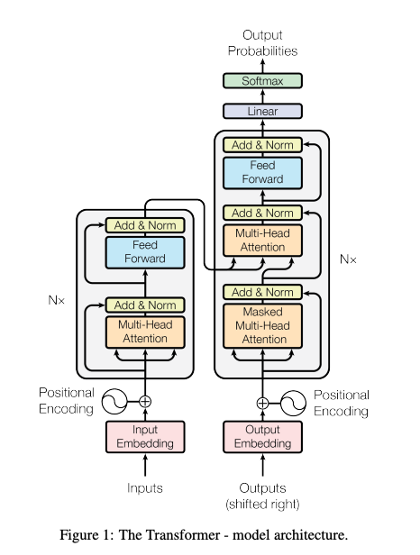
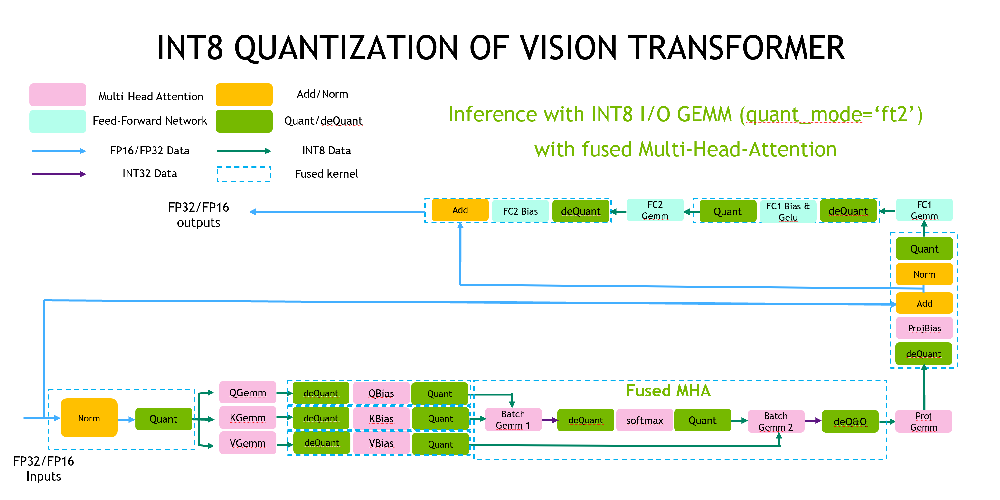
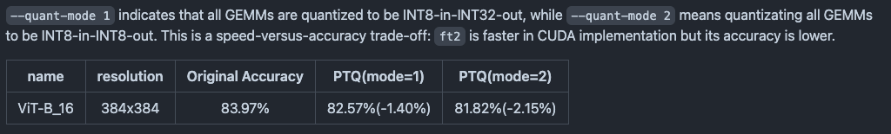

# Recent Trends in Transformer Quantization

# Recent Trends in Transformer Quantization

[](/@cochard-dav?source=post_page---byline--4c8aacee7a63---------------------------------------)

[David Cochard](/@cochard-dav?source=post_page---byline--4c8aacee7a63---------------------------------------)

6 min read

·

Aug 15, 2024

--

[Listen](/m/signin?actionUrl=https%3A%2F%2Fmedium.com%2Fplans%3Fdimension%3Dpost_audio_button%26postId%3D4c8aacee7a63&operation=register&redirect=https%3A%2F%2Fmedium.com%2Faxinc-ai%2Frecent-trends-in-transformer-quantization-4c8aacee7a63&source=---header_actions--4c8aacee7a63---------------------post_audio_button------------------)

Share

Transformers are known to be networks that are difficult to quantize. In this article, we will introduce the latest trends in Transformer quantization.

## Overview

The Transformer is a deep neural network (DNN) model that uses attention mechanisms. It was introduced in the 2017 paper “Attention Is All You Need.” Initially, Transformers were applied in the field of natural language processing, but they have since become widely used in image and audio fields as well, with models like [Vision Transformer](/axinc-ai/vision-transformer-state-of-the-art-image-identification-technology-without-convolutional-fd10097ae9c2) and EnCodec. Transformers can uniformly treat language, images, and audio as tokens, forming the foundation for today’s multimodal AI.

[## Attention Is All You Need

### The dominant sequence transduction models are based on complex recurrent or convolutional neural networks in an…

arxiv.org](https://arxiv.org/abs/1706.03762?source=post_page-----4c8aacee7a63---------------------------------------)

## Transformer Quantization

Transformers are known to be networks that are difficult to quantize. Among the components of the Transformer architecture, the most computationally intensive part is the Attention mechanism, which is represented as `Value * Key * Query`. This involves taking the dot product of the `Query` and `Key`, and multiplying it by the `Value`, enabling differentiable table lookup. While the Attention mechanism itself can maintain accuracy even when quantized to `Int8`, the non-linear operations such as `Norm`, `Softmax`, and `GeLU` are known to be less resilient to quantization.



Transformer architecture (Source: <https://arxiv.org/pdf/1706.03762>)

## Faster Transformer Example from NVIDIA

The following is an example of the implementation of [Vision Transformer](/axinc-ai/vision-transformer-state-of-the-art-image-identification-technology-without-convolutional-fd10097ae9c2) using NVIDIA’s *Faster Transformer*, a high-speed implementation of Transformers. In this implementation, the `Gemm` operation, which is the matrix multiplication in the Attention mechanism, is implemented with `Int8` precision. However, the `Softmax`, `LayerNorm`, and activation functions are implemented with `Float` precision. The quantization from `Float` to `Int8 (Quant)`is referred to as “Q,” and the dequantization from `Int8` to `Float (deQuant)` is referred to as “DQ”

Press enter or click to view image in full size



Source: <https://github.com/NVIDIA/FasterTransformer/blob/main/docs/vit_guide.md>

[## FasterTransformer/docs/vit\_guide.md at main · NVIDIA/FasterTransformer

### Transformer related optimization, including BERT, GPT — FasterTransformer/docs/vit\_guide.md at main ·…

github.com](https://github.com/NVIDIA/FasterTransformer/blob/main/docs/vit_guide.md?source=post_page-----4c8aacee7a63---------------------------------------)

In the implementation of *FasterTransformer*, using `INT8 GEMM` results in an approximate 2.15% degradation in accuracy.

Press enter or click to view image in full size



Source: <https://github.com/NVIDIA/FasterTransformer/blob/main/docs/vit_guide.md>

However, employing `INT8 GEMM` speeds up inference time on the T4 GPU by 1.67 times.

Press enter or click to view image in full size


Source: <https://github.com/NVIDIA/FasterTransformer/blob/main/docs/vit_guide.md>

There has also been a proposal for I-ViT, which implements `Softmax`, `Layer Norm`, and activation with integer precision. Although it doesn’t use `Int8`, but`Int32`, resulting in a mixed precision approach.

[## I-ViT: Compute ViT in integer type! ?Shiftmax and ShiftGELU, which evolved from I-BERT technology…

### 3 main points✔️ Proposed I-ViT with all Vision Transformer calculations in integer type ✔️ Softmax and GELU with bit…

ai-scholar.tech](https://ai-scholar.tech/en/articles/transformer/i-ViT?source=post_page-----4c8aacee7a63---------------------------------------)

## Using FP8 instead of INT8

In recent years, with the introduction of NVIDIA’s H100, FP8 has garnered attention.

Press enter or click to view image in full size


FP8 format (Source: <https://docs.nvidia.com/deeplearning/transformer-engine/user-guide/examples/fp8_primer.html>)

FP8 has a unique characteristic of non-linear quantization, where it offers finer granularity for smaller values and coarser granularity for larger values, compared to `INT8`.


FP8 range (Source: <https://arxiv.org/pdf/2312.05725v2>)

Below is a usage example of FP8 with [BERT](/axinc-ai/bert-a-machine-learning-model-for-efficient-natural-language-processing-aef3081c24e8).

[## FP8-BERT: Post-Training Quantization for Transformer

### Transformer-based models, such as BERT, have been widely applied in a wide range of natural language processing tasks…

arxiv.org](https://arxiv.org/abs/2312.05725v2?source=post_page-----4c8aacee7a63---------------------------------------)

Using FP8 significantly improves the computational accuracy of BERT models.

Press enter or click to view image in full size


Precision using FP8 (Source: <https://arxiv.org/pdf/2312.05725v2>)

However, the same paper mentions that non-linear operators like `Softmax` and `GeLU` are sensitive to quantization. Therefore, even when using `FP8`, `Softmax` and `GeLU` are executed in `BF16` to maintain accuracy.

Press enter or click to view image in full size


Source: <https://arxiv.org/pdf/2312.05725v2>

## Example of 4-bit Quantization in llama.cpp

Large Language Models (LLMs) use the Transformer architecture. In [*llama.cpp*](https://github.com/ggerganov/llama.cpp), an inference runtime for LLMs, 4-bit quantization is widely employed.

The quantization format in llama.cpp is as follows:

```
Q4_0 : legacy  
Q4_1 : legacy  
Q4_K_S : Small-Scale Model Using k-quant: All Tensors Quantized to 4-bit  
Q4_K_M : Medium-Scale Model Using k-quant: Half of the Tensors Quantized to 4-bit, the Rest to 6-bit  
IQ4_NL : 4.50-bit Non-linear Quantization Using Importance Matrices  
IQ4_XS  : 4.25-bit Non-linear Quantization Using Importance Matrices
```

[## TheBloke/Llama-2-7B-Chat-GGML · Hugging Face

### We're on a journey to advance and democratize artificial intelligence through open source and open science.

huggingface.co](https://huggingface.co/TheBloke/Llama-2-7B-Chat-GGML?source=post_page-----4c8aacee7a63---------------------------------------#provided-files)

`Q4_K_M` is recommended, with the formats without “`K`” being the old format and those with “`K`” being the new quantization format. Additionally, `IQ4_XS` uses calibration data with importance matrices, which can potentially enhance performance. However, if calibration is done in English for a Japanese language model, the performance may decrease for inference in Japanese.

In *llama.cpp*, weight quantization is used, and due to non-linear quantization, the 4-bit weights are expanded to `FP16` for `GEMM` calculations. Therefore, tensors are implemented in `FP16`.

Below is the GEMM implementation in *llama.cpp.* It uses *cublas* and FP16 implementation.

```
cublasGemmBatchedEx(ctx.cublas_handle(), CUBLAS_OP_T, CUBLAS_OP_N,  
                ne01, ne11, ne10,  
                alpha, (const void **) (ptrs_src.get() + 0*ne23), CUDA_R_16F,   nb01/nb00,  
                       (const void **) (ptrs_src.get() + 1*ne23), CUDA_R_16F,   nb11/nb10,  
                beta,  (      void **) (ptrs_dst.get() + 0*ne23), cu_data_type, ne01,  
                ne23,  
                cu_compute_type,  
                CUBLAS_GEMM_DEFAULT_TENSOR_OP));
```

[## llama.cpp/ggml-cuda.cu at master · ggerganov/llama.cpp

### LLM inference in C/C++. Contribute to ggerganov/llama.cpp development by creating an account on GitHub.

github.com](https://github.com/ggerganov/llama.cpp/blob/master/ggml-cuda.cu?source=post_page-----4c8aacee7a63---------------------------------------)

## Trends for NPUs

As mentioned above, achieving high accuracy with Transformers has led to a trend of using mixed precision with `FP16` and `Int8`. Consequently, many recent NPUs are increasingly supporting `FP16` operations in addition to `Int8`.

Below is an example implementation of running [*Whisper*](/axinc-ai/whisper-speech-recognition-model-capable-of-recognizing-99-languages-5b5cf0197c16) on the RK3588, a SoC by *Rockchip*. In this implementation, activations are handled using Arm v8’s FP16 instructions, while the Attention mechanism is implemented using the NPU’s FP16 GEMM.

[## GitHub — usefulsensors/useful-transformers: Efficient Inference of Transformer models

### Efficient Inference of Transformer models. Contribute to usefulsensors/useful-transformers development by creating an…

github.com](https://github.com/usefulsensors/useful-transformers?source=post_page-----4c8aacee7a63---------------------------------------)

## Trends for ONNX

ONNX includes Q and DQ operations, supporting mixed precision. Using the `nodes_to_quantize` option in the ONNX Runtime quantization tool, you can quantize only the `GEMM` operations to `Int8`.

```
nodes_to_quantize:  
                List of nodes names to quantize. When this list is not None only the nodes in this list  
                are quantized.
```

[## onnxruntime/onnxruntime/python/tools/quantization/quantize.py at…

### ONNX Runtime: cross-platform, high performance ML inferencing and training accelerator …

github.com](https://github.com/microsoft/onnxruntime/blob/fff68c3151b774d8a2e9290e96b9f707cd950216/onnxruntime/python/tools/quantization/quantize.py?source=post_page-----4c8aacee7a63---------------------------------------#L51-L61)

## Conclusion

Current Transformer quantization implementations predominantly use a mixed precision approach combining `Int8` and `BF16`. Additionally, both NPUs and frameworks are increasingly designed with mixed precision in mind.

---

[ax Inc.](https://axinc.jp/en/) has developed [ailia SDK](https://ailia.jp/en/), which enables cross-platform, GPU-based rapid inference.

ax Inc. provides a wide range of services from consulting and model creation, to the development of AI-based applications and SDKs. Feel free to [contact us](https://axinc.jp/en/) for any inquiry.