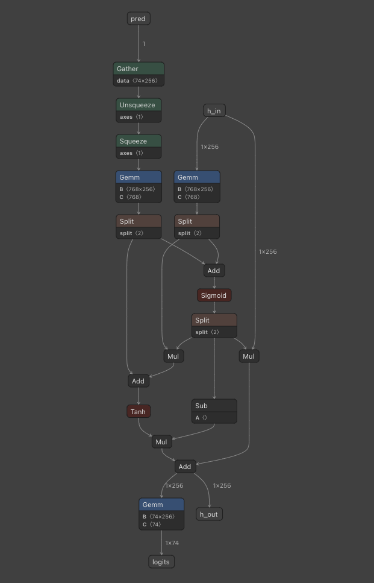

# G2P_EN: A Machine Learning Model for Converting English Text to Phonemes

# G2P\_EN: A Machine Learning Model for Converting English Text to Phonemes

[](/@cochard-dav?source=post_page---byline--03072cc2251f---------------------------------------)

[David Cochard](/@cochard-dav?source=post_page---byline--03072cc2251f---------------------------------------)

4 min read

·

Aug 16, 2024

--

[Listen](/m/signin?actionUrl=https%3A%2F%2Fmedium.com%2Fplans%3Fdimension%3Dpost_audio_button%26postId%3D03072cc2251f&operation=register&redirect=https%3A%2F%2Fmedium.com%2Faxinc-ai%2Fg2p-en-a-machine-learning-model-for-converting-english-text-to-phonemes-03072cc2251f&source=---header_actions--03072cc2251f---------------------post_audio_button------------------)

Share

This is an introduction to「G2P\_EN」, a machine learning model that can be used with [ailia SDK](https://ailia.jp/en/). You can easily use this model to create AI applications using [ailia SDK](https://ailia.jp/en/) as well as many other ready-to-use [ailia MODELS](https://github.com/axinc-ai/ailia-models).

## Overview

*G2P\_EN* is an algorithm that converts English text into phonemes using a dictionary and a machine learning model. It is used in the English mode of [GPT-SoVITS](/axinc-ai/gpt-sovits-a-zero-shot-speech-synthesis-model-with-customizable-fine-tuning-e4c72cd75d87).

[## GitHub — Kyubyong/g2p: g2p: English Grapheme To Phoneme Conversion

### g2p: English Grapheme To Phoneme Conversion. Contribute to Kyubyong/g2p development by creating an account on GitHub.

github.com](https://github.com/Kyubyong/g2p?source=post_page-----03072cc2251f---------------------------------------)

G2P stands for *“Grapheme to Phoneme”*, which is the process of converting text into phonemes. It is primarily used as a preprocessing step for Text-to-Speech (TTS) systems.

For example, if you have the text “`To be or not to be, that is the question,`” the result of the G2P process would be something like `“T UW1 B IY1 AO1 R N AA1 T T UW1 B IY1 DH AE1 T IH1 Z DH AH0 K W EH1 S CH AH0 N.”`

## The algorithm

Traditionally, G2P has been implemented using a dictionary-based approach. However, this method faces the challenge of being unable to convert words that are not included in the dictionary into phonemes. *G2P\_EN* addresses this issue by using a neural network to predict phonemes for unknown words.

### Formatting Input Text

The numerical representations in the input text are converted to English words. For example, `“10”` is replaced with `“ten”` and `“10000”` is replaced with `“ten thousand”.`

```
text = normalize_numbers(text)
```

Symbols other than `‘. , ? ! -` are masked.

```
text = text.lower()  
text = re.sub("[^ a-z'.,?!\-]", "", text)  
text = text.replace("i.e.", "that is")  
text = text.replace("e.g.", "for example")
```

Common English contractions are expanded. For example, “can’t” becomes “cannot,” and “I’m” becomes “I am.”

```
text = text.replace("i.e.", "that is")  
text = text.replace("e.g.", "for example")
```

### Word tokenization

The text is split into words using the `TweetTokenizer` from NLTK. While word separation can also be done using spaces and unicode punctuation symbols, the `TweetTokenizer` considers special cases like `@name` for word segmentation. However, since `@` is masked beforehand in *G2P\_EN*, using `TweetTokenizer` might not be necessary.

### Usage of the dictionary

Convert the split words into phonemes using two dictionaries: `homographs.en` and `cmudict`.

The `homographs.en` dictionary accounts for the variations in pronunciation that depend on the part of speech, defining two possible pronunciations. After performing part-of-speech tagging using NLTK’s perceptron, the appropriate pronunciation is selected from the dictionary.

An example entry in `homographs.en` includes the text, pronunciation 1, pronunciation 2, and the part of speech. If the part of speech matches, pronunciation 1 is used; if it doesn’t, pronunciation 2 is applied.

```
ABUSE|AH0 B Y UW1 Z|AH0 B Y UW1 S|V  
ABUSES|AH0 B Y UW1 Z IH0 Z|AH0 B Y UW1 S IH0 Z|V
```

An example of an entry in `cmudict` is shown below. When multiple pronunciations are defined, *G2P\_EN* uses the first pronunciation listed.

```
ABUSE 1 AH0 B Y UW1 S  
ABUSE 2 AH0 B Y UW1 Z  
ABUSED 1 AH0 B Y UW1 Z D  
ABUSER 1 AH0 B Y UW1 Z ER0
```

### Phoneme estimation

If a word is not found in the dictionaries, its pronunciation is predicted using a neural network. *G2P\_EN v1* was implemented in *TensorFlow*, but *G2P\_EN v2* is implemented in *numpy*. It uses an Encoder-Decoder structure, decoding up to 20 symbols using Greedy Search.

The structure of the Encoder is as follows: it loops through each character and calculates the embeddings.


Encoder

The structure of the Decoder is as follows: it loops through each output character and stops when the symbol 3 appears. The maximum loop limit is 20 characters.



Decoder

## Usage in ailia SDK

You can use *G2P\_EN* with ailia SDK using the command below.

```
$ python3 g2p_en.py --input "I'm an activationist."
```

Here is an example of the output. The phrase `“I’m an”` is converted using the dictionary, while the word `“activationist”` has its phonemes predicted by the neural network.

```
Output : ['AY1', 'M', ' ', 'AE1', 'N', ' ', 'AE2', 'K', 'T', 'IH0', 'V', 'EY1', 'SH', 'AH0', 'N', 'IH0', 'S', 'T', ' ', '.']
```

[## ailia-models/natural\_language\_processing/g2p\_en at master · axinc-ai/ailia-models

### The collection of pre-trained, state-of-the-art AI models for ailia SDK …

github.com](https://github.com/axinc-ai/ailia-models/tree/master/natural_language_processing/g2p_en?source=post_page-----03072cc2251f---------------------------------------)

*G2P\_EN* can be used in Python as well as C++.

[## ailia-models-cpp/natural\_language\_processing/g2p\_en at master · axinc-ai/ailia-models-cpp

### C++ version of ailia models repository. Contribute to axinc-ai/ailia-models-cpp development by creating an account on…

github.com](https://github.com/axinc-ai/ailia-models-cpp/tree/master/natural_language_processing/g2p_en?source=post_page-----03072cc2251f---------------------------------------)

---

[ax Inc.](https://axinc.jp/en/) has developed [ailia SDK](https://ailia.jp/en/), which enables cross-platform, GPU-based rapid inference.

ax Inc. provides a wide range of services from consulting and model creation, to the development of AI-based applications and SDKs. Feel free to [contact us](https://axinc.jp/en/) for any inquiry.