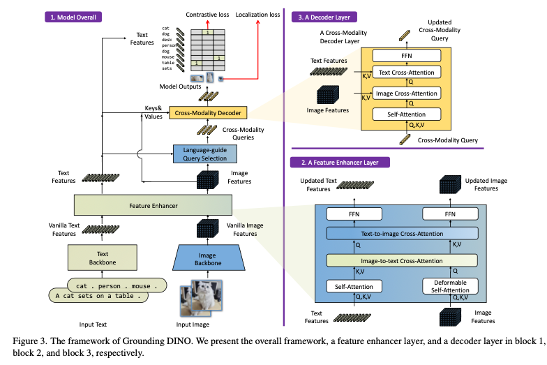

# Grounding DINO: Detect Any Object from Text

# Grounding DINO: Detect Any Object from Text

[](/@cochard-dav?source=post_page---byline--29808580cb32---------------------------------------)

[David Cochard](/@cochard-dav?source=post_page---byline--29808580cb32---------------------------------------)

3 min read

·

Aug 20, 2024

--

[Listen](/m/signin?actionUrl=https%3A%2F%2Fmedium.com%2Fplans%3Fdimension%3Dpost_audio_button%26postId%3D29808580cb32&operation=register&redirect=https%3A%2F%2Fmedium.com%2Faxinc-ai%2Fgrounding-dino-detect-any-object-from-text-29808580cb32&source=---header_actions--29808580cb32---------------------post_audio_button------------------)

Share

This is an introduction to「Grounding DINO」, a machine learning model that can be used with [ailia SDK](https://ailia.jp/en/). You can easily use this model to create AI applications using [ailia SDK](https://ailia.jp/en/) as well as many other ready-to-use [ailia MODELS](https://github.com/axinc-ai/ailia-models).

## Overview

*Grounding DINO* is an object detection model capable of detecting any object. By inputting the object you want to detect in text, you can obtain the bounding box for that object within an image.

Press enter or click to view image in full size


Grounding DINO ouput (Source: )<https://github.com/IDEA-Research/Grounded-Segment-Anything/blob/main/assets/demo7.jpg>)

[## GitHub — IDEA-Research/GroundingDINO: [ECCV 2024] Official implementation of the paper “Grounding…

### ECCV 2024] Official implementation of the paper “Grounding DINO: Marrying DINO with Grounded Pre-Training for Open-Set…

github.com](https://github.com/IDEA-Research/GroundingDINO?source=post_page-----29808580cb32---------------------------------------)

## Architecture

[*GLIP*](https://github.com/microsoft/GLIP)(starting with a G, stands for *Grounded Language-Image Pre-training*)has been proposed as the object detection version of [CLIP](/axinc-ai/clip-learning-transferable-visual-models-from-natural-language-supervision-4508b3f0ea46), which calculates candidate regions and embeddings for objects using a *Visual Encoder* and text embeddings using a *Text Encoder*. The *Word-Region Alignment Score* is then computed by taking the dot product of these embeddings. This enables object detection based on any given text.

Press enter or click to view image in full size


GLIP architecture (Source: <https://github.com/microsoft/GLIP>)

Additionally, [DINO](https://github.com/IDEA-Research/DINO) (*DETR with Improved No-objects*) has been proposed as an object detector using the [*Transformer*](https://huggingface.co/docs/transformers/en/index)architecture instead of the usual algorithm based on anchor boxes and overlaps of ROI, that have been mainly used until now in models such as [YOLO](/axinc-ai/yolox-object-detection-model-exceeding-yolov5-d6cea6d3c4bc). This change of methodology is referred to as DETR (*DEtection TRansformers*), which removes the need for fixed algorithms like NMS (Non-Max Suppression), allowing for End-to-End optimization.

Press enter or click to view image in full size


DINO architecture (Source: <https://github.com/IDEA-Research/DINO>)

*Grounding DINO* is a model architecture that combines the object detection component of *GLIP* with *DINO*.

Press enter or click to view image in full size



Grounding DINO architecture (Source: <https://arxiv.org/abs/2303.05499>)

For text tokenization, *Grounding DINO* uses the [*BERT*](/axinc-ai/bert-a-machine-learning-model-for-efficient-natural-language-processing-aef3081c24e8)-base model, similar to *GLIP*.

## Usage

To use *Grounding DINO* with ailia SDK, use the following command to specify the input image and the label of the object(s) you want to detect.

```
python3 groundingdino.py -i input.jpg --caption "Horse. Clouds. Grasses. Sky. Hill."
```

[## ailia-models/object\_detection/groundingdino at master · axinc-ai/ailia-models

### The collection of pre-trained, state-of-the-art AI models for ailia SDK - ailia-models/object\_detection/groundingdino…

github.com](https://github.com/axinc-ai/ailia-models/tree/master/object_detection/groundingdino?source=post_page-----29808580cb32---------------------------------------)

Let’s see how this model performs on the [sample picture](https://web.eecs.umich.edu/~fouhey/fun/desk/desk.jpg) taken from [Detic](/axinc-ai/detic-object-detection-and-segmentation-of-21k-classes-with-high-accuracy-49cba412b7d4).

### blue bottle

Press enter or click to view image in full size


### red cup

Press enter or click to view image in full size


### web camera

Press enter or click to view image in full size


## References

***DINO Paper*** — [DETR with Improved DeNoising Anchor Boxes for End-to-End Object Detection](https://arxiv.org/pdf/2203.03605.pdf?ref=blog.roboflow.com)

***GLIP Paper*** — [Grounded Language-Image Pre-training](https://arxiv.org/pdf/2112.03857.pdf?ref=blog.roboflow.com)

***Grounding DINO Paper*** — [Grounding DINO: Marrying DINO with Grounded Pre-Training for Open-Set Object Detection](https://arxiv.org/pdf/2303.05499.pdf?ref=blog.roboflow.com)

---

[ax Inc.](https://axinc.jp/en/) has developed [ailia SDK](https://ailia.jp/en/), which enables cross-platform, GPU-based rapid inference.

ax Inc. provides a wide range of services from consulting and model creation, to the development of AI-based applications and SDKs. Feel free to [contact us](https://axinc.jp/en/) for any inquiry.