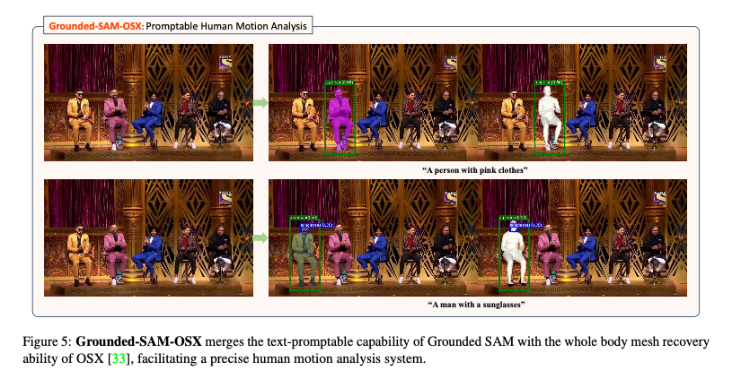

# Grounded-SAM: Segmented Any Object from Text

# Grounded-SAM: Segmented Any Object from Text

[](/@cochard-dav?source=post_page---byline--7727f0500a8a---------------------------------------)

[David Cochard](/@cochard-dav?source=post_page---byline--7727f0500a8a---------------------------------------)

3 min read

·

Aug 23, 2024

--

[Listen](/m/signin?actionUrl=https%3A%2F%2Fmedium.com%2Fplans%3Fdimension%3Dpost_audio_button%26postId%3D7727f0500a8a&operation=register&redirect=https%3A%2F%2Fmedium.com%2Faxinc-ai%2Fgrounded-sam-segmented-any-object-from-text-7727f0500a8a&source=---header_actions--7727f0500a8a---------------------post_audio_button------------------)

Share

This is an introduction to「Grounded-SAM」, a machine learning model that can be used with [ailia SDK](https://ailia.jp/en/). You can easily use this model to create AI applications using [ailia SDK](https://ailia.jp/en/) as well as many other ready-to-use [ailia MODELS](https://github.com/axinc-ai/ailia-models).

## Overview

*Grounded-SAM* is a machine learning model capable of segmenting any object specified by text.

Press enter or click to view image in full size


Source: https://github.com/IDEA-Research/Grounded-Segment-Anything/blob/main/assets/demo2.jpg

[## GitHub — IDEA-Research/Grounded-Segment-Anything: Grounded SAM: Marrying Grounding DINO with…

### Grounded SAM: Marrying Grounding DINO with Segment Anything &amp; Stable Diffusion &amp; Recognize Anything …

github.com](https://github.com/IDEA-Research/Grounded-Segment-Anything?source=post_page-----7727f0500a8a---------------------------------------)

[## Grounded SAM: Assembling Open-World Models for Diverse Visual Tasks

### We introduce Grounded SAM, which uses Grounding DINO as an open-set object detector to combine with the segment…

arxiv.org](https://arxiv.org/abs/2401.14159?source=post_page-----7727f0500a8a---------------------------------------)

## Architecture

*Grounded-SAM* uses [*GroundingDINO*](/axinc-ai/grounding-dino-detect-any-object-from-text-29808580cb32)to calculate the bounding box of the object being specified by text, and then uses that bounding box as input to the [*Segment Anything*](/axinc-ai/segmentanything-a-segmentation-model-with-target-specification-50514d9908e9) model to perform segmentation.

Press enter or click to view image in full size


Grounded SAM architecture ( Source: <https://arxiv.org/abs/2401.14159>)

As an application example, by combining *Grounded-SAM* with [*Stable Diffusion*](/axinc-ai/generating-high-quality-images-with-sdxl-ec586e4a63f9), it becomes possible to perform advanced image editing, as we can see in the image above. On the 3rd row, the user specifies “bench” by text, which gets segmented, then *Stable Diffusion* changes its appearance seamlessly.

Grounded-SAM can segment objects based on text, even complex statements such as “a person wearing pink clothes” or “a man wearing sunglasses”

Press enter or click to view image in full size



(Source: <https://arxiv.org/abs/2401.14159>)

You can refer to the following articles to get more information about the models used internally.

[## Grounding DINO: Detect Any Object from Text

### This is an introduction to「Grounding DINO」, a machine learning model that can be used with ailia SDK. You can easily…

medium.com](/axinc-ai/grounding-dino-detect-any-object-from-text-29808580cb32?source=post_page-----7727f0500a8a---------------------------------------)

[## SegmentAnything: A Segmentation Model with Target Specification

### This is an introduction to「SegmentAnything」, a machine learning model that can be used with ailia SDK. You can easily…

medium.com](/axinc-ai/segmentanything-a-segmentation-model-with-target-specification-50514d9908e9?source=post_page-----7727f0500a8a---------------------------------------)

[## Generating High-Quality Images with SDXL

### This article explains how to generate high-quality images using SDXL, the latest model of Stable Diffusion.

medium.com](/axinc-ai/generating-high-quality-images-with-sdxl-ec586e4a63f9?source=post_page-----7727f0500a8a---------------------------------------)

## Usage

To use Grounded-SAM with ailia SDK, use the following command. The memory consumption is approximately 5GB. If your VRAM is limited, add the `-e 1` option to execute it on the CPU.

```
$ python3 grounded_sam.py -i demo.jpg --caption "The running dog."
```

[## ailia-models/image\_segmentation/grounded\_sam at master · axinc-ai/ailia-models

### The collection of pre-trained, state-of-the-art AI models for ailia SDK - ailia-models/image\_segmentation/grounded\_sam…

github.com](https://github.com/axinc-ai/ailia-models/tree/master/image_segmentation/grounded_sam?source=post_page-----7727f0500a8a---------------------------------------)

To run Grounded SAM, you’ll need [*ailia\_tokenizer*](/axinc-ai/ailia-tokenizer-nlp-tokenizer-for-unity-and-c-e8c3625f9877) for the BERT Tokenizer. Please install it using the following command.

```
pip3 install ailia_tokenizer
```

---

[ax Inc.](https://axinc.jp/en/) has developed [ailia SDK](https://ailia.jp/en/), which enables cross-platform, GPU-based rapid inference.

ax Inc. provides a wide range of services from consulting and model creation, to the development of AI-based applications and SDKs. Feel free to [contact us](https://axinc.jp/en/) for any inquiry.