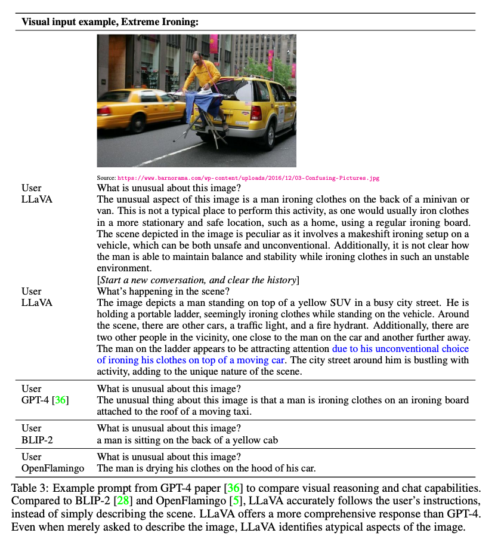

# LLaVA: Large Language Model That Understands Images

# LLaVA: Large Language Model That Understands Images

[](/@cochard-dav?source=post_page---byline--57d68c321254---------------------------------------)

[David Cochard](/@cochard-dav?source=post_page---byline--57d68c321254---------------------------------------)

5 min read

·

Aug 26, 2024

--

[Listen](/m/signin?actionUrl=https%3A%2F%2Fmedium.com%2Fplans%3Fdimension%3Dpost_audio_button%26postId%3D57d68c321254&operation=register&redirect=https%3A%2F%2Fmedium.com%2Faxinc-ai%2Fllava-large-language-model-that-understands-images-57d68c321254&source=---header_actions--57d68c321254---------------------post_audio_button------------------)

Share

This is an introduction to「LLaVA」, a machine learning model that can be used with [ailia SDK](https://ailia.jp/en/). You can easily use this model to create AI applications using [ailia SDK](https://ailia.jp/en/) as well as many other ready-to-use [ailia MODELS](https://github.com/axinc-ai/ailia-models).

---

## Overview

*LLaVA* is a large language model which original version was released in December 2023 by the University of Wisconsin-Madison, Microsoft Research, and Columbia University. Similar to *OpenAI*’s *GPT-4V* (V for Vision), it allows you to input images and ask questions about them through prompts.

[## Visual Instruction Tuning

### Instruction tuning large language models (LLMs) using machine-generated instruction-following data has improved…

arxiv.org](https://arxiv.org/abs/2304.08485?source=post_page-----57d68c321254---------------------------------------)

## Architecture

One of the key challenges in developing multimodal (text + image) AI models is the lack of sufficient training data. *LLaVA* addresses this by designing a pipeline that builds a training dataset, named LLaVA-Instruct-150K, of images augmented with what they call “instructions” using a large language model that handles only text.

Instead of using *GPT-4V*, which can process images, *LLaVA* employs *GPT-4*, which cannot handle images, to construct the dataset. The input context of GPT-4 consists of captions describing the images and the bounding boxes within the images. By passing in captions and bounding box locations to the language-only model paired with the understanding of the image, you can form conversations about the image in a cheap and efficient manner. Based on this context, *GPT-4* generates responses that include conversations, detailed descriptions, and complex reasoning.

Press enter or click to view image in full size


Source: <https://arxiv.org/pdf/2304.08485>

Next, the dataset made of all those GPT-4-generated responses is linked with the source images through AI model training described hereafter.


LLaVA architecture (Source: <https://arxiv.org/pdf/2304.08485>)

For images, *LLaVA* employs a pre-trained [*CLIP*](/axinc-ai/clip-learning-transferable-visual-models-from-natural-language-supervision-4508b3f0ea46)visual encoder, which excels in processing visual content by extracting meaningful features from images and videos.

The language component, *Vicuna*, is a sophisticated llama2-based language model that handles the textual input, maintaining context and generating responses.

The image features computer by the visual encoder are then connected to language embeddings through a projection matrix. This allows input images and input text to be mapped to the same embedding space, allowing the LLM to understand the context from both the image and the input prompt in a unified manner.

## Usage examples

When presented with the image shown below and asked, `“What is unusual about this image?”` *LLaVA* can respond that ironing at the back of a minivan is what makes the situation unusual.

Press enter or click to view image in full size



Source: <https://arxiv.org/pdf/2304.08485>

## Main iterations

The original *LLaVA* model has been improved with the following updates:

- **LLaVA-1.5** integrates academic task-oriented data, improving performance on VQA, OCR, and region-level perception tasks.

[## Improved Baselines with Visual Instruction Tuning

### Large multimodal models (LMM) have recently shown encouraging progress with visual instruction tuning. In this note, we…

arxiv.org](https://arxiv.org/abs/2310.03744?source=post_page-----57d68c321254---------------------------------------)

- **LLaVA-1.6 (LLaVA-NeXT)** expanded support for different LLMs, increased input image resolution to 4x more pixels, and improved reasoning capabilities overall.

[## LLaVA-NeXT: Improved reasoning, OCR, and world knowledge

### LLaVA team presents LLaVA-NeXT, with improved reasoning, OCR, and world knowledge. LLaVA-NeXT even exceeds Gemini Pro…

llava-vl.github.io](https://llava-vl.github.io/blog/2024-01-30-llava-next/?source=post_page-----57d68c321254---------------------------------------)

LLaVA-NeXT also has various improved versions on its own, details available at the blog below:

[## LLaVA-NeXT — Versions

llava-vl.github.io](https://llava-vl.github.io/blog/?source=post_page-----57d68c321254---------------------------------------)

There are also many specialized version of LLaVA such as

- **LLaVA-RLHF** which uses a new alignment algorithm that augments the reward model with additional factual information. This is a significant development in aligning large multimodal models with human preferences and reducing hallucinations.

[## Aligning Large Multimodal Models with Factually Augmented RLHF

### Large Multimodal Models (LMM) are built across modalities and the misalignment between two modalities can result in…

arxiv.org](https://arxiv.org/abs/2309.14525?source=post_page-----57d68c321254---------------------------------------)

- **LLaVA-Med** which can answer open-ended research questions on biomedical images

[## LLaVA-Med: Training a Large Language-and-Vision Assistant for Biomedicine in One Day

### Conversational generative AI has demonstrated remarkable promise for empowering biomedical practitioners, but current…

arxiv.org](https://arxiv.org/abs/2306.00890?source=post_page-----57d68c321254---------------------------------------)

## Usage with ailia SDK

To use *LLaVA* with the ailia SDK, you can use the following command. It requires approximately 28GB of memory in FP32, if you don’t have sufficient VRAM, you can run it on the CPU using the `-e 1` option.

```
$ python3 llava.py --input input.jpg --prompt "What are the things I should be cautious about when I visit here?" -e 1
```

[## ailia-models/vision\_language\_model/llava at master · axinc-ai/ailia-models

### The collection of pre-trained, state-of-the-art AI models for ailia SDK - ailia-models/vision\_language\_model/llava at…

github.com](https://github.com/axinc-ai/ailia-models/tree/master/vision_language_model/llava?source=post_page-----57d68c321254---------------------------------------)

Let’s run this example prompt `“What are the things I should be cautious about when I visit here?”` on the following image.

Press enter or click to view image in full size


Source: <https://llava-vl.github.io/static/images/view.jpg>

Here is the response we get:

```
When visiting this location, which features a pier extending over a large body of water, you should be cautious about several things. First, be mindful of the weather conditions, as the pier may be affected by strong winds or storms, which could make it unsafe to walk on. Second, be aware of the water depth and currents, as they can change rapidly and pose a risk to swimmers or those who venture too close to the edge. Additionally, be cautious of the presence of any wildlife in the area, as they may pose a potential danger or distraction. Finally, be mindful of the pier's structural integrity, as it may be subject to wear and tear over time, and it is essential to ensure that it is safe for use.
```

---

[ax Inc.](https://axinc.jp/en/) has developed [ailia SDK](https://ailia.jp/en/), which enables cross-platform, GPU-based rapid inference.

ax Inc. provides a wide range of services from consulting and model creation, to the development of AI-based applications and SDKs. Feel free to [contact us](https://axinc.jp/en/) for any inquiry.