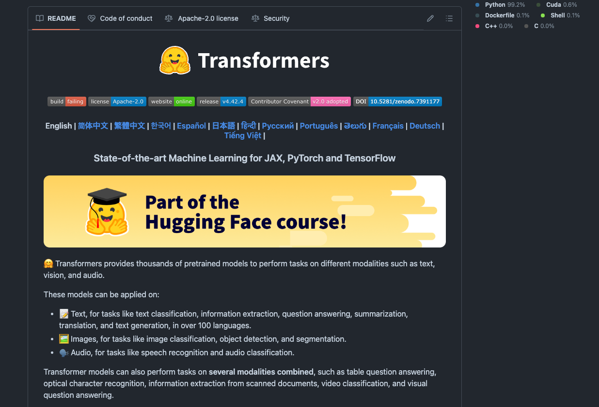

# Overview of Tokenizer Parameters Used by Transformers

# Overview of Tokenizer Parameters Used by Transformers

[](/@cochard-dav?source=post_page---byline--8be8030637c6---------------------------------------)

[David Cochard](/@cochard-dav?source=post_page---byline--8be8030637c6---------------------------------------)

10 min read

·

Aug 29, 2024

--

[Listen](/m/signin?actionUrl=https%3A%2F%2Fmedium.com%2Fplans%3Fdimension%3Dpost_audio_button%26postId%3D8be8030637c6&operation=register&redirect=https%3A%2F%2Fmedium.com%2Faxinc-ai%2Fhow-tokenizer-parameters-impact-transformers-behavior-8be8030637c6&source=---header_actions--8be8030637c6---------------------post_audio_button------------------)

Share

This article explains how the parameters used in the *Tokenizer* impact the result that is processed by *Transformers*.

---

## About Transformers

*Transformers* is a poplar library from *HuggingFace* that can handle various Transformer-based models. *Transformers* includes various *Tokenizers*, which allow for mutual conversion between text and tokens.

Press enter or click to view image in full size



Source: <https://github.com/huggingface/transformers>

[## GitHub — huggingface/transformers: 🤗 Transformers: State-of-the-art Machine Learning for Pytorch…

### 🤗 Transformers: State-of-the-art Machine Learning for Pytorch, TensorFlow, and JAX. — huggingface/transformers

github.com](https://github.com/huggingface/transformers?source=post_page-----8be8030637c6---------------------------------------)

## Encode function default behavior

To encode and convert text to tokens in *Transformers*, you use the `__call__` method on the model.

```
from transformers import AutoTokenizer  
texts = "This is a test."  
tokenizer = AutoTokenizer.from_pretrained('intfloat/multilingual-e5-base')  
outputs = tokenizer(texts)
```

Below is an output example with the token IDs stored in `input_ids` as well as the `attention_mask` which indicates whether each token is to be processed or not.

```
{'input_ids': [0, 3293, 83, 10, 3034, 5, 2],  
 'attention_mask': [1, 1, 1, 1, 1, 1, 1]}
```

The default parameters of this function is `padding=False`, `truncation=False`, and `return_tensors=None.`

## Encode function variants

There are four variants of the Encode method: `__call__`, `encode`, `encode_plus`, `batch_encode_plus`.

The default`__call__` is the most versatile and can process both single text (`str`) and batches of text (`list[str]`). When a `str` is provided, it behaves like `encode_plus`, and when a `list[str]` is provided, it behaves like `batch_encode_plus`.

`encode` and `encode_plus` only accept a `str` as input. If a `list[str]` is provided, unintended behavior occurs, resulting in an output that contains only special tokens. `encode` outputs only `input_ids`, while `encode_plus` outputs both `input_ids` and `attention_mask`.

`batch_encode_plus` can accept a `list[str]` as input. If a `str` is provided, unintended behavior occurs, where the string is tokenized character by character. For example, if the string `”Hello”` is passed, it will be encoded as `[“H”, “e”, “l”, “l”, “o”]` instead of `[“Hello”]`.

## Encode function parameters

The `max_length` parameter is a setting used when the maximum token length provided to the AI model is specified, and you want to truncate the input to avoid exceeding this length. If the input length is shorter than the maximum token length, it will remain as-is.

```
texts = ["This is a test.", "Hello world."]  
outputs = tokenizer(texts, padding = True, truncation = True, max_length = 77)
```

```
{'input_ids': [[0, 3293, 83, 10, 3034, 5, 2], [0, 35378, 8999, 5, 2, 1, 1]],  
 'attention_mask': [[1, 1, 1, 1, 1, 1, 1], [1, 1, 1, 1, 1, 0, 0]]}
```

With `padding = True`, the input will be padded to the maximum token length within the batch. By setting `padding = "max_length"`, if the length is shorter than `max_length`, padding is applied up to `max_length`. This setting is used when you want to always provide a fixed-length token sequence to the AI model.

With `truncation = True`, if the length exceeds `max_length`, it will be truncated to the `max_length` length.

```
texts = ["This is a test.", "Hello world."]  
outputs = tokenizer(texts, padding = "max_length", truncation = True, max_length = 77)
```

```
{'input_ids': [[0, 3293, 83, 10, 3034, 5, 2, 1, 1, 1, 1, 1, 1, 1, 1, 1, 1, 1, 1, 1, 1, 1, 1, 1, 1, 1, 1, 1, 1, 1, 1, 1, 1, 1, 1, 1, 1, 1, 1, 1, 1, 1, 1, 1, 1, 1, 1, 1, 1, 1, 1, 1, 1, 1, 1, 1, 1, 1, 1, 1, 1, 1, 1, 1, 1, 1, 1, 1, 1, 1, 1, 1, 1, 1, 1, 1, 1],  
 [0, 35378, 8999, 5, 2, 1, 1, 1, 1, 1, 1, 1, 1, 1, 1, 1, 1, 1, 1, 1, 1, 1, 1, 1, 1, 1, 1, 1, 1, 1, 1, 1, 1, 1, 1, 1, 1, 1, 1, 1, 1, 1, 1, 1, 1, 1, 1, 1, 1, 1, 1, 1, 1, 1, 1, 1, 1, 1, 1, 1, 1, 1, 1, 1, 1, 1, 1, 1, 1, 1, 1, 1, 1, 1, 1, 1, 1]],  
'attention_mask': [[1, 1, 1, 1, 1, 1, 1, 0, 0, 0, 0, 0, 0, 0, 0, 0, 0, 0, 0, 0, 0, 0, 0, 0, 0, 0, 0, 0, 0, 0, 0, 0, 0, 0, 0, 0, 0, 0, 0, 0, 0, 0, 0, 0, 0, 0, 0, 0, 0, 0, 0, 0, 0, 0, 0, 0, 0, 0, 0, 0, 0, 0, 0, 0, 0, 0, 0, 0, 0, 0, 0, 0, 0, 0, 0, 0, 0],  
 [1, 1, 1, 1, 1, 0, 0, 0, 0, 0, 0, 0, 0, 0, 0, 0, 0, 0, 0, 0, 0, 0, 0, 0, 0, 0, 0, 0, 0, 0, 0, 0, 0, 0, 0, 0, 0, 0, 0,
```

## Encode options in details

### padding

`False` **or** `"do_not_pad"` **(default):** Does nothing. If batch input is provided, tokens with different lengths will be output for each batch.

```
texts = ["This is a test.", "Hello world."]  
outputs = tokenizer(texts, padding = False, max_length = 77)
```

```
{'input_ids': [[0, 3293, 83, 10, 3034, 5, 2], [0, 35378, 8999, 5, 2]],  
 'attention_mask': [[1, 1, 1, 1, 1, 1, 1], [1, 1, 1, 1, 1]]}
```

`True` **or** `"longest"`**:** When batch input is provided, padding is applied to the maximum token length within the batch. `max_length` is ignored.

```
texts = ["This is a test.", "Hello world."]  
outputs = tokenizer(texts, padding = True, max_length = 77)
```

```
{'input_ids': [[0, 3293, 83, 10, 3034, 5, 2], [0, 35378, 8999, 5, 2, 1, 1]],  
 'attention_mask': [[1, 1, 1, 1, 1, 1, 1], [1, 1, 1, 1, 1, 0, 0]]}
```

`"max_length"`**:** If the length is shorter than `max_length`, padding is applied up to `max_length`. If it is longer than `max_length`, nothing is done. Therefore, the output token length may exceed `max_length`.

```
texts = ["This is a test.", "Hello world."]  
outputs = tokenizer(texts, padding = "max_length", max_length = 77)
```

```
{'input_ids': [[0, 3293, 83, 10, 3034, 5, 2, 1, 1, 1, 1, 1, 1, 1, 1, 1, 1, 1, 1, 1, 1, 1, 1, 1, 1, 1, 1, 1, 1, 1, 1, 1, 1, 1, 1, 1, 1, 1, 1, 1, 1, 1, 1, 1, 1, 1, 1, 1, 1, 1, 1, 1, 1, 1, 1, 1, 1, 1, 1, 1, 1, 1, 1, 1, 1, 1, 1, 1, 1, 1, 1, 1, 1, 1, 1, 1, 1],  
[0, 35378, 8999, 5, 2, 1, 1, 1, 1, 1, 1, 1, 1, 1, 1, 1, 1, 1, 1, 1, 1, 1, 1, 1, 1, 1, 1, 1, 1, 1, 1, 1, 1, 1, 1, 1, 1, 1, 1, 1, 1, 1, 1, 1, 1, 1, 1, 1, 1, 1, 1, 1, 1, 1, 1, 1, 1, 1, 1, 1, 1, 1, 1, 1, 1, 1, 1, 1, 1, 1, 1, 1, 1, 1, 1, 1, 1]],  
'attention_mask': [[1, 1, 1, 1, 1, 1, 1, 0, 0, 0, 0, 0, 0, 0, 0, 0, 0, 0, 0, 0, 0, 0, 0, 0, 0, 0, 0, 0, 0, 0, 0, 0, 0, 0, 0, 0, 0, 0, 0, 0, 0, 0, 0, 0, 0, 0, 0, 0, 0, 0, 0, 0, 0, 0, 0, 0, 0, 0, 0, 0, 0, 0, 0, 0, 0, 0, 0, 0, 0, 0, 0, 0, 0, 0, 0, 0, 0],  
[1, 1, 1, 1, 1, 0, 0, 0, 0, 0, 0, 0, 0, 0, 0, 0, 0, 0, 0, 0, 0, 0, 0, 0, 0, 0, 0, 0, 0, 0, 0, 0, 0, 0, 0, 0, 0, 0, 0, 0, 0, 0, 0, 0, 0, 0, 0, 0, 0, 0, 0, 0, 0, 0, 0, 0, 0, 0, 0, 0, 0, 0, 0, 0, 0, 0, 0, 0, 0, 0, 0, 0, 0, 0, 0, 0, 0]]}
```

### truncation

`False` **(default):** Does nothing. `max_length` is ignored.

```
texts = ["This is a test.", "Hello world."]  
outputs = tokenizer(texts, truncation = True, max_length = 4)
```

```
{'input_ids': [[0, 3293, 83, 10, 3034, 5, 2], [0, 35378, 8999, 5, 2]],  
 'attention_mask': [[1, 1, 1, 1, 1, 1, 1], [1, 1, 1, 1, 1]]}
```

`True`**:** If the length exceeds `max_length`, it truncates to `max_length`. Instead of a simple cut-off, an EOT (End Of Text) token is inserted as the last token after truncation. In the example below, a simple truncation would result in `[0, 3293, 83, 10]`, but after inserting the EOT token, it becomes `[0, 3293, 83, 2]`.

```
texts = ["This is a test.", "Hello world."]  
outputs = tokenizer(texts, truncation = True, max_length = 4)
```

```
{'input_ids': [[0, 3293, 83, 2], [0, 35378, 8999, 2]],  
 'attention_mask': [[1, 1, 1, 1], [1, 1, 1, 1]]}
```

### return\_tensors

This is used to control the output format.

`None` **(default):** The output is in Python list format. The number of dimensions in the output varies depending on whether a single text or a list of texts is input. If a single text is input, a 1-dimensional list is returned.

```
texts = "This is a test."  
outputs = tokenizer(texts, return_tensors=None)
```

```
{'input_ids': [0, 3293, 83, 10, 3034, 5, 2],  
 'attention_mask': [1, 1, 1, 1, 1, 1, 1]}
```

If a list of texts is input, a 2-dimensional list is returned.

```
texts = ["This is a test.", "Hello world."]  
outputs = tokenizer(texts, return_tensors=None)
```

```
{'input_ids': [[0, 3293, 83, 10, 3034, 5, 2], [0, 35378, 8999, 5, 2]],  
 'attention_mask': [[1, 1, 1, 1, 1, 1, 1], [1, 1, 1, 1, 1]]}
```

`"np"`**:** The output is in the form of a `numpy.array`.

Whether a single text or a list of texts is input, a 2-dimensional array is returned.

If the number of elements does not match for each batch, `np.array(np.array(dtype=np.int64), object)` is returned. This is because the number of elements varies within the batch, making the second dimension an object.

```
texts = ["This is a test.", "Hello world."]  
outputs = tokenizer(texts, padding = False, return_tensors = "np")
```

```
{'input_ids': array([array([   0, 3293,   83,   10, 3034,    5,    2]),  
       array([    0, 35378,  8999,     5,     2])], dtype=object),  
 'attention_mask': array([array([1, 1, 1, 1, 1, 1, 1]),  
       array([1, 1, 1, 1, 1])], dtype=object)}
```

If the number of elements matches for all batches, a 2-dimensional `np.array` is returned.

```
texts = ["This is a test.", "Hello world."]  
outputs = tokenizer(texts, padding = True, return_tensors = "np")
```

```
{'input_ids': array([[    0,  3293,    83,    10,  3034,     5,     2],  
       [    0, 35378,  8999,     5,     2,     1,     1]]),  
 'attention_mask': array([[1, 1, 1, 1, 1, 1, 1],  
       [1, 1, 1, 1, 1, 0, 0]])}
```

`"pt"`**:** The output is in the form of a `torch` tensor.

Whether a single text or a list of texts is input, a 2-dimensional tensor is returned.

```
texts = "This is a test."  
outputs = tokenizer(texts, return_tensors="pt")
```

```
{'input_ids': tensor([[   0, 3293,   83,   10, 3034,    5,    2]]),  
 'attention_mask': tensor([[1, 1, 1, 1, 1, 1, 1]])}
```

If `padding = False` and a list of texts is input, an error will occur because the number of elements cannot be variable per batch.

```
texts = ["This is a test.", "Hello world."]  
outputs = tokenizer(texts, return_tensors="pt")
```

```
ValueError: Unable to create tensor, you should probably activate truncation and/or padding with 'padding=True' 'truncation=True' to have batched tensors with the same length. Perhaps your features (`input_ids` in this case) have excessive nesting (inputs type `list` where type `int` is expected).
```

If `padding = True` and a list of texts is input, a 2-dimensional tensor is returned.

```
texts = ["This is a test.", "Hello world."]  
outputs = tokenizer(texts, padding=True, return_tensors="pt")
```

```
{'input_ids': tensor([[    0,  3293,    83,    10,  3034,     5,     2],  
        [    0, 35378,  8999,     5,     2,     1,     1]]),  
 'attention_mask': tensor([[1, 1, 1, 1, 1, 1, 1],  
        [1, 1, 1, 1, 1, 0, 0]])}
```

### text\_pair

A text is provided together with another text to be tokenized as a pair. This is used in cases where you want to tokenize something like a Question + Answer together.

When `text_pair` is provided, both `text` and `text_pair` are converted into tokens separately and then concatenated. The SOT (Start Of Text) of `text_pair` is replaced with an EOT (End Of Text) before concatenation.

```
text = ["This is a ", "Hello "]  
text_pair = ["test.", "world."]  
outputs = tokenizer(text, text_pair, padding=True, return_tensors="np")  
decoded = tokenizer.decode(outputs["input_ids"][0])
```

```
{'input_ids': array([[    0,  3293,    83,    10,     2,     2,  3034,     5,     2],  
       [    0, 35378,     2,     2,  8999,     5,     2,     1,     1]]),  
'attention_mask': array([[1, 1, 1, 1, 1, 1, 1, 1, 1],  
       [1, 1, 1, 1, 1, 1, 1, 0, 0]])}  
<s> This is a</s></s> test.</s>
```

When using `text_pair`, truncation is applied with slightly special rules. The default for `truncation` is `"longest_first"`, meaning that tokens are removed one by one from the longer of `text` and `text_pair` until `max_length` is reached. For example, if `text` has 5 tokens, `text_pair` has 3 tokens, and `max_length` is 6 tokens, after truncation, `text` will have 3 tokens and `text_pair` will have 3 tokens.

```
text = ["This is a ", "Hello "]  
text_pair = ["test.", "world."]  
outputs = tokenizer(text, text_pair, truncation=True, return_tensors="np", max_length=6)  
decoded = tokenizer.decode(outputs["input_ids"][0])
```

```
{'input_ids': array([[    0,  3293,     2,     2,  3034,     2],  
       [    0, 35378,     2,     2,  8999,     2]]),  
'attention_mask': array([[1, 1, 1, 1, 1, 1],  
       [1, 1, 1, 1, 1, 1]])}  
<s> This</s></s> test</s>
```

If `"only_first"` is given for `truncation`, only the tokens in `text` will be truncated. If `"only_second"` is given, only the tokens in `text_pair` will be truncated.

### split\_special\_tokens

It determines how to encode special tokens if the text contains any. In `FastTokenizer`, `split_special_tokens` cannot be used, so you need to specify `use_fast=False` in the`from_pretrained` function.

`false` **(default):** Special tokens like `<s>` are encoded as special tokens.

```
sents = "<s>"  
tokenizer = AutoTokenizer.from_pretrained('intfloat/multilingual-e5-base', use_fast=False)  
inputs = tokenizer(sents, padding=True, truncation=True, return_tensors='np', split_special_tokens=False)
```

```
{'input_ids': array([[0, 0, 2]]),  
 'attention_mask': array([[1, 1, 1]])}
```

`true`**:** Special tokens like `<s>` are tokenized as regular text.

```
sents = "<s>"  
tokenizer = AutoTokenizer.from_pretrained('intfloat/multilingual-e5-base', use_fast=False)  
inputs = tokenizer(sents, padding=True, truncation=True, return_tensors='np', split_special_tokens=True)
```

```
{'input_ids': array([[   0, 4426,    7, 2740,    2]]),  
 'attention_mask': array([[1, 1, 1, 1, 1]])}
```

For `WhisperTokenizer` and `RobertaTokenizer`, `split_special_tokens=True` works effectively. However, for `CLIPTokenizer`, `split_special_tokens=True` is ignored, and it always behaves as if `split_special_tokens=False`.

## Decode function default behavior

To perform decoding with *Transformers*, call `decode` as shown below. Decoding converts a sequence of tokens back into text.

```
texts = "This is a test."  
outputs = tokenizer(texts)  
texts = tokenizer.decode(outputs["input_ids"])
```

```
<s> This is a test.</s>
```

## Decode function parameters

### Special Tokens

To prevent the output of special tokens like SOT, EOT, PAD, and UNK, set `skip_special_tokens` to `True`.

```
texts = "This is a test."  
outputs = tokenizer(texts)  
texts = tokenizer.decode(outputs["input_ids"], skip_special_tokens=True)
```

```
This is a test.
```

The default behavior outputs special tokens as we can see below.

```
texts = "This is a test."  
outputs = tokenizer(texts)  
texts = tokenizer.decode(outputs["input_ids"])
```

```
<s> This is a test.</s>
```

## Introducing ailia Tokenizer

While the *Transformers* library is very convenient, it only work in Python, making it challenging to integrate its tokenizers into iOS or Android apps.

Our company offers *ailia Tokenizer*, which can be used on iOS and Android as well since it is available in C++, Flutter, Unity (C#), and Python

[## ailia Tokenizer : NLP Tokenizer for Unity and C++

### Introducing ailia Tokenizer, a tokenizer for NLP that can be used from Unity or C++, without the need for an Python…

medium.com](/axinc-ai/ailia-tokenizer-nlp-tokenizer-for-unity-and-c-e8c3625f9877?source=post_page-----8be8030637c6---------------------------------------)

---

[ax Inc.](https://axinc.jp/en/) has developed [ailia SDK](https://ailia.jp/en/), which enables cross-platform, GPU-based rapid inference.

ax Inc. provides a wide range of services from consulting and model creation, to the development of AI-based applications and SDKs. Feel free to [contact us](https://axinc.jp/en/) for any inquiry.