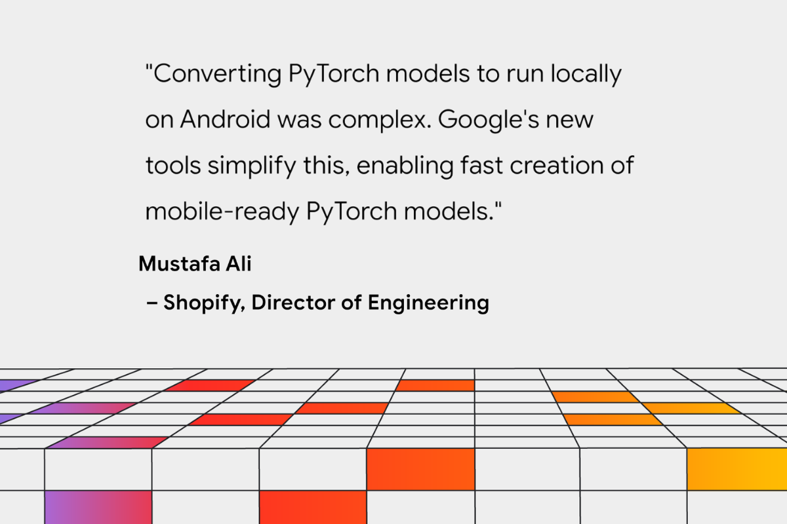
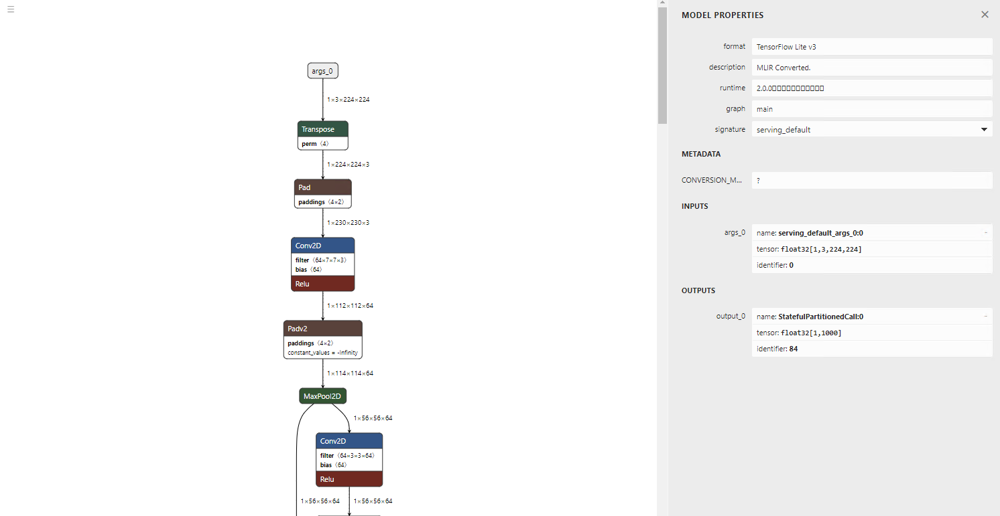
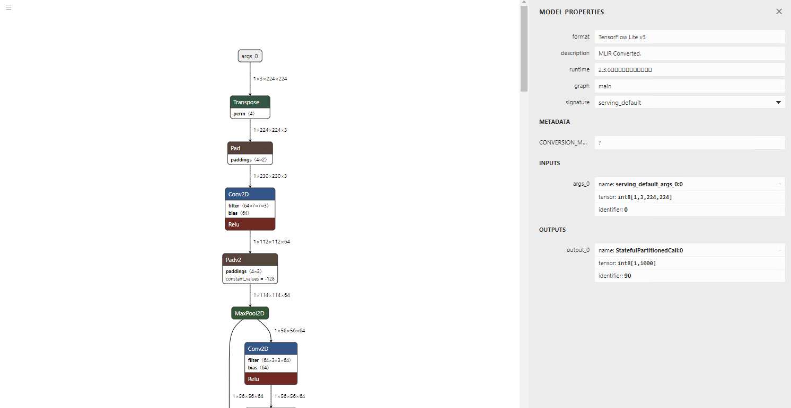
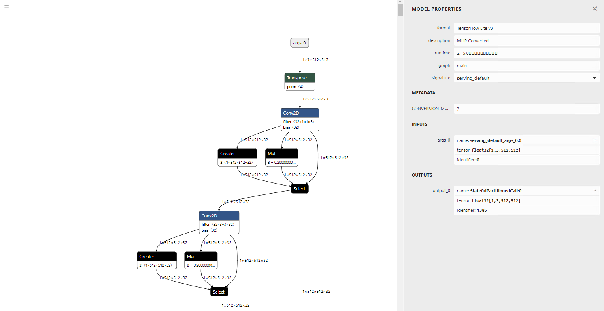
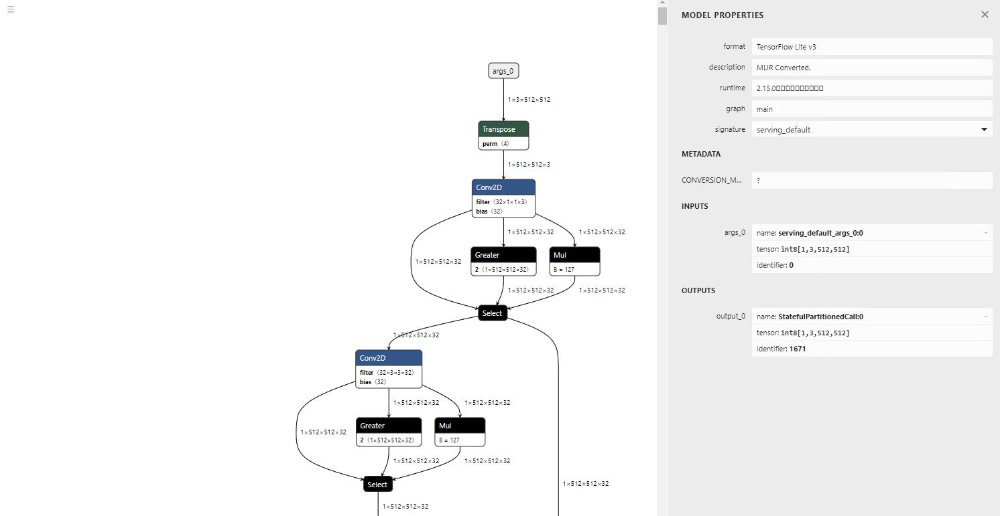

# Convert Models From Pytorch to TFLite With AI Edge Torch

# Convert Models From Pytorch to TFLite With AI Edge Torch

[](/@cochard-dav?source=post_page---byline--0e85623f8d56---------------------------------------)

[David Cochard](/@cochard-dav?source=post_page---byline--0e85623f8d56---------------------------------------)

9 min read

·

Oct 1, 2024

--

3

[Listen](/m/signin?actionUrl=https%3A%2F%2Fmedium.com%2Fplans%3Fdimension%3Dpost_audio_button%26postId%3D0e85623f8d56&operation=register&redirect=https%3A%2F%2Fmedium.com%2Faxinc-ai%2Fconvert-models-from-pytorch-to-tflite-with-ai-edge-torch-0e85623f8d56&source=---header_actions--0e85623f8d56---------------------post_audio_button------------------)

Share

This article explains how *AI Edge Torch* can be used to convert PyTorch models into .tflite format, which can then be run with TensorFlow Lite (TFLite hereafter) and MediaPipe, on Android, iOS and IOT devices.

---

## About AI Edge Torch

*AI Edge Torch* is a toolkit developed by *Google* and released in May 2024 for converting models from Pytorch to TFLite.

Press enter or click to view image in full size



Source: <https://developers.googleblog.com/en/ai-edge-torch-high-performance-inference-of-pytorch-models-on-mobile-devices>

[## GitHub — google-ai-edge/ai-edge-torch: Supporting PyTorch models with the Google AI Edge TFLite…

### Supporting PyTorch models with the Google AI Edge TFLite runtime. — google-ai-edge/ai-edge-torch

github.com](https://github.com/google-ai-edge/ai-edge-torch?source=post_page-----0e85623f8d56---------------------------------------)

[## AI Edge Torch: High Performance Inference of PyTorch Models on Mobile Devices

### Released today, AI Edge Torch enables support for PyTorch, JAX, Keras, and Tensorflow with TFLite.

developers.googleblog.com](https://developers.googleblog.com/en/ai-edge-torch-high-performance-inference-of-pytorch-models-on-mobile-devices/?source=post_page-----0e85623f8d56---------------------------------------)

Previously, when converting Pytorch model to TFLite format, it was necessary to go through the ONNX format, using tools like `onnx2tensorflow`.

However, this method had issues where frequent `Transpose` operations were inserted due to the conversion between Pytorch’s default `ChannelFirst` format and TensorFlow’s `ChannelLast` format, resulting in slower inference speeds. Additionally, many conversion errors occurred when converting from ONNX to TensorFlow `saved_model`.

*AI Edge Torch* solves these problems by directly outputting TFLite from Pytorch.

## Installation

Simply run the following command

```
pip3 install ai-edge-torch
```

## Conversion from ResNet18 to TFLite (float)

By inputting the ResNet18 Torch model into `ai_edge_torch.convert`, you can convert it to TFLite.

```
import torch  
import torchvision  
import ai_edge_torch  
  
resnet18 = torchvision.models.resnet18(torchvision.models.ResNet18_Weights.IMAGENET1K_V1)  
sample_inputs = (torch.randn(1, 3, 224, 224),)  
edge_model = ai_edge_torch.convert(resnet18.eval(), sample_inputs)  
edge_model.export("resnet18.tflite")
```

The output model is very clean, with no unnecessary `Transpose` operations.

(visualisation using [Netron](/axinc-ai/visualizing-an-onnx-model-using-netron-49b845a3c5b9))

Press enter or click to view image in full size



Of course, the inference result is also correct.

```
=============================================================  
class_count=3  
+ idx=0  
  category=892[wall clock ]  
  prob=13.361162185668945  
  value=13.361162185668945  
+ idx=1  
  category=409[analog clock ]  
  prob=12.400266647338867  
  value=12.400266647338867  
+ idx=2  
  category=426[barometer ]  
  prob=10.935765266418457  
  value=10.935765266418457  
Script finished successfully.
```

## Conversion from ResNet18 to TFLite (int8) with quantization

*AI Edge Torch* also supports quantization. To perform quantization, use `pt2e_quantizer`. Calibration is done by performing inference between `prepare_pt2e` and `convert_pt2e`. In this example, one image is used, but in practice, inference is performed with multiple images for calibration.

```
import torch  
import torchvision  
import ai_edge_torch  
  
from ai_edge_torch.quantize import pt2e_quantizer  
from ai_edge_torch.quantize import quant_config  
from torch.ao.quantization import quantize_pt2e  
  
resnet18 = torchvision.models.resnet18(torchvision.models.ResNet18_Weights.IMAGENET1K_V1)  
sample_inputs = (torch.randn(1, 3, 224, 224),)  
  
quantizer = pt2e_quantizer.PT2EQuantizer().set_global(  
    pt2e_quantizer.get_symmetric_quantization_config()  
)  
model = torch._export.capture_pre_autograd_graph(resnet18, sample_inputs)  
model = quantize_pt2e.prepare_pt2e(model, quantizer)  
  
import cv2  
import numpy  
img = cv2.imread("clock.jpg")  
img = cv2.resize(img, (224, 224))  
img = numpy.expand_dims(img, 0)  
img = numpy.transpose(img, (0, 3, 1, 2))  
img = img / 255.0  
img = img.astype(numpy.float32)  
model(torch.from_numpy(img)) # calibration  
  
model = quantize_pt2e.convert_pt2e(model, fold_quantize=False)  
  
with_quantizer = ai_edge_torch.convert(  
    model,  
    sample_inputs,  
    quant_config=quant_config.QuantConfig(pt2e_quantizer=quantizer),  
)  
with_quantizer.export("resnet18_int8.tflite")
```

The model quantization is executed using `torch.ao.quantization`. *AI Edge Torch* can also converts models that have already been quantized in Torch into TFLite.

[## Quantization in PyTorch 2.0 Export Tutorial — PyTorch Tutorials 2.0.1+cu117 documentation

### Note Quantization in PyTorch 2.0 export is still a work in progress. Today we have FX Graph Mode Quantization which…

pytorch.org](https://pytorch.org/tutorials/prototype/quantization_in_pytorch_2_0_export_tutorial.html?source=post_page-----0e85623f8d56---------------------------------------)

This sample was created based on the test code below.

[## ai-edge-torch/test/test\_quantize.py at main · google-ai-edge/ai-edge-torch

### Supporting PyTorch models with the Google AI Edge TFLite runtime. — ai-edge-torch/test/test\_quantize.py at main ·…

github.com](https://github.com/google-ai-edge/ai-edge-torch/blob/main/test/test_quantize.py?source=post_page-----0e85623f8d56---------------------------------------)

The visualisation of the model architecture shows the inputs and outputs are in int8 format.

Press enter or click to view image in full size



The inference result remains correct.

```
=============================================================  
class_count=3  
+ idx=0  
  category=892[wall clock ]  
  prob=13.09241008758545  
  value=123  
+ idx=1  
  category=409[analog clock ]  
  prob=12.106959342956543  
  value=109  
+ idx=2  
  category=426[barometer ]  
  prob=10.980731010437012  
  value=93
```

## Conversion of large-scale models

*AI Edge Torch* was developed with the conversion of LLM models in mind, so it is capable of converting large-scale models. Let’s try converting GFPGAN, details about the model in the article below.

[## GFPGAN: A Machine Learning Model for Enhancing the Quality of Facial Images

### This is an introduction to「GFPGAN」, a machine learning model that can be used with ailia SDK. You can easily use this…

medium.com](/axinc-ai/gfpgan-a-machine-learning-model-for-enhancing-the-quality-of-facial-images-f46df488bf31?source=post_page-----0e85623f8d56---------------------------------------)

Here is a code example for converting GFPGAN to TFLite float.

```
import torch  
import ai_edge_torch  
  
import os  
model_name = "GFPGANv1.3"  
model_path = os.path.join('experiments/pretrained_models', model_name + '.pth')  
upscale = 2  
arch = 'clean'  
channel_multiplier = 2  
from gfpgan import GFPGANer  
restorer = GFPGANer(  
    model_path=model_path,  
    upscale=upscale,  
    arch=arch,  
    channel_multiplier=channel_multiplier,  
    bg_upsampler=None,  
    device="cpu")  
model = restorer.gfpgan  
model.eval()  
  
sample_inputs = (torch.randn(1, 3, 512, 512),)  
edge_model = ai_edge_torch.convert(model, sample_inputs)  
edge_model.export("gfpgan_float.tflite")
```

Below is the converted model visualisation. Since TFLite does not support `LeakyReLU`, it is converted into `Gather`, `Mul`, and `Select` operations.

Press enter or click to view image in full size



`torch.randn` is converted to a new operator called `STABLEHLO_RNG_BIT_GENERATOR`. As a result, it will cause an error in TensorFlow 2.12.0. However, inference runs correctly in TensorFlow 2.17.0.


GFPGAN input image (Source: <https://github.com/TencentARC/GFPGAN/blob/master/inputs/whole_imgs/10045.png>）


GFPGAN output image (Source: <https://github.com/TencentARC/GFPGAN/blob/master/inputs/whole_imgs/10045.png>）

Now let’s convert the same model to TFLite Int8.

```
# normal  
import torch  
import ai_edge_torch  
  
import os  
model_name = "GFPGANv1.3"  
model_path = os.path.join('experiments/pretrained_models', model_name + '.pth')  
upscale = 2  
arch = 'clean'  
channel_multiplier = 2  
from gfpgan import GFPGANer  
restorer = GFPGANer(  
    model_path=model_path,  
    upscale=upscale,  
    arch=arch,  
    channel_multiplier=channel_multiplier,  
    bg_upsampler=None,  
    device="cpu")  
model = restorer.gfpgan  
model.eval()  
  
sample_inputs = (torch.randn(1, 3, 512, 512),)  
edge_model = ai_edge_torch.convert(model, sample_inputs)  
edge_model.export("gfpgan_float.tflite")  
  
# quantize  
from ai_edge_torch.quantize import pt2e_quantizer  
from ai_edge_torch.quantize import quant_config  
from torch.ao.quantization import quantize_pt2e  
  
quantizer = pt2e_quantizer.PT2EQuantizer().set_global(  
    pt2e_quantizer.get_symmetric_quantization_config()  
)  
model = torch._export.capture_pre_autograd_graph(model, sample_inputs)  
model = quantize_pt2e.prepare_pt2e(model, quantizer)  
  
import cv2  
import numpy  
for face in ["face_01.png", "face_02.png", "face_03.png"]:  
    img = cv2.imread(face)  
    img = cv2.cvtColor(img, cv2.COLOR_BGR2RGB)  
    img = cv2.resize(img, (512, 512))  
    img = numpy.expand_dims(img, 0)  
    img = numpy.transpose(img, (0, 3, 1, 2))  
    img = img / 255.0  
    img = (img - 0.5) / 0.5  
    img = img.astype(numpy.float32)  
    print(img.shape)  
    model(torch.from_numpy(img)) # calibration  
  
model = quantize_pt2e.convert_pt2e(model, fold_quantize=False)  
  
with_quantizer = ai_edge_torch.convert(  
    model,  
    sample_inputs,  
    quant_config=quant_config.QuantConfig(pt2e_quantizer=quantizer),  
)  
with_quantizer.export("gfpgan_int8.tflite")
```

In the case of Int8, calibration fails with the following error:

```
Traceback (most recent call last):  
  File "/mnt/c/Users/kyakuno/Desktop/tflite/GFPGAN/tflite.py", line 49, in <module>  
    model(torch.from_numpy(img)) # calibration  
  File "/home/kyakuno/.local/lib/python3.10/site-packages/torch/fx/graph_module.py", line 738, in call_wrapped  
    return self._wrapped_call(self, *args, **kwargs)  
  File "/home/kyakuno/.local/lib/python3.10/site-packages/torch/fx/graph_module.py", line 316, in __call__  
    raise e  
  File "/home/kyakuno/.local/lib/python3.10/site-packages/torch/fx/graph_module.py", line 303, in __call__  
    return super(self.cls, obj).__call__(*args, **kwargs)  # type: ignore[misc]  
  File "/home/kyakuno/.local/lib/python3.10/site-packages/torch/nn/modules/module.py", line 1553, in _wrapped_call_impl  
    return self._call_impl(*args, **kwargs)  
  File "/home/kyakuno/.local/lib/python3.10/site-packages/torch/nn/modules/module.py", line 1562, in _call_impl  
    return forward_call(*args, **kwargs)  
  File "<eval_with_key>.106", line 183, in forward  
  File "/home/kyakuno/.local/lib/python3.10/site-packages/torch/_ops.py", line 667, in __call__  
    return self_._op(*args, **kwargs)  
RuntimeError: view size is not compatible with input tensor's size and stride (at least one dimension spans across two contiguous subspaces). Use .reshape(...) instead.
```

The conversion of the model without performing calibration is successful. However, during inference with TensorFlow 2.17.0, an exception occurs and the inference does not complete.

The model itself appears to be correctly quantized to Int8.

Press enter or click to view image in full size



## Conversion parameters

### Regarding the Flex operator

When trying to convert operators like `Relu6`, which are not included in the `TFLITE_BUILTIN` set and require `Flex` operators, the following error occurs:

```
Some ops are not supported by the native TFLite runtime, you can enable TF kernels fallback using TF Select. See instructions: https://www.tensorflow.org/lite/guide/ops_select  
TF Select ops: Relu6
```

In such cases, it is possible to enable Flex operators by using `_ai_edge_converter_flags`

```
import ai_edge_torch  
 import tensorflow as tf  
 sample_inputs = (input_image,)  
 tfl_converter_flags = {'target_spec': {'supported_ops': [tf.lite.OpsSet.TFLITE_BUILTINS, tf.lite.OpsSet.SELECT_TF_OPS]}}  
 edge_model = ai_edge_torch.convert(self.model, sample_inputs, _ai_edge_converter_flags=tfl_converter_flags)  
 edge_model.export("image_encoder.tflite")
```

[## ai-edge-torch/docs/pytorch\_converter/README.md at main · google-ai-edge/ai-edge-torch

### Supporting PyTorch models with the Google AI Edge TFLite runtime. — ai-edge-torch/docs/pytorch\_converter/README.md at…

github.com](https://github.com/google-ai-edge/ai-edge-torch/blob/main/docs/pytorch_converter/README.md?source=post_page-----0e85623f8d56---------------------------------------)

### Regarding dynamic shapes

By default, all shapes are output as static. To use dynamic shapes, you can specify dynamic shapes by using the `torch.dynamo` functionality. In dynamo, shape validation runs during graph tracing. Therefore, if there are constraints like multiples of 4096, you need to define variables and apply constraints like `* 4096` when defining the shape.

```
import ai_edge_torch  
import tensorflow as tf  
sample_inputs = (current_vision_feats[0], memory_1, memory_2, current_vision_pos_embeds[0], memory_pos_embed_1, memory_pos_embed_2)  
tfl_converter_flags = {'target_spec': {'supported_ops': [tf.lite.OpsSet.TFLITE_BUILTINS]}}  
n_1 = torch.export.Dim("n_1", min=1, max=256)  
n_4096 = n_1 * 4096  
n_2 = torch.export.Dim("n_2", min=1, max=256)  
n_4 = n_2 * 4  
dynamic_shapes={  
    'curr': None,  
    'memory_1': {0: n_4096},  
    'memory_2': {0: n_4},  
    'curr_pos': None,  
    'memory_pos_1': {0: n_4096},  
    'memory_pos_2': {0: n_4}  
}  
edge_model = ai_edge_torch.convert(self.memory_attention, sample_inputs, _ai_edge_converter_flags=tfl_converter_flags, dynamic_shapes=dynamic_shapes)  
edge_model.export("model/memory_attention_"+model_id+".tflite")
```

[## [PT2] Failed to capture graph in export with dynamic shape inputs for LLM models · Issue #117477 ·…

### 🐛 Describe the bug We aim to apply pt2e quantization for LLM models, but encounter challenges in capturing graphs with…

github.com](https://github.com/pytorch/pytorch/issues/117477?source=post_page-----0e85623f8d56---------------------------------------)

## About quantization

The quantization process using `PT2EQuantizer` is implemented in `quantize/pt2e_quantizer.py`

[## ai-edge-torch/ai\_edge\_torch/quantize/pt2e\_quantizer.py at main · google-ai-edge/ai-edge-torch

### Supporting PyTorch models with the Google AI Edge TFLite runtime. …

github.com](https://github.com/google-ai-edge/ai-edge-torch/blob/main/ai_edge_torch/quantize/pt2e_quantizer.py?source=post_page-----0e85623f8d56---------------------------------------)

The operators targeted for quantization are explicitly specified, and the resulting TFLite model will be in mixed precision.

```
# static quantization ops (both PTQ and QAT)  
  STATIC_OPS = [  
      "linear",  
      "addmm",  
      "conv_relu",  
      "conv",  
      "adaptive_avg_pool2d",  
      "gru_io_only",  
      "max_pool2d",  
      "add_relu",  
      "add",  
      "mul_relu",  
      "mul",  
      "cat",  
      "fixed_qparams",  
  ]  
  
  DYNAMIC_OPS = [  
      "linear",  
      "addmm",  
      "conv",  
      "conv_relu",  
  ]
```

## Conclusion

With *AI Edge Torch*, conversion from Torch to TFLite and deployment to devices has become easier. The backend technology, [STABLEHLO](https://github.com/openxla/stablehlo), seems to be designed with JAX usage in mind, so it appears that Google envisions deploying models trained in both Pytorch and JAX to devices via TFLite.

## Troubleshooting

### Unknown PJRT\_DEVICE ‘CUDA’

To run on the CPU in an environment without CUDA, execute `export PJRT_DEVICE=CPU` beforehand.

### torch.\_dynamo.exc.Unsupported: call\_function ConstantVariable

It seems that using `size(0)` to retrieve the batch size from a Tensor's shape results in this error. Replacing it with `shape[0]` resolves the issue.

### reset\_histogram type error during quantization

The CPU implementation of `torch.histc` only supports float. Therefore, if the tensor in the graph contains an int64 tensor, the following error will occur.

```
torch.histogram: input tensor and hist tensor should have the same dtype, but got input long int and hist float
```

To resolve this issue, modify `reset_histogram` function in `torch/ao/quantization/observer.py` as shown below:

```
def reset_histogram(self, x: torch.Tensor, min_val: torch.Tensor, max_val: torch.Tensor) -> None:  
        self.min_val.resize_(min_val.shape)  
        self.min_val.copy_(min_val)  
        self.max_val.resize_(max_val.shape)  
        self.max_val.copy_(max_val)  
        assert (  
            min_val.numel() == 1 and max_val.numel() == 1  
        ), "histogram min/max values must be scalar."  
        if x.dtype != torch.float32: # 追加  
            x = x.float() # 追加  
        torch.histc(  
            x, self.bins, min=min_val, max=max_val, out=self.histogram  # type: ignore[arg-type]  
        )
```

### dtype error during quantization

The following `dtype` error may occur during quantization.

```
File "/home/kyakuno/.local/lib/python3.10/site-packages/torch/_subclasses/fake_tensor.py", line 1757, in _dispatch_impl  
    r = func(*args, **kwargs)  
  File "/home/kyakuno/.local/lib/python3.10/site-packages/torch/_ops.py", line 667, in __call__  
    return self_._op(*args, **kwargs)  
  File "/home/kyakuno/.local/lib/python3.10/site-packages/torch/ao/quantization/fx/_decomposed.py", line 81, in quantize_per_tensor_meta  
    assert input.dtype == torch.float32, f"Expecting input to have dtype torch.float32, but got dtype: {input.dtype}"  
torch._dynamo.exc.TorchRuntimeError: Failed running call_function quantized_decomposed.quantize_per_tensor.default(*(FakeTensor(..., size=(), dtype=torch.int64), 0.007843137718737125, -128, -128, 127, torch.int8), **{}):  
Expecting input to have dtype torch.float32, but got dtype: torch.int64
```

It is no longer be *full integer quantization* (where both tensors and operations are Int8), but instead become *dynamic quantization* (where tensors are Float and weights are Int8). However, by passing `is_dynamic=True` as an argument to `get_symmetric_quantization_config`, the export will succeed.

```
quantizer = pt2e_quantizer.PT2EQuantizer().set_global(  
    pt2e_quantizer.get_symmetric_quantization_config(is_dynamic=True)  
)  
model = torch._export.capture_pre_autograd_graph(self.model, sample_inputs)  
model = quantize_pt2e.prepare_pt2e(model, quantizer)  
model(input_image) # calibration (you need to edit reset_histogram function)  
model = quantize_pt2e.convert_pt2e(model, fold_quantize=False)
```

### error: redefinition of symbol named ‘gelu\_decomp\_0’

*AI Edge Torch* requires `tf-nightly>=2.18.0.dev20240607`. If you run `pip3 install tensorflow`, it will revert to the regular TensorFlow instead of tf-nightly, so after running `pip3 uninstall tf-nightly`, please run `pip3 install tf-nightly`.

[## Bug: redefinition of symbol named ‘gelu\_decomp\_0’ · Issue #38 · google-ai-edge/ai-edge-torch

### Description of the bug: When trying to convert a huggingface-based whisper pytorch model, the error msg error…

github.com](https://github.com/google-ai-edge/ai-edge-torch/issues/38?source=post_page-----0e85623f8d56---------------------------------------)

## Introducing ailia TFLite Runtime

Our company offers the *ailia TFLite Runtime*, which enables fast inference using NNAPI and NPU in Android environments. By using *AI Edge Torch*, it is expected that more models can be converted to tflite than before, making NPU inference on Android and embedded environments easier to use.

[## ailia TFLite Runtime : Runtime for implementing AI on NonOS and RTOS devices

### Introducing ailia TFLite Runtime, a runtime for implementing AI on NonOS and RTOS devices. ailia TFLite Runtime makes…

medium.com](/axinc-ai/ailia-tflite-runtime-runtime-for-implementing-ai-on-nonos-and-rtos-devices-8b12e412df2b?source=post_page-----0e85623f8d56---------------------------------------)

---

[ax Inc.](https://axinc.jp/en/) has developed [ailia SDK](https://ailia.jp/en/), which enables cross-platform, GPU-based rapid inference.

ax Inc. provides a wide range of services from consulting and model creation, to the development of AI-based applications and SDKs. Feel free to [contact us](https://axinc.jp/en/) for any inquiry.