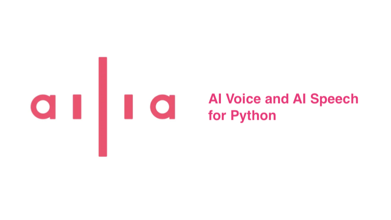

# Addition of Python API to ailia AI Voice and ailia AI Speech

# Addition of Python API to ailia AI Voice and ailia AI Speech

[](/@cochard-dav?source=post_page---byline--d0613f205248---------------------------------------)

[David Cochard](/@cochard-dav?source=post_page---byline--d0613f205248---------------------------------------)

3 min read

·

Oct 3, 2024

--

[Listen](/m/signin?actionUrl=https%3A%2F%2Fmedium.com%2Fplans%3Fdimension%3Dpost_audio_button%26postId%3Dd0613f205248&operation=register&redirect=https%3A%2F%2Fmedium.com%2Faxinc-ai%2Faddition-of-python-api-to-ailia-ai-voice-and-ailia-ai-speech-d0613f205248&source=---header_actions--d0613f205248---------------------post_audio_button------------------)

Share

Press enter or click to view image in full size



## About ailia AI Voice and *ailia AI Speech*

*ailia AI Voice* is a library that performs speech synthesis using [*GPT-SoVITS*](/axinc-ai/gpt-sovits-a-zero-shot-speech-synthesis-model-with-customizable-fine-tuning-e4c72cd75d87), while *ailia AI Speech* is a library that performs speech recognition using [*Whisper*](/axinc-ai/whisper-speech-recognition-model-capable-of-recognizing-99-languages-5b5cf0197c16).

Previously, these libraries provided bindings for C++, C#, and Flutter, and we just added Python bindings.

*ailia AI Voice* and *ailia AI Speech* have very few dependencies and run on ONNX without using PyTorch, enabling stable operation without relying on framework versions. Additionally, after prototyping in Python, you can seamlessly deploy to mobile devices like iOS or Android using bindings for Unity or Flutter.

## Installation

Both modules can be install via *pip*

```
pip3 install ailia_voice  
pip3 install ailia_speech
```

## Usage

Using the Python bindings for *ailia AI Voice* and *ailia AI Speech*, speech synthesis and speech recognition can be achieved in just a few line of code. The models are also downloaded automatically.

### Speech synthesis with *ailia AI Voice*

As shown in the sample below, download the `reference_audio_girl.wav` file, perform speech synthesis based on the voice in this file, and save the result.

```
import ailia_voice  
  
import librosa  
import time  
import soundfile  
  
import os  
import urllib.request  
  
# Load reference audio  
ref_text = "水をマレーシアから買わなくてはならない。"  
ref_file_path = "reference_audio_girl.wav"  
if not os.path.exists(ref_file_path):  
 urllib.request.urlretrieve(  
  "https://github.com/axinc-ai/ailia-models/raw/refs/heads/master/audio_processing/gpt-sovits/reference_audio_captured_by_ax.wav",  
  "reference_audio_girl.wav"  
 )  
audio_waveform, sampling_rate = librosa.load(ref_file_path, mono=True)  
  
# Infer  
voice = ailia_voice.GPTSoVITS()  
voice.initialize_model(model_path = "./models/")  
voice.set_reference_audio(ref_text, ailia_voice.AILIA_VOICE_G2P_TYPE_GPT_SOVITS_JA, audio_waveform, sampling_rate)  
buf, sampling_rate = voice.synthesize_voice("こんにちは。今日はいい天気ですね。", ailia_voice.AILIA_VOICE_G2P_TYPE_GPT_SOVITS_JA)  
  
# Save result  
soundfile.write("output.wav", buf, sampling_rate)
```

### Speech recognition with ailia AI Speech

As shown below, download the `demo.wav` file and perform speech recognition on it. Since the return value is a generator, you can sequentially obtain the recognition results even for long audio files.

```
import ailia_speech  
  
import librosa  
  
import os  
import urllib.request  
  
# Load target audio  
input_file_path = "demo.wav"  
if not os.path.exists(input_file_path):  
 urllib.request.urlretrieve(  
  "https://github.com/axinc-ai/ailia-models/raw/refs/heads/master/audio_processing/whisper/demo.wa",  
  "demo.wav"  
 )  
audio_waveform, sampling_rate = librosa.load(input_file_path, mono=True)  
  
# Infer  
speech = ailia_speech.Whisper()  
speech.initialize_model(model_path = "./models/", model_type = ailia_speech.AILIA_SPEECH_MODEL_TYPE_WHISPER_MULTILINGUAL_SMALL)  
recognized_text = speech.transcribe(audio_waveform, sampling_rate)  
for text in recognized_text:  
  print(text)
```

## Parameters

Various parameters can be passed to the ailia SDK constructor. For example if you want to use the GPU, you can configure it as shown below.

```
import ailia  
import ailia_voice  
import ailia_speech  
  
env_id = ailia.get_gpu_environment_id()  
voice = ailia_voice.GPTSoVITS(env_id = env_id)  
speech = ailia_speech.Whisper(env_id = env_id)
```

## Works offline

If the AI model files exist in the `model_path`, both speech synthesis and speech recognition will operate completely offline.

## Speech recognition real time feedback

By providing a function to *Whisper*’s callback, it is possible to obtain intermediate results during speech recognition.

```
import ailia_speech  
  
def f_callback(text):  
 print(text)  
  
speech = ailia_speech.Whisper(callback = f_callback)
```

## Documentation

[## GitHub — axinc-ai/ailia-sdk: cross-platform high speed inference SDK

### cross-platform high speed inference SDK. Contribute to axinc-ai/ailia-sdk development by creating an account on GitHub.

github.com](https://github.com/axinc-ai/ailia-sdk?source=post_page-----d0613f205248---------------------------------------)

---

[ax Inc.](https://axinc.jp/en/) has developed [ailia SDK](https://ailia.jp/en/), which enables cross-platform, GPU-based rapid inference.

ax Inc. provides a wide range of services from consulting and model creation, to the development of AI-based applications and SDKs. Feel free to [contact us](https://axinc.jp/en/) for any inquiry.