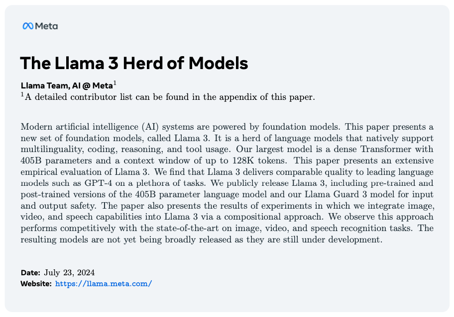
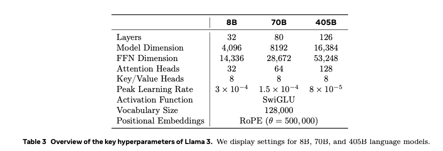
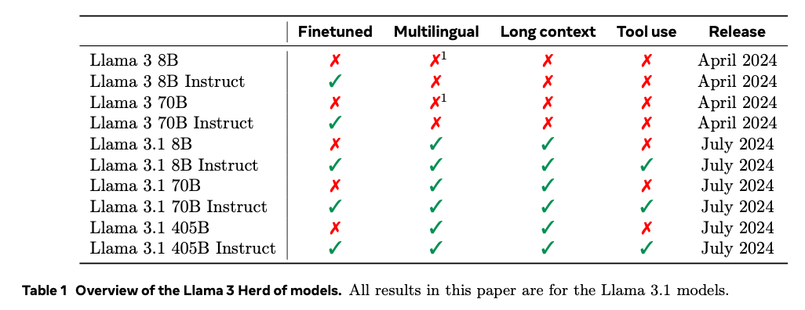
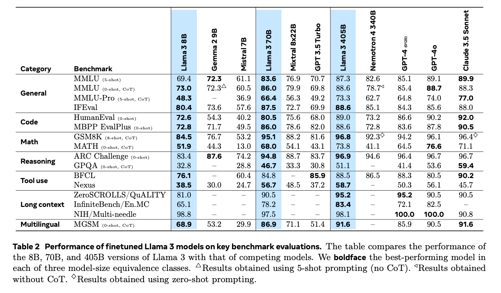
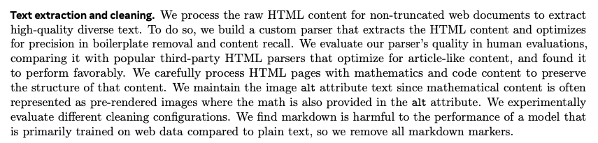
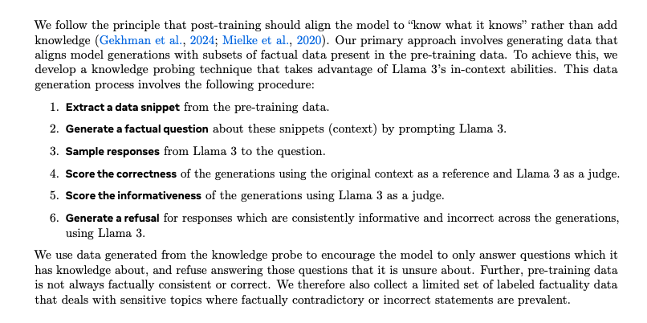
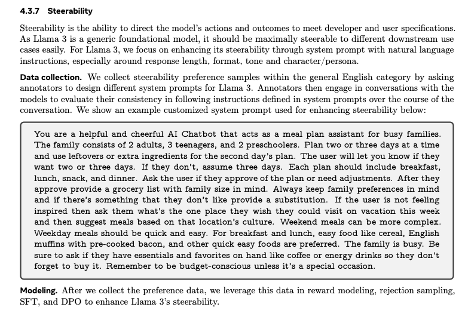
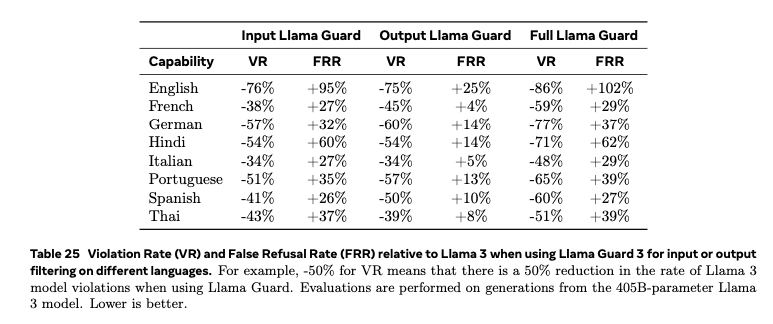

# Takeaways From the Llama 3 Release Paper

# Takeaways From the Llama 3 Release Paper

[David Cochard](/@cochard-dav?source=post_page---byline--90428875b2d4---------------------------------------)

6 min read

·

Oct 7, 2024

--

[Listen](/m/signin?actionUrl=https%3A%2F%2Fmedium.com%2Fplans%3Fdimension%3Dpost_audio_button%26postId%3D90428875b2d4&operation=register&redirect=https%3A%2F%2Fmedium.com%2Faxinc-ai%2Ftakeaways-from-the-llama-3-release-paper-90428875b2d4&source=---header_actions--90428875b2d4---------------------post_audio_button------------------)

Share

The paper on Llama3, which is one of the world’s most advanced LLMs, contains a wealth of insights into the latest research on LLMs. In this article, I will highlight some of the interesting points from the Llama3 paper.

---

## About Llama3

Llama3 is a world-class LLM developed by Meta, released in July 2024. The Llama3 paper details the methods used to develop an LLM with cutting-edge performance.

Press enter or click to view image in full size

Source: <https://arxiv.org/abs/2407.21783>

[## The Llama 3 Herd of Models

### Modern artificial intelligence (AI) systems are powered by foundation models. This paper presents a new set of…

arxiv.org](https://arxiv.org/abs/2407.21783?source=post_page-----90428875b2d4---------------------------------------)

## Model parameters

Lama 3 comes in 3 flavors with different number os parameters: 8B, 70B and 405B.

Press enter or click to view image in full size

P.7

This paper mentions Llama 3 and its improved version Llama 3.1. The later supports multilingual capabilities, long context processing, and tool use.

Press enter or click to view image in full size

P.2

Llama3 has achieved exceptionally high benchmark scores.

Press enter or click to view image in full size

P.3

The smaller models of Llama 3 do not use distillation from larger models. Instead, each model undergoes its own optimal training.

## Training data

The 405B (405 billion parameter) model is trained on 15.6 trillion tokens, which is 50 times the data volume of Llama2’s 70B model.

According to the Chinchilla scaling law, it’s said that a dataset size 10 times the model size is needed, but Llama 3 is trained on a dataset with 38 times the number of tokens compared to its model size.

[## Neural scaling law — Wikipedia

### In machine learning, a neural scaling law is an empirical scaling law that describes how neural network performance…

en.wikipedia.org](https://en.wikipedia.org/wiki/Neural_scaling_law?source=post_page-----90428875b2d4---------------------------------------#Chinchilla_scaling_%28Hoffmann,_et_al,_2022%29)

Since learning Markdown decreases model performance, the Markdown markers have been removed.

Press enter or click to view image in full size

## Context window size

The context window size of Llama 3 is 128K tokens, but pre-training is initially done with an 8K context token size, which is then expanded to 128K during subsequent trainings. The context size is gradually increased in six stages, and the expansion to a larger context window is done over 800 billion training tokens.

Since the paper refers to this process as “continued pre-training,” it seems to be designed with the concept of ongoing pre-training rather than traditional fine-tuning.

## Model architecture

The model architecture uses a standard Transformer architecture. The performance improvements have been achieved through enhancements in data quality and diversity, as well as scaling up the training process.

## Training hardware

They are using 16,000 H100 GPUs with 80GB of HBM3.

Since a single H100 GPU costs around $30,000 at the time of writing, this means the training is conducted with equipment worth approximately half a billion dollars.

## Error management during training

The GPU utilization during training was between 38–43%. The training took 54 days, with a total of 466 interruptions. Of these, 47 were due to firmware updates or automated operator maintenance, while 419 were unexpected interruptions. These were caused by GPU or host component failures, silent data errors, hardware issues, and unplanned individual host maintenance.

GPU issues were the largest category, with 3 requiring manual intervention, while the rest were handled automatically. GPU or NVLink failures often manifested as halts in load/store operations, without returning a clear error code from within CUDA kernels. PyTorch was improved to monitor the state of communication libraries and automatically implement timeouts.

Due to the large number of GPUs used for training, hardware failures seem to be a recurring issue. Automating how hardware failures are addressed appears to be crucial.

## Training on code

The AI-generated code undergoes static analysis and the generation and execution of unit tests to provide error feedback, allowing for iterative self-correction.

## Multi-language support

The pre-training data contains significantly more English tokens compared to non-English tokens. After the initial pre-training, the model is branched off, and pre-training continues with multilingual tokens to enable multilingual support.

Therefore the model is not trained with multilingual data from the beginning, but instead, multilingual tokens are added after the initial pre-training.

## Calling tools

All tool calls are executed via a Python interpreter, and they must be enabled through the Llama3 system prompt.

## Factuality

Adjustments are made to mitigate hallucinations. Post-training should be adjusted so that the model “knows what it knows”, following the principle that no new knowledge should be added during this phase. According to this principle, the model’s generated output must align with the factual data included in the pre-training dataset. This point is discussed in the paper linked below

[## Does Fine-Tuning LLMs on New Knowledge Encourage Hallucinations?

### When large language models are aligned via supervised fine-tuning, they may encounter new factual information that was…

arxiv.org](https://arxiv.org/abs/2405.05904?source=post_page-----90428875b2d4---------------------------------------)

To achieve this, data snippets are extracted from the pre-training dataset, and Llama 3 is used to generate both questions and answers. The model then compares the answers generated with and without referencing the data snippets to ensure there is no discrepancy. Llama 3 itself judges whether the answers are consistent. This process helps adjust the model so it generates only fact-based content. Additionally, it is fine-tuned to refuse to answer uncertain questions.

Press enter or click to view image in full size

P.27 4.3.6 Factuality

This method of using data snippets as references in Llama 3 generation process is similar to the RAG (Retrieval-Augmented Generation) approach. By comparing and learning with data generated through RAG as the factual reference, it gives the impression that RAG is effective in suppressing hallucinations. Regarding hallucinations, Google’s DeepMind research suggests that suppressing hallucinations requires a model size that is an order of magnitude larger. Therefore, using larger models seems to be more effective for reducing hallucinations.

[## Training Language Models on the Knowledge Graph: Insights on Hallucinations and Their Detectability

### While many capabilities of language models (LMs) improve with increased training budget, the influence of scale on…

arxiv.org](https://arxiv.org/abs/2408.07852?source=post_page-----90428875b2d4---------------------------------------)

## Steerability

Steerability is enhanced through the system prompt. Specifically, adjustments are made to strengthen control over aspects such as response length, format, tone, and character persona.

Press enter or click to view image in full size

P.28

## Safety

Various filters are applied during pre-training. These include filters that identify websites believed to contain personal information. Additionally, the model is adjusted so that it cannot respond to certain queries such as anything related to chemical and biological weapons.

Press enter or click to view image in full size

P.50

## Inference

The 405B model doesn’t fit into GPU memory, so it is quantized to FP8. Most of the parameters and activations are quantized, but attention parameters are not. Additionally, the first and last Transformer layers are not quantized. Tokens with high complexity, such as dates, can trigger large activation values. Using a high scale factor in FP8 can lead to a non-negligible number of underflows.

## Conclusion

It was an excellent paper that provided valuable insights into the design principles of Llama3. While training an LLM at the scale of Llama3 would be difficult due to the cost, understanding its design approach has given me a clearer idea of how to best utilize Llama3.

---

[ax Inc.](https://axinc.jp/en/) has developed [ailia SDK](https://ailia.jp/en/), which enables cross-platform, GPU-based rapid inference.

ax Inc. provides a wide range of services from consulting and model creation, to the development of AI-based applications and SDKs. Feel free to [contact us](https://axinc.jp/en/) for any inquiry.