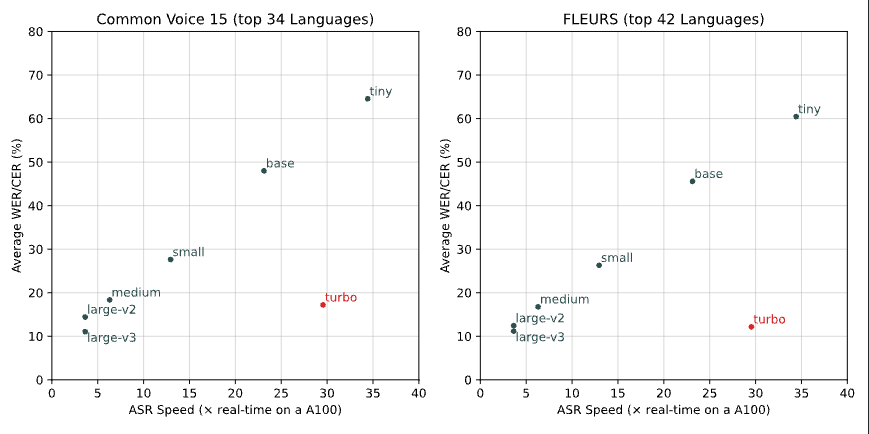
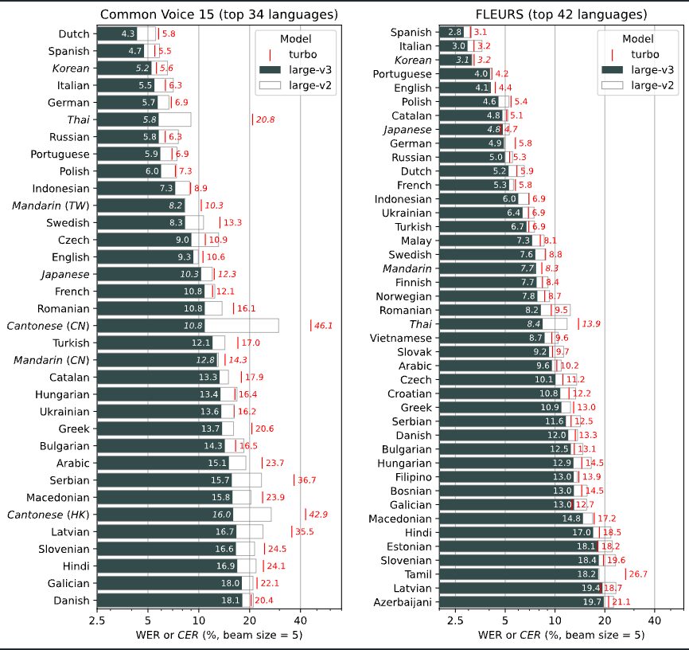

# Whisper Large V3 Turbo: High-Accuracy and Fast Speech Recognition Model

# Whisper Large V3 Turbo: High-Accuracy and Fast Speech Recognition Model

[](/@cochard-dav?source=post_page---byline--be2f6af77bdc---------------------------------------)

[David Cochard](/@cochard-dav?source=post_page---byline--be2f6af77bdc---------------------------------------)

4 min read

·

Oct 17, 2024

--

[Listen](/m/signin?actionUrl=https%3A%2F%2Fmedium.com%2Fplans%3Fdimension%3Dpost_audio_button%26postId%3Dbe2f6af77bdc&operation=register&redirect=https%3A%2F%2Fmedium.com%2Faxinc-ai%2Fwhisper-large-v3-turbo-high-accuracy-and-fast-speech-recognition-model-be2f6af77bdc&source=---header_actions--be2f6af77bdc---------------------post_audio_button------------------)

Share

We already introduced Whisper in a [previous article](/axinc-ai/whisper-speech-recognition-model-capable-of-recognizing-99-languages-5b5cf0197c16), as well as methods to perform [prompt engineering](/axinc-ai/prompt-engineering-in-whisper-6bb18003562d) and [fine-tuning](/axinc-ai/whisper-fine-tuning-to-transcribe-jargon-976164a5eac8) on it. Today we focus on its latest update, *Whisper Large V3 Turbo*.

---

## Overview

*Whisper Large V3 Turbo* is the latest model of *Whisper* released by *OpenAI* in October 2024. While maintaining the accuracy of the *Large V2* model, it significantly improves processing speed.

[## `turbo` model release · openai whisper · Discussion #2363

### We’re releasing a new Whisper model named large-v3-turbo, or turbo for short. It is an optimized version of Whisper…

github.com](https://github.com/openai/whisper/discussions/2363?source=post_page-----be2f6af77bdc---------------------------------------)

## Architecture

*Whisper Large V3 Turbo* is a model that reduces the number of decoder layers in *Whisper Large V3* from 32 to 4. With just 4 layers, the same as the *tiny* model, it achieves significant speed improvements.

This implementation is inspired by *Distil-Whisper*, which showed that using a smaller decoder can greatly improve speed while maintaining accuracy.

While *Distil-Whisper* uses distillation, *Whisper Large V3 Turbo* is retrained on *Whisper*’s original dataset. Since translation data is not included, its performance in translation mode has declined.

The graph below is a comparison of inference speed and accuracy. The horizontal axis represents inference speed, with faster models positioned further to the right. The turbo model achieves inference speeds between tiny and base models. The vertical axis represents accuracy (error rate), with lower positions indicating higher accuracy. *Whisper Large V3 Turbo* achieves accuracy equivalent to *Large V2*.

Press enter or click to view image in full size



Source: <https://github.com/openai/whisper/discussions/2363>

Below is the accuracy by language. While there is a drop in accuracy for languages like Thai and Cantonese, the model maintains the same level of accuracy as *Large V2* for Japanese.

Press enter or click to view image in full size



The model architecture of *Whisper Large V3 Turbo* is compatible with *Whisper Large V3*. Therefore, you can use the inference code for *Whisper Large V3* without any modifications.

## About Whisper Large V2 and V3

*Whisper Large V2*, often simply referred to as “*Large*,” is a high-accuracy model that has been part of Whisper since its early stages. *Whisper Large V3*, released in November 2023, is a newer model that expanded the supported languages from 99 to 100 with the addition of Cantonese, and increased the number of MelSpectrum bins from 80 to 128.

## Usage

You can use *Whisper Large V3 Turbo* with ailia SDK using the following command:

```
$ python3 whisper.py --input input.wav -m turbo
```

[## ailia-models/audio\_processing/whisper at master · axinc-ai/ailia-models

### The collection of pre-trained, state-of-the-art AI models for ailia SDK - ailia-models/audio\_processing/whisper at…

github.com](https://github.com/axinc-ai/ailia-models/tree/master/audio_processing/whisper?source=post_page-----be2f6af77bdc---------------------------------------)

Since *Whisper Large V3 Turbo* is compatible with *Whisper Large V3*, you can simply replace the model in [*ailia AI Speech*](/axinc-ai/ailia-ai-speech-speech-recognition-library-for-unity-and-c-d29db1abe978) to run it. Therefore, no library update is required, and it can also be used from Unity.

[## Added whisper turbo by kyakuno · Pull Request #144 · axinc-ai/ailia-models-unity

### Whisper Turboを選択可能にしました。

github.com](https://github.com/axinc-ai/ailia-models-unity/pull/144?source=post_page-----be2f6af77bdc---------------------------------------)

It can also be used from the ailia AI Speech Python package.

[## ailia-speech

### ailia AI Speech

pypi.org](https://pypi.org/project/ailia-speech/?source=post_page-----be2f6af77bdc---------------------------------------)

## Evaluation

When using ailia SDK and *Whisper Large V3 Turbo* on the CPU of a Mac M2, the inference time for converting 40 seconds of audio data is as follows:

> small 9432 ms（encoder 659ms decoder 37ms）  
> turbo 18363 ms（encoder 2878ms decoder 37ms）  
> medium 29323 ms（encoder 2277ms decoder 353ms）

In terms of model architecture, the encoder is the same as *Large V3*, so the encoder is computationally heavy, while the decoder is significantly faster.

The encoder processes 30 seconds of audio at once, using a static shape, meaning the tensor shape does not change between frames. In contrast, the decoder operates with a dynamic shape, where the tensor shape changes between frames, necessitating shader recompilation. Since *Whisper Large V3 Turbo* has a heavy encoder and a lightweight decoder, it benefits from GPU acceleration, making it an architecture that can easily achieve performance improvements on the GPU.

When used with the GPU on an M2 Mac, the performance is as follows:

> small 15588 ms（encoder 310ms decoder 69ms）  
> turbo 15775 ms （encoder 2129ms decoder 37ms）  
> medium 57175ms （encoder 1078ms decoder 241ms）

For models like small and medium, the CPU performs faster. However, with the turbo model, the GPU provides faster performance.

---

[ax Inc.](https://axinc.jp/en/) has developed [ailia SDK](https://ailia.jp/en/), which enables cross-platform, GPU-based rapid inference.

ax Inc. provides a wide range of services from consulting and model creation, to the development of AI-based applications and SDKs. Feel free to [contact us](https://axinc.jp/en/) for any inquiry.