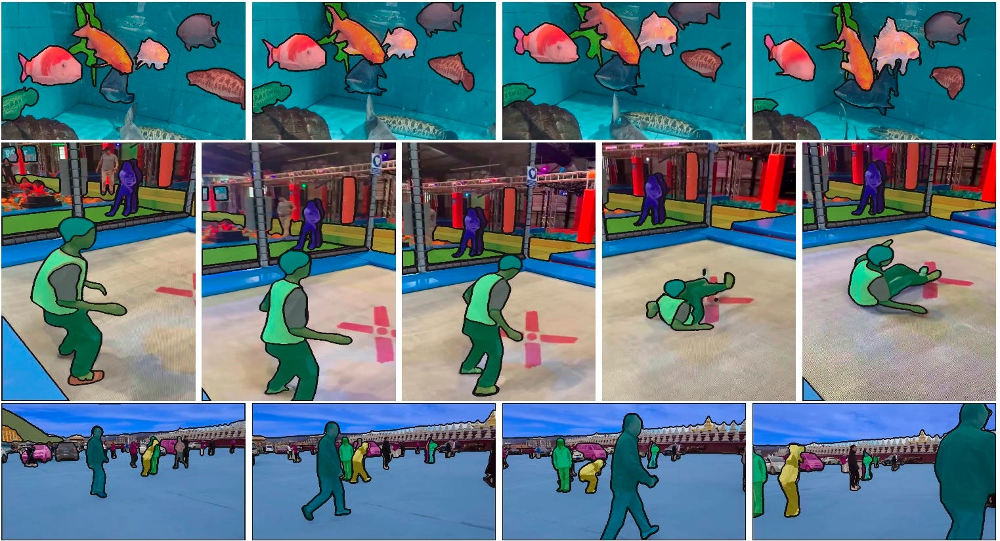
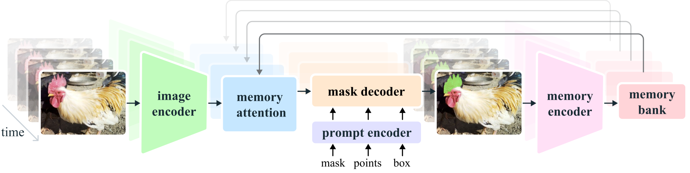
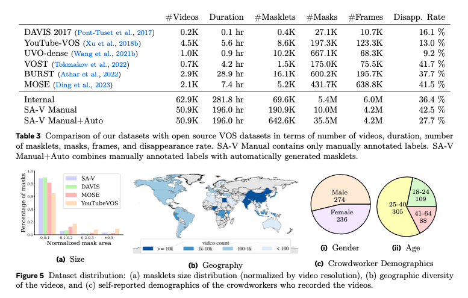
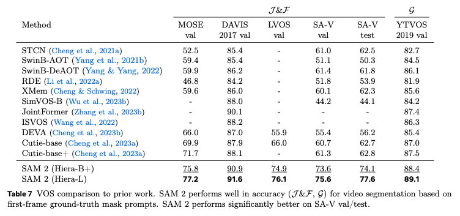
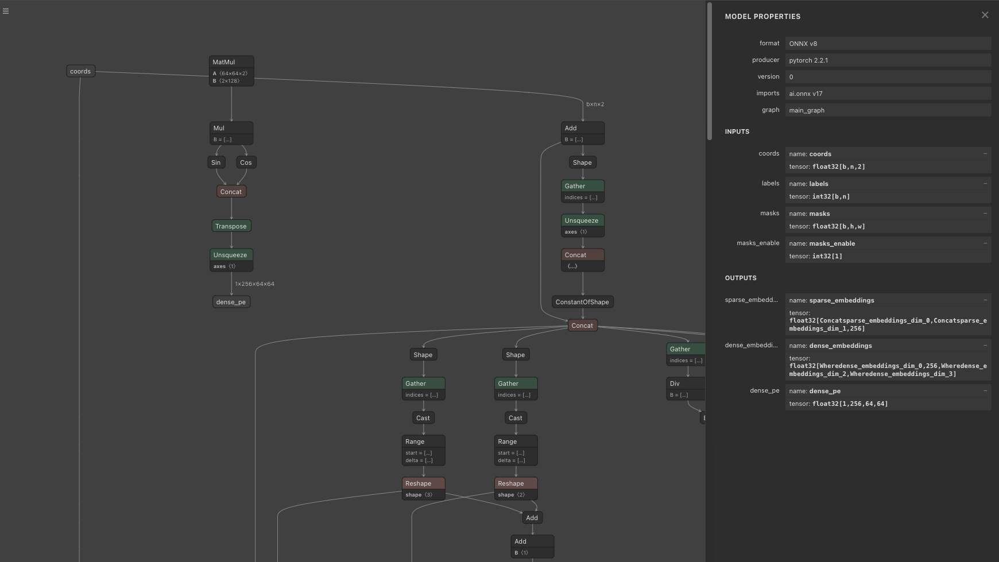
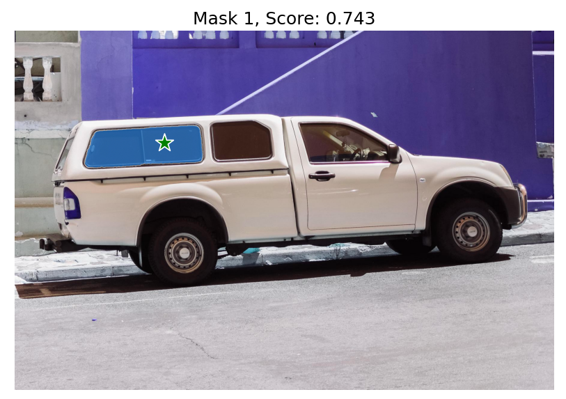

# SegmentAnything2: Segmentation Model for Arbitrary Objects in Videos

# SegmentAnything2: Segmentation Model for Arbitrary Objects in Videos

[](/@cochard-dav?source=post_page---byline--7565a325924c---------------------------------------)

[David Cochard](/@cochard-dav?source=post_page---byline--7565a325924c---------------------------------------)

8 min read

·

Oct 23, 2024

--

[Listen](/m/signin?actionUrl=https%3A%2F%2Fmedium.com%2Fplans%3Fdimension%3Dpost_audio_button%26postId%3D7565a325924c&operation=register&redirect=https%3A%2F%2Fmedium.com%2Faxinc-ai%2Fsegmentanything2-segmentation-model-for-arbitrary-objects-in-videos-7565a325924c&source=---header_actions--7565a325924c---------------------post_audio_button------------------)

Share

This is an introduction to「SegmentAnything2」, a machine learning model that can be used with [ailia SDK](https://ailia.jp/en/). You can easily use this model to create AI applications using [ailia SDK](https://ailia.jp/en/) as well as many other ready-to-use [ailia MODELS](https://github.com/axinc-ai/ailia-models).

## Overview

*SegmentAnything2* is a new version of the segmentation model developed by *Meta* and released in July 2024. Compared to *SegmentAnything* (see our past article on the topic [here](/axinc-ai/segmentanything-a-segmentation-model-with-target-specification-50514d9908e9)), which was released in April 2023, it offers improved accuracy and can now also be applied to videos.

Press enter or click to view image in full size



Source: <https://github.com/facebookresearch/segment-anything-2>

[## GitHub — facebookresearch/segment-anything-2: The repository provides code for running inference…

### The repository provides code for running inference with the Meta Segment Anything Model 2 (SAM 2), links for…

github.com](https://github.com/facebookresearch/segment-anything-2?source=post_page-----7565a325924c---------------------------------------)

[## SAM 2: Segment Anything in Images and Videos

### We present Segment Anything Model 2 (SAM 2 ), a foundation model towards solving promptable visual segmentation in…

ai.meta.com](https://ai.meta.com/research/publications/sam-2-segment-anything-in-images-and-videos/?source=post_page-----7565a325924c---------------------------------------)

## Architecture

The following is the architecture of SegmentAnything2. In still image mode, after embedding the image using the image encoder, the prompt is vectorized by the prompt encoder, and the mask decoder generates the mask image. The segmentation area can be specified using a mask, points, or a box.

Press enter or click to view image in full size



Source: <https://github.com/facebookresearch/segment-anything-2>

In video mode, the embedding of the current frame is corrected using memory attention based on the embeddings of past and future frames. Additionally, after segmenting the video in step 1, it supports a process in step 2 where key points are added to improve areas that were not successfully segmented.

Press enter or click to view image in full size


Source: <https://ai.meta.com/research/publications/sam-2-segment-anything-in-images-and-videos/>

Below is the architecture of the first version of [*SegmentAnything*](/axinc-ai/segmentanything-a-segmentation-model-with-target-specification-50514d9908e9)*1* for comparison. Apart from the addition of memory attention and a memory encoder for videos, its structure is quite similar. It is worth noting that in *SegmentAnything2*, text input, which was theoretically supported in the first version, is no longer supported. However, even in *SegmentAnything1*, the text implementation was never publicly released.

Press enter or click to view image in full size


Source: <https://github.com/facebookresearch/segment-anything>

The image encoder in *SegmentAnything1* used [ViT](/axinc-ai/vision-transformer-state-of-the-art-image-identification-technology-without-convolutional-fd10097ae9c2), while *SegmentAnything2* uses *Hiera*. *Hiera* is a hierarchical Vision Transformer ([ViT](/axinc-ai/vision-transformer-state-of-the-art-image-identification-technology-without-convolutional-fd10097ae9c2)) developed by *Meta*. In ViT, the spatial resolution remains constant throughout the network. However, in the early layers, not many feature representations are needed, and conversely, in the later layers, high spatial resolution isn’t as necessary, making it inefficient. In contrast, *Hiera* employs an architecture that progressively reduces spatial resolution, similar to *ResNet*.

Press enter or click to view image in full size


Hiera architecture (Source: <https://github.com/facebookresearch/hiera>)

*Hiera* enables faster inference compared to ViT. As a result, *SegmentAnything2* can perform inference more quickly than *SegmentAnything1*.

Press enter or click to view image in full size


Hiera benchmark ( Source: <https://github.com/facebookresearch/hiera>)

[## GitHub — facebookresearch/hiera: Hiera: A fast, powerful, and simple hierarchical vision…

### Hiera: A fast, powerful, and simple hierarchical vision transformer. — facebookresearch/hiera

github.com](https://github.com/facebookresearch/hiera?source=post_page-----7565a325924c---------------------------------------)

## Dataset

*SegmentAnything2* uses a video dataset called *SA-V*, which was created specifically for it. This dataset consists of 50.9K videos and 642.6K masks.

Press enter or click to view image in full size



Dataset comparison(Source: <https://ai.meta.com/research/publications/sam-2-segment-anything-in-images-and-videos/>）

*SegmentAnything1* was trained using the *SA-1B* dataset, which contains 11 million still images and 1 billion masks. In contrast, *SegmentAnything2* is trained using a mix of both the *SA-1B* and *SA-V* datasets.

## Precision

In still image mode, *SegmentAnything2* is more accurate and faster than *SegmentAnything1*. The row “our mix” in the table below shows that by training with a combination of the *SA-1B* and *SA-V* datasets, the accuracy has improved.

Press enter or click to view image in full size


Source: <https://ai.meta.com/research/publications/sam-2-segment-anything-in-images-and-videos/>

In video mode, *SegmentAnything2* delivers the highest performance in video segmentation tasks comapred to other models.

Press enter or click to view image in full size



Source: <https://ai.meta.com/research/publications/sam-2-segment-anything-in-images-and-videos/>

## On still images

In the Image Encoder, the input image is preprocessed in `sam2/utils/transforms.py`, using RGB order, and is normalized with `mean = [0.485, 0.456, 0.406]` and `std = [0.229, 0.224, 0.225]`. The size of the image to be processed is 1024x1024. The aspect ratio is NOT preserved during resizing. The shape of the transformed input image becomes `(1, 3, 1024, 1024)`.

The output of the Image Encoder consists of `vision_features` (features from the final layer), `vision_pos_enc` (three layers including the final one), and `backbone_fpn` (features including three layers from the final one, where the final layer is equivalent to `vision_features`). This data is passed through post-processing in `_prepare_backbone_features` to be converted into embeddings across three layers. The upper layers are called `high_res_feats`, and the lower layer is called `image_embed`. The shapes are as follows: `high_res_feats = [(1, 32, 256, 256), (1, 64, 128, 128)]`, and `image_embed = (1, 256, 64, 64)`

Press enter or click to view image in full size


Image Encoder

The output of the Prompt Encoder consists of `sparse_embeddings` and `dense_embeddings`. `sparse_embeddings` are computed from points and box, while `dense_embeddings` are computed from the mask. The shapes are `sparse_embeddings = (1, N, 256)`and `dense_embeddings=(1, 256, 64, 64)`

Press enter or click to view image in full size



Prompt Encoder

The output of the Mask Decoder, when `multi_mask_output = True`, consists of three 256x256 mask images and confidence scores. The shape of `low_res_masks` is `(1, 3, 256, 256)`, and the shape of `iou_predictions` is `(1, 3)`. The `low_res_masks` are clamped within the range of -32 to 32. Since the default `mask_threshold` is 0, the `low_res_masks` are binarized: values less than or equal to 0 are set to 0, and values greater than 0 are set to 1. When `multi_mask_output = False`, the output consists of one 256x256 mask image and a confidence score. The model produces four images, and when `multi_mask_output = False`, the first image is output, while when `multi_mask_output = True`, the first is excluded, and the next three images are output.

Press enter or click to view image in full size


Mask Decoder

When options like `max_hole_area` or `max_sprinkle_area` are enabled, an algorithm is applied to correct the mask images by filling in holes. By default, these options are disabled.

In the Prompt Encoder, `PositionEmbeddingRandom` is used to encode positional information with random values. The Position Embedding array provided to the Prompt Encoder must match the Position Embedding array given to the Mask Decoder. The shape of the Position Embedding is `(1, 256, 64, 64)`

## On videos

When applied to videos, the same logic as still images still applies, with the addition of Memory Attention.

The logic for generating features to be given to the Mask Decoder differs between still images and videos. For still images, the output of the Image Encoder’s Backbone from the current frame is passed to the Mask Decoder. For videos, the final features are generated by applying Memory Attention to both the `current_vision_feats`, which is the output of the Image Encoder’s Backbone from the current frame (same as still image), and the features from previous frames stored in memory. The memory stores one frame that is the focus of the prompt and the N frames immediately preceding the current frame (up to a maximum of 6 frames).

Memory Attention is used starting from the second frame. The input for the second frame is `curr = (4096, 1, 256)`, `curr_pos = (4096, 1, 256)`, `memory = (4100, 1, 64)`, and `memory_pos = (4100, 1, 64)`. For the third frame, the input is `curr = (4096, 1, 256)`, `curr_pos = (4096, 1, 256)`, `memory = (8200, 1, 64)`, and `memory_pos = (8200, 1, 64)`

In the memory, embeddings of size `(4096, 64)` for `cond_frames` are stored, up to a maximum of `num_maskmem = 7`. After that, embeddings of size `(4, 64)` are stored, up to a maximum of `num_obj_ptrs_in_encoder=16`. The embeddings for important frames are stored in larger quantities, while the embeddings for less important past frames are compressed and stored accordingly.

In Memory Attention, Rotary Position Embedding (RoPE) Attention is used, where a rotation matrix is applied to each element of the Attention’s Query and Key to perform Position Embedding. The RoPE Attention’s Position Embedding is applied only to the region corresponding to `cond_frames` (a region in multiples of 4096). The rotation matrix for RoPE Attention is prepared for 4096 elements, but since the length of Key (memory) is larger, it is repeated and expanded for use. The number of elements in Query (`current_vision_feats`) is always 4096.

[## GitHub — naver-ai/rope-vit: [ECCV 2024] Official PyTorch implementation of RoPE-ViT “Rotary…

### ECCV 2024] Official PyTorch implementation of RoPE-ViT “Rotary Position Embedding for Vision Transformer” …

github.com](https://github.com/naver-ai/rope-vit?source=post_page-----7565a325924c---------------------------------------)

In Memory Attention, Self Attention is calculated in `_forward_sa`, and Cross Attention is calculated in `_forward_ca`. In Self Attention, processing is applied to `current_vision_feats`. In Cross Attention, processing is applied to the result of Self Attention and the memory.

The output of Memory Attention and the output of the Prompt Encoder are fed into the Mask Decoder to generate the mask.

The generated mask is used to calculate embeddings for the next frame. Specifically, the embeddings are calculated by applying the Memory Encoder to the output of the current frame’s Image Encoder and the generated mask. This embedding is then stored and used in the Memory Attention for the next frame.

## Changing the processing image resolution

In the following issue, there is a discussion about improving speed by lowering the inference resolution from 1024 to 512, or obtaining a near pixel-perfect mask by increasing the resolution to 4096.

[## Change image resolution · Issue #138 · facebookresearch/segment-anything-2

### Similar to SAM 1, SAM 2 was trained on 1024x1024 images. I’m wondering whether it’s possible to adapt SAM 2 to 512x512…

github.com](https://github.com/facebookresearch/segment-anything-2/issues/138?source=post_page-----7565a325924c---------------------------------------)

When the resolution is lowered to 512x512, the dimensionality of the Image Encoder’s embedding is reduced from 4096 to 1024.

## Export to ONNX

To convert Memory Attention to ONNX, the Complex Tensor used in RoPE Attention needs to be replaced with a 2D Tensor.

[## export memory\_attention module to onnx failed with RuntimeError: ScalarType ComplexFloat is an…

### I am trying to export various model modules of sam2 to onnx for use on c++, but I encountered an error exporting the…

github.com](https://github.com/facebookresearch/segment-anything-2/issues/186?source=post_page-----7565a325924c---------------------------------------)

## Usage

To use *SegmentAnything2* on a still image with ailia SDK, you can use the following command. Specify the coordinates of the segmentation target in `pos`

```
python3 segment-anything-2.py --pos 500 375 -i truck.jpg
```

To use *SegmentAnything2* with a web camera, you can use the following command:

```
python3 segment-anything-2.py --pos 960 540 -v 0
```

To use *SegmentAnything2* on a video, you can use the following command:

```
python3 segment-anything-2.py -v demo
```

[## ailia-models/image\_segmentation/segment-anything-2 at master · axinc-ai/ailia-models

### The collection of pre-trained, state-of-the-art AI models for ailia SDK …

github.com](https://github.com/axinc-ai/ailia-models/tree/master/image_segmentation/segment-anything-2?source=post_page-----7565a325924c---------------------------------------)

Press enter or click to view image in full size



Output example

---

[ax Inc.](https://axinc.jp/en/) has developed [ailia SDK](https://ailia.jp/en/), which enables cross-platform, GPU-based rapid inference.

ax Inc. provides a wide range of services from consulting and model creation, to the development of AI-based applications and SDKs. Feel free to [contact us](https://axinc.jp/en/) for any inquiry.