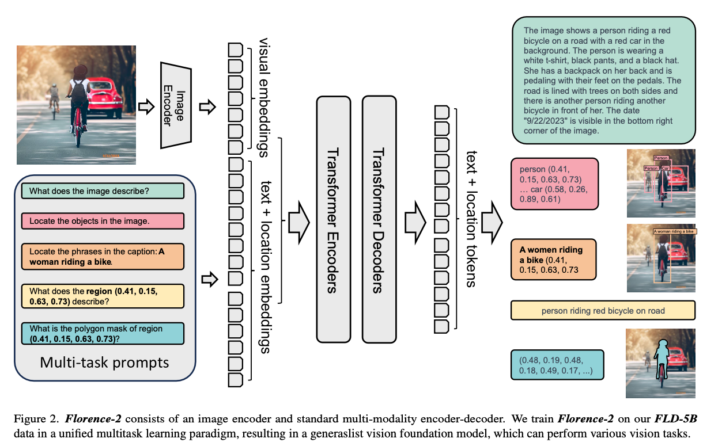
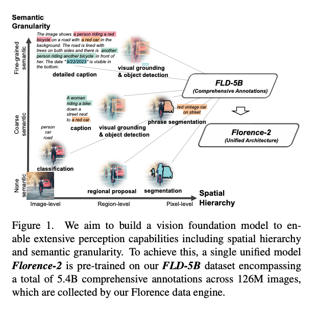

# Florence2: Lightweight Vision Language Model For Edge Deployment

# Florence2: Lightweight Vision Language Model For Edge Deployment

[](/@cochard-dav?source=post_page---byline--4245f2d8efe1---------------------------------------)

[David Cochard](/@cochard-dav?source=post_page---byline--4245f2d8efe1---------------------------------------)

4 min read

·

Nov 5, 2024

--

[Listen](/m/signin?actionUrl=https%3A%2F%2Fmedium.com%2Fplans%3Fdimension%3Dpost_audio_button%26postId%3D4245f2d8efe1&operation=register&redirect=https%3A%2F%2Fmedium.com%2Faxinc-ai%2Fflorence2-lightweight-vision-language-model-for-edge-deployment-4245f2d8efe1&source=---header_actions--4245f2d8efe1---------------------post_audio_button------------------)

Share

This is an introduction to「Florence2」, a machine learning model that can be used with [ailia SDK](https://ailia.jp/en/). You can easily use this model to create AI applications using [ailia SDK](https://ailia.jp/en/) as well as many other ready-to-use [ailia MODELS](https://github.com/axinc-ai/ailia-models).

## Overview

*Florence2* is a lightweight Vision Language Model (VLM) developed by *Microsoft* released in November 2023. It can generate captions for input images, calculate bounding boxes, perform OCR, and handle segmentation.

Press enter or click to view image in full size



[## microsoft/Florence-2-base · Hugging Face

### We’re on a journey to advance and democratize artificial intelligence through open source and open science.

huggingface.co](https://huggingface.co/microsoft/Florence-2-base?source=post_page-----4245f2d8efe1---------------------------------------)

[## Paper page — Florence-2: Advancing a Unified Representation for a Variety of Vision Tasks

### Join the discussion on this paper page

huggingface.co](https://huggingface.co/papers/2311.06242?source=post_page-----4245f2d8efe1---------------------------------------)

## Florence 2 characteristics

*Florence2* is lighter than *LLAVA*, the well-known open-source VLM, and can be deployed on edge devices. Additionally, it achieves higher accuracy than the captioning model *BLIP2*.

However, being lightweight also means that it doesn’t support free-form prompts like *LLAVA* does. *Florence2* only supports fixed prompts. For example, for image captioning tasks, it uses the fixed prompt “What does the image describe?”. If you change it to something like “How many cars exist?”, it won’t produce the correct output.

If you want to use custom prompts, you would need to first convert the image to text with *Florence2*, then input that text along with the prompt into a separate LLM.

## Training data

*Florence2* creates large-scale datasets without relying on human labor. This dataset, named `FLD-5B`, consists of 1.26 billion images with 5.4 billion annotations.

The dataset creation was performed using other models and services such as [*Segment Anything*](/axinc-ai/segmentanything-a-segmentation-model-with-target-specification-50514d9908e9), *Azure Document Intelligence* (OCR), [*Grounding Dino*](/axinc-ai/grounding-dino-detect-any-object-from-text-29808580cb32), and LLM. Bounding boxes for object detection tasks are also treated as text information.

*Florence2* relies on those various large-scale models to create datasets, but the result of training on these datasets is a very lightweight model.



## Architecture

*Florence2* uses *Sequence-to-Sequence* and formulates all tasks as translation problems.

For the object detection task, it uses `(x0, y0, x1, y1)` to represent a bounding box. For the OCR task, the quad box is defined as `(x0, y0, x1, y1, x2, y2, x3, y3),` and the polygon representation of a segmentation masks is defined as`(x0, y0, …, xn, yn).`

The input prompt is tokenized by a Tokenizer and embedded by a Text Encoder. The input image is resized to 768x768 and embedded by a Vision Encoder.

If the input prompt is “What does the image describe?”, it is tokenized as `[0 2264 473 5 2274 6190 116 2]`, resulting in an embedding of shape `(1, 8, 768)`.

The text and image embeddings are concatenated and input into the Encoder to obtain the hidden state, which is then output one token at a time by the Decoder.

The Tokenizer is *BartTokenizer*. The model architecture uses *DaVIT* for the Vision Encoder and a standard Transformer with `LayerNorm` in both the Encoder and Decoder.

## Usage

*Florence2* can be used with ailia SDK using the following command.

```
python3 florence2.py -i input.jpg -p CAPTION
```

You can specify any of the following pre-defined prompts depending on the task to achieve.

```
choices=[  
        "CAPTION",  
        "DETAILED_CAPTION",  
        "MORE_DETAILED_CAPTION",  
        "CAPTION_TO_PHRASE_GROUNDING",  
        "OD",  
        "DENSE_REGION_CAPTION",  
        "REGION_PROPOSAL",  
        "OCR",  
        "OCR_WITH_REGION",  
    ],
```

Here is the result on the following image.


Source: https://huggingface.co/datasets/huggingface/documentation-images/resolve/main/transformers/tasks/car.jpg

The `DETAILED_CAPTION` output would be:

```
{'<MORE_DETAILED_CAPTION>': 'The image shows a vintage Volkswagen Beetle car parked on a cobblestone street in front of a yellow building with two wooden doors. The car is a light blue color with a white stripe running along the side. It has a round body and a small rear window. The wheels are silver with black rims. The building appears to be old and dilapidated, with peeling paint and crumbling walls. The sky is blue and there are trees in the background.'}
```

[## ailia-models/vision\_language\_model/florence2 at master · axinc-ai/ailia-models

### The collection of pre-trained, state-of-the-art AI models for ailia SDK — ailia-models/vision\_language\_model/florence2…

github.com](https://github.com/axinc-ai/ailia-models/tree/master/vision_language_model/florence2?source=post_page-----4245f2d8efe1---------------------------------------)

---

[ax Inc.](https://axinc.jp/en/) has developed [ailia SDK](https://ailia.jp/en/), which enables cross-platform, GPU-based rapid inference.

ax Inc. provides a wide range of services from consulting and model creation, to the development of AI-based applications and SDKs. Feel free to [contact us](https://axinc.jp/en/) for any inquiry.