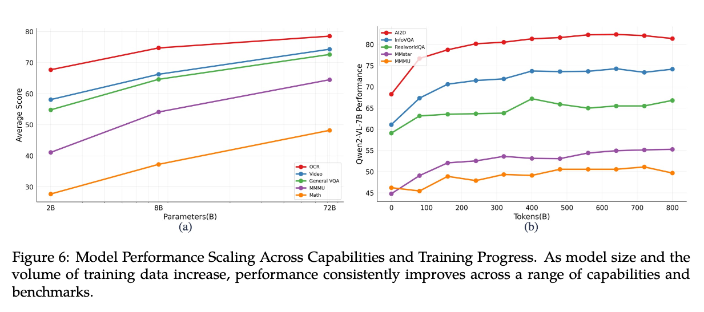
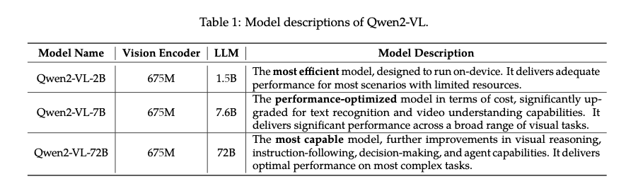

# Qwen2-VL: A Vision Language Model That Runs Locally

# Qwen2-VL: A Vision Language Model That Runs Locally

[](/@cochard-dav?source=post_page---byline--4b97ccab1bf6---------------------------------------)

[David Cochard](/@cochard-dav?source=post_page---byline--4b97ccab1bf6---------------------------------------)

6 min read

·

Nov 27, 2024

--

1

[Listen](/m/signin?actionUrl=https%3A%2F%2Fmedium.com%2Fplans%3Fdimension%3Dpost_audio_button%26postId%3D4b97ccab1bf6&operation=register&redirect=https%3A%2F%2Fmedium.com%2Faxinc-ai%2Fqwen2-vl-a-vision-language-model-that-runs-locally-4b97ccab1bf6&source=---header_actions--4b97ccab1bf6---------------------post_audio_button------------------)

Share

This is an introduction to「Qwen2-VL」, a machine learning model that can be used with [ailia SDK](https://ailia.jp/en/). You can easily use this model to create AI applications using [ailia SDK](https://ailia.jp/en/) as well as many other ready-to-use [ailia MODELS](https://github.com/axinc-ai/ailia-models).

## Overview

*Qwen2-VL* is a vision language model released by *Alibaba* in October 2024. It offers three model sizes: 2B, 7B, and 72B, and enables users to ask questions about images using text, similar to the GPT-4 vision API.

Applications include multilingual image-text understanding, code/math reasoning, video analysis, live chat, and agents.

Previously, [*LLAVA*](/axinc-ai/llava-large-language-model-that-understands-images-57d68c321254)was commonly used as an open-source solution for such tasks. However, it had certain limitations, such as its smallest model being relatively large at 7B and its lack of support for some languages, such as Japanese. *Qwen2-VL* addresses these issues by providing a 2B model size and support for Japanese.

Press enter or click to view image in full size


[## GitHub — QwenLM/Qwen2-VL: Qwen2-VL is the multimodal large language model series developed by Qwen…

### Qwen2-VL is the multimodal large language model series developed by Qwen team, Alibaba Cloud. — QwenLM/Qwen2-VL

github.com](https://github.com/QwenLM/Qwen2-VL?source=post_page-----4b97ccab1bf6---------------------------------------)

## Architecture

In *Qwen2-VL*, input images are tokenized and combined with the prompt text, then transformed into latent representations using a Vision Encoder before being fed into the *QwenLM* Decoder. It also supports videos, where up to 30 frames can be tokenized together.

Press enter or click to view image in full size


Source: <https://github.com/QwenLM/Qwen2-VL>

Vision Language Models (VLMs) usually face the following challenges:

- Encoding input images at a fixed resolution
- Using [CLIP](/axinc-ai/clip-learning-transferable-visual-models-from-natural-language-supervision-4508b3f0ea46) as the Vision Encoder

*Qwen2-VL* addresses these issues by:

- Handling input resolutions as they are, embedding positional information with RoPE
- Using [Vision Transformers](/axinc-ai/vision-transformer-state-of-the-art-image-identification-technology-without-convolutional-fd10097ae9c2) (ViT) as the Vision Encoder and making it trainable

These improvements enhance the model’s accuracy.

*Qwen2-VL* training process goes as follows:

1. The first stage involves training the ViT
2. The second stage trains all parameters, including those of the LLM
3. In the final stage, ViT parameters are frozen, and instruction tuning is performed using an Instruction Dataset

During pretraining, 600 billion tokens are used. The LLM is initialized with Qwen2 parameters. In the second stage, an additional 800 billion image-related tokens are processed, bringing the total to 1.4 trillion tokens.

## Performance

*Qwen2-VL-72B* outperforms *GPT-4o* in terms of performance.

Press enter or click to view image in full size


Source: <https://github.com/QwenLM/Qwen2-VL>

The graph below is a performance comparison of the 2B, 7B, and 72B models. While the 72B model delivers the highest accuracy, the 2B model also demonstrates solid performance.

Press enter or click to view image in full size



Source: <https://github.com/QwenLM/Qwen2-VL>

*Qwen2-VL-2B* is the most efficient model, providing sufficient performance for most scenarios. The 7B model significantly enhances text recognition and video understanding capabilities. The 72B model further improves instruction adherence, decision-making, and agent-related capabilities.

The Vision Encoder has a fixed parameter count of 675M, ensuring high image recognition performance regardless of the model size. As a result, tasks like OCR can achieve high performance even with the 2B model.

Press enter or click to view image in full size



Source: <https://github.com/QwenLM/Qwen2-VL>

## Prompt templates

Qwen2-VL utilizes special tokens such as `<|vision_start|>` and `<|vision_end|>` for vision-related input. In dialogue, `<|im_start|>` is used. For encoding bounding boxes, `<|box_start|>` and `<|box_end|>` are employed. To link bounding boxes with captions, `<|object_ref_start|>` and `<|object_ref_end|>` are used.

Press enter or click to view image in full size


Source: <https://github.com/QwenLM/Qwen2-VL>

Here is the prompt used when running a sample. `<|image_pad|>` is replaced with the tokenized values of the image and supplied to the Vision Encoder.

```
<|im_start|>system  
You are a helpful assistant.<|im_end|>  
<|im_start|>user  
<|vision_start|><|image_pad|><|vision_end|>Describe this image.<|im_end|>  
<|im_start|>assistant
```

When the input tokens are of size (1, 913), the output from the Vision Encoder will be (1, 913, 1536). This output is then fed into the QwenLM Decoder to generate text.

## Tokenizer

*Qwen2-VL* uses the *Qwen2Tokenizer* as its tokenizer. *Qwen2Tokenizer* is compatible and employs the same BPE-based method as *GPT2Tokenizer*.

## Usage

To run Qwen2-VL with ailia SDK ([version 1.5 or later](/axinc-ai/released-ailia-sdk-1-5-0-723bbcae0068)), use the following command. The 2B model has a size of 10GB (FP32), and Japanese can also be used in the prompt.

```
$ python3 qwen2_vl.py --input demo.jpeg --prompt "Describe this image."
```

[## ailia-models/vision\_language\_model/qwen2\_vl at master · axinc-ai/ailia-models

### The collection of pre-trained, state-of-the-art AI models for ailia SDK - ailia-models/vision\_language\_model/qwen2\_vl…

github.com](https://github.com/axinc-ai/ailia-models/tree/master/vision_language_model/qwen2_vl?source=post_page-----4b97ccab1bf6---------------------------------------)

When running inference on an M2 Mac CPU, it takes approximately 23 seconds for image embedding (1024x683 resolution) and about 42 seconds for text generation. The processing time for image embedding depends on the image resolution, while text generation time is less affected by resolution.

A reduced FP16 version of the ONNX model is also available. To use the FP16 version, include the `-fp16` option.

```
$ python3 qwen2_vl.py --input demo.jpeg --prompt "Describe this image." --fp16
```

*Qwen2-VL* does not currently work with *llama.cpp*, but support is being addressed in [Issue #9426](https://github.com/ggerganov/llama.cpp/issues/9246).

## Output examples

Here is an example of querying an image with Qwen2-VL.

Press enter or click to view image in full size


Source: https://qianwen-res.oss-cn-beijing.aliyuncs.com/Qwen-VL/assets/demo.jpeg

> **Describe this image.**
>
> The image depicts a serene beach scene with a woman and a dog. The woman is sitting on the sand, wearing a plaid shirt and black pants, and appears to be smiling. She is giving a high-five to the dog, which is sitting on the sand next to her. The dog is wearing a colorful harness and appears to be wagging its tail. The background shows the ocean with gentle waves, and the sky is clear with a soft glow, suggesting either sunrise or sunset. The overall atmosphere is peaceful and joyful.

Queries can be made in Japanese, and Japanese OCR is also supported.

## Applications

An application called [*ColQwen2*](https://huggingface.co/vidore/colqwen2-v0.1) has been proposed, which utilizes the projected features from *Qwen2-VL* Vision Encoder output to perform PDF-based Retrieval-Augmented Generation (RAG). Users can ask questions about the images on the relevant pages using *Qwen2-VL* prompts to get answers.

Traditional RAG processes everything in a text-based manner, making it challenging to handle charts and diagrams. However, by using *ColPali*, which leverages *Qwen2-VL* to process everything image-based, this issue can be addressed effectively.

Press enter or click to view image in full size


Source: <https://huggingface.co/vidore/colqwen2-v0.1>

[## vidore/colqwen2-v0.1 · Hugging Face

### We’re on a journey to advance and democratize artificial intelligence through open source and open science.

huggingface.co](https://huggingface.co/vidore/colqwen2-v0.1?source=post_page-----4b97ccab1bf6---------------------------------------)

---

[ax Inc.](https://axinc.jp/en/) has developed [ailia SDK](https://ailia.jp/en/), which enables cross-platform, GPU-based rapid inference.

ax Inc. provides a wide range of services from consulting and model creation, to the development of AI-based applications and SDKs. Feel free to [contact us](https://axinc.jp/en/) for any inquiry.