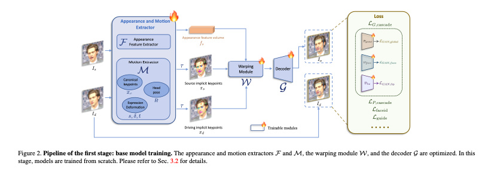

# Live Portrait: Bring Portraits to Life

# Live Portrait: Bring Portraits to Life

[](/@cochard-dav?source=post_page---byline--1aa682082d80---------------------------------------)

[David Cochard](/@cochard-dav?source=post_page---byline--1aa682082d80---------------------------------------)

4 min read

·

Dec 5, 2024

--

[Listen](/m/signin?actionUrl=https%3A%2F%2Fmedium.com%2Fplans%3Fdimension%3Dpost_audio_button%26postId%3D1aa682082d80&operation=register&redirect=https%3A%2F%2Fmedium.com%2Faxinc-ai%2Flive-portrait-bring-portraits-to-life-1aa682082d80&source=---header_actions--1aa682082d80---------------------post_audio_button------------------)

Share

This is an introduction to「Live Portrait」, a machine learning model that can be used with [ailia SDK](https://ailia.jp/en/). You can easily use this model to create AI applications using [ailia SDK](https://ailia.jp/en/) as well as many other ready-to-use [ailia MODELS](https://github.com/axinc-ai/ailia-models).

---

## Overview

*Live Portrait* is an AI model released in July 2024 by *KUAISHOU*, a short video platform from China. It can animate the expressions of a single image with remarkable smoothness.


Source: <https://github.com/KwaiVGI/LivePortrait>

[## GitHub — KwaiVGI/LivePortrait: Bring portraits to life!

### Bring portraits to life! Contribute to KwaiVGI/LivePortrait development by creating an account on GitHub.

github.com](https://github.com/KwaiVGI/LivePortrait?source=post_page-----1aa682082d80---------------------------------------)

[## LivePortrait: Efficient Portrait Animation with Stitching and Retargeting Control

### Portrait Animation aims to synthesize a lifelike video from a single source image, using it as an appearance reference…

arxiv.org](https://arxiv.org/abs/2407.03168?source=post_page-----1aa682082d80---------------------------------------)

## Architecture

In recent years, advancements in GANs and diffusion models have enabled the animation of various portrait images. Traditional diffusion-based models offer high-quality results but come with the drawback of high computational costs. On the other hand, non-diffusion algorithm-based methods, which generate intermediate frames using keypoints and optical flow, are faster but suffer from lower quality.

*Live Portrait* is based on an algorithmic approach rather than a diffusion-based method, but it enhances quality by incorporating AI into the algorithmic modules. Compared to traditional diffusion-based models, it operates much faster, achieving inference speeds of 128ms per frame on an RTX 4090.

The algorithmic approach consists of two main components: a *Warping* module, which calculates optical flow from the keypoints of the input image and the keypoints of the output image, and a *Decoder* module, which generates the image using the input image and the optical flow. These modules are traditionally implemented using algorithms. *Live Portrait* replaces both the Warping and the Decoder modules with AI models.

Press enter or click to view image in full size



Base model training (Source: <https://arxiv.org/abs/2407.03168>)

*Live Portrait* adopts *face vid2vid* as its base model. To generate the output image `Id`​ from the input image `Is`​, it first extracts keypoints `xs`​ from `Is`​ and `xd`​ from `Id`​. These keypoints, `xs`​ and `xd`​, are then fed into the *Warping* module, which outputs a latent representation similar to optical flow. The Decoder is trained to generate the final image from this latent representation.

Press enter or click to view image in full size


Training of the Second-Stage Model (Source: <https://arxiv.org/abs/2407.03168>)

In the second-stage model, *Live Portrait* introduces its unique approach by incorporating additional features to capture micro-expressions, such as eye movements like winking and subtle mouth movements.

*Live Portrait* was trained on a larger dataset of 69 million images compared to *face vid2vid*. The base model training was conducted using 8 NVIDIA A100 GPUs over a period of 10 days. The second-stage model was trained in 2 days. The input image size is 256x256, while the output image size is 512x512.

## Usage

In order to use *Live Portrait* with ailia SDK, the following command is used. You can specify the character image with the `-i` option. To manipulate the image in real-time using a face from a webcam, specify `-driving 0`.

```
$ python3 live_portrait.py -i s6.jpg --driving 0
```

[## ailia-models/generative\_adversarial\_networks/live\_portrait at master · axinc-ai/ailia-models

### The collection of pre-trained, state-of-the-art AI models for ailia SDK …

github.com](https://github.com/axinc-ai/ailia-models/tree/master/generative_adversarial_networks/live_portrait?source=post_page-----1aa682082d80---------------------------------------)

By default, the face detection is performed using [*Insight Face*](https://insightface.ai/), but you can also use [*Face Mesh*](/axinc-ai/facemeshv2-detecting-key-points-on-faces-in-real-time-with-blendshapes-6381dbf78756) by specifying `-det facemesh`.

```
$ python3 live_portrait.py -i s6.jpg --driving 0 --det facemesh
```

*Live Portrait* is licensed under the MIT License, but the *Insight Face* model is restricted to Non Commercial Purpose Only. Therefore, if you are considering commercial use, use *Face Mesh* instead.

```
The code of InsightFace is released under the MIT License.  
The models of InsightFace are for non-commercial research purposes only.  
  
If you want to use the LivePortrait project for commercial purposes, you   
should remove and replace InsightFace’s detection models to fully comply with   
the MIT license.
```

[## LivePortrait/LICENSE at main · KwaiVGI/LivePortrait

### Bring portraits to life! Contribute to KwaiVGI/LivePortrait development by creating an account on GitHub.

github.com](https://github.com/KwaiVGI/LivePortrait/blob/main/LICENSE?source=post_page-----1aa682082d80---------------------------------------)

---

[ax Inc.](https://axinc.jp/en/) has developed [ailia SDK](https://ailia.jp/en/), which enables cross-platform, GPU-based rapid inference.

ax Inc. provides a wide range of services from consulting and model creation, to the development of AI-based applications and SDKs. Feel free to [contact us](https://axinc.jp/en/) for any inquiry.