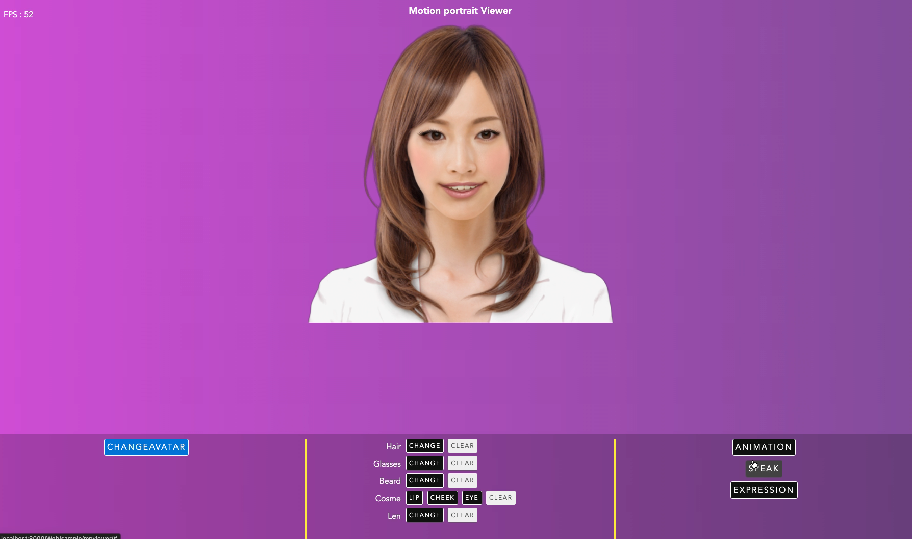
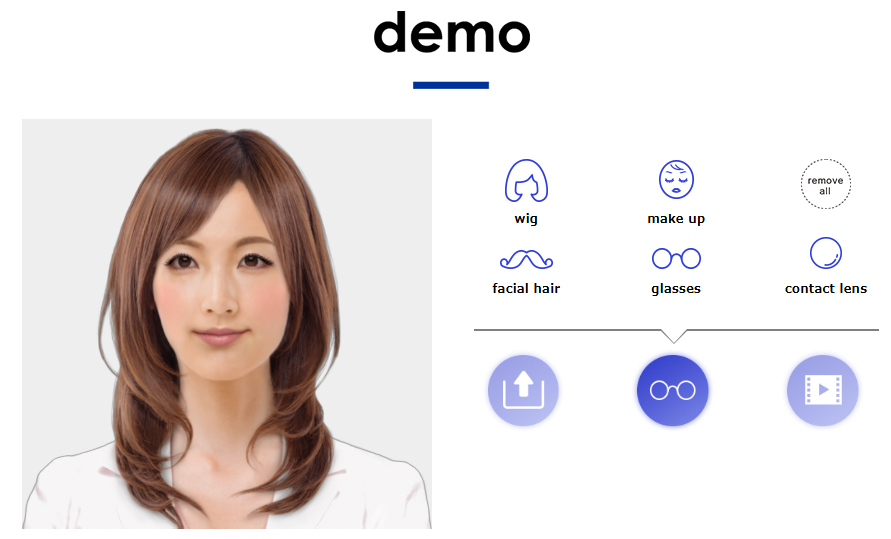
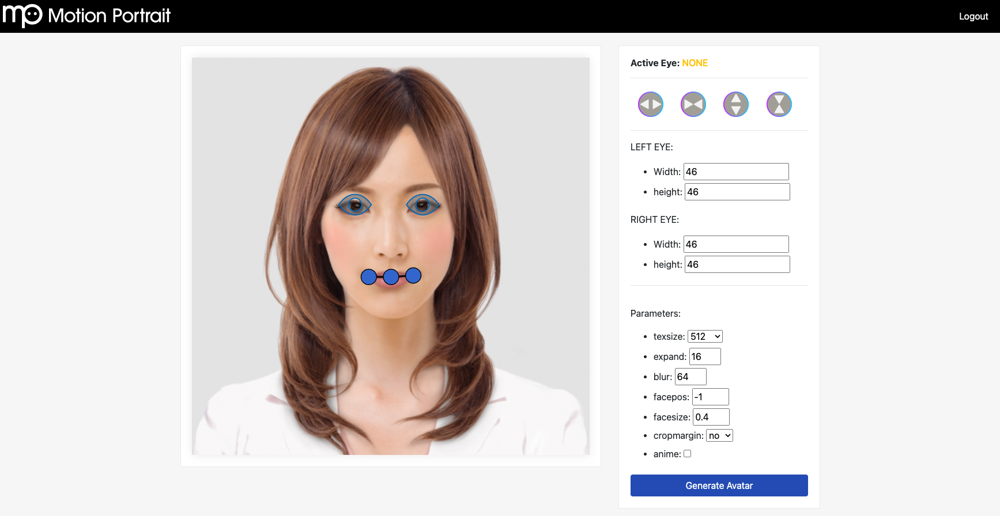
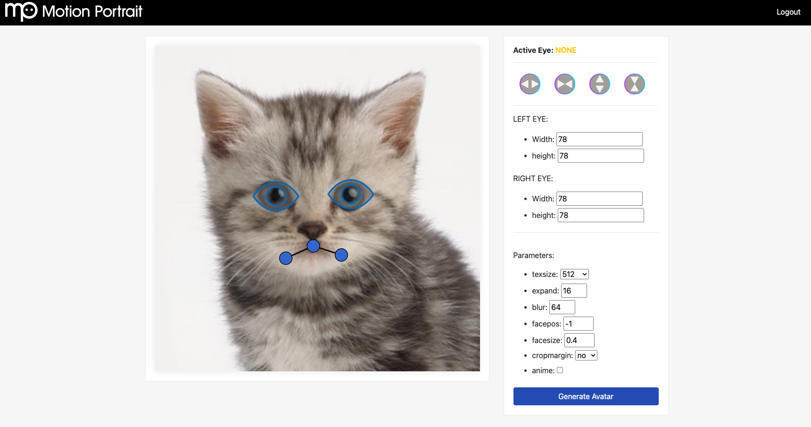
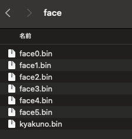

# Motion Portrait: Avatar Solution Combined with LLM

# Motion Portrait: Avatar Solution Combined with LLM

[](/@cochard-dav?source=post_page---byline--9db0dc187a91---------------------------------------)

[David Cochard](/@cochard-dav?source=post_page---byline--9db0dc187a91---------------------------------------)

7 min read

·

Dec 9, 2024

--

[Listen](/m/signin?actionUrl=https%3A%2F%2Fmedium.com%2Fplans%3Fdimension%3Dpost_audio_button%26postId%3D9db0dc187a91&operation=register&redirect=https%3A%2F%2Fmedium.com%2Faxinc-ai%2Fmotion-portrait-avatar-solution-combined-with-llm-9db0dc187a91&source=---header_actions--9db0dc187a91---------------------post_audio_button------------------)

Share

Introducing *Motion Portrait*, an avatar solution developed by [ax Inc.](https://axinc.jp/en/) that can be used with LLMs.

---

## Overview

In recent years, it has become possible to interact with avatars using LLMs, but since text alone can feel limited, there is a growing demand for displaying avatars simultaneously.

By using *Motion Portrait*, developed by [ax Inc.](https://axinc.jp/en/), you can generate and display an avatar from a single image with ease. *Motion Portrait* is extremely lightweight and can run on browsers and mobile devices.

Press enter or click to view image in full size



Motion Portrait example

[## MotionPortrait, Inc.

### MotionPortrait, Inc. web site. Introduction to MotionPortrait technology.

motionportrait.com](https://motionportrait.com/?source=post_page-----9db0dc187a91---------------------------------------)

By combining *Motion Portrait,* with other ax products such as [*ailia AI Speech*](/axinc-ai/ailia-ai-speech-speech-recognition-library-for-unity-and-c-d29db1abe978) for speech recognition, [*ailia AI Voice*](/axinc-ai/ailia-ai-voice-voice-synthesis-library-for-unity-and-c-76cd9137a06d) for speech synthesis, and conversational generation using *OpenAI* or [*ailia LLM*](/axinc-ai/ailia-llm-implementation-of-llm-on-edge-devices-c721de6aeef8), a seamless avatar solution is provided.

Press enter or click to view image in full size


Avatar Solution Overview

## Motion Portrait features

- Generating an avatar from a single image
- Avatar rendering
- Animation playback
- Facial expression changes
- Lip sync
- Addition of accessories (hair, hats, glasses, etc.)
- Makeup

## Usage examples

*Motion Portrait* is used for the chatbot avatar displayed in the bottom right corner of the [*ailia.ai* website](https://ailia.ai/en/). It operates very efficiently within the browser.

Press enter or click to view image in full size


[## ailia AI Series

### This is the AI product site of Axell Corporation. With the motto 'AI liberates people', it is a domestic AI total…

ailia.ai](https://ailia.ai/en/?source=post_page-----9db0dc187a91---------------------------------------)

The *Motion Portrait* homepage lets you test features such as virtual makeup and trying on glasses.

Press enter or click to view image in full size



[## MotionPortrait, Inc.

### MotionPortrait, Inc. web site. Introduction to MotionPortrait technology.

motionportrait.com](https://motionportrait.com/?source=post_page-----9db0dc187a91---------------------------------------)

*Motion Portrait* also has been used for character animations in several games, as well as TV programs.

## How-to

### Avatar creation

To generate an avatar, you can use the browser-based avatar generation tool. Simply upload an image, and an avatar will be automatically generated.

Once the image is uploaded, the feature point editing screen will appear. For portraits of people, the tool automatically detects feature points, you can adjust them if necessary. You can also set the avatar’s resolution using the *texsize* option. Finally, click “Generate Avatar” to download the avatar’s bin file.

Press enter or click to view image in full size



*Motion Portrait* also supports animals. In this case, feature points may not be detected correctly, so please manually adjust the feature points if necessary.

Press enter or click to view image in full size



When using PNG images with an alpha channel, the alpha value will be used as the character’s outline. Therefore, if you provide an image with a fully opaque background (alpha value of 255), a square-shaped character image will be generated. If you want the outline of the character to be automatically estimated, use an image format without an alpha channel, such as JPEG. Additionally, for creating higher-precision avatars, include the character’s mask values in the alpha channel.

### Avatar usage

The *Motion Portrait SDK* gives you all the control you need.

**WebGL sample**

For using your avatar in a web browser, you can start a web server with the following command from`mpsdk/sample.WebGL/`

```
python3 -m http.server 8000
```

Place the avatar’s bin file in the following location.

```
mpsdk/sample.WebGL/Web/sample/mpviewer/items/face
```



Add the list of avatar bin files to `js/mp_fileio.js`

```
var faceFiles = ["web_version.bin", "kyakuno.bin", "face0.bin", "face1.bin", "face2.bin", "face3.bin", "face4.bin", "face5.bin"];
```

This interface also allows you to try out predefined animations.

> <http://localhost:8000/Web/sample/mpviewer/>

The actual code is written in `mp_demo.js`. Lip sync from audio files can also be implemented by simply specifying the MP3 file you want the avatar to speak.

```
function onVoiceStart() {  
    if (voiceFiles == undefined || voiceFiles == null || voiceFiles.length <= 0)  
        return;  
    var typevoice = 2;  
    var isPlaying = mpwebgl.instance.isanimplaying(typevoice);  
    if (isPlaying == typevoice) {  
        mpwebgl.instance.pauseaudio();  
        mpwebgl.instance.unloadanimation();  
        mpwebgl.instance.destroyvoice();  
        return;  
    }  
    var voiceId = mpwebgl.instance.loadvoice('items/voice/' + voiceFiles[voiceIndex]);  
    if (voiceId > 0) {  
        if (++voiceIndex == voiceFiles.length)  
            voiceIndex = 0;  
    }  
    else  
        console.error("load voice fail");  
}
```

**C++ sample**

For native applications, a C++ API is provided. Below is a sample program for rendering an avatar using OpenGL. By loading the avatar file into `MpFace`, setting the avatar to `MpRender`, and calling `Draw` in the OpenGL rendering loop, the avatar can be rendered.

```
#include <OpenGL/gl.h>  
#include "mprender.h"  
#include "mpface.h"  
#include "mpctlanimation.h"  
#include "mpctlitem.h"  
#include "mpctlspeech.h"  
#include "mpcosme.h"  
  
#include <time.h>  
#include <sys/timeb.h>  
#include <stdio.h>  
#include <opencv2/opencv.hpp>  
  
#include <GLUT/GLUT.h>  
  
const GLfloat lightPosition1[4] = {0.0f,3.0f, 5.0f, 1.0f};  
const GLfloat green[] = { 0.0, 1.0, 0.0, 1.0 };  
const GLfloat lightPosition2[4] = {5.0f,3.0f, 0.0f, 1.0f};  
const GLfloat red[] = { 1.0, 0.0, 0.0, 1.0 };  
  
const GLfloat teapotAmbient[4] = {0.3f,0.5f, 0.0f, 1.0f};  
const GLfloat teapotDiffuse[4] = {1.0f,1.0f, 0.3f, 1.0f};  
const GLfloat teapotSpecular[4] = {1.0f,1.0f, 1.0f, 1.0f};  
const GLfloat teapotShininess[4] = {20.0f};  
  
void setup(void) {  
   glClearColor(0.0f, 0.0f, 0.0f, 1.0f);  
   glEnable(GL_DEPTH_TEST);  
   glEnable(GL_LIGHTING);  
   glEnable(GL_LIGHT0);  
   glEnable(GL_LIGHT1);  
     
   glLightfv(GL_LIGHT0, GL_POSITION, lightPosition1);  
   glLightfv(GL_LIGHT0, GL_DIFFUSE, red);  
   glLightfv(GL_LIGHT0, GL_SPECULAR, red);  
   glLightfv(GL_LIGHT1, GL_POSITION, lightPosition2);  
   glLightfv(GL_LIGHT1, GL_DIFFUSE, green);  
   glLightfv(GL_LIGHT1, GL_SPECULAR, green);  
   glMaterialfv(GL_FRONT, GL_AMBIENT, teapotAmbient);  
   glMaterialfv(GL_FRONT, GL_DIFFUSE, teapotDiffuse);  
   glMaterialfv(GL_FRONT, GL_SPECULAR, teapotSpecular);  
   glMaterialfv(GL_FRONT, GL_SHININESS, teapotShininess);  
}  
  
void resize(int width, int height) {  
   glViewport(0, 0, width, height);  
   glMatrixMode(GL_PROJECTION);  
   glLoadIdentity();  
   gluPerspective(45.0,  
                  (double)width/height,  
                  0.1,  
                  100.0);  
   glMatrixMode(GL_MODELVIEW);  
   glLoadIdentity();  
   gluLookAt(-0.5, 2.1, 2.0,  
             0.0, 0.0, 0.0,  
             0.0, 4.0, 0.0);  
}  
  
class mpView {  
    bool isFaceLoaded_;  
    long animStartTime_;  
  
    // MP instance  
    motionportrait::MpRender *render_;  
    motionportrait::MpFace   *face_;  
    motionportrait::MpCosme  *cosme_;  
  
    // MP controller  
    motionportrait::MpCtlAnimation *ctlAnim_;  
  
    motionportrait::MpCtlSpeech    *ctlSpeech_;  
    motionportrait::MpCtlSpeech::VoiceId voice_;  
    motionportrait::MpCtlItem      *ctlGlasses_;  
    motionportrait::MpCtlItem::ItemId glasses_;  
    motionportrait::MpCtlItem      *ctlHair_;  
    motionportrait::MpCtlItem::ItemId hair_;  
  
    //NSMutableArray *beardID_;  
  
    // cosme ID  
    motionportrait::MpCosme::CosmeId cosmeIdEye_;  
    motionportrait::MpCosme::CosmeId cosmeIdCheek_;  
    motionportrait::MpCosme::CosmeId cosmeIdLip_;  
  
    motionportrait::MpCtlAnimation::AnimDataId animData_;  
  
    motionportrait::mpVector2 eyesCenter_;  
  
public:  
  
bool initMPRenderer(void) {  
  
    // MpRender::Init() must be called before any MP functions  
    render_ = new motionportrait::MpRender();  
    render_->Init();  
  
    int width = 640;  
    motionportrait::mpRect viewport = {0, 0, width, width};  
    render_->SetViewport(viewport);  
  
    // initialize MpFace instance  
    face_ = new motionportrait::MpFace();  
  
    // init cosme  
    cosme_ = new motionportrait::MpCosme();  
    cosmeIdEye_ = NULL;  
    cosmeIdCheek_ = NULL;  
    cosmeIdLip_ = NULL;  
  
    // get controllers  
    ctlSpeech_ = face_->GetCtlSpeech();  
    ctlAnim_ = face_->GetCtlAnimation();  
    ctlGlasses_ = face_->GetCtlItem(motionportrait::MpFace::ITEM_TYPE_GLASSES);  
    ctlHair_ = face_->GetCtlItem(motionportrait::MpFace::ITEM_TYPE_HAIR);  
  
    return true;  
}  
  
bool loadFace(const char *face) {  
    if (face_->Load(face)) {  
        printf("can't load specied face");  
        return false;  
    }  
  
    // set face to renderer  
    render_->SetFace(face_);  
  
    // set neck rotation parameters  
    motionportrait::MpCtlAnimation *anim = face_->GetCtlAnimation();  
    anim->SetParamf(motionportrait::MpCtlAnimation::NECK_X_MAX_ROT, 2.0f);  
    anim->SetParamf(motionportrait::MpCtlAnimation::NECK_Y_MAX_ROT, 2.0f);  
    anim->SetParamf(motionportrait::MpCtlAnimation::NECK_Z_MAX_ROT, 0.3f);  
  
    // calculate eyes center position  
    motionportrait::MpFace::PartsPosition partsPos;  
    motionportrait::MpFace::GetPartsPosition(face, partsPos);  
    eyesCenter_.x = (partsPos.eyeLeft.x + partsPos.eyeRight.x) / 2;  
    eyesCenter_.y = (partsPos.eyeLeft.y + partsPos.eyeRight.y) / 2;  
  
    return true;  
}  
  
  
bool startAnimation(const char *animation) {  
    stopAnimation();  
    animData_ = ctlAnim_->CreateAnimation(animation);  
    if (animData_) {  
        animStartTime_ = getmsec();  
        return true;  
    } else {  
        return false;  
    }  
}  
  
void stopAnimation(void) {  
    if (animData_) {  
        ctlAnim_->DestroyAnimation(animData_);  
        animData_ = 0;  
    }  
}  
  
void drawBackground(bool draw) {  
    render_->EnableDrawBackground(draw);  
}  
  
void setBackgroundColor(float red, float green, float blue, float alpha) {  
    //[glContext_ makeCurrentContext];  
    glClearColor(red, green, blue, alpha);  
}  
  
void lookAt(float x, float y, float time) {  
    motionportrait::mpVector2 pos = {x - eyesCenter_.x + 0.5f, y - eyesCenter_.y + 0.5f};  
    ctlAnim_->LookAt(time, pos, 1.0f);  
}  
  
 void drawRect(void) {  
    // update unconcious animation  
    long cTime = getmsec();  
    motionportrait::MpCtlAnimation *anim = face_->GetCtlAnimation();  
    anim->Update(cTime);  
  
    if (animData_) {  
        // play animation file  
        int playing = ctlAnim_->AnimateData(animStartTime_, cTime, animData_);  
        if (playing == 0) {  
            // clean up after animation finish  
            stopAnimation();  
        }  
    }  
  
    // render  
    glClear(GL_COLOR_BUFFER_BIT);  
    render_->Draw();  
    glFlush();  
}  
  
long getmsec(void) {  
    static bool first = true;  
    static double start;  
    double now;  
    struct timeb time;  
  
    ftime(&time);  
    now = (double)time.time * 1000 + time.millitm;  
    if (first) {  
        start = now;  
        first = false;  
    }  
    return (long)(now - start);  
}  
  
};  
  
mpView* mpView_ = NULL;  
float t = 0.0f;  
  
void draw(void) {  
   glClear(GL_COLOR_BUFFER_BIT | GL_DEPTH_BUFFER_BIT);  
   glutSolidTeapot(0.5 + t);  
   if (mpView_ != NULL){  
    mpView_->drawRect();  
   }  
   t = t + 0.01f;  
   glFlush();  
   glutPostRedisplay();  
}  
  
int main(int argc, char ** argv) {  
    glutInit(&argc, argv);  
    glutInitWindowSize(600,600);  
    glutInitDisplayMode(GLUT_SINGLE | GLUT_RGBA | GLUT_DEPTH);  
    glutCreateWindow("Wire_teapot");  
    glutReshapeFunc(resize);  
    glutDisplayFunc(draw);  
  
    mpView_ = new mpView();  
  
    mpView_->initMPRenderer();  
  
    mpView_->drawBackground(false);  
    mpView_->setBackgroundColor(0.5f, 0.5f, 0.5f, 1.0f);  
    bool status = mpView_->loadFace("items/face.bin");  
    if (!status){  
        return -1;  
    }  
  
    status = mpView_->startAnimation("anim0/anim.ani2");  
    if (!status){  
        return -1;  
    }  
  
    mpView_->lookAt(-0.5f, 0.0f, 1.0f);  
  
    setup();  
  
    glutMainLoop();  
  
    return 0;  
}
```

## Inquiry about our evaluation version

For information on obtaining the MotionPortrait conversion tool and SDK, please contact us using the link below.

[## Inquiries about our products and services

www.ailia.ai](https://www.ailia.ai/en-contact-product?_gl=1*1i577xz*_gcl_au*MjExNDcwNTg1Ni4xNzMzNzIyNjcw&source=post_page-----9db0dc187a91---------------------------------------)

The evaluation version includes the following:

- An account for the web-based avatar generation tool
- SDK for each platform (`mpsdk.zip`)

---

[ax Inc.](https://axinc.jp/en/) has developed [ailia SDK](https://ailia.jp/en/), which enables cross-platform, GPU-based rapid inference.

ax Inc. provides a wide range of services from consulting and model creation, to the development of AI-based applications and SDKs. Feel free to [contact us](https://axinc.jp/en/) for any inquiry.