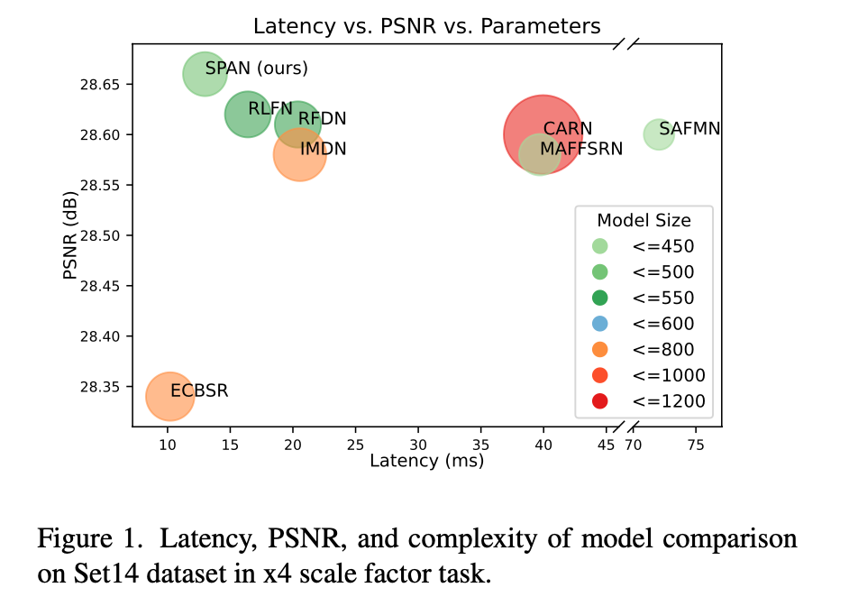
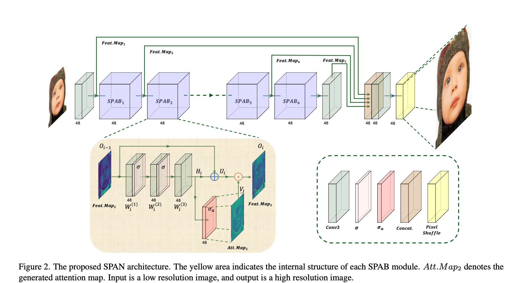
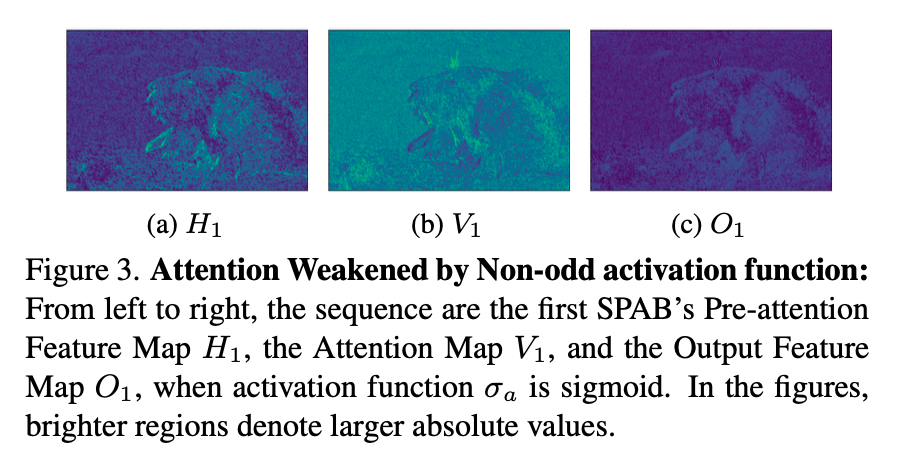
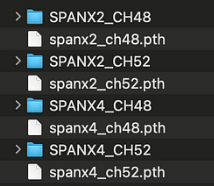

# SPAN: Efficient Super-Resolution Model Using Parameter-Free Attention

# SPAN: Efficient Super-Resolution Model Using Parameter-Free Attention

[](/@cochard-dav?source=post_page---byline--d938764aa208---------------------------------------)

[David Cochard](/@cochard-dav?source=post_page---byline--d938764aa208---------------------------------------)

4 min read

·

Mar 3, 2025

--

[Listen](/m/signin?actionUrl=https%3A%2F%2Fmedium.com%2Fplans%3Fdimension%3Dpost_audio_button%26postId%3Dd938764aa208&operation=register&redirect=https%3A%2F%2Fmedium.com%2Faxinc-ai%2Fspan-efficient-super-resolution-model-using-parameter-free-attention-d938764aa208&source=---header_actions--d938764aa208---------------------post_audio_button------------------)

Share

This is an introduction to「SPAN」, a machine learning model that can be used with [ailia SDK](https://ailia.jp/en/). You can easily use this model to create AI applications using [ailia SDK](https://ailia.jp/en/) as well as many other ready-to-use [ailia MODELS](https://github.com/axinc-ai/ailia-models).

## Overview

*SPAN* (Swift Parameter-free Attention Network for Efficient Super-Resolution) is a super-resolution model released in November 2023 by the Georgia Institute of Technology and Xiaomi. It ranked first in both overall performance and execution time in the NTIRE 2024 super-resolution challenge.

[## GitHub — hongyuanyu/SPAN: Swift Parameter-free Attention Network for Efficient Super-Resolution

### Swift Parameter-free Attention Network for Efficient Super-Resolution — hongyuanyu/SPAN

github.com](https://github.com/hongyuanyu/SPAN?source=post_page-----d938764aa208---------------------------------------)

[## Swift Parameter-free Attention Network for Efficient Super-Resolution

### Single Image Super-Resolution (SISR) is a crucial task in low-level computer vision, aiming to reconstruct…

arxiv.org](https://arxiv.org/abs/2311.12770?source=post_page-----d938764aa208---------------------------------------)

## Main features

SPAN is a highly efficient super-resolution model that balances the number of parameters, inference speed, and image quality. Traditionally, model efficiency has been improved by reducing FLOPs and parameters to achieve faster processing. However, simply reducing FLOPs or parameters does not always lead to improved inference speed. SPAN accelerates the model while maintaining accuracy by introducing parameter-free attention.

Press enter or click to view image in full size



SPAN benchmark (Source: <https://arxiv.org/abs/2311.12770>)

## Architecture

SPAN proposes a parameter-free attention mechanism. It directly computes the attention map using an activation function from high-level feature information generated by the convolutional layer.

Press enter or click to view image in full size



SPAN architecture (Source: <https://arxiv.org/abs/2311.12770>)

An attention map is necessary because a super-resolution model needs to focus on areas rich in local information, such as complex textures, edges, and color transitions. Without an attention map, the model is more prone to artifacts caused by blurring.

In SPAN, the edge and texture information required for attention is directly detected through convolutional kernels learned during training.

Press enter or click to view image in full size



Output attention maps (Source: <https://arxiv.org/abs/2311.12770>)

## Comparison with Transformer-based attention

In SPAN, Attention is designed to be parameter-free. This makes it different from the Attention mechanism in a typical Transformer in several ways.

In a standard Transformer Attention mechanism (e.g., Self-Attention), multiple linear transformations (usually for queries, keys, and values) are involved, and additional parameters are used to learn the relationships between elements.

On the other hand, SPAN directly utilizes the output of the Convolution layer to generate the Attention map, eliminating the need for additional trainable parameters or complex computations. This process has the following characteristics:

- **Use of Symmetric Activation Functions**: SPAN generates the Attention Map using symmetric activation functions, which enhances computational simplicity and speed.
- **Parameter-Free**: Since SPAN’s Attention mechanism does not introduce additional trainable parameters, the overall model complexity and computational cost remain low. In contrast, a typical Transformer’s Attention mechanism adds many parameters, increasing computational burden.
- **Residual Connection**: SPAN employs residual connections to minimize information loss while enabling efficient feature extraction. This helps balance information enhancement and retention within the Attention mechanism.

As a result, SPAN adopts a simpler and more efficient approach, significantly improving the trade-off between inference speed and performance. This makes it particularly practical in resource-constrained scenarios.

## Benchmark to other SOTA models

The performance of SPAN is as follows: On the BSD100 dataset with 4× upscaling, it achieves a PSNR of 27.62 in just 13.67 ms. It is characterized by both high accuracy and speed.

Press enter or click to view image in full size


SPAN benchmark (Source: <https://arxiv.org/abs/2311.12770>)

## Checkpoints

SPAN has four publicly available checkpoints, combining scaling factors of ×2 and ×4 with channel counts of 48 and 52.



## Quality benchmark

This is a quality comparison between [*Real-ESRGAN*](/axinc-ai/real-esrgan-super-resolution-model-enhanced-for-denoising-dd581b2702a8) and SPAN (×4, ch52). Real-ESRGAN tends to apply strong denoising, whereas SPAN preserves finer textures in the image compared to *Real-ESRGAN*.

Press enter or click to view image in full size


RealESRGAN (Source: <https://github.com/sanghyun-son/EDSR-PyTorch/blob/master/test/0853x4.png>)

Press enter or click to view image in full size


SPAN (Source: <https://github.com/sanghyun-son/EDSR-PyTorch/blob/master/test/0853x4.png>)


RealESRGAN (Source: <https://github.com/sanghyun-son/EDSR-PyTorch/blob/master/test/0853x4.png>)


SPAN (Source: <https://github.com/sanghyun-son/EDSR-PyTorch/blob/master/test/0853x4.png>)

## Performance benchmark

This is a speed comparison on an M2 Mac (ailia SDK 1.5) using MPS. SPAN runs significantly faster than Real-ESRGAN.

### RealESRGAN (510x339 -> 1785x1186)

2989ms

### SPAN (510x339 -> 2040x1356)

x4 ch48 : 139ms  
x4 ch52 : 168ms

## Usage

You can use SPAN in ailia SDK using the following command.

```
python3 span.py -i input.jpg
```

The scaling factor can be set to either 2× or 4×, with the default being 2× upscaling.

```
python3 span.py -i input.jpg --scale 4
```

[## ailia-models/super\_resolution/span at master · axinc-ai/ailia-models

### The collection of pre-trained, state-of-the-art AI models for ailia SDK - ailia-models/super\_resolution/span at master…

github.com](https://github.com/axinc-ai/ailia-models/tree/master/super_resolution/span?source=post_page-----d938764aa208---------------------------------------)

---

[ax Inc.](https://axinc.jp/en/) has developed [ailia SDK](https://ailia.jp/en/), which enables cross-platform, GPU-based rapid inference.

ax Inc. provides a wide range of services from consulting and model creation, to the development of AI-based applications and SDKs. Feel free to [contact us](https://axinc.jp/en/) for any inquiry.