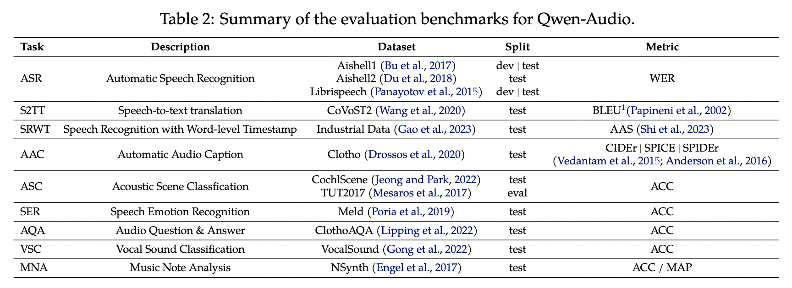

# Qwen Audio: Text Generation from Audio Input

# Qwen Audio: Text Generation from Audio Input

[](/@cochard-dav?source=post_page---byline--c77a8afb25d4---------------------------------------)

[David Cochard](/@cochard-dav?source=post_page---byline--c77a8afb25d4---------------------------------------)

4 min read

·

Mar 11, 2025

--

[Listen](/m/signin?actionUrl=https%3A%2F%2Fmedium.com%2Fplans%3Fdimension%3Dpost_audio_button%26postId%3Dc77a8afb25d4&operation=register&redirect=https%3A%2F%2Fmedium.com%2Faxinc-ai%2Fqwen-audio-text-generation-from-audio-input-c77a8afb25d4&source=---header_actions--c77a8afb25d4---------------------post_audio_button------------------)

Share

This is an introduction to「Qwen Audio」, a machine learning model that can be used with [ailia SDK](https://ailia.jp/en/). You can easily use this model to create AI applications using [ailia SDK](https://ailia.jp/en/) as well as many other ready-to-use [ailia MODELS](https://github.com/axinc-ai/ailia-models).

## Overview

*Qwen Audio* is a multimodal version of the large model series Qwen, taking audio as input, released by *Alibaba* in November 2023. It allows users to input audio and generate text based on any given prompt.

[## GitHub — QwenLM/Qwen-Audio: The official repo of Qwen-Audio (通义千问-Audio) chat & pretrained large…

### The official repo of Qwen-Audio (通义千问-Audio) chat & pretrained large audio language model proposed by Alibaba Cloud. …

github.com](https://github.com/QwenLM/Qwen-Audio?source=post_page-----c77a8afb25d4---------------------------------------)

Promptable audio language models are gaining attention for their ability to interact with audio. However, there were no pre-trained audio models trained on large-scale data.

*Qwen* Audio addresses this limitation by being pre-trained on large-scale data, enabling it to cover more than 30 tasks and various types of audio, including human speech, natural sounds, music, and singing, thereby enhancing universal audio understanding.

However, directly training on all tasks and datasets can lead to interference issues due to differences in task focus, language, annotation granularity, and text structure, which result in significantly varied text labels associated with different datasets.

To overcome this challenge, a multi-task training framework is designed to encourage knowledge sharing while avoiding interference. This is achieved by conditioning the decoder on a hierarchical sequence of tags, allowing shared and specific tags to be used effectively.

Building on the capabilities of *Qwen Audio*, *Qwen Audio-Chat* has been further developed to support both audio and text inputs, enabling multi-turn conversations and accommodating various audio-centric scenarios.

## Architecture

In *Qwen Audio*, an audio encoder based on [*Whisper Large V2*](/axinc-ai/whisper-speech-recognition-model-capable-of-recognizing-99-languages-5b5cf0197c16) is applied to the input audio, converting it into embeddings that capture its meaning. Then, a decoder based on *Qwen 7B* is used to generate text.

Press enter or click to view image in full size


Qwen Audio architecture (Source: <https://arxiv.org/abs/2311.07919>)

*Whisper Large V2* is a 32-layer Transformer model that includes two convolutional down-sampling layers. Its audio encoder consists of 640 million parameters. While *Whisper Large V2* has been trained using supervised learning for speech recognition and translation, its encoded representations still contain rich information.

The language model is initialized with pre-trained weights derived from *Qwen-7B,* which is a 32-layer Transformer decoder model with 4,096 hidden units and a total of 7.7 billion parameters.

## Tasks available

*Qwen Audio* supports various tasks, including:

- Automatic speech recognition
- Speech-to-text translation
- Speech recognition with word-level timestamps
- Automatic audio captioning
- Acoustic scene classification
- Speech emotion recognition
- Audio Question Answering
- Vocal sound classification
- Music note analysis

Press enter or click to view image in full size



Qwen Audio tasks overview (Source: <https://arxiv.org/abs/2311.07919>)

The following datasets are used in *Qwen Audio*. In addition to speech recognition, diverse data is incorporated for tasks such as dialect identification, gender recognition, emotion recognition, speaker verification, speaker separation, speaker age prediction, vocal sound classification, acoustic scene classification, singer identification, instrument classification, musical note analysis, and audio genre recognition.

Press enter or click to view image in full size


QwenAudio datasets (Source: <https://arxiv.org/abs/2311.07919>)

## Performances

*Qwen Audio* achieves high performance across various benchmark tasks without the need for task-specific fine-tuning. This is a remarkable result, similar to the impact of [BERT](/axinc-ai/bert-a-machine-learning-model-for-efficient-natural-language-processing-aef3081c24e8) in natural language processing.

Press enter or click to view image in full size


Qwen Audio performances (Source: <https://arxiv.org/abs/2311.07919>)

## Usage

You can use *Qwen Audio* with ailia SDK with the following command. Since *Qwen Audio* utilizes a 7B-class decoder, approximately 32GB of memory is required. Additionally, execution may take some time.

```
python3 qwen_audio.py --input 1272-128104-0000.flac --prompt "what does the person say?"
```

[## ailia-models/audio\_language\_model/qwen\_audio at master · axinc-ai/ailia-models

### The collection of pre-trained, state-of-the-art AI models for ailia SDK - ailia-models/audio\_language\_model/qwen\_audio…

github.com](https://github.com/axinc-ai/ailia-models/tree/master/audio_language_model/qwen_audio?source=post_page-----c77a8afb25d4---------------------------------------)

---

[ax Inc.](https://axinc.jp/en/) has developed [ailia SDK](https://ailia.jp/en/), which enables cross-platform, GPU-based rapid inference.

ax Inc. provides a wide range of services from consulting and model creation, to the development of AI-based applications and SDKs. Feel free to [contact us](https://axinc.jp/en/) for any inquiry.