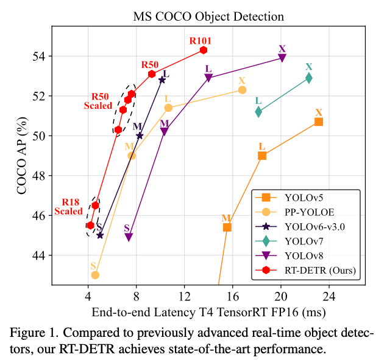
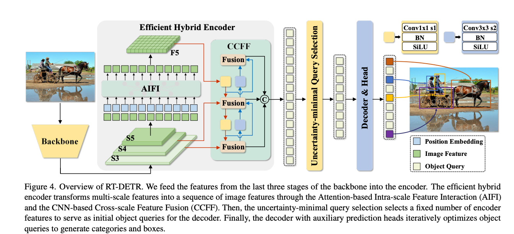

# RT-DETR: Hybrid Object Detection Model Combining Convolutions and Transformers

# RT-DETR: Hybrid Object Detection Model Combining Convolutions and Transformers

[](/@cochard-dav?source=post_page---byline--26809f9fd742---------------------------------------)

[David Cochard](/@cochard-dav?source=post_page---byline--26809f9fd742---------------------------------------)

4 min read

·

Mar 21, 2025

--

[Listen](/m/signin?actionUrl=https%3A%2F%2Fmedium.com%2Fplans%3Fdimension%3Dpost_audio_button%26postId%3D26809f9fd742&operation=register&redirect=https%3A%2F%2Fmedium.com%2Faxinc-ai%2Frt-detr-hybrid-object-detection-model-combining-convolution-and-transformer-26809f9fd742&source=---header_actions--26809f9fd742---------------------post_audio_button------------------)

Share

This is an introduction to「RT-DETR」, a machine learning model that can be used with [ailia SDK](https://ailia.jp/en/). You can easily use this model to create AI applications using [ailia SDK](https://ailia.jp/en/) as well as many other ready-to-use [ailia MODELS](https://github.com/axinc-ai/ailia-models).

## Overview

*RT-DETR* is an object detection model with a hybrid architecture combining Convolutions and Transformers, released by *Baidu* in April 2023. *RT-DETRv2*, an improved version of *RT-DETR*, was released later in July 2024. By introducing this hybrid approach, *RT-DETR* achieves fast and highly accurate object detection.

[## GitHub — lyuwenyu/RT-DETR: [CVPR 2024] Official RT-DETR (RTDETR paddle pytorch), Real-Time…

### CVPR 2024] Official RT-DETR (RTDETR paddle pytorch), Real-Time DEtection TRansformer, DETRs Beat YOLOs on Real-time…

github.com](https://github.com/lyuwenyu/RT-DETR?source=post_page-----26809f9fd742---------------------------------------)

[## DETRs Beat YOLOs on Real-time Object Detection

### The YOLO series has become the most popular framework for real-time object detection due to its reasonable trade-off…

arxiv.org](https://arxiv.org/abs/2304.08069?source=post_page-----26809f9fd742---------------------------------------)

[## RT-DETRv2: Improved Baseline with Bag-of-Freebies for Real-Time Detection Transformer

### In this report, we present RT-DETRv2, an improved Real-Time DEtection TRansformer (RT-DETR). RT-DETRv2 builds upon the…

arxiv.org](https://arxiv.org/abs/2407.17140?source=post_page-----26809f9fd742---------------------------------------)

## Architecture

In object detection, convolution-based models such as YOLO are well known. However, its speed and accuracy rely on *Non-Maximum Suppression (NMS)*. NMS is a process that detects overlapping bounding boxes and removes duplicates based on their overlap. This algorithm has several issues, such as difficulty in setting thresholds, excessive removal of overlapping objects, lack of consideration for overlaps between different classes, and excessive suppression of low-scoring objects, such as those in dark images or partially occluded objects.

To address these issues, recent models like DETR have emerged, utilizing Transformers to eliminate the need for NMS. However, DETR has the drawback of high computational cost.

*RT-DETR* achieves fast and highly accurate object detection by using a hybrid encoder that combines Convolutions and Transformers.

Below is a benchmark of the inference speed and accuracy of *RT-DETR*. Models positioned toward the upper left are higher performing, and we can see that *RT-DETR* outperforms *YOLOv8*.



Source: <https://arxiv.org/abs/2304.08069>

## About hybrid encoder

The hybrid encoder is designed for efficient multi-scale feature processing.

*RT-DETR* uses *ResNet50* as backbone. First, the input image is fed into the convolution-based backbone to extract feature vectors. Then, Attention is applied using the Transformer-based AIFI, and multi-scale features are fused using the convolution-based CCFF.

Press enter or click to view image in full size



Source: <https://arxiv.org/abs/2304.08069>

*AIFI (Attention-based Intra-scale Feature Interaction)* aims to capture relationships between conceptual entities by applying self-attention to high-level features, particularly those from the final stage (S5). By performing self-attention only on features rich in high-level semantic information, it reduces computational cost while enhancing object localization and recognition. It is not applied to low-level features (S3 or S4) to avoid redundancy and confusion.

*CCFF (CNN-based Cross-scale Feature Fusion)* introduces a fusion block composed of multiple convolutional layers to perform cross-scale feature fusion. This fusion block combines features from adjacent scales into new features, and ultimately fuses them in a lightweight and efficient manner using a CNN-based approach. This enables efficient interaction between different scales and systematically integrates high-level features rich in semantic information with low-level features.

## Benchmark

*RT-DETR* achieves an excellent balance of speed and accuracy across many object detection tasks.

Press enter or click to view image in full size


Source: <https://arxiv.org/abs/2304.08069>

## Improvements of RT-DETRv2

*RT-DETRv2* replaces `grid_sample` with `discrete_sample`, introduces strong data augmentation during training, and adjusts hyperparameters.

## Usage

You can use *RT*-*DETRv2* with ailia SDK using the following command:

```
$ python3 rt-detr-v2.py --input demo.jpg
```

[## ailia-models/object\_detection/rt-detr-v2 at master · axinc-ai/ailia-models

### The collection of pre-trained, state-of-the-art AI models for ailia SDK - ailia-models/object\_detection/rt-detr-v2 at…

github.com](https://github.com/axinc-ai/ailia-models/tree/master/object_detection/rt-detr-v2?source=post_page-----26809f9fd742---------------------------------------)

---

[ax Inc.](https://axinc.jp/en/) has developed [ailia SDK](https://ailia.jp/en/), which enables cross-platform, GPU-based rapid inference.

ax Inc. provides a wide range of services from consulting and model creation, to the development of AI-based applications and SDKs. Feel free to [contact us](https://axinc.jp/en/) for any inquiry.