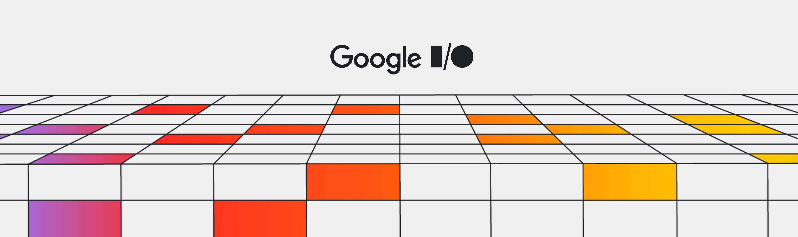
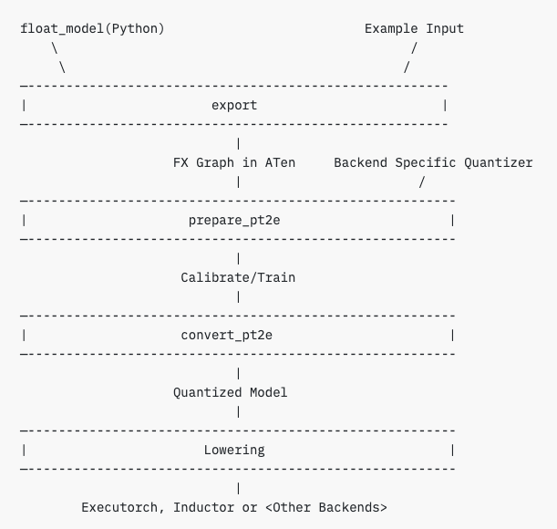
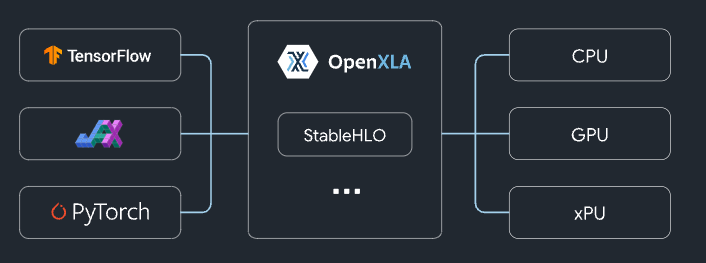
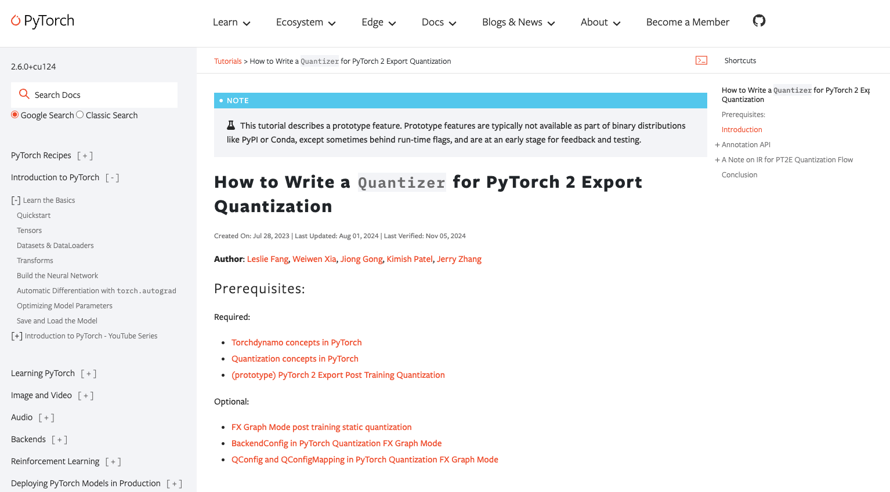
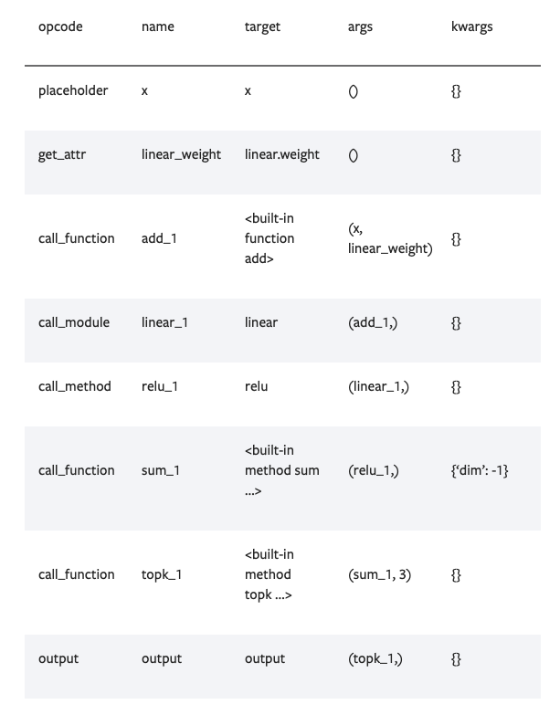
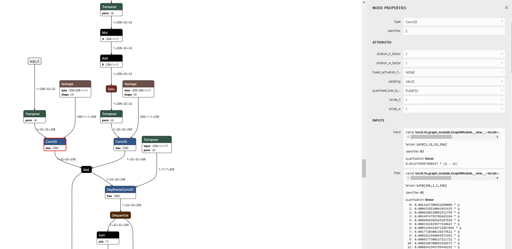
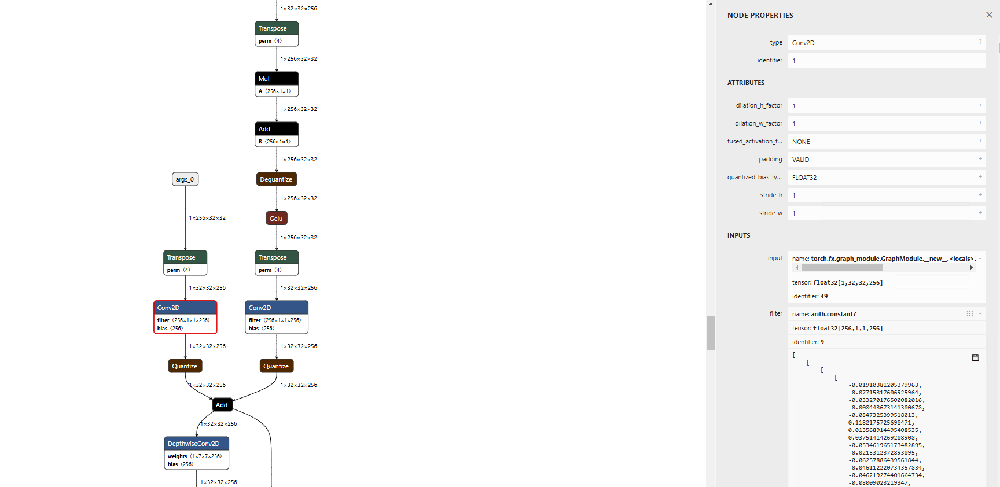
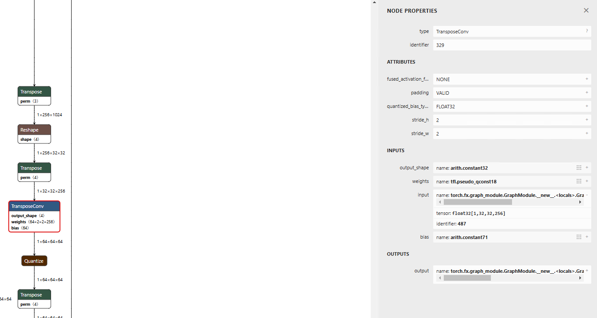
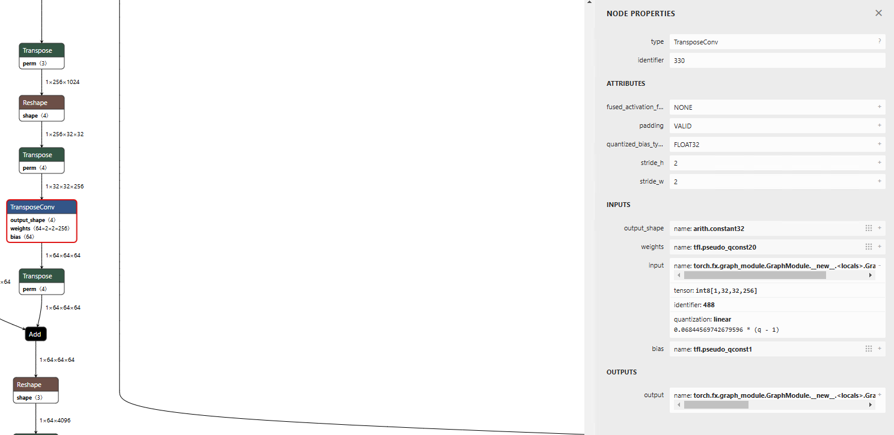

# Quantization with AI Edge Torch

# Quantization with AI Edge Torch

[](/@cochard-dav?source=post_page---byline--1efe17b93cd7---------------------------------------)

[David Cochard](/@cochard-dav?source=post_page---byline--1efe17b93cd7---------------------------------------)

12 min read

·

Apr 15, 2025

--

[Listen](/m/signin?actionUrl=https%3A%2F%2Fmedium.com%2Fplans%3Fdimension%3Dpost_audio_button%26postId%3D1efe17b93cd7&operation=register&redirect=https%3A%2F%2Fmedium.com%2Faxinc-ai%2Fquantization-with-ai-edge-torch-1efe17b93cd7&source=---header_actions--1efe17b93cd7---------------------post_audio_button------------------)

Share

*AI Edge Torch* (`ai-edge-torch` pip package) is a library that lets you convert PyTorch models into a `.tflite` format, enabling you to run those models completely on-device using Tensorflow Lite, or our [*ailia TFLite Runtime*](/axinc-ai/ailia-tflite-runtime-runtime-for-implementing-ai-on-nonos-and-rtos-devices-8b12e412df2b) if the official Tensorflow Lite is not supported.

We already introduced *AI Edge Torch* in the article below.

[## Convert Models From Pytorch to TFLite With AI Edge Torch

### This article explains how AI Edge Torch can be used to convert PyTorch models into .tflite format, which can then be…

medium.com](/axinc-ai/convert-models-from-pytorch-to-tflite-with-ai-edge-torch-0e85623f8d56?source=post_page-----1efe17b93cd7---------------------------------------)

Now let’s focus on quantization.

In `ai-edge-torch`, the Torch graph is quantized using `pt2e` and then converted to TFLite. This article provides a detailed explanation of how quantization is applied to the Torch graph and how it is reflected in the TFLite parameters.

Press enter or click to view image in full size



ai-edge-torch (Source: <https://developers.googleblog.com/ja/ai-edge-torch-high-performance-inference-of-pytorch-models-on-mobile-devices/>)

## Conversion pipeline

Below is an example script for creating a quantized model in ai-edge-torch. A model for quantization is created using `prepare_pt2e`, inference is performed with calibration data, a quantized model is generated using `convert_pt2e`, converted to TFLite with `convert`, and saved with `export`.

```
quantizer = pt2e_quantizer.PT2EQuantizer().set_global(  
    pt2e_quantizer.get_symmetric_quantization_config()  
)  
model = quantize_pt2e.prepare_pt2e(model, quantizer)  
model(torch.from_numpy(img)) # calibration  
model = quantize_pt2e.convert_pt2e(model, fold_quantize=False)  
with_quantizer = ai_edge_torch.convert(  
    model,  
    sample_inputs,  
    quant_config=quant_config.QuantConfig(pt2e_quantizer=quantizer),  
)  
with_quantizer.export("resnet18_int8.tflite")
```

When running `prepare_pt2e, a`static graph is created from Torch’s dynamic graph, calibration is performed on this static graph, then a quantized model is generated with `convert_pt2e`, and a device model is produced through *lowering*.

The *lowering process* refers to transforming a high-level model representation (typically annotated with quantization specs) into a **lower-level Intermediate Representation (IR)** with explicit quantization operations (`Quantize` / `Dequantize`) suitable for deployment on edge devices.



pt2e flow (Source: <https://pytorch.org/tutorials/prototype/pt2e_quant_ptq.html>)

[## (prototype) PyTorch 2 Export Post Training Quantization — PyTorch Tutorials 2.6.0+cu124…

### This tutorial introduces the steps to do post training static quantization in graph mode based on torch.\_export.export…

pytorch.org](https://pytorch.org/tutorials/prototype/pt2e_quant_ptq.html?source=post_page-----1efe17b93cd7---------------------------------------)

When you run `prepare_pt2e` on a Torch graph, an FX graph (static graph) annotated with a `QuantizationSpec` is generated. Although Torch is characterized by its dynamic computation graphs, by using Torch FX, the dynamic graph can be traced and converted into a static graph.

By running inference on the FX graph with calibration data, calibration information such as Min/Max values and histograms for each tensor is generated based on the `QuantizationSpec` and annotations set in `prepare_pt2e`.

When `pt2e_convert` is called, the FX graph is converted into an Exported Program format. The Exported Program is an intermediate representation as shown below.

```
ExportedProgram:  
    class GraphModule(torch.nn.Module):  
        def forward(self, p_mask_downsampler_encoder_0_weight: "f32[4, 1, 3, 3]", p_mask_downsampler_encoder_0_bias: "f32[4]", p_mask_downsampler_encoder_1_weight: "f32[4]", p_mask_downsampler_encoder_1_bias: "f32[4]", p_mask_downsampler_encoder_3_weight: "f32[16, 4, 3, 3]", p_mask_downsampler_encoder_3_bias: "f32[16]", p_mask_downsampler_encoder_4_weight: "f32[16]", p_mask_downsampler_encoder_4_bias: "f32[16]", p_mask_downsampler_encoder_6_weight: "f32[64, 16, 3, 3]", p_mask_downsampler_encoder_6_bias: "f32[64]", p_mask_downsampler_encoder_7_weight: "f32[64]", p_mask_downsampler_encoder_7_bias: "f32[64]", p_mask_downsampler_encoder_9_weight: "f32[256, 64, 3, 3]", p_mask_downsampler_encoder_9_bias: "f32[256]", p_mask_downsampler_encoder_10_weight: "f32[256]", p_mask_downsampler_encoder_10_bias: "f32[256]", p_mask_downsampler_encoder_12_weight: "f32[256, 256, 1, 1]", p_mask_downsampler_encoder_12_bias: "f32[256]", p_pix_feat_proj_weight: "f32[256, 256, 1, 1]", p_pix_feat_proj_bias: "f32[256]", p_fuser_layers_0_dwconv_weight: "f32[256, 1, 7, 7]", p_fuser_layers_0_dwconv_bias: "f32[256]", p_fuser_layers_0_norm_weight: "f32[256]", p_fuser_layers_0_norm_bias: "f32[256]", p_fuser_layers_0_pwconv1_weight: "f32[1024, 256]", p_fuser_layers_0_pwconv1_bias: "f32[1024]", p_fuser_layers_0_pwconv2_weight: "f32[256, 1024]", p_fuser_layers_0_pwconv2_bias: "f32[256]", p_fuser_layers_0_gamma: "f32[256]", p_fuser_layers_1_dwconv_weight: "f32[256, 1, 7, 7]", p_fuser_layers_1_dwconv_bias: "f32[256]", p_fuser_layers_1_norm_weight: "f32[256]", p_fuser_layers_1_norm_bias: "f32[256]", p_fuser_layers_1_pwconv1_weight: "f32[1024, 256]", p_fuser_layers_1_pwconv1_bias: "f32[1024]", p_fuser_layers_1_pwconv2_weight: "f32[256, 1024]", p_fuser_layers_1_pwconv2_bias: "f32[256]", p_fuser_layers_1_gamma: "f32[256]", p_out_proj_weight: "f32[64, 256, 1, 1]", p_out_proj_bias: "f32[64]", b_getattr_l__self_____encoder___0___scale_0__: "f32[4]", b_getattr_l__self_____encoder___0___zero_point_0__: "i64[4]", b__tensor_constant_0: "f32[]", b_getattr_l__self_____encoder___3___scale_0__: "f32[16]", b_getattr_l__self_____encoder___3___zero_point_0__: "i64[16]", b__tensor_constant_1: "f32[]", b_getattr_l__self_____encoder___6___scale_0__: "f32[64]", b_getattr_l__self_____encoder___6___zero_point_0__: "i64[64]", b__tensor_constant_2: "f32[]", b_getattr_l__self_____encoder___9___scale_0__: "f32[256]", b_getattr_l__self_____encoder___9___zero_point_0__: "i64[256]", b__tensor_constant_3: "f32[]", b_getattr_l__self_____encoder___12___scale_0__: "f32[256]", b_getattr_l__self_____encoder___12___zero_point_0__: "i64[256]", b_pix_feat_proj_scale_0: "f32[256]", b_pix_feat_proj_zero_point_0: "i64[256]", b_dwconv_scale_0: "f32[256]", b_dwconv_zero_point_0: "i64[256]", b__tensor_constant_4: "f32[]", b_pwconv1_scale_0: "f32[1024]", b_pwconv1_zero_point_0: "i64[1024]", b_pwconv2_scale_0: "f32[256]", b_pwconv2_zero_point_0: "i64[256]", b_dwconv_scale_1: "f32[256]", b_dwconv_zero_point_1: "i64[256]", b__tensor_constant_5: "f32[]", b_pwconv1_scale_1: "f32[1024]", b_pwconv1_zero_point_1: "i64[1024]", b_pwconv2_scale_1: "f32[256]", b_pwconv2_zero_point_1: "i64[256]", b_out_proj_scale_0: "f32[64]", b_out_proj_zero_point_0: "i64[64]", b__tensor_constant_6: "f32[]", b__tensor_constant_7: "f32[]", b__tensor_constant_8: "f32[]", b__tensor_constant_9: "f32[]", b__tensor_constant0: "f32[32]", pix_feat: "f32[1, 256, 32, 32]", masks: "f32[1, 1, 512, 512]"):  
            # File: <eval_with_key>.110:8 in forward, code: quantize_per_tensor_default = torch.ops.quantized_decomposed.quantize_per_tensor.default(arg1_1, 0.07839307934045792, 0, -128, 127, torch.int8);  arg1_1 = None  
            quantize_per_tensor: "i8[1, 1, 512, 512]" = torch.ops.quantized_decomposed.quantize_per_tensor.default(masks, 0.07839307934045792, 0, -128, 127, torch.int8);  masks = None  
  
            # File: /sam2/modeling/memory_encoder.py:58 in forward, code: return self.encoder(x)  
            dequantize_per_tensor: "f32[1, 1, 512, 512]" = torch.ops.quantized_decomposed.dequantize_per_tensor.default(quantize_per_tensor, 0.07839307934045792, 0, -128, 127, torch.int8);  quantize_per_tensor = None  
...
```

When `convert` is called, the Exported Program format is converted into [*StableHLO* format](https://github.com/openxla/stablehlo) using `torch_xla`. *StableHLO* is an intermediate representation developed by Google, representing High Level Operations (HLO). Next, the *StableHLO* format is converted into MLIR, then into TFLite, and finally a `TFLiteModel` instance is returned.

Press enter or click to view image in full size



StableHLO overview (Source: <https://github.com/openxla/stablehlo>)

Exported Program, StableHLO, and MLIR are all intermediate representations, while TFLite is the lowered model, and they are converted equivalently. Therefore, in theory, the quantization accuracy is determined at the initial`pt2e` stage.

## About pt2e

In AI Edge Torch, quantization is performed using `pt2e` (PyTorch 2 Export), which is the second-generation model exporter in PyTorch. To support various devices, it allows flexible modification of quantization methods from scripts, adapting to device constraints.

Press enter or click to view image in full size



pt2e (Source: <https://pytorch.org/tutorials/prototype/pt2e_quantizer.html>)

[## How to Write a Quantizer for PyTorch 2 Export Quantization — PyTorch Tutorials 2.6.0+cu124…

### (prototype) PyTorch 2 Export Post Training Quantization introduced the overall API for pytorch 2 export quantization…

pytorch.org](https://pytorch.org/tutorials/prototype/pt2e_quantizer.html?source=post_page-----1efe17b93cd7---------------------------------------)

For example, on certain devices, the `zero_point` of an Int8 tensor must be fixed at 0, or asymmetric quantization may not be supported, requiring the use of symmetric quantization instead.

With `pt2e`, by appropriately describing these constraints in scripts as a `QuantizationConfig`, quantization can be performed in a format that meets the device requirements.

In `pt2e`, constraints are specified using `QuantizationSpec` and `Annotations`.

`QuantizationSpec` defines the constraints applied to tensors, such as restrictions on `zero_point` or the quantization method to be used.

```
act_quantization_spec = QuantizationSpec(  
    dtype=torch.int8,  
    quant_min=-128,  
    quant_max=127,  
    qscheme=torch.per_tensor_affine,  
    is_dynamic=False,  
    observer_or_fake_quant_ctr=HistogramObserver.with_args(eps=2**-12),  
)
```

There are also special versions of `QuantizationSpec`, such as `SharedQuantizationSpec`, which imposes the constraint that input and output quantization parameters must match (e.g. for operations like `AveragePooling` or `Concat),` and `DerivedQuantizationSpec`, which imposes constraints like setting the bias scale in a `Conv` operation as the product of the input and weight scales.

Annotations are constraints applied to nodes (operators), where `QuantizationSpec` is assigned to input and output tensors for each node, such as `Conv`.

```
input_qspec_map = {}  
input_act0 = add_node.args[0]  
input_qspec_map[input_act0] = input_act_qspec  
  
input_act1 = add_node.args[1]  
input_qspec_map[input_act1] = input_act_qspec  
  
add_node.meta["quantization_annotation"] = QuantizationAnnotation(  
    input_qspec_map=input_qspec_map,  
    output_qspec=output_act_qspec,  
    _annotated=True,  
)
```

Annotations are applied through pattern matching, and quantization is applied to the nodes that match the pattern. Nodes that are not annotated remain in float.

```
add_partitions = get_source_partitions(gm.graph, [operator.add, torch.add])  
add_partitions = list(itertools.chain(*add_partitions.values()))  
for add_partition in add_partitions:  
    add_node = add_partition.output_nodes[0]  
    # Setting quantization_annotation for add_node
```

## Annotations in AI Edge Torch

Node-specific snnotations are defined using the following code. In this example, when a node’s operator matches `torch.ops.aten.conv2d.default`, constraints are applied via `QuantizationSpec` to input and output tensors, as well as to weights and bias. As a result of the annotation, the lowered internal representation includes Q (Quantize) and DQ (Dequantize) nodes.

```
@register_annotator("conv")  
def _annotate_conv(  
    gm: torch.fx.GraphModule,  
    quantization_config: Optional[QuantizationConfig],  
    filter_fn: Optional[Callable[[Node], bool]] = None,  
) -> Optional[List[List[Node]]]:  
  annotated_partitions = []  
  for n in gm.graph.nodes:  
    if n.op != "call_function" or n.target not in [  
        torch.ops.aten.conv1d.default,  
        torch.ops.aten.conv2d.default,  
        torch.ops.aten.convolution.default,  
    ]:  
      continue  
    conv_node = n  
  
    input_qspec_map = {}  
    input_act = conv_node.args[0]  
    assert isinstance(input_act, Node)  
    input_qspec_map[input_act] = get_input_act_qspec(quantization_config)  
  
    weight = conv_node.args[1]  
    assert isinstance(weight, Node)  
    input_qspec_map[weight] = get_weight_qspec(quantization_config)  
  
    # adding weight node to the partition as well  
    partition = [conv_node, conv_node.args[1]]  
  
    bias = conv_node.args[2] if len(conv_node.args) > 2 else None  
    if isinstance(bias, Node):  
      input_qspec_map[bias] = get_bias_qspec(quantization_config)  
      partition.append(bias)  
  
    if _is_annotated(partition):  
      continue  
  
    if filter_fn and any(not filter_fn(n) for n in partition):  
      continue  
  
    conv_node.meta["quantization_annotation"] = QuantizationAnnotation(  
        input_qspec_map=input_qspec_map,  
        output_qspec=get_output_act_qspec(quantization_config),  
        _annotated=True,  
    )  
    _mark_nodes_as_annotated(partition)  
    annotated_partitions.append(partition)  
  return annotated_partitions
```

[## ai-edge-torch/ai\_edge\_torch/quantize/pt2e\_quantizer\_utils.py at main · google-ai-edge/ai-edge-torch

### Supporting PyTorch models with the Google AI Edge TFLite runtime. …

github.com](https://github.com/google-ai-edge/ai-edge-torch/blob/main/ai_edge_torch/quantize/pt2e_quantizer_utils.py?source=post_page-----1efe17b93cd7---------------------------------------)

In FX graph nodes, the operator of the node is stored in `target`, and the inputs to the node are stored in `args`.



Source: <https://pytorch.org/docs/stable/fx.html>

Annotations are executed within the `annotate` function of the `PT2EQuantizer`, which is passed as an argument to `prepare_pt2e`. Therefore, it is possible to reference the annotations after `prepare_pt2e` has been called.

```
def annotate(self, model: torch.fx.GraphModule) -> torch.fx.GraphModule:  
    """just handling global spec for now"""  
    if self.global_config and not self.global_config.input_activation:  # type: ignore[union-attr]  
      model = self._annotate_for_dynamic_quantization_config(model)  
    else:  
      model = self._annotate_for_static_quantization_config(model)  
    propagate_annotation(model)  
    return model  
  
  def _annotate_all_static_patterns(  
      self,  
      model: torch.fx.GraphModule,  
      quantization_config: Optional[QuantizationConfig],  
      filter_fn: Optional[Callable[[Node], bool]] = None,  
  ) -> torch.fx.GraphModule:  
    if quantization_config is None:  
      return model  
  
    if quantization_config.is_qat:  
      for op in self.STATIC_QAT_ONLY_OPS:  
        OP_TO_ANNOTATOR[op](model, quantization_config, filter_fn)  
    for op in self.STATIC_OPS:  
      OP_TO_ANNOTATOR[op](model, quantization_config, filter_fn)  
    return model
```

[## ai-edge-torch/ai\_edge\_torch/quantize/pt2e\_quantizer.py at main · google-ai-edge/ai-edge-torch

### Supporting PyTorch models with the Google AI Edge TFLite runtime. …

github.com](https://github.com/google-ai-edge/ai-edge-torch/blob/main/ai_edge_torch/quantize/pt2e_quantizer.py?source=post_page-----1efe17b93cd7---------------------------------------)

## Lowering process in AI Edge Torch

As mentioned earlier, the lowering process converts the internal representation into a device-specific model format. In AI Edge Torch, when `convert` is called, the following code converts the Exported Program into *StableHLO*, and then into *MLIR*, which is the internal representation used by TensorFlow.

```
def exported_program_to_mlir(  
    exported_program: torch.export.ExportedProgram,  
    sample_args: tuple[torch.Tensor],  
) -> stablehlo.StableHLOModelBundle:  
  # Setting export_weights to False here so that pytorch/xla avoids copying the  
  # weights to a numpy array which would lead to memory bloat. This means that  
  # the state_dict in the returned bundle is going to be empty.  
  return stablehlo.exported_program_to_stablehlo(  
      exported_program,  
      stablehlo.StableHLOExportOptions(  
          override_tracing_arguments=sample_args, export_weights=False  
      ),  
  )._bundle
```

[## ai-edge-torch/ai\_edge\_torch/lowertools/torch\_xla\_utils.py at main · google-ai-edge/ai-edge-torch

### Supporting PyTorch models with the Google AI Edge TFLite runtime. …

github.com](https://github.com/google-ai-edge/ai-edge-torch/blob/main/ai_edge_torch/lowertools/torch_xla_utils.py?source=post_page-----1efe17b93cd7---------------------------------------)

The return value of a quantized model is a `TfLiteModel`. Since the Exported Program format cannot be used for inference, returning a `TfLiteModel` enables the model to be executed for inference.

```
exported_programs = list(map(_run_convert_passes, exported_programs))  
  tflite_model = lowertools.exported_programs_to_tflite(  
      exported_programs,  
      signatures,  
      quant_config=quant_config,  
      _tfl_converter_flags=_tfl_converter_flags,  
      _saved_model_dir=_saved_model_dir,  
  )  
  
  return model.TfLiteModel(tflite_model)
```

[## ai-edge-torch/ai\_edge\_torch/\_convert/conversion.py at main · google-ai-edge/ai-edge-torch

### Supporting PyTorch models with the Google AI Edge TFLite runtime. — ai-edge-torch/ai\_edge\_torch/\_convert/conversion.py…

github.com](https://github.com/google-ai-edge/ai-edge-torch/blob/main/ai_edge_torch/_convert/conversion.py?source=post_page-----1efe17b93cd7---------------------------------------)

## Graph optimization

Graph optimization is performed at the FX graph stage before it is converted to StableHLO when `convert` is called. Before calling `lowertools`, `_run_convert_passes` is invoked, and the following optimizations are executed.

```
passes = [  
      fx_passes.BuildInterpolateCompositePass(),  
      fx_passes.CanonicalizePass(),  
      fx_passes.OptimizeLayoutTransposesPass(),  
      fx_passes.CanonicalizePass(),  
      fx_passes.BuildAtenCompositePass(),  
      fx_passes.CanonicalizePass(),  
      fx_passes.RemoveNonUserOutputsPass(),  
      fx_passes.CanonicalizePass(),  
  ]  
  
  # Debuginfo is not injected automatically by odml_torch. Only inject  
  # debuginfo via fx pass when using torch_xla.  
  if ai_edge_torch.config.use_torch_xla:  
    passes += [  
        fx_passes.InjectMlirDebuginfoPass(),  
        fx_passes.CanonicalizePass(),  
    ]
```

In the `OptimizerLayoutTransposesPass`, each node is evaluated to determine whether NHWC layout is required, using either the GREEDY or MINCUT algorithm. If necessary, `Transpose` operations are inserted. In the case of MINCUT, when a single tensor is referenced by multiple nodes, `Transpose` operations are inserted at more optimal positions. By default, the algorithm is set to MINCUT, and the operation mode can be configured via the `AIEDGETORCH_LAYOUT_OPTIMIZE_PARTITIONER` environment variable.

[## ai-edge-torch/ai\_edge\_torch/\_convert/fx\_passes/optimize\_layout\_transposes\_pass at main ·…

### Supporting PyTorch models with the Google AI Edge TFLite runtime. …

github.com](https://github.com/google-ai-edge/ai-edge-torch/tree/main/ai_edge_torch/_convert/fx_passes/optimize_layout_transposes_pass?source=post_page-----1efe17b93cd7---------------------------------------)

## AI Edge Torch practical use cases

### Change the quantization settings for specific layers

By calling the `annotate` function of `PT2EQuantizer` defined in ai-edge-torch, an annotation is set in `n.meta["quantization_annotation"]` of the FX graph. By modifying the `input_qspec_map` of this annotation, it is possible to prevent specific layers from being quantized.

Below is an example of creating a `PT2EQuantizer2` class that inherits from `PT2EQuantizer`. The `annotate` function is overridden, and when the node is a `Conv2D`, a float `QuantizationSpec` is created and set to the input nodes of the `quantization_annotation`.

```
class PT2EQuantizer2(pt2e_quantizer.PT2EQuantizer):  
    def annotate(self, model: torch.fx.GraphModule) -> torch.fx.GraphModule:  
        super().annotate(model)  
        for n in model.graph.nodes:  
            if n.target in [torch.ops.aten.conv2d.default]:  
                if "quantization_annotation" in n.meta:  
                    print(n.target)  
                    print("Before")  
                    print(n.meta["quantization_annotation"])  
  
                    from torch.ao.quantization.quantizer import QuantizationSpec  
                    from torch.ao.quantization.observer import PlaceholderObserver  
                    act_observer_or_fake_quant_ctr = PlaceholderObserver  
  
                    float_spec = QuantizationSpec(dtype=torch.float32,  
                        observer_or_fake_quant_ctr=act_observer_or_fake_quant_ctr.with_args(  
                        eps=2**-12  
                    ),)  
  
                    for key in n.meta["quantization_annotation"].input_qspec_map:  
                        n.meta["quantization_annotation"].input_qspec_map[key] = float_spec  
  
                    #n.meta["quantization_annotation"].output_qspec = float_spec  
  
                    print("After")  
                    print(n.meta["quantization_annotation"])  
        return model  
  
quantizer = PT2EQuantizer2().set_global(  
    pt2e_quantizer.get_symmetric_quantization_config()  
)
```

Here is the `QuantizationAnnotation` before and after the change to `Conv2D`.

```
aten.conv2d.default  
Before  
QuantizationAnnotation(input_qspec_map={arg1_1: QuantizationSpec(dtype=torch.int8, observer_or_fake_quant_ctr=functools.partial(<class 'torch.ao.quantization.observer.HistogramObserver'>, eps=0.000244140625){}, quant_min=-128, quant_max=127, qscheme=torch.per_tensor_affine, ch_axis=None, is_dynamic=False), _param_constant0: QuantizationSpec(dtype=torch.int8, observer_or_fake_quant_ctr=functools.partial(<class 'torch.ao.quantization.observer.PerChannelMinMaxObserver'>, eps=0.000244140625){}, quant_min=-127, quant_max=127, qscheme=torch.per_channel_symmetric, ch_axis=0, is_dynamic=False), _param_constant1: None}, output_qspec=QuantizationSpec(dtype=torch.int8, observer_or_fake_quant_ctr=functools.partial(<class 'torch.ao.quantization.observer.HistogramObserver'>, eps=0.000244140625){}, quant_min=-128, quant_max=127, qscheme=torch.per_tensor_affine, ch_axis=None, is_dynamic=False), allow_implicit_sharing=True, _annotated=True)  
After  
QuantizationAnnotation(input_qspec_map={arg1_1: QuantizationSpec(dtype=torch.float32, observer_or_fake_quant_ctr=functools.partial(<class 'torch.ao.quantization.observer.PlaceholderObserver'>, eps=0.000244140625){}, quant_min=None, quant_max=None, qscheme=None, ch_axis=None, is_dynamic=False), _param_constant0: QuantizationSpec(dtype=torch.float32, observer_or_fake_quant_ctr=functools.partial(<class 'torch.ao.quantization.observer.PlaceholderObserver'>, eps=0.000244140625){}, quant_min=None, quant_max=None, qscheme=None, ch_axis=None, is_dynamic=False), _param_constant1: QuantizationSpec(dtype=torch.float32, observer_or_fake_quant_ctr=functools.partial(<class 'torch.ao.quantization.observer.PlaceholderObserver'>, eps=0.000244140625){}, quant_min=None, quant_max=None, qscheme=None, ch_axis=None, is_dynamic=False)}, output_qspec=QuantizationSpec(dtype=torch.int8, observer_or_fake_quant_ctr=functools.partial(<class 'torch.ao.quantization.observer.HistogramObserver'>, eps=0.000244140625){}, quant_min=-128, quant_max=127, qscheme=torch.per_tensor_affine, ch_axis=None, is_dynamic=False), allow_implicit_sharing=True, _annotated=True)
```

Normally, `Conv` is output in Int8.

Press enter or click to view image in full size



Usual export

After rewriting the `quantization_annotation`, the `Conv` will be output in Float.

Press enter or click to view image in full size



Export with Float annotation specified for Conv

In this example, the `output_qspec` remains as Int8 because the layer after `Conv` is expected to operate in Int8. However, if you want the subsequent layer to operate in Float, you can assign `float_spec` to `output_qspec` as well.

```
n.meta["quantization_annotation"].output_qspec = float_spec
```

### Run TransposeConv in Int8

Since `TransposeConv` is not annotated in AI Edge Torch, it is processed in Float. If you want it to be processed in Int8, apply the annotation to the input of `torch.ops.aten.conv_transpose2d.input`.

```
import ai_edge_torch  
  
from ai_edge_torch.quantize import pt2e_quantizer  
from ai_edge_torch.quantize import quant_config  
from torch.ao.quantization import quantize_pt2e  
  
from ai_edge_torch.quantize.pt2e_quantizer_utils import get_input_act_qspec, get_weight_qspec, get_bias_qspec, get_output_act_qspec  
from torch.ao.quantization.quantizer import QuantizationAnnotation  
  
quantization_config = pt2e_quantizer.get_symmetric_quantization_config(is_dynamic=False, is_per_channel=False)  
  
class PT2EQuantizer2(pt2e_quantizer.PT2EQuantizer):  
    def annotate(self, model: torch.fx.GraphModule) -> torch.fx.GraphModule:  
        super().annotate(model)  
  
        for n in model.graph.nodes:  
            if n.target in [torch.ops.aten.conv_transpose2d.input]:  
                input_qspec_map = {}  
  
                input_qspec_map[n.args[0]] = get_input_act_qspec(quantization_config)  
  
                # weightにも制約をかけるとうまくint8に変換できなくなるため、inputにだけ制約をかける  
                #input_qspec_map[n.args[1]] = get_weight_qspec(quantization_config)  
                #input_qspec_map[n.args[2]] = get_bias_qspec(quantization_config)  
  
                n.meta["quantization_annotation"] = QuantizationAnnotation(  
                    input_qspec_map=input_qspec_map,  
                    output_qspec=get_output_act_qspec(quantization_config),  
                    _annotated=True,  
                )  
  
        return model  
  
quantizer = PT2EQuantizer2().set_global(  
    quantization_config  
)
```

Press enter or click to view image in full size



Normal export

Press enter or click to view image in full size



Export with Int8 annotation applied

### Unify quantization parameters across multiple layers

To use the same quantization parameters across multiple layers, use `SharedQuantizationSpec`. Create a `SharedQuantizationSpec` from the source layer, and assign it to the `output_qspec` of the target layers. This allows quantization to be performed using a shared observer.

```
quantization_config = pt2e_quantizer.get_symmetric_quantization_config(is_dynamic=False, is_per_channel=True)  
  
class PT2EQuantizer2(pt2e_quantizer.PT2EQuantizer):  
    def annotate(self, model: torch.fx.GraphModule) -> torch.fx.GraphModule:  
        super().annotate(model)  
  
        target_node = None  
        for n in model.graph.nodes:  
            if str(n.target) == "output":  
                target_node = n.args[0][0]  
  
        for n in model.graph.nodes:  
            if n == target_node:  
                input_qspec_map = {}  
                input_qspec_map[n.args[0]] = get_input_act_qspec(quantization_config)  
                n.meta["quantization_annotation"] = QuantizationAnnotation(  
                    input_qspec_map=input_qspec_map,  
                    output_qspec=get_output_act_qspec(quantization_config),  
                    _annotated=True,  
                )  
  
        return model
```

### Make the model output in Int8

If the layer connected to the model’s output is not annotated, the model output will be in Float. To make the model output Int8, trace back to the input layer connected to the output and apply the appropriate annotation.

```
quantization_config = pt2e_quantizer.get_symmetric_quantization_config(is_dynamic=False, is_per_channel=True)  
  
class PT2EQuantizer2(pt2e_quantizer.PT2EQuantizer):  
    def annotate(self, model: torch.fx.GraphModule) -> torch.fx.GraphModule:  
        super().annotate(model)  
  
        target_node = None  
        for n in model.graph.nodes:  
            if str(n.target) == "output":  
                target_node = n.args[0][0]  
  
        for n in model.graph.nodes:  
            if n == target_node:  
                input_qspec_map = {}  
                input_qspec_map[n.args[0]] = get_input_act_qspec(quantization_config)  
                n.meta["quantization_annotation"] = QuantizationAnnotation(  
                    input_qspec_map=input_qspec_map,  
                    output_qspec=get_output_act_qspec(quantization_config),  
                    _annotated=True,  
                )  
  
        return model
```

The `args` of a node in the FX graph are usually in the form of `(input1, input2)`. However, for operators like `output` or `aten.concat.default`, they are stored in a special format: `([input1, input2], param)`. Therefore, instead of `n.args[0]`, `n.args[0][0]` is used to reference the input node for the `output`.

### Provide Int64 or Bool as the input tensor

If the model’s input tensor is of type Int64 or Bool, a dtype error may occur during quantization.

```
torch._dynamo.exc.TorchRuntimeError: Failed running call_function quantized_decomposed.quantize_per_tensor.default(*(FakeTensor(..., size=(1, 128), dtype=torch.bool), 0.003919653594493866, -128, -128, 127, torch.int8), **{}):  
Expecting input to have dtype torch.float32, but got dtype: torch.bool
```

This happens because the input tensor is connected to an operator like `concat` that undergoes quantization, which leads to an attempt to quantize the input tensor. To avoid this issue, you need to disable quantization for the nodes connected to input tensors of types like Int64 or Bool.

To investigate which node is causing the issue, you can check the Exported Program or inspect the node information during annotation.

```
model = quantize_pt2e.convert_pt2e(model, fold_quantize=False)  
print(model)
```

```
class PT2EQuantizer2(pt2e_quantizer.PT2EQuantizer):  
    def __init__(self, quantization_config):  
        super().__init__()  
        self.quantization_config = quantization_config  
  
    def annotate(self, model: torch.fx.GraphModule) -> torch.fx.GraphModule:  
        super().annotate(model)  
  
        for n in model.graph.nodes:  
            print(n.target, n.name, n.args, "quantization_annotation" in n.meta)
```

Once the problematic node is identified, disable quantization for that node.

```
class PT2EQuantizer2(pt2e_quantizer.PT2EQuantizer):  
    def __init__(self, quantization_config):  
        super().__init__()  
        self.quantization_config = quantization_config  
  
    def annotate(self, model: torch.fx.GraphModule) -> torch.fx.GraphModule:  
        super().annotate(model)  
  
        for n in model.graph.nodes:  
            if n.target in [torch.ops.aten.cat.default]:  
                if "quantization_annotation" in n.meta:  
                    if str(n.args[0][1]) == "arg5_1":  
                        act_observer_or_fake_quant_ctr = PlaceholderObserver  
  
                        float_spec = QuantizationSpec(dtype=torch.float32,  
                            observer_or_fake_quant_ctr=act_observer_or_fake_quant_ctr.with_args(  
                            eps=2**-12  
                        ),)  
  
                        for key in n.meta["quantization_annotation"].input_qspec_map:  
                            n.meta["quantization_annotation"].input_qspec_map[key] = float_spec
```

## Conclusion

We have introduced how AI Edge Torch performs quantization through a path from PyTorch’s dynamic graph, to the static FX graph, then to Exported Program, *StableHLO*, *MLIR*, and finally to TFLite.

It’s an extensive flow, but based on the principle that intermediate representations are transformed equivalently, we can understand that quantization accuracy depends primarily on the annotations and `QuantizationSpecs` applied to the static FX graph. By understanding this internal structure, we can see that there is room for deeper optimization.

---

[ax Inc.](https://axinc.jp/en/) has developed [ailia SDK](https://ailia.jp/en/), which enables cross-platform, GPU-based rapid inference.

ax Inc. provides a wide range of services from consulting and model creation, to the development of AI-based applications and SDKs. Feel free to [contact us](https://axinc.jp/en/) for any inquiry.