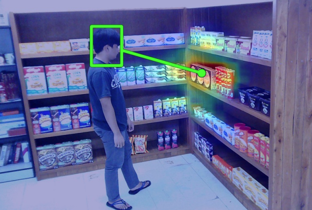
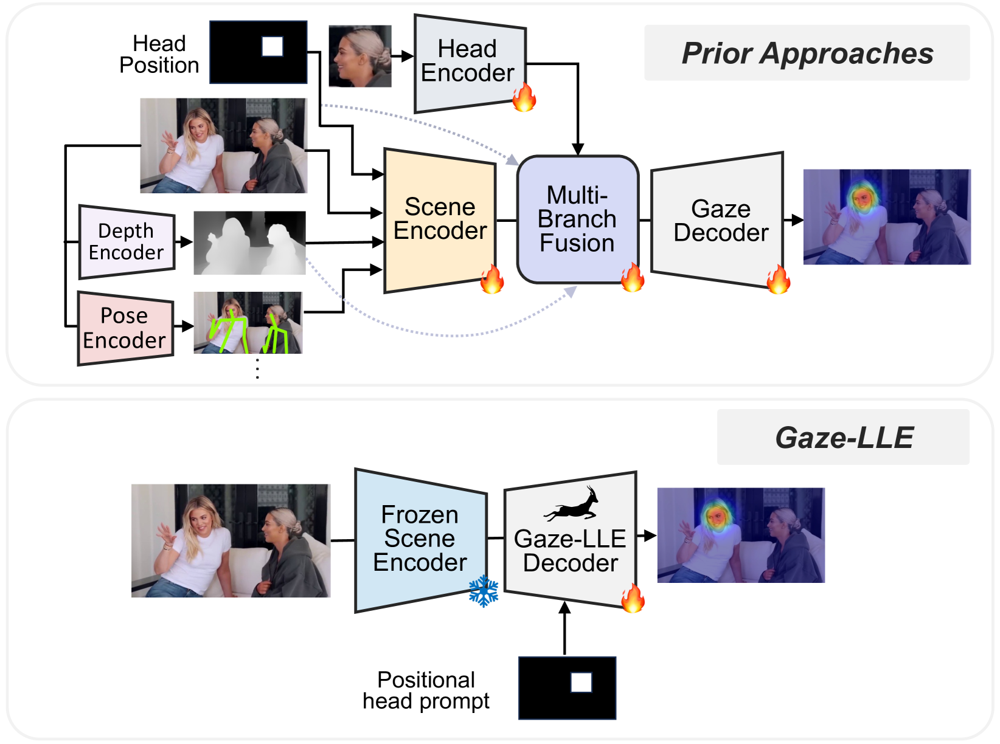
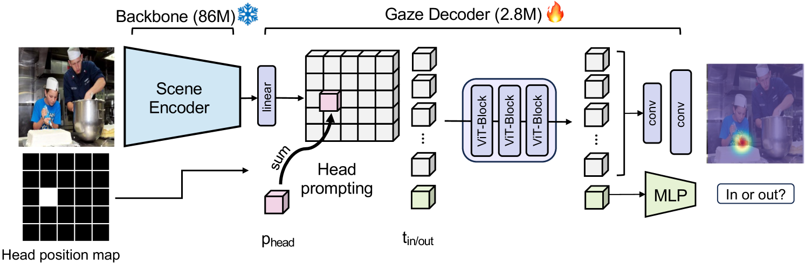

# Gaze-LLE: Gaze Estimation Model Trained on Large-Scale Data

# Gaze-LLE: Gaze Estimation Model Trained on Large-Scale Data

[](/@cochard-dav?source=post_page---byline--7d27848cc6a8---------------------------------------)

[David Cochard](/@cochard-dav?source=post_page---byline--7d27848cc6a8---------------------------------------)

4 min read

·

Apr 25, 2025

--

[Listen](/m/signin?actionUrl=https%3A%2F%2Fmedium.com%2Fplans%3Fdimension%3Dpost_audio_button%26postId%3D7d27848cc6a8&operation=register&redirect=https%3A%2F%2Fmedium.com%2Faxinc-ai%2Fgaze-lle-gaze-estimation-model-trained-on-large-scale-data-7d27848cc6a8&source=---header_actions--7d27848cc6a8---------------------post_audio_button------------------)

Share

This is an introduction to「Gaze-LLE」, a machine learning model that can be used with [ailia SDK](https://ailia.jp/en/). You can easily use this model to create AI applications using [ailia SDK](https://ailia.jp/en/) as well as many other ready-to-use [ailia MODELS](https://github.com/axinc-ai/ailia-models).



## Overview

*Gaze-LLE* is a gaze estimation model released in December 2024 by the *Georgia Institute of Technology* and the *University of Illinois*. It provides four pretrained models. All models take an image and the bounding box of the subject’s head as input. The `vitb14` and `vitl14` models output a heatmap of the gaze target, while the `vitb14_inout` and `vitl14_inout` models additionally estimate the probability that the gaze target is within the image.

[## GitHub — fkryan/gazelle

### Contribute to fkryan/gazelle development by creating an account on GitHub.

github.com](https://github.com/fkryan/gazelle?source=post_page-----7d27848cc6a8---------------------------------------)

[## Gaze-LLE: Gaze Target Estimation via Large-Scale Learned Encoders

### We address the problem of gaze target estimation, which aims to predict where a person is looking in a scene…

arxiv.org](https://arxiv.org/abs/2412.09586?source=post_page-----7d27848cc6a8---------------------------------------)

## Main characteristics

Traditional gaze estimation methods often employed complex architectures combining multiple modules such as scene encoders, head encoders, depth estimation, and pose estimation. However, these approaches posed challenges such as difficulty in training and slow model convergence.

*Gaze-LLE* addresses these issues by using a large-scale foundation model as the encoder and constructing a lightweight decoder. This design significantly simplifies the architecture compared to conventional methods and dramatically improves training efficiency.

Press enter or click to view image in full size



Conventional approaches vs. Gaze-LLE (Source: <https://arxiv.org/abs/2412.09586>)

## Architecture

*Gaze-LLE* performs gaze estimation through the following steps:

First, the input image is passed through a frozen encoder (primarily *DINOv2*) to extract image features. Then, a binary mask generated from the head bounding box is used to add position embeddings to the extracted features. This process produces a feature map focused on the specific person’s head and is referred to as “Head Prompting.”

The resulting image feature map is updated through three Transformer layers. After that, an upsampling operation is performed, and the features are decoded into a gaze target heatmap.

Press enter or click to view image in full size



Gaze-LLE architecture (Source: <https://arxiv.org/abs/2412.09586>)

*Gaze-LLE* adopts a design in which the head bounding box is incorporated after the scene encoder. This approach significantly improves performance compared to conventional methods that combine the bounding box with the input image before feeding it into the scene encoder.

## Performance

*Gaze-LLE* demonstrated strong performance on both the *GazeFollow* and *VideoAttentionTarget* datasets. Notably, despite having one to two orders of magnitude fewer trainable parameters compared to previous studies, it achieved state-of-the-art or near state-of-the-art results on key evaluation metrics.

These results demonstrate that *Gaze-LLE* enables lightweight yet highly accurate gaze estimation.

Press enter or click to view image in full size


Gaze-LLE benchmark (Source: <https://arxiv.org/abs/2412.09586>)

## Reliance on foundation models

*Gaze-LLE* primarily uses *DINOv2*, but it is also compatible with other foundation models. The table below shows the performance when using different pretrained models. Among them, *DINOv2* achieved the highest accuracy as a state-of-the-art feature extraction encoder. [*CLIP*](/axinc-ai/clip-learning-transferable-visual-models-from-natural-language-supervision-4508b3f0ea46)also demonstrated strong performance. Furthermore, as more advanced foundation models are developed in the future, it is expected that the accuracy of gaze estimation using *Gaze-LLE* will further improve.

Press enter or click to view image in full size


Source: <https://arxiv.org/abs/2412.09586>

## Effectiveness of “Head Prompting”

To verify the effectiveness of Head Prompting in *Gaze-LLE*, inference was performed using a model without Head Prompting, and the results were compared.

Press enter or click to view image in full size


Benchmark (Source: <https://arxiv.org/abs/2412.09586>)

As shown in the first row, when there is only one person in the image, accurate gaze estimation was achieved even without Head Prompting. This suggests that the encoder is already capable of detecting the head within the image and leveraging that information.

On the other hand, as seen in the second and third rows, when multiple people are present in the image, the model was observed to estimate the gaze of the wrong individual. This indicates that Head Prompting plays a crucial role in explicitly informing the model whose information should be used for gaze estimation.

## Usage

To use *Gaze-LLE* with ailia SDK, use the command below. By default, the pretrained model `vitl14_inout` is used.

```
python3 gazelle.py --input input.png --savepath output.png
```

To display the gaze estimation results as a heatmap, add the `heatmap` option.

```
python3 gazelle.py --input input.png --headmap
```

[## ailia-models/face\_recognition/gazelle at master · axinc-ai/ailia-models

### The collection of pre-trained, state-of-the-art AI models for ailia SDK — ailia-models/face\_recognition/gazelle at…

github.com](https://github.com/axinc-ai/ailia-models/tree/master/face_recognition/gazelle?source=post_page-----7d27848cc6a8---------------------------------------)

---

[ax Inc.](https://axinc.jp/en/) has developed [ailia SDK](https://ailia.jp/en/), which enables cross-platform, GPU-based rapid inference.

ax Inc. provides a wide range of services from consulting and model creation, to the development of AI-based applications and SDKs. Feel free to [contact us](https://axinc.jp/en/) for any inquiry.