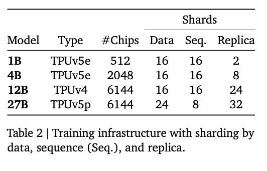
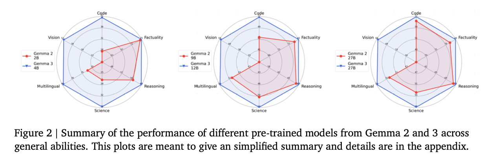
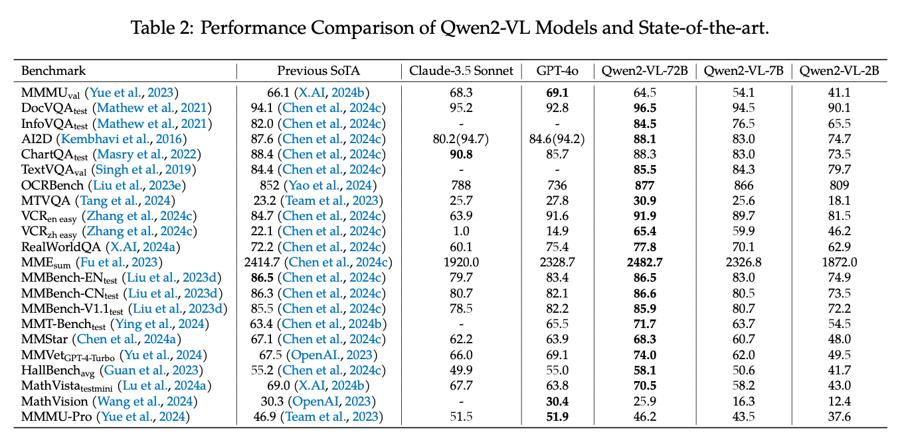
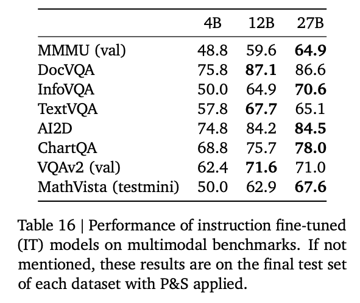
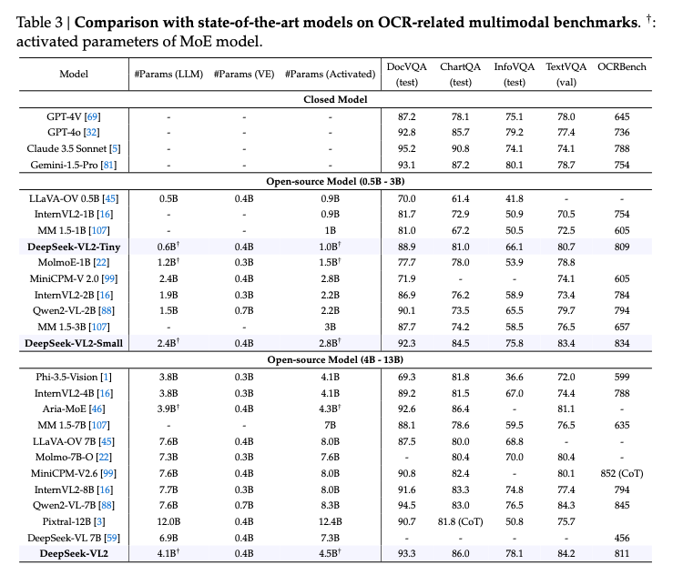

# Gemma3: Local LLM with Multimodal Support

# Gemma3: Local LLM with Multimodal Support

[](/@cochard-dav?source=post_page---byline--40f0ff237e96---------------------------------------)

[David Cochard](/@cochard-dav?source=post_page---byline--40f0ff237e96---------------------------------------)

8 min read

·

May 29, 2025

--

[Listen](/m/signin?actionUrl=https%3A%2F%2Fmedium.com%2Fplans%3Fdimension%3Dpost_audio_button%26postId%3D40f0ff237e96&operation=register&redirect=https%3A%2F%2Fmedium.com%2Faxinc-ai%2Fgemma3-local-llm-with-multimodal-support-40f0ff237e96&source=---header_actions--40f0ff237e96---------------------post_audio_button------------------)

Share

Press enter or click to view image in full size


Source: <https://blog.google/technology/developers/gemma-3/>

## Overview

*Gemma3* is a local LLM released by *Google* on March 12, 2025. It supports 140 languages and is available in 1B, 4B, 12B, and 27B model sizes. *Gemma3* now supports a long context of 128k tokens.

The 27B model of *Gemma3* outperforms *Deepseek-v3* 671B model and offers performance comparable to *Gemini-1.5-Pro*. Additionally, the 4B model of *Gemma3* delivers performance on par with *Gemma2* 27B model.

Press enter or click to view image in full size


ELO Score (Source: <https://blog.google/technology/developers/gemma-3/>)

It’s also multimodal, allowing images to be used as input.


Example of multimodal input (Source: <https://blog.google/technology/developers/gemma-3/>)

Below is the official blog post and technical report.

[## Introducing Gemma 3: The most capable model you can run on a single GPU or TPU

### Today, we’re introducing Gemma 3, our most capable, portable and responsible open model yet.

blog.google](https://blog.google/technology/developers/gemma-3/?source=post_page-----40f0ff237e96---------------------------------------)

## Architecture

### Vision Encoder

*Gemma3* uses *SigLIP* for image encoding. *SigLIP* is a derivative model of [CLIP](/axinc-ai/clip-learning-transferable-visual-models-from-natural-language-supervision-4508b3f0ea46) that replaces CLIP Softmax with a Sigmoid, enabling it to compute probabilities even when only a single text input is provided.

[## Sigmoid Loss for Language Image Pre-Training

### We propose a simple pairwise Sigmoid loss for Language-Image Pre-training (SigLIP). Unlike standard contrastive…

arxiv.org](https://arxiv.org/abs/2303.15343?source=post_page-----40f0ff237e96---------------------------------------)

Images are handled at a fixed resolution of 896x896. When a high-resolution image is provided, average pooling is applied to the encoded result of the high-resolution image, reducing it to a feature vector equivalent to 896x896.

Additionally, for images that are not square in aspect ratio or are high-resolution, an optional pan-and-scan method can be applied. Inspired by [*LLAVA*](/axinc-ai/llava-large-language-model-that-understands-images-57d68c321254), pan-and-scan is a newly proposed technique in *Gemma3* that divides the image into non-overlapping crops of equal size, resizes each crop to 896x896 resolution, encodes them in batch direction, and tokenizes them as multiple images.

This pan-and-scan logic is implemented as described below.

```
def pan_and_scan(  
        self,  
        image: np.ndarray,  
        pan_and_scan_min_crop_size: int,  
        pan_and_scan_max_num_crops: int,  
        pan_and_scan_min_ratio_to_activate: float,  
        data_format: Optional[Union[str, ChannelDimension]] = None,  
        input_data_format: Optional[Union[str, ChannelDimension]] = None,  
    ):  
        """  
        Pan and Scan and image, by cropping into smaller images when the aspect ratio exceeds  
        minumum allowed ratio.  
  
        Args:  
            image (`np.ndarray`):  
                Image to resize.  
            pan_and_scan_min_crop_size (`int`, *optional*):  
                Minimum size of each crop in pan and scan.  
            pan_and_scan_max_num_crops (`int`, *optional*):  
                Maximum number of crops per image in pan and scan.  
            pan_and_scan_min_ratio_to_activate (`float`, *optional*):  
                Minimum aspect ratio to activate pan and scan.  
            data_format (`str` or `ChannelDimension`, *optional*):  
                The channel dimension format of the image. If not provided, it will be the same as the input image.  
            input_data_format (`ChannelDimension` or `str`, *optional*):  
                The channel dimension format of the input image. If not provided, it will be inferred.  
        """  
        height, width = get_image_size(image)  
  
        # Square or landscape image.  
        if width >= height:  
            # Only apply PaS if the image is sufficiently exaggerated  
            if width / height < pan_and_scan_min_ratio_to_activate:  
                return []  
  
            # Select ideal number of crops close to the image aspect ratio and such that crop_size > min_crop_size.  
            num_crops_w = int(math.floor(width / height + 0.5))  # Half round up rounding.  
            num_crops_w = min(int(math.floor(width / pan_and_scan_min_crop_size)), num_crops_w)  
  
            # Make sure the number of crops is in range [2, pan_and_scan_max_num_crops].  
            num_crops_w = max(2, num_crops_w)  
            num_crops_w = min(pan_and_scan_max_num_crops, num_crops_w)  
            num_crops_h = 1  
  
        # Portrait image.  
        else:  
            # Only apply PaS if the image is sufficiently exaggerated  
            if height / width < pan_and_scan_min_ratio_to_activate:  
                return []  
  
            # Select ideal number of crops close to the image aspect ratio and such that crop_size > min_crop_size.  
            num_crops_h = int(math.floor(height / width + 0.5))  
            num_crops_h = min(int(math.floor(height / pan_and_scan_min_crop_size)), num_crops_h)  
  
            # Make sure the number of crops is in range [2, pan_and_scan_max_num_crops].  
            num_crops_h = max(2, num_crops_h)  
            num_crops_h = min(pan_and_scan_max_num_crops, num_crops_h)  
            num_crops_w = 1  
  
        crop_size_w = int(math.ceil(width / num_crops_w))  
        crop_size_h = int(math.ceil(height / num_crops_h))  
  
        # Don't apply PaS if crop size is too small.  
        if min(crop_size_w, crop_size_h) < pan_and_scan_min_crop_size:  
            return []  
  
        crop_positions_w = [crop_size_w * i for i in range(num_crops_w)]  
        crop_positions_h = [crop_size_h * i for i in range(num_crops_h)]  
  
        if input_data_format == ChannelDimension.LAST:  
            image_crops = [  
                image[pos_h : pos_h + crop_size_h, pos_w : pos_w + crop_size_w]  
                for pos_h, pos_w in itertools.product(crop_positions_h, crop_positions_w)  
            ]  
        else:  
            image_crops = [  
                image[:, pos_h : pos_h + crop_size_h, pos_w : pos_w + crop_size_w]  
                for pos_h, pos_w in itertools.product(crop_positions_h, crop_positions_w)  
            ]  
  
        return image_crops
```

[## transformers/src/transformers/models/gemma3/image\_processing\_gemma3.py at…

### 🤗 Transformers: State-of-the-art Machine Learning for Pytorch, TensorFlow, and JAX. …

github.com](https://github.com/huggingface/transformers/blob/9be4728af8bec48073ae841881d7f4e2ac3521d1/src/transformers/models/gemma3/image_processing_gemma3.py?source=post_page-----40f0ff237e96---------------------------------------#L132)

The tokens encoded from the crops are arranged in the prompt as shown below.

```
image_inputs = {}  
        if images is not None:  
            batched_images = make_nested_list_of_images(images)  
            image_inputs = self.image_processor(batched_images, **output_kwargs["images_kwargs"])  
  
            # Create empty text to be replaced with placeholders  
            if not text:  
                text = [" ".join([self.boi_token] * len(images)) for images in batched_images]  
  
            if len(batched_images) != len(text):  
                raise ValueError(  
                    f"Received inconsistently sized batches of images ({len(batched_images)}) and text ({len(text)})."  
                )  
  
            # Replace image tokens by the full expanded sequence  
            batch_num_crops = to_py_obj(image_inputs.pop("num_crops"))  
            for batch_idx, (prompt, images, num_crops) in enumerate(zip(text, batched_images, batch_num_crops)):  
                image_indexes = [m.start() for m in re.finditer(self.boi_token, prompt)]  
  
                if len(images) != len(image_indexes):  
                    raise ValueError(  
                        f"Prompt contained {len(image_indexes)} image tokens but received {len(images)} images."  
                    )  
  
                # Insert additional image tokens for Pan-and-Scan crops  
                for num, idx in reversed(list(zip(num_crops, image_indexes))):  
                    if num:  
                        formatted_image_text = (  
                            f"Here is the original image {self.boi_token} and here are some crops to help you see better "  
                            + " ".join([self.boi_token] * num)  
                        )  
                        prompt = prompt[:idx] + formatted_image_text + prompt[idx + len(self.boi_token) :]  
                        text[batch_idx] = prompt  
  
            # Expand placeholder image tokens to the full image token sequence  
            text = [prompt.replace(self.boi_token, self.full_image_sequence) for prompt in text]
```

[## transformers/src/transformers/models/gemma3/processing\_gemma3.py at…

### 🤗 Transformers: State-of-the-art Machine Learning for Pytorch, TensorFlow, and JAX. …

github.com](https://github.com/huggingface/transformers/blob/9be4728af8bec48073ae841881d7f4e2ac3521d1/src/transformers/models/gemma3/processing_gemma3.py?source=post_page-----40f0ff237e96---------------------------------------#L116)

The model size of the Vision Encoder is fixed at 417M parameters.


Parameter count for each model (Source: <https://blog.google/technology/developers/gemma-3/>)

### Long Context

When extending to a 128k long context, there is a problem of enormous memory consumption for the KV cache.

KV cache is an algorithm that reduces computation by storing the Q and K from attention, as well as the result of the QK and V dot product. While *DeepSeek* adopts a method of compressing this KV cache, *Gemma3* controls memory usage by dividing attention into global and local attention, and maintaining a token length of 1024 for local attention.

Press enter or click to view image in full size


KV cache (Source: <https://www.youtube.com/watch?app=desktop&v=0VLAoVGf_74>)

To support long context, the frequency of ROPE used for encoding positional information in local attention is set to 10k, while the frequency for global attention is increased to 1M.

### Tokenizer

The tokenizer is the same as in *Gemma2*. It is a *SentencePiece* tokenizer that performs number splitting, whitespace preservation, and byte-level encoding, with a vocabulary of 262,000. This tokenizer provides a more balanced performance for languages other than English.

### Training

The 27B model is trained on 14T tokens, the 12B model on 12T tokens, the 4B model on 4T tokens, and the 1B model on 2T tokens. Like *Gemma2*, *Gemma3* uses distillation, training to match the token probability distributions of a larger model.

For training, instead of NVIDIA GPUs, *Google* used their custom-developed ASICs TPUv4, TPUv5e, and TPUv5p.



Training infra (Source: <https://storage.googleapis.com/deepmind-media/gemma/Gemma3Report.pdf>)

### Quantization

*Gemma3* officially provides quantized models. QAT (Quantization Aware Training) is used to create these models, and the models are fine-tuned in the process. In QAT, 5,000 training steps are performed to match the probability distributions of pre-training and post-training.

## Performance

*Gemma3* significantly outperforms *Gemma2*, and its 27B model delivers higher performance than *Gemini 1.5 Flash*.

Press enter or click to view image in full size


Benchmark (Source: <https://storage.googleapis.com/deepmind-media/gemma/Gemma3Report.pdf>)

*Gemma3* surpasses *Gemma2* in every metric.

Press enter or click to view image in full size



Benchmark (Source: <https://storage.googleapis.com/deepmind-media/gemma/Gemma3Report.pdf>)

## Comparison with Qwen2VL

Here is a comparison of the scores for *DocVQA*, a dataset for questions about text and tables, *InfoVQA*, a dataset for questions about infographic, and *TextVQA*, a dataset for questions about natural images.

In terms of multimodal performance, *Qwen2-VL* demonstrates higher performance.

Press enter or click to view image in full size


Examples from each dataset are shown below.

Press enter or click to view image in full size


Sample from DocVQA (Source: <https://arxiv.org/abs/2007.00398>)

Press enter or click to view image in full size


Sample from InfoVQA (Source: <https://arxiv.org/abs/2104.12756>)


Sample from TextVQA (Source: <https://arxiv.org/abs/1904.08920>)

Here is the source data for the graph.

Press enter or click to view image in full size



Qwen2VL (Source: <https://arxiv.org/abs/2409.12191>)



Gemma3 (Source: <https://storage.googleapis.com/deepmind-media/gemma/Gemma3Report.pdf>)

Press enter or click to view image in full size



DeepSeek VL2 (Source: <https://arxiv.org/abs/2412.10302>)

## llama.cpp support

Quantized models for llama.cpp are available at the link below.

[## ggml-org (ggml.ai)

### Org profile for ggml.ai on Hugging Face, the AI community building the future.

huggingface.co](https://huggingface.co/ggml-org?source=post_page-----40f0ff237e96---------------------------------------)

llama.cpp supports *Gemma3* starting from version b4875.

[## Release b4875 · ggml-org/llama.cpp

### LLM inference in C/C++. Contribute to ggml-org/llama.cpp development by creating an account on GitHub.

github.com](https://github.com/ggml-org/llama.cpp/releases/tag/b4875?source=post_page-----40f0ff237e96---------------------------------------)

llama.cpp also supports image input through the following PR.

[## clip : Experimental support for Gemma 3 vision by ngxson · Pull Request #12344 · ggml-org/llama.cpp

### What is this? Follow up the text-only PR: #12343 Note: Vision capability is available on these model sizes: 4b, 12b and…

github.com](https://github.com/ggml-org/llama.cpp/pull/12344?source=post_page-----40f0ff237e96---------------------------------------)

## ailia LLM support

*ailia LLM* is a library that enables the use of llama.cpp from Flutter and Unity. It has supported *Gemma3* since version 1.3.1.

[## ailia LLM: Implementation of LLM on Edge Devices

### This is an introduction to ailia LLM, a library for implementing LLM on edge devices including Android and iOS.

medium.com](/axinc-ai/ailia-llm-implementation-of-llm-on-edge-devices-c721de6aeef8?source=post_page-----40f0ff237e96---------------------------------------)

The method for running it in Python is shown below. It works on macOS, Windows, and Linux. The initial run involves downloading a 4GB model, which may take some time.

```
pip3 install ailia-llm
```

```
import ailia_llm  
  
import os  
import urllib.request  
  
model_file_path = "gemma-3-4b-it-Q4_K_M.gguf"  
if not os.path.exists(model_file_path):  
 print("begin model download")  
 urllib.request.urlretrieve(  
  "https://storage.googleapis.com/ailia-models/gemma/gemma-3-4b-it-Q4_K_M.gguf",  
  model_file_path  
 )  
 print("end model download")  
  
model = ailia_llm.AiliaLLM()  
model.open(model_file_path)  
  
messages = []  
messages.append({"role": "system", "content": "語尾に「わん」をつけてください。"})  
messages.append({"role": "user", "content": "あなたの名前は何ですか？"})  
  
stream = model.generate(messages)  
  
text = ""  
for delta_text in stream:  
 text = text + delta_text  
print(text)  
  
if model.context_full():  
 raise Exception("Context full")  
  
messages.append({"role": "assistant", "content": text})
```

[## ailia LLM : エッジデバイスにLLMを実装できるライブラリ

### エッジデバイスにLLMを実装するためのライブラリであるailia LLMの紹介です。

medium.com](/axinc/ailia-llm-%E3%82%A8%E3%83%83%E3%82%B8%E3%83%87%E3%83%90%E3%82%A4%E3%82%B9%E3%81%ABllm%E3%82%92%E5%AE%9F%E8%A3%85%E3%81%A7%E3%81%8D%E3%82%8B%E3%83%A9%E3%82%A4%E3%83%96%E3%83%A9%E3%83%AA-45bc982d0f3f?source=post_page-----40f0ff237e96---------------------------------------)

## ailia DX Insight support

*ailia DX Insight* is a GUI tool that allows local LLMs to be run easily. Support for *Gemma3* has been available since the beta version of *ailia DX Insight* 1.2.1.

[## ailia DX Insight ｜ailia AI Series

### Document search, translation, meeting minutes, and image generation too! Make AI your everyday work partner. This…

ailia.ai](https://ailia.ai/en/dx/?source=post_page-----40f0ff237e96---------------------------------------)

---

[ax Inc.](https://axinc.jp/en/) has developed [ailia SDK](https://ailia.jp/en/), which enables cross-platform, GPU-based rapid inference.

ax Inc. provides a wide range of services from consulting and model creation, to the development of AI-based applications and SDKs. Feel free to [contact us](https://axinc.jp/en/) for any inquiry.