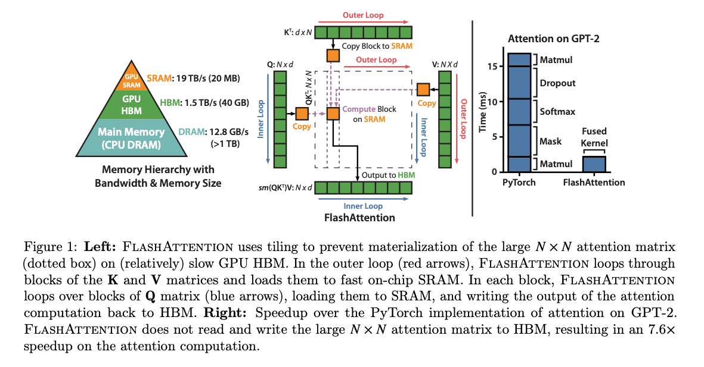
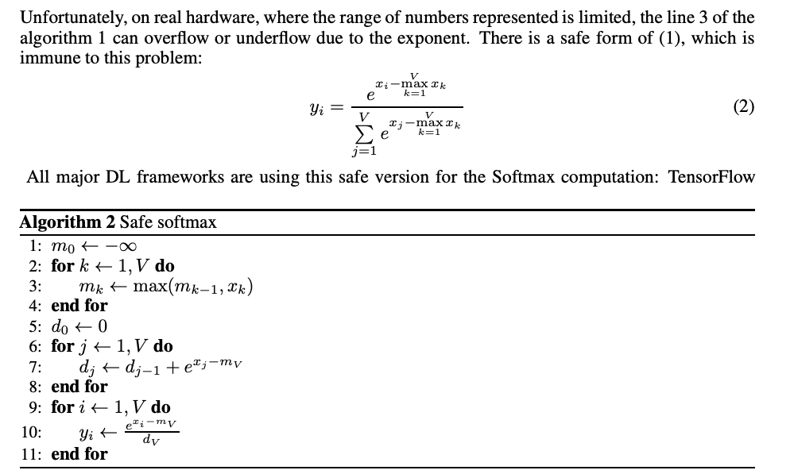
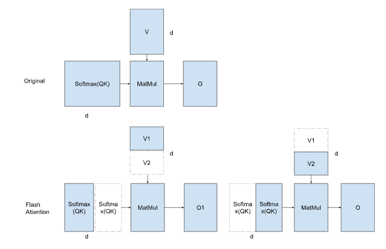

# Flash Attention: Improve the Efficiency of Transformer Models

# Flash Attention: Improve the Efficiency of Transformer Models

[David Cochard](/@cochard-dav?source=post_page---byline--482523eb7a64---------------------------------------)

7 min read

·

Jun 11, 2025

--

[Listen](/m/signin?actionUrl=https%3A%2F%2Fmedium.com%2Fplans%3Fdimension%3Dpost_audio_button%26postId%3D482523eb7a64&operation=register&redirect=https%3A%2F%2Fmedium.com%2Faxinc-ai%2Fflash-attention-improve-the-efficiency-of-transformer-models-482523eb7a64&source=---header_actions--482523eb7a64---------------------post_audio_button------------------)

Share

This is an introduction to Flash Attention, an algorithm that accelerates Attention by reducing memory bandwidth usage.

---

## Overview

Flash Attention was introduced in May 2022 by a research group at Stanford University.

[## FlashAttention: Fast and Memory-Efficient Exact Attention with IO-Awareness

### Transformers are slow and memory-hungry on long sequences, since the time and memory complexity of self-attention are…

arxiv.org](https://arxiv.org/abs/2205.14135?source=post_page-----482523eb7a64---------------------------------------)

In recent years, GPUs have seen a dramatic improvement in matrix multiplication performance thanks to components like Tensor Cores. However, there is a challenge in that the speed of memory, such as High Bandwidth Memory (HBM) where tensors are stored, has not improved much. As a result, the actual performance of AI workloads tends to be lower than the theoretical FLOPS listed in specifications.

Flash Attention addresses this issue by utilizing the Static Random-Access Memory (SRAM) within the GPU to improve computation speed. SRAM is significantly faster than HBM, but it has a much smaller capacity. While HBM may have around 40GB, SRAM typically only has about 20MB.

Press enter or click to view image in full size

Source: <https://arxiv.org/abs/2205.14135>

Flash Attention reduces access to HBM by dividing the Attention computation into tiles. It is mathematically equivalent to standard Attention, and when executed with sufficient numerical precision, the error remains very small.

## About Attention

Attention is a method in Transformers that helps each word in a sentence focus on other relevant words when understanding or generating language. It takes *Query*, *Key*, and *Value* tensors as input and produces an output tensor through matrix multiplication and *Softmax*.

There are two types of Attention: *Self Attention*, where the *Query*, *Key*, and *Value* are the same tensor, and *Cross Attention,* where they are different tensors. Both *Self Attention* and *Cross Attention* are generalized as `scaled_dot_product_attention`.

Scaled Dot Product Attention (Source: <https://arxiv.org/pdf/1706.03762v7>)

[## torch.nn.functional.scaled\_dot\_product\_attention — PyTorch 2.7 documentation

### Read the PyTorch Domains documentation to learn more about domain-specific libraries

docs.pytorch.org](https://docs.pytorch.org/docs/stable/generated/torch.nn.functional.scaled_dot_product_attention.html?source=post_page-----482523eb7a64---------------------------------------)

Let’s take a closer look at the computation. The process begins by performing a matrix multiplication of the *Query* and *Key*, followed by applying *Softmax*, and then multiplying by the *Value*. Taking the dot product of the *Query* and *Key* is equivalent to computing the cosine similarity between them. Applying *Softmax* to the matrix product of *Query* and *Key* normalizes the values into probabilities between 0 and 1, allowing us to determine which elements of the *Key* are most similar to the *Query*. Finally, multiplying by the *Value* and summing with weights based on similarity extracts the *Value* corresponding to the *Key*.

This is similar to a differentiable table lookup. If *Softmax* were replaced with *Max*, the computation would instead search for the *Key* most similar to the *Query* and return the corresponding *Value*.

## Memory access with Attention

In general, *Query (Q), Key (K)*, and *Value (V)* are large tensors. The result of the matrix multiplication between Q and K is also a large tensor. Therefore, Q, K, and V cannot be stored in SRAM and must be read directly from HBM.

Specifically, the naive implementation of Attention involves the following steps:

- Q and K are read from HBM, their matrix product is computed, and the result is written to HBM.
- The result is read from HBM, *Softmax* is applied, and the output is written back to HBM.
- The *Softmax* result and V are read from HBM, their matrix product is computed, and the final result is written to HBM.

In total, the Attention computation involves three reads from HBM and three writes to HBM.

## Tiling in Flash Attention

In Flash Attention, Q and K are transferred from HBM to SRAM in tiles. A matrix multiplication of Q and K is performed, followed by applying *Softmax*, then computing the matrix multiplication with V, and writing the result back to HBM.

From the second tile onward, the result of the previous V matrix multiplication is retrieved from HBM, scaled appropriately, and the result of the current tile’s V matrix multiplication is added to it.

This reduces memory access to just two reads from HBM and one write to HBM.

The key point of Flash Attention is that it also splits along the dimension *d*, which is the dimension used in *Softmax*. Traditionally, it was believed that Attention could not be tiled because *d* could not be split. This is because *Softmax* computes a distribution over all *d* values in the input tensor, and the calculation cannot proceed until all *d* values are available.

Flash Attention overcomes this by extending the concept of *Online Softmax*. It performs a dot product with V using a provisional distribution calculated without having all *d* values. Then, in the next tile, it corrects the previous dot product result and performs a read-modify-write operation to reconcile the final output.

## Closer look at Online Softmax

Since Flash Attention is an extension of *Online Softmax*, let’s look at the later more closely.

[## Online normalizer calculation for softmax

### The Softmax function is ubiquitous in machine learning, multiple previous works suggested faster alternatives for it…

arxiv.org](https://arxiv.org/abs/1805.02867?source=post_page-----482523eb7a64---------------------------------------)

*Softmax* is expressed by the following formula. It computes the sum of the exponentials of the input tensor and then divides each exponential by this total sum.

Press enter or click to view image in full size

However, since the exponential function grows rapidly, it can diverge toward infinity. To address this, *Safe Softmax* is used. In *Safe Softmax*, the maximum value of the input tensor is subtracted before applying the exponential function. This shifts the inputs into the negative range, keeping the exponential values within the range of 0 to 1 and preventing divergence to infinity.

Press enter or click to view image in full size

With *Safe Softmax*, three memory reads are required. One to compute the maximum value of the input tensor, one to calculate the sum of the exponentials after subtracting the maximum, and one to perform the division by the sum.

In *Online Softmax*, the maximum value and the sum of exponentials are computed simultaneously, allowing the process to be completed with just two memory accesses.

Press enter or click to view image in full size

This works by first computing the sum of exponentials using a provisional maximum value, called *before\_max*. When the true maximum, *after\_max*, is later determined, the difference between them (*after\_max — before\_max*) is used to correct the result.

Provisional value: *exp(x — before\_max)*  
 True value: *exp(x — after\_max)*  
 Recovery from provisional: *exp(x — before\_max) \* exp(before\_max — after\_max)*

## Applying Online Softmax to Flash Attention

*Online Softmax* performs corrections on an element-wise basis, but in Flash Attention, corrections are applied on a tile-by-tile basis. Suppose the inner product of *Softmax* and V in the previous tile was calculated using *before\_max*, and in the current tile *after\_max* is updated. In that case, the previous result is corrected by multiplying it with *exp(before\_max — after\_max)*.

If there is no difference between *before\_max* and *after\_max*, the correction factor is 1. If *after\_max* is larger, the correction factor becomes a value less than 1.

For example, in the previous tile, if the correct maximum had been used, the probabilities multiplied with V should have ranged from 0 to 0.4. However, because they were calculated using a provisional maximum, the probabilities ranged from 0 to 1.0. Therefore, to adjust to the correct values, the previous result is multiplied by both *exp(before\_max — after\_max)* and *before\_sum / after\_sum*.

Conceptual Diagram of Flash Attention

Provisional value:  
 *exp(x — before\_max) / before\_sum \* V1*

True value:  
 *exp(x — after\_max) / after\_sum \* V1 + exp(x — after\_max) / after\_sum \* V2*

Recovery from provisional:  
 *exp(x — before\_max) / before\_sum \* V1 \* exp(before\_max — after\_max) \* (before\_sum / after\_sum) + exp(x — after\_max) / after\_sum \* V2*

This can be formalized as follows:

Press enter or click to view image in full size

Flash Attention (Source: <https://arxiv.org/pdf/2205.14135>)

## Performance gain

Flash Attention achieves approximately 2× speedup in inference on the T4 (with no masking and no dropout).

Press enter or click to view image in full size

Source: <https://arxiv.org/pdf/2205.14135>

## Conclusion

By extending *Online Softmax* to work with tiles, Flash Attention enables tiling of Attention computations, thereby reducing memory access to HBM. Flash Attention can be applied not only to HBM but to any hardware architecture that combines slow and fast memory. It is especially effective for large tensor sizes that cannot fully fit into fast memory, offering significant speedups in such cases

---

[ax Inc.](https://axinc.jp/en/) has developed [ailia SDK](https://ailia.jp/en/), which enables cross-platform, GPU-based rapid inference.

ax Inc. provides a wide range of services from consulting and model creation, to the development of AI-based applications and SDKs. Feel free to [contact us](https://axinc.jp/en/) for any inquiry.