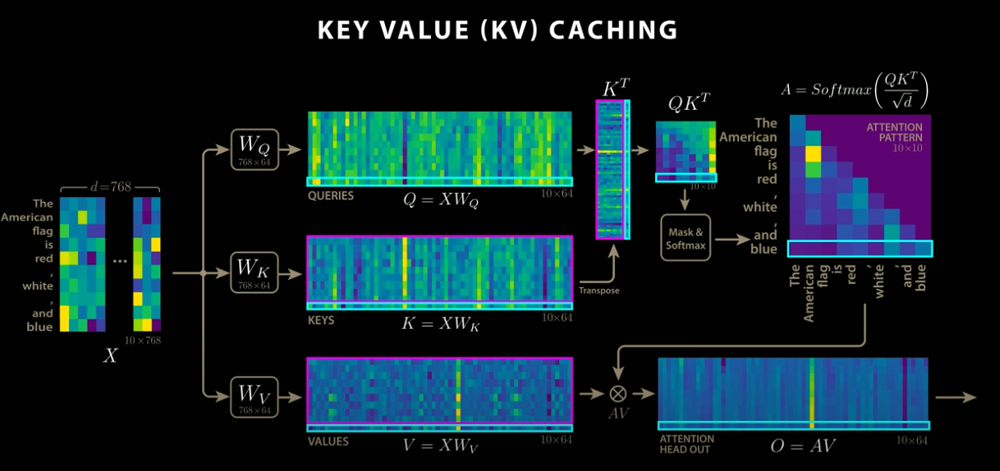
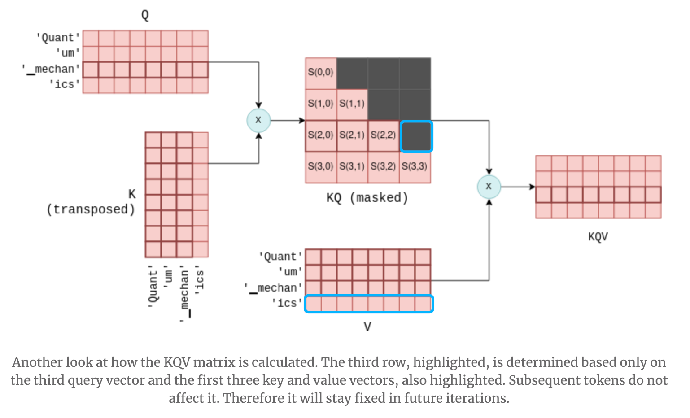

# KVCache: Speed Up Processing by Caching the Results of Attention Calculations

# KVCache: Speed Up Processing by Caching the Results of Attention Calculations

[David Cochard](/@cochard-dav?source=post_page---byline--be291d705253---------------------------------------)

3 min read

·

Jun 12, 2025

--

[Listen](/m/signin?actionUrl=https%3A%2F%2Fmedium.com%2Fplans%3Fdimension%3Dpost_audio_button%26postId%3Dbe291d705253&operation=register&redirect=https%3A%2F%2Fmedium.com%2Faxinc-ai%2Fkvcache-speed-up-processing-by-caching-the-results-of-attention-calculations-be291d705253&source=---header_actions--be291d705253---------------------post_audio_button------------------)

Share

KVCache is a technique that accelerates Transformers by caching the results of Attention calculations.

In language models using Transformers, the output token from the current inference is concatenated with the input tokens and reused as the input tokens for the next inference. Therefore, in the (N+1)th inference, the N tokens are exactly the same as in the previous inference, with only one new token added.

KVCache stores the reusable computation results from the current inference and loads them for use in the next inference. As a result, unlike typical caches, cache misses do not occur.

## Standard Attention

In Attention, the output is computed by multiplying *Query (Q)* and *Key (K)* to obtain QK, applying *Softmax*, and then performing a matrix multiplication with *Value (V)*. When decoding N tokens has been completed and the (N+1)th token is inferred, the column size of the QK matrix becomes (N+1). As a result, the processing time increases as decoding progresses.

Press enter or click to view image in full size

Standard Attention (Source: <https://www.youtube.com/watch?app=desktop&v=0VLAoVGf_74>)

## Attention with KVCache

When using KVCache, the result of the previous Q and K matrix multiplication is cached in VRAM, and only the matrix multiplication for the newly added token is computed. This result is then integrated with the previously cached result. As a result, only the newly added token needs to be processed, leading to faster performance

Press enter or click to view image in full size

KVCache implementation (Source: <https://www.youtube.com/watch?app=desktop&v=0VLAoVGf_74>)

When a new token is added to Q and K, it may seem that not only the bottom row but also the rightmost column of QK would change. However, in Transformers, future tokens are masked to prevent them from being referenced, so only the bottom row of QK is updated. As a result, only the bottom row of QKV is also updated, and KVCache functions correctly even when multiple Attention layers are stacked.

Press enter or click to view image in full size

KQ masking (Source: <https://blog.csdn.net/taoqick/article/details/137476233>)

## KVCache performance

Without KVCache, the processing time increases non-linearly with the length of the input tokens. By using KVCache, the processing time can be made linear with respect to the number of input tokens.

Press enter or click to view image in full size

Source: <https://www.youtube.com/watch?app=desktop&v=0VLAoVGf_74>

## Other applications of KVCache

In addition to accelerating Transformer decoding, KVCache is also used for prompt caching in LLMs. Prompt caching enables fast execution of multiple different questions on the same context by storing and reusing the KVCache.

Moreover, as a variation of RAG, a method called CAG (Cache-Augmented Generation) has been proposed. It speeds up RAG by caching entire context documents into KVCache.

Source: <https://arxiv.org/pdf/2412.15605>

[## Don’t Do RAG: When Cache-Augmented Generation is All You Need for Knowledge Tasks

### Retrieval-augmented generation (RAG) has gained traction as a powerful approach for enhancing language models by…

arxiv.org](https://arxiv.org/abs/2412.15605?source=post_page-----be291d705253---------------------------------------)

## Challenges of KVCache

KVCache stores the results of matrix multiplications in VRAM, which leads to a significant increase in VRAM usage. To address this issue, DeepSeek has introduced a technique that compresses the KVCache.

Press enter or click to view image in full size

KVCache compression (Source: <https://www.youtube.com/watch?app=desktop&v=0VLAoVGf_74>)

KVCache optimization in DeepSeek

---

[ax Inc.](https://axinc.jp/en/) has developed [ailia SDK](https://ailia.jp/en/), which enables cross-platform, GPU-based rapid inference.

ax Inc. provides a wide range of services from consulting and model creation, to the development of AI-based applications and SDKs. Feel free to [contact us](https://axinc.jp/en/) for any inquiry.