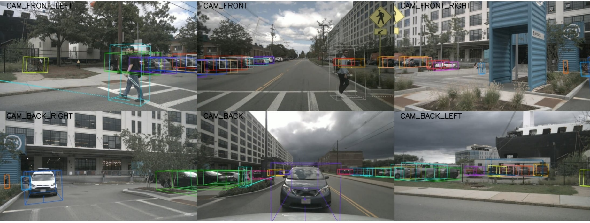
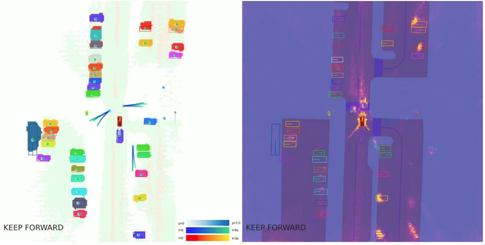
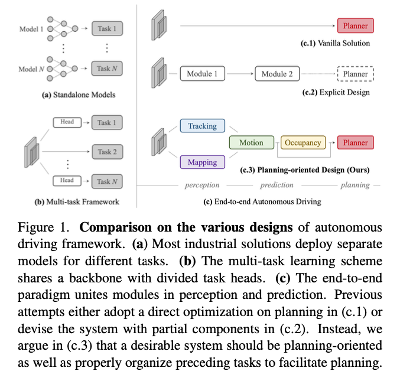
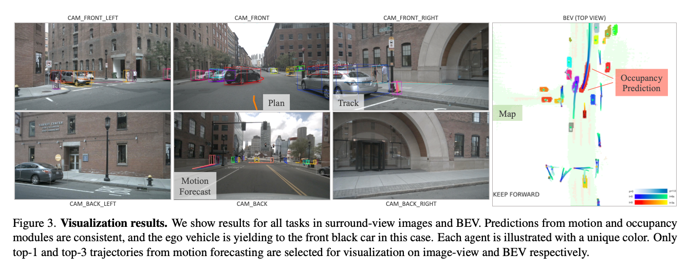
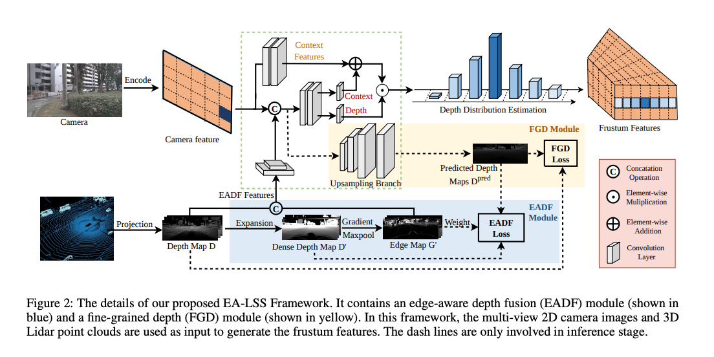
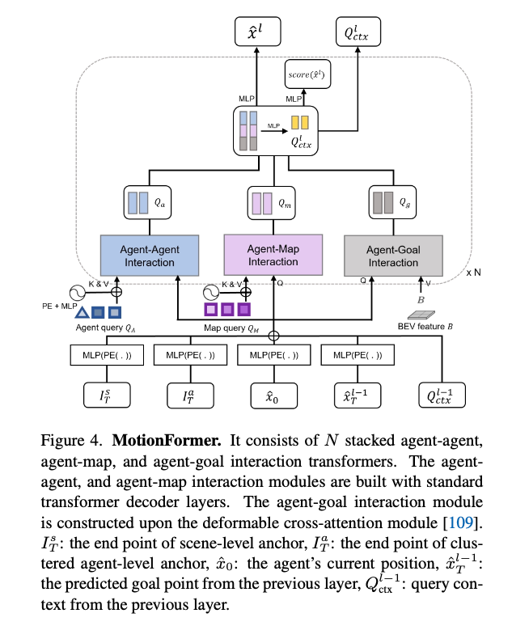
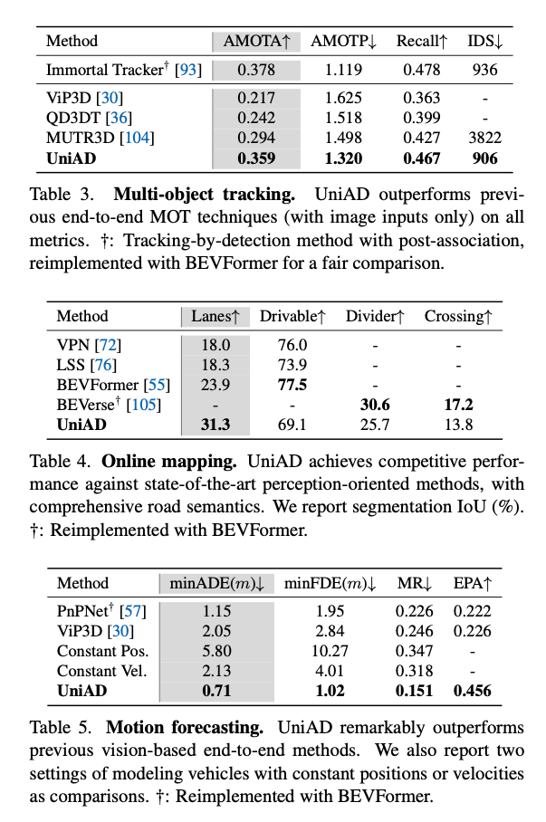

# UniAD: Foundational Model for End-to-End Autonomous Driving

# UniAD: Foundational Model for End-to-End Autonomous Driving

[David Cochard](/@cochard-dav?source=post_page---byline--aa593496eb53---------------------------------------)

5 min read

·

Jun 20, 2025

--

[Listen](/m/signin?actionUrl=https%3A%2F%2Fmedium.com%2Fplans%3Fdimension%3Dpost_audio_button%26postId%3Daa593496eb53&operation=register&redirect=https%3A%2F%2Fmedium.com%2Faxinc-ai%2Funiad-foundational-model-for-end-to-end-autonomous-driving-aa593496eb53&source=---header_actions--aa593496eb53---------------------post_audio_button------------------)

Share

Press enter or click to view image in full size

Press enter or click to view image in full size

*UniAD* is a foundational model for end-to-end autonomous driving. It was introduced in April 2023 by *OpenDriveLab*, *Wuhan University*, and *SenseTime Research*. The model received the Best Paper Award at CVPR 2023.

[## Planning-oriented Autonomous Driving

### Modern autonomous driving system is characterized as modular tasks in sequential order, i.e., perception, prediction…

arxiv.org](https://arxiv.org/abs/2212.10156?source=post_page-----aa593496eb53---------------------------------------)

Just as image recognition has been integrated into vision-language models (VLMs), there is a similar trend toward integrating autonomous driving into foundation end-to-end models. *UniAD* proposes a core architecture for such end-to-end autonomous driving models.

## Overview

In autonomous driving, the system recognizes 3D bounding boxes from camera input, tracks objects using motion prediction, detects obstacles through occupancy estimation, and determines the optimal route using a planner in the planning phase. In conventional autonomous driving systems, perception, prediction, and planning were implemented as separate modules.

In end-to-end autonomous driving, these modules are interconnected, allowing for backpropagation from planning phase, back to perception, during training. This enables each module to learn richer intermediate representations and improve overall accuracy.

Moreover, while traditional autonomous driving systems often relied on pre-built static point cloud maps and self-localization to determine the vehicle’s position and navigate using virtual guides based on the map, *UniAD* creates maps online, eliminating the need for static maps and enabling autonomous driving without them.

Source: <https://arxiv.org/abs/2212.10156>

## Architecture

*UniAD* does not use LiDAR and instead processes multi-view camera images. These camera images are handled in the BEV (Bird’s Eye View) feature space. Within this space, *UniAD* performs the generation and tracking of agents (such as oncoming vehicles and pedestrians) using *TrackFormer*, online map creation using *MapFormer*, trajectory prediction for each agent using *MotionFormer*, occupancy prediction using *OccFormer*, and route planning using the *Planner*.

Press enter or click to view image in full size

Source: <https://arxiv.org/abs/2212.10156>

Here is an example of visualizing *UniAD*’s intermediate prediction results projected onto camera images and the BEV space. Although *UniAD* performs learning and trajectory prediction in an end-to-end manner, the outputs of each module can be visualized individually, allowing for verification of whether the system is recognizing the environment appropriately.

Press enter or click to view image in full size

Source: <https://arxiv.org/abs/2212.10156>

## About BEV

From the input images, frustum features are generated and then rearranged into a top-down perspective through BEV transformation.

Press enter or click to view image in full size

Frustrum Features (Source: <https://arxiv.org/abs/2008.05711>)

First, *ResNet* is applied to the camera images to extract 2D features, which are then transformed into *frustum* features with depth information. A *frustum* is a 3D shape, typically a pyramid or cone, that defines the visible area from a camera or viewpoint. Objects within this region are what the camera can capture. Frustum features are represented as voxels, with each voxel containing feature values extracted using *ResNet*. This structure enables unified processing of camera imagery and LiDAR-like spatial information.

There are various methods for “lifting” from 2D to 3D. We can mention the ones that use 2D depth estimation, camera pose and configuration, or LiDAR information as constraints.

Lifting using depth estimation (Source: <https://arxiv.org/pdf/2008.05711>)

Press enter or click to view image in full size

Lifting using LiDAR information as a constraint (Source: <https://arxiv.org/abs/2303.17895>)

Finally, the data is rearranged into a top-down view through BEV transformation from the frustum features.

## Closer look at each architecture module

*MotionFormer* receives the outputs of *TrackFormer* and *MapFormer* as keys and values, and combines them with the BEV features to predict the trajectory using a Multi-Layer Perceptron (MLP).

Source: <https://arxiv.org/abs/2212.10156>

*OccFormer* is structured as a Transformer using self-attention and cross-attention. It predicts the occupancy of a single frame.

Source: <https://arxiv.org/abs/2212.10156>

In the *Planner*, occupancy information from multiple frames is received, and the optimal trajectory is predicted using an MLP.

Source: <https://arxiv.org/abs/2212.10156>

## Evaluation

*UniAD* has been evaluated on the *nuScenes* dataset.

Although *UniAD* is trained end-to-end, it achieves performance close to state-of-the-art in individual tasks such as object tracking.

Source: <https://arxiv.org/abs/2212.10156>

In planning, it achieves state-of-the-art performance.

Source: <https://arxiv.org/abs/2212.10156>

## Computational cost

*UniAD* comes in three variants: S, M, and L.

Press enter or click to view image in full size

Source: <https://arxiv.org/abs/2212.10156>

The total FLOPS required to process one frame using all modules is 1.7T FLOPS.

Source: <https://arxiv.org/abs/2212.10156>

## Conclusion

*UniAD* serves as a foundational model for end-to-end autonomous driving. It has since evolved into models like *FusionAD*, which integrates LiDAR, and is considered a cornerstone in the development of end-to-end autonomous driving systems.

---

[ax Inc.](https://axinc.jp/en/) has developed [ailia SDK](https://ailia.jp/en/), which enables cross-platform, GPU-based rapid inference.

ax Inc. provides a wide range of services from consulting and model creation, to the development of AI-based applications and SDKs. Feel free to [contact us](https://axinc.jp/en/) for any inquiry.