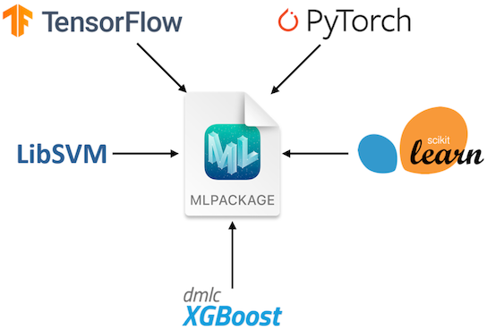
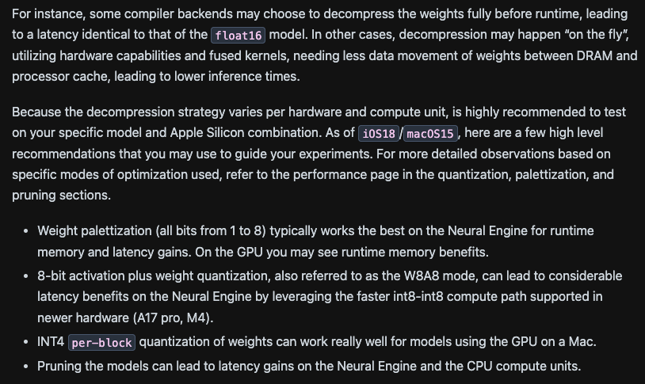
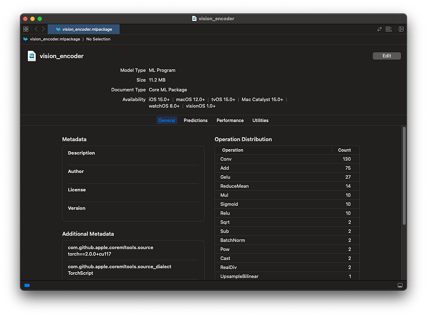
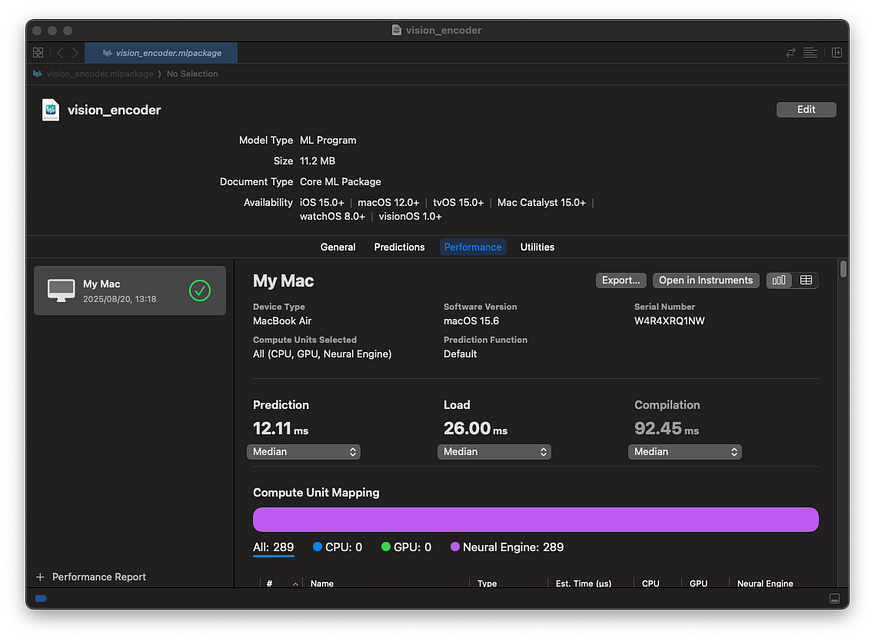
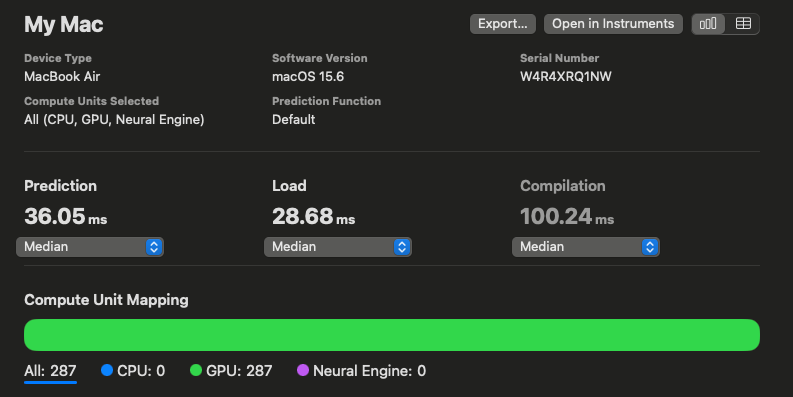
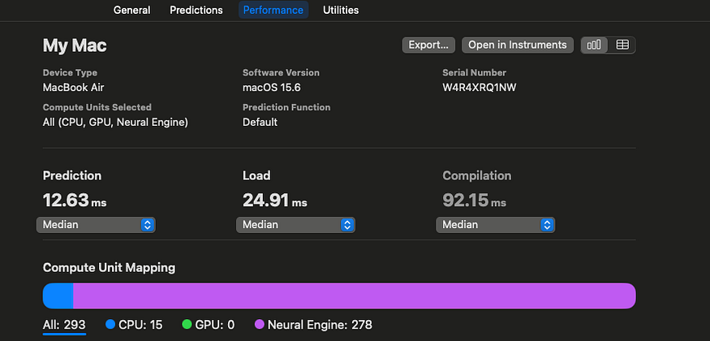
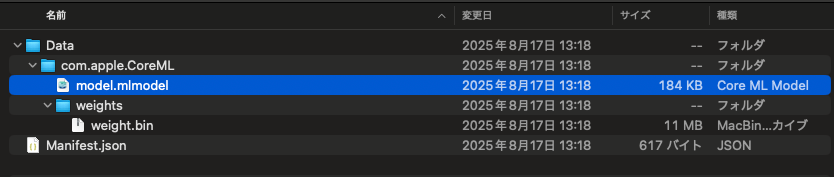

# Using Mixed Precision in Core ML

# Using Mixed Precision in Core ML

[](/@terada_80332?source=post_page---byline--77c2428ba728---------------------------------------)

[Takehiko TERADA](/@terada_80332?source=post_page---byline--77c2428ba728---------------------------------------)

6 min read

·

Aug 24, 2025

--

[Listen](/m/signin?actionUrl=https%3A%2F%2Fmedium.com%2Fplans%3Fdimension%3Dpost_audio_button%26postId%3D77c2428ba728&operation=register&redirect=https%3A%2F%2Fmedium.com%2Faxinc-ai%2Fusing-mixed-precision-in-core-ml-77c2428ba728&source=---header_actions--77c2428ba728---------------------post_audio_button------------------)

Share

This guide explains how to improve accuracy while maintaining speed by using mixed precision in Core ML.

---

### About Core ML

Core ML is an AI framework provided by Apple. Core ML abstracts the CPU, GPU, and ANE (NPU), enabling fast AI inference on Apple hardware.

Press enter or click to view image in full size


Source: <https://www.youtube.com/watch?v=LOYD9aQNuGM>

Core ML models are in the .mlpackage format. You can export a .mlpackage from a PyTorch model using coremltools.



About MLPACKAGE (Source: <https://developer.apple.com/documentation/coreml/>)

You can run inference on the exported .mlpackage using the Python API. You can also convert the .mlpackage to a .mlmodelc to run inference from Swift.

## About ANE

The ANE is Apple’s NPU (Apple Neural Engine). It is primarily an architecture intended to run inference in FP16. Through the M3 generation, it only supports weight quantization, and INT8 quantization is used to reduce model size and save memory bandwidth.

Notably, the A17 Pro and M4 add support for INT8 operations, which can enable further inference speedups depending on the use case.。

Press enter or click to view image in full size



[## Overview

### This section covers optimization techniques that help you get a smaller model by compressing its weights and…

apple.github.io](https://apple.github.io/coremltools/docs-guides/source/opt-overview.html?source=post_page-----77c2428ba728---------------------------------------)

## Converting models from PyTorch to Core ML

Using coremltools, you can export an .mlpackage from a PyTorch graph. Core ML tensors operate in FP16, so no calibration data is required for exporting to an .mlpackage. coremltools also supports Linux and can be used in non‑macOS environments.

```
import coremltools as ct  
import coremltools.optimize.coreml as cto  
  
def export_encoder(vision_encoder, args):  
    image_input = torch.randn(1, 3, 1024, 1024, dtype=torch.float)  
    traced_model = torch.jit.trace(vision_encoder, image_input)  
    outputs = [ct.TensorType(name="image_embeddings")]  
    coreml_model = ct.convert(  
        traced_model,  
        inputs=[ct.TensorType(shape=image_input.shape, name="image")],  
        outputs=outputs,  
        convert_to="mlprogram"  
    )  
    return coreml_model
```

You can view details of the converted .mlpackage by double-clicking it in Finder on macOS.

Press enter or click to view image in full size



You can also measure inference speed using Performance.

Press enter or click to view image in full size



## Running inference on Core ML models in Python

To run a Core ML model in Python, use the code below. Create an MLModel instance from the .mlpackage and perform inference with predict.

```
import coremltools as ct  
encoder_model_path = "encoder.mlpackage"  
encoder_model = ct.models.MLModel(encoder_model_path, ct.ComputeUnit.ALL)  
encoder_inputs = {  
    "image": image_input_expanded,  
}  
encoder_output = encoder_model.predict(encoder_inputs)  
embedding = encoder_output['image_embeddings']
```

## Converting from .mlpackage to .mlmodelc

To convert an .mlpackage to a .mlmodelc, use the command below. Use coremlc with the compile option and provide the .mlpackage.

```
/Applications/Xcode.app/Contents/Developer/usr/bin/coremlc compile encoder.mlpackage ./
```

## Running inference on Core ML models in Swift

To run a Core ML model in Swift, use the code below.

```
private var encoderModel: MLModel?  
let encoderURL = URL(fileURLWithPath: "encoder.mlmodelc")  
encoderModel = try MLModel(contentsOf: encoderURL)  
  
imagePixel = Array(repeating: 0.0, count: totalPixels * 3)  
// fill imagePixel  
let inputArray = convertToMLMultiArray(  
            imagePixel: imagePixel,  
            inputShape: [1,3,  
                         inferenceSize.width as NSNumber,  
                         inferenceSize.height as NSNumber])  
let input = try MLDictionaryFeatureProvider(dictionary: [  
                "image": inputArray  // inputArray must be MLMultiArray  
            ])  
let result = try encoderModel.prediction(from: input)  
var imageEmbeddings: MLMultiArray! = nil  
imageEmbeddings = result.featureValue(for: "image_embeddings")?.multiArrayValue  
let pointer = UnsafeMutablePointer<Float32>(OpaquePointer(imageEmbeddings.dataPointer))About Core ML accuracy
```

Core ML runs in FP16 by default. Components such as a Transformer’s LayerNorm can lack sufficient dynamic range in FP16, which may lead to reduced accuracy.

Specifically, FP16 has a 5-bit exponent, with a maximum finite value of 65,504. With bfloat16 (BF16), the exponent is 8 bits — the same as FP32 — so you don’t encounter range limitations; however, on the ANE’s FP16, operations like SquaredDifference and Pow can overflow and produce NaNs.。

In such cases, you should run inference in FP32 instead of FP16 to prevent overflow. To output an FP32 model in Core ML, pass compute\_precision=ct.precision.FLOAT32 to ct.convert.

```
import coremltools as ct  
import coremltools.optimize.coreml as cto  
  
def export_encoder(vision_encoder, args):  
    image_input = torch.randn(1, 3, 1024, 1024, dtype=torch.float)  
    traced_model = torch.jit.trace(vision_encoder, image_input)  
    outputs = [ct.TensorType(name="image_embeddings")]  
    coreml_model = ct.convert(  
        traced_model,  
        inputs=[ct.TensorType(shape=image_input.shape, name="image")],  
        outputs=outputs,  
        convert_to="mlprogram",  
        compute_precision=ct.precision.FLOAT32,  
    )  
    return coreml_model
```

However, switching to FP32 means it can no longer run on the ANE (NPU) and will run entirely on the GPU, resulting in slower inference. For example, a Vision Encoder’s latency drops from 12.23 ms to 35.57 ms.

Press enter or click to view image in full size


Inference speed in FP16

Press enter or click to view image in full size



Inference speed in FP32

## Using Mixed Precision

Instead of making all layers FP32, we consider making only specific layers FP32 to improve performance. This approach of mixing multiple precisions is called mixed precision.

In Core ML, you can pass compute\_precision as a function during model conversion, allowing you to set only specified op\_types to FP32. In the example below, l2\_norm is run in FP32.

```
def selector(op):  
    return op.op_type != "l2_norm"  
  
compute_precision = ct.transform.FP16ComputePrecision(op_selector=selector)  
coreml_model = ct.convert(  
    ...,  
    compute_precision=compute_precision,  
)
```

[## Convert OpenELM to float16 Core ML · Issue #95 · huggingface/swift-transformers

### I converted the models to float32 using this script: https://gist.github.com/pcuenca/23cd08443460bc90854e2a6f0f575084…

github.com](https://github.com/huggingface/swift-transformers/issues/95?source=post_page-----77c2428ba728---------------------------------------)

[## more-ane-transformers/convert.py at main · smpanaro/more-ane-transformers

### Run transformers (incl. LLMs) on the Apple Neural Engine. - more-ane-transformers/convert.py at main ·…

github.com](https://github.com/smpanaro/more-ane-transformers/blob/main/convert.py?source=post_page-----77c2428ba728---------------------------------------)

This model includes LayerNorm, and because LayerNorm uses Pow, running in FP16 lacks sufficient range and degrades accuracy. Therefore, we run the portions corresponding to LayerNorm in FP32.


LayerNorm is decomposed into multiple operators.

Specifically, we run in FP32 the portion corresponding to LayerNorm, starting with pow and continuing through sqrt.

```
import coremltools as ct  
import coremltools.optimize.coreml as cto  
  
layer_norm = False  
def op_selector(op):  
    global layer_norm  
    if op.op_type == "pow":  
        layer_norm = True  
    is_fp16 = not layer_norm  
    if op.op_type == "sqrt":  
        layer_norm = False  
    print(op.op_type, is_fp16)  
    return is_fp16  
def export_encoder(vision_encoder, args):  
    image_input = torch.randn(1, 3, 1024, 1024, dtype=torch.float)  
    traced_model = torch.jit.trace(vision_encoder, image_input)  
    outputs = [ct.TensorType(name="image_embeddings")]  
    coreml_model = ct.convert(  
        traced_model,  
        inputs=[ct.TensorType(shape=image_input.shape, name="image")],  
        outputs=outputs,  
        convert_to="mlprogram",  
        compute_precision=ct.transform.FP16ComputePrecision(op_selector)  
    )  
    return coreml_model
```

Here are the inference speeds: FP16 is 12.19 ms, FP32 is 36.05 ms, and mixed precision is 12.63 ms. Pow runs on the CPU, but everything else runs on the ANE (NPU), making it faster than the FP32 model.

Press enter or click to view image in full size



## Analyzing MLPackage models

The model in an MLPackage is located at encoder.mlpackage/Data/com.apple.CoreML/model.mlmodel, and it can be analyzed with Netron.

Press enter or click to view image in full size



Inside an MLPackage


Visualizing with Netron

## Summary

We confirmed that using Core ML enables inference on Apple devices with the ANE (NPU). We also confirmed that using mixed precision allows you to balance accuracy and speed.

## Evaluation environment

The evaluation was conducted on a MacBook M2 with coremltools==7.1.

---

At ailia Inc., as part of our “AI computing business”, we provide development services that accelerate your AI models and deploy them on devices. By leveraging Torch’s P2TE, the ailia SDK, ONNX Runtime, Core ML, QNN, and more, we can implement modern, large-scale Transformer models on your devices. If you are interested, please feel free to contact us.

---

As a company dedicated to practical AI, ailia Inc. develops the ailia SDK, which enables high-speed, GPU-accelerated inference across platforms. We offer end-to-end AI solutions — from consulting and model creation to SDK provisioning, AI-powered app and system development, and support — so please feel free to contact us.