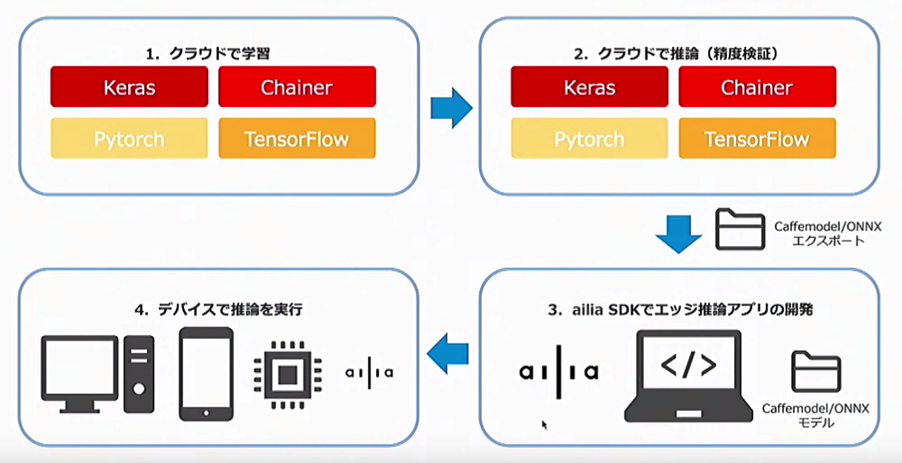

# ailia SDK チュートリアル(ONNXへのモデル変換)

# ailia SDK チュートリアル(ONNXへのモデル変換)

[](https://kyakuno.medium.com/?source=post_page---byline--add271b8ebdd---------------------------------------)

[Kazuki Kyakuno](https://kyakuno.medium.com/?source=post_page---byline--add271b8ebdd---------------------------------------)

18 min read

·

Jan 17, 2020

--

Share

PytorchやTensorFlowなど各種の学習フレームワークで学習したモデルをailia SDKで使用できるONNXにエクスポートするチュートリアルです。ailia SDKを利用することでONNXをモバイルを含む各種プラットフォームに簡単にデプロイすることができます。ailia SDKについて詳しくは[こちら](https://ailia.jp/)をご覧ください。

## ailia SDKが対応するモデル形式

ailia SDKはONNXの読み込みに対応しています。独自に学習したモデルをailia SDKで使用するには、学習フレームワークが提供するONNXへのエクスポート機能を使用します。

Press enter or click to view image in full size



ailia SDKでは下記のリポジトリにONNXのエクスポートのサンプルをまとめています。

[## axinc-ai/export-to-onnx

### A model learned with Pytorch can be loaded by outputting it to ONNX format using torch.onnx.export, then using the…

github.com](https://github.com/axinc-ai/export-to-onnx?source=post_page-----add271b8ebdd---------------------------------------)

また、ailia MODELSのエクスポートスクリプトの例は下記のWikiにまとめています。

[## axinc-ai/ailia-models

### Pretrained models for ailia SDK. Contribute to axinc-ai/ailia-models development by creating an account on GitHub.

github.com](https://github.com/axinc-ai/ailia-models/wiki?source=post_page-----add271b8ebdd---------------------------------------)

ailia SDKが対応するONNXのバージョンはopset=10〜17です。対応レイヤーはailia SDKのWEBサイトや仕様書に記載しています。

[## ailia SDK（アイリア）- ディープラーニングフレームワーク -

### 物体検出・画像分類・特徴抽出。 クラウドで学習したモデルを簡単にアプリに組み込み。 高速なディープラーニングがあなたの手に。 エッジ(端末)側での推論に特化したディープラーニングミドルウェア…

ailia.jp](http://ailia.jp/?source=post_page-----add271b8ebdd---------------------------------------)

## モデルエクスポートの基本

### 機械学習モデルの推論処理の構成

機械学習モデルを使用した推論処理は、前処理・推論・後処理の3段階の構成となっています。前処理では、入力画像に対して、正規化や並び替えを行います。推論では、前処理を行ったデータを機械学習モデルに入力して、何らかのデータを出力します。後処理では、値域変換や並び替えを行います。モデルエクスポートによる機械学習モデルのONNX変換では前処理と後処理は含まれないため、前処理と後処理は別途、PythonやCで実装する必要があります。

### モデルエクスポートの手順

機械学習モデルのエクスポートでは、Pythonスクリプト内にあるモデルオブジェクトをエクスポート関数に与えることで、ONNXを出力します。

入力はモデルオブジェクトであるため、main.pyなど、エクスポートしたいモデルを含むデモプログラムに直接、エクスポートするコードを埋め込みます。Pytorchの場合、load\_state\_dirでptファイルを読み込んだ後などにtorch.onnx.exportを埋め込みます。

エクスポート時はモデルの入力Shapeを明示的に指定する必要があり、入力Shapeを確認する必要があります。確認する方法としては、実際にデモプログラムを実行する際に、print(input.shape)を実行します。Netronを使ってモデルを可視化する方法もあります。

### 前処理と後処理の実装

機械学習モデルはデータ列を受け取ってデータ列を返すため、データ列から意味のある情報（バウンディングボックス）などを取得するには、前処理と後処理のコードを記述する必要があります。

実際にどのような前処理と後処理が必要なのかは、変換元のリポジトリを参照する必要があります。変換元のリポジトリで、print(input)やprint(output)などをして、実際にどういうデータが流れているかを確認します。

### 機械学習モデルが正しく動かない場合

ONNXに出力した機械学習モデルから期待した結果が得られない場合、下記のいずれかが間違っています。

(1) 前処理  
(2) ONNXでの推論  
(3) 後処理

どこで間違っているかを切り分けるために、torchなどでデモプログラムを実行した際の、機械学習モデルの入力と出力をnumpy.saveでファイルに保存しておき、それを使用して推論して同じデータが出力されるかを確認することで、ONNXでの推論が原因なのか、前処理か後処理が原因なのかを切り分けることができます。

numpy.saveした入力を与えて、サンプルと同じものが出力されるならONNXへのエクスポートは正常に行えていますので、前処理と後処理の内容を確認します。

## Pytorchからのエクスポート

Pytorchは標準でONNXへのエクスポートに対応しています。エクスポートはtorch.onnx.exportで行い、引数にモデルと入力Variableを与えます。ailia SDKで使用できるようにするため、opset\_version=10もしくは11に指定してください。

### 1入力のモデルのエクスポート

torchvisionから1入力1出力のモデルであるVGG16をダウンロードし、vgg16\_pytorch.onnxにエクスポートします。

[## axinc-ai/export-to-onnx

### You can't perform that action at this time. You signed in with another tab or window. You signed out in another tab or…

github.com](https://github.com/axinc-ai/export-to-onnx/blob/master/export_from_pytorch.py?source=post_page-----add271b8ebdd---------------------------------------)

### 複数の入出力を持つモデルのエクスポート

複数の入出力を持つモデルをエクスポートする場合、List形式で入力のVariableを与えます。

### 特定の関数のエクスポート

デフォルトではmodel.forwardがエクスポートされますが、model.predictなど別の関数をエクスポートしたい場合は、model.forwardに関数を代入します。

### 可変長の入力を持つモデルのエクスポート

入力のShapeが推論時まで確定しない場合は、input\_namesで入力に名前を付け、名前に対してdynamic\_axesを指定することで、任意の軸を可変長にすることができます。軸は0から指定します。

エクスポートしたモデルをNetronで見るとX軸が可変長になっています。


ailia SDKで推論する際は、net.set\_input\_shape((1,1,128,64))などを実行してShapeを確定します。

### Resizeを使用するモデルのエクスポート

ONNXではopset=11からResizeのオペレータが拡張され、Pytorchと一致するResizeに対応しました。ailia SDKでは1.2.4からopset=11が一部、使用可能になっていますので、セグメンテーションなど、Resizeを使用するモデルをエクスポートする場合は、opset=11でエクスポートした方が精度が改善する場合があります。

## Chainerからのエクスポート

Chainerも公式でONNXへのエクスポートに対応しています。pip経由でonnx\_chainerをインストールします。

> pip3 install onnx\_chainer

下記の例ではchainercvに含まれるVGG16をONNXにエクスポートしています。

[## axinc-ai/export-to-onnx

### You can't perform that action at this time. You signed in with another tab or window. You signed out in another tab or…

github.com](https://github.com/axinc-ai/export-to-onnx/blob/master/export_from_chainer.py?source=post_page-----add271b8ebdd---------------------------------------)

## Kerasからのエクスポート

Kerasの場合、keras2onnxでエクスポートします。pip経由でkeras2onnxをインストールします。

> pip3 install keras2onnx

下記の例では、kerasに含まれるVGG16モデルをONNXにエクスポートします。

[## axinc-ai/export-to-onnx

### You can't perform that action at this time. You signed in with another tab or window. You signed out in another tab or…

github.com](https://github.com/axinc-ai/export-to-onnx/blob/master/export_from_keras.py?source=post_page-----add271b8ebdd---------------------------------------)

Kerasでエクスポートする際の注意点として、エクスポートされたモデルの入力のバッチサイズが不定値（N）になります。そのため、推論時にset\_input\_shapeを呼ぶ必要があります。

### TensorFlow2.x + Kerasを使用したエクスポート

TensorFlow2.xに同梱されているKerasを使用してモデルをエクスポートする場合、pypiに記載されているように、keras2onnxをソースコードからインストールする必要があります。

```
Due to some reason, the package release paused, please install it from the source, and the support of keras or tf.keras over tensorflow 2.x is only available in the source.
```

[## keras2onnx

### The keras2onnx model converter enables users to convert Keras models into the ONNX model format. Initially, the Keras…

pypi.org](https://pypi.org/project/keras2onnx/?source=post_page-----add271b8ebdd---------------------------------------)

例えば、keras2onnx 1.6.0でTensorFlow2のモデルをエクスポートした場合、ONNXへのエクスポートには成功しますが、ONNXの推論で下記のエラーが発生します。

```
Op (MatMul) [ShapeInferenceError] Incompatible dimensions for matrix multiplication
```

また、keras2onnx 1.7.0では、エクスポート時に下記のエラーが発生します。

```
Unable to find out a correct type for tensor type = 20
```

[## error with the example model EfficientNet · Issue #494 · onnx/keras-onnx

### I was trying the tutorial notebook and I did small modifications. See my notebook here. after the existing model hdf5…

github.com](https://github.com/onnx/keras-onnx/issues/494?source=post_page-----add271b8ebdd---------------------------------------)

これらの問題は、keras2onnx 1.8.0をソースコードからインストールすることで解決可能です。keras2onnxをソースコードからインストールするには、下記のようにします。

```
git clone git@github.com:onnx/keras-onnx.git # or download zip  
cd keras-onnx  
pip install .
```

## TensorFlowからのエクスポート

TensorFlowからエクスポートするには、tf2onnxを使用します。pip経由でtf2onnxをインストールします。

> pip3 install tf2onnx

下記の例では、TensorFlow.kerasからTensorFlowに読み込んだグラフをONNXに出力します。TensorFlowの場合、TensorFlowLiteにエクスポートする時と同様、事前にグラフをFreezeする必要があります。また、学習用のパラメータは定数に置き換える必要があります。

## Get Kazuki Kyakuno’s stories in your inbox

Join Medium for free to get updates from this writer.

Subscribe

Subscribe

Remember me for faster sign in

また、TensorFlowはChannel Lastで、ONNXはChannel Firstなため、TransposeがConvごとに発生します。パフォーマンスを出す場合、TransposeOptimizerを使用してTransposeの発生を抑制する必要があります。

そのため、コードは下記のように複雑になります。

[## axinc-ai/export-to-onnx

### You can't perform that action at this time. You signed in with another tab or window. You signed out in another tab or…

github.com](https://github.com/axinc-ai/export-to-onnx/blob/master/export_from_tensorflow.py?source=post_page-----add271b8ebdd---------------------------------------)

TensorFlowでグラフをフリーズする際、convert\_variables\_to\_constantsには最終出力のノードの名前を指定する必要があります。ノード名は、graph\_def.nodeを列挙することで取得可能です。

フリーズしたグラフをimport\_graph\_defした場合、ノード名にはimport/という接頭子が追加されるため、tf2onnxに指定するinput\_namesとoutput\_namesのノード名にはimport/を追加する必要があります。

### TensorFlowからのエクスポートのトラブルシューティング

グラフにBatchNormalizationを含む場合、フリーズしようとすると、incompatible with expected resourceエラーが発生することがあります。

> ValueError: Input 0 of node import/mobilenet\_1.00\_224/conv1\_bn/cond/ReadVariableOp/Switch was passed float from import/conv1\_bn/gamma:0 incompatible with expected resource.

KerasからTensorFlowのグラフを取得してフリーズする際にエラーが発生する場合は、tf.keras.backend.set\_learning\_phase(0)を呼び出すことで回避することができます。

[## Freezing network with batch norm does not work with TRT · Issue #22957 · tensorflow/tensorflow

### Dismiss GitHub is home to over 40 million developers working together to host and review code, manage projects, and…

github.com](https://github.com/tensorflow/tensorflow/issues/22957?source=post_page-----add271b8ebdd---------------------------------------)

TensorFlowを単独で使用していてエラーが発生している場合は、下記のコードを挿入することで回避可能です。

[## import frozen graph with error "Input 0 of node X was passed float from Y:0 incompatible with…

### Note: create this issue for anybody who might come across the similar issue in the future. when I tried to convert…

github.com](https://github.com/onnx/tensorflow-onnx/issues/77?source=post_page-----add271b8ebdd---------------------------------------)

## Channel FirstとChannel Lastについて

ONNXとailia SDKは内部のテンソルをChannel First形式で扱います。Channel Firstとは、(N,C,H,W)のフォーマットで、チャンネルごとにまとまってデータが格納されます。対して、Channel Last形式は、(N,H,W,C)で、チャンネルがインタリーブされてデータが格納されます。Channel FirstがRRRGGGBBBのようなイメージで、Channel LastがRGBRGBRGBのようなイメージです。

PytorchやChainerはChannel First形式で、KerasやTensorFlowはChannel Last形式です。そのため、PytorchやChainerからエクスポートする方が、より簡単にailia SDKに読み込ませることができます。KerasやTensorFlowからエクスポートする場合、Channel First形式とChannel Last形式を変換するために、Transpose Layerが挿入されることがありますので、その場合は、tf2onnxのTranspose Optimizerや、ONNXのオプティマイザでTranspose Layerを除去することで推論速度を改善することができます。

## Prototxtの出力

ailia SDKで読み込むにはONNXからprototxtを出力する必要があります。

ailia SDKではONNXからprototxtを出力するためのスクリプトを同梱しています。

このスクリプトは引数にONNXを与えると、.prototxtファイルを出力します。

> python3 onnx2prototxt.py input.onnx

[## axinc-ai/yolov3-face

### You can't perform that action at this time. You signed in with another tab or window. You signed out in another tab or…

github.com](https://github.com/axinc-ai/yolov3-face/blob/master/onnx-ailia/onnx2prototxt.py?source=post_page-----add271b8ebdd---------------------------------------)

## ailia SDKでのテスト

作成したONNXとprototxtをailia SDKに読み込ませて推論のテストを行います。Python APIを使用すると簡単です。

[## axinc-ai/ailia-models

### You can't perform that action at this time. You signed in with another tab or window. You signed out in another tab or…

github.com](https://github.com/axinc-ai/ailia-models/blob/master/vgg16/vgg16.py?source=post_page-----add271b8ebdd---------------------------------------)

Kerasで出力したONNXはバッチサイズが不定になり、そのままでは推論できません。NetもしくはClassifierインスタンスを作成したあと、predict APIやclassifier APIの呼び出し前にset\_input\_shapeを呼び出して入出力形状を確定させてください。

> net.set\_input\_shape((1,224,224,3))

## ailia SDKでのプロファイル

速度を解析するにはailia SDKのプロファイルモードを使用します。各レイヤーの処理時間が出力されます。

> net.set\_profile\_mode(True)
>
> net.predict(input\_data)
>
> print(net.get\_summary())

## ONNXのオプティマイズ

ONNXはonnx.optimizer.optimizeを使用してグラフ最適化を行うことができます。グラフ最適化を行うことで、BatchNormalizationの重みをConvolutionにマージすることができ、モバイル環境での速度を改善することができます。

> opt\_passes = [  
>  ‘extract\_constant\_to\_initializer’,   
>  ‘fuse\_add\_bias\_into\_conv’,   
>  ‘fuse\_bn\_into\_conv’,   
>  ‘fuse\_consecutive\_concats’,   
>  ‘fuse\_consecutive\_log\_softmax’,   
>  ‘fuse\_consecutive\_reduce\_unsqueeze’,   
>  ‘fuse\_consecutive\_squeezes’,   
>  ‘fuse\_consecutive\_transposes’,   
>  ‘fuse\_matmul\_add\_bias\_into\_gemm’,   
>  ‘fuse\_pad\_into\_conv’,   
>  ‘fuse\_transpose\_into\_gemm’,   
>  ]  
>  model = onnx.optimizer.optimize(model, opt\_passes )

ailia SDKではグラフ最適化を行うためのスクリプト（onnx\_optimizer.py）を同梱しています。

[## axinc-ai/yolov3-face

### You can’t perform that action at this time. You signed in with another tab or window. You signed out in another tab or…

github.com](https://github.com/axinc-ai/yolov3-face/blob/master/onnx-ailia/onnx_optimizer.py?source=post_page-----add271b8ebdd---------------------------------------)

このスクリプトは引数にONNXを与えると、.opt.onnxファイルを出力します。

> python3 onnx\_optimizer.py input.onnx

グラフ最適化を行った後も標準のONNXの規格に準拠しています。

なお、ONNXの公式のオプティマイザはグラフによってはエラーが発生します。これに関しては公式のアップデート待ちとなっています。

今後、ailia SDKではONNXの公式のオプティマイザがエラーになった場合も最適化できるオプションを追加予定です。

出力したprototxtをnetronにアップロードすることでグラフ構造を解析することができます。

[## Netron

### Edit description

lutzroeder.github.io](https://lutzroeder.github.io/netron/?source=post_page-----add271b8ebdd---------------------------------------)

ax株式会社はAIを実用化する会社として、クロスプラットフォームでGPUを使用した高速な推論を行うことができるailia SDKを開発しています。ax株式会社ではコンサルティングからモデル作成、SDKの提供、AIを利用したアプリ・システム開発、サポートまで、 AIに関するトータルソリューションを提供していますのでお気軽に[お問い合わせ](https://axinc.jp/)ください。