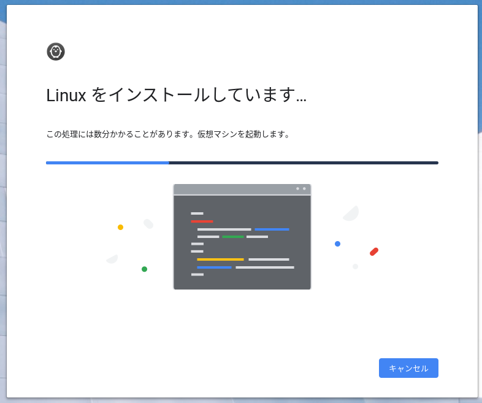
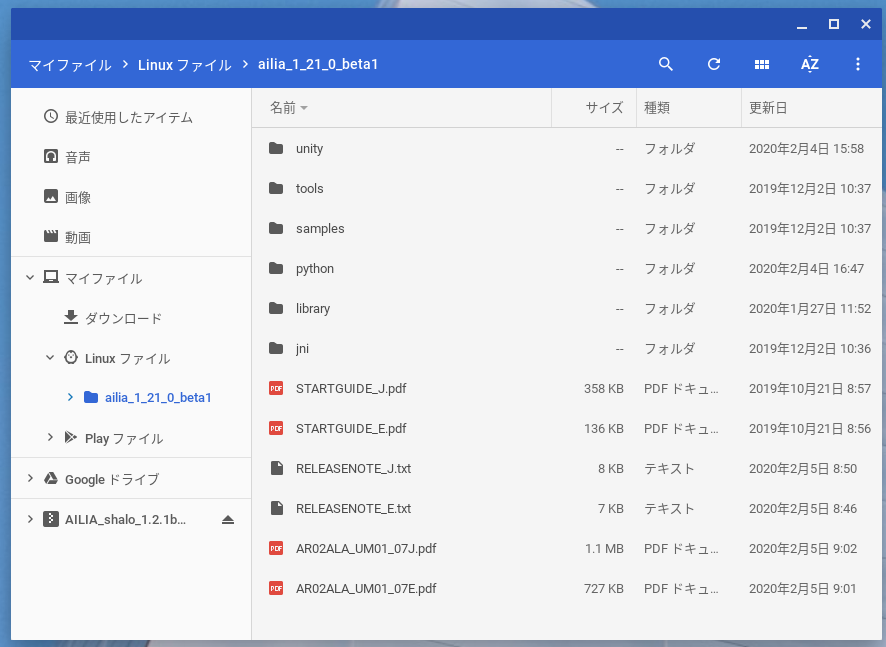

# ailia SDKをJetsonNanoやChromeBookで動かす

# ailia SDKをJetsonNanoやChromeBookで動かす

[Kazuki Kyakuno](https://kyakuno.medium.com/?source=post_page---byline--bea74e2d1ba---------------------------------------)

Feb 11, 2020

--

Share

ailia SDKをJetsonNanoやChromeBookで動作させる解説です。ailia SDKを利用することでディープラーニングの推論をクロスプラットフォームで行うことができます。ailia SDKについて詳しくは[こちら](https://ailia.jp/)をご覧ください。

## JetsonNano

### ailia SDK 1.2.3以降の場合

下記のチュートリアルにJetsonを追加しましたので、こちらを参照してください。

[## ailia SDK チュートリアル(Python)

### ailia SDKをPythonで使用するチュートリアルです。Pythonを使用することで様々なモデルの動作を簡単に試すことができます。

medium.com](https://medium.com/axinc/ailia-sdk-%E3%83%81%E3%83%A5%E3%83%BC%E3%83%88%E3%83%AA%E3%82%A2%E3%83%AB-python-28379dbc9649?source=post_page-----bea74e2d1ba---------------------------------------)

### ailia SDK 1.2.1の場合

JetsonNanoではailia SDKのJetsonバイナリを実行することができます。JetsonNanoでailia SDKを使用することで、ONNXから直接、GPU推論することができ、ailia-modelsに公開されている多様なモデルを使用することができます。

Jetsonバイナリはailia SDK 1.2.1以降のlibrary/experimental/jetsonに含まれています。下記のチュートリアルはUbuntu 18.04 LTSに向けたものです。

ailia SDKをダウンロードします。

Press enter or click to view image in full size

python/ailiaを/usr/local/lib/python3.6/dist-packagesに、library/experimental/jetson/libailia.soとlibrary/experimental/jetson/libailia\_pose\_estimate.soとlibrary/experimental/jetson/libailia\_cuda.soを/usr/local/lib/python3.6/dist-packages/ailiaにコピーします。

> cd ailia\_sdk\_1\_21  
> sudo cp -r python/ailia /usr/local/lib/python3.6/dist-packages  
> sudo cp library/experimental/jetson/libailia.so /usr/local/lib/python3.6/dist-packages/ailia  
> sudo cp library/experimental/jetson/libailia\_pose\_estimate.so /usr/local/lib/python3.6/dist-packages/ailia  
> sudo cp library/experimental/jetson/libailia\_cuda.so /usr/local/lib/python3.6/dist-packages/ailia

dist-packagesが存在しない場合は、下記のコマンドでパスを確認します。

> python3 -c “import site; print (site.getsitepackages())”

ailiaフォルダに実行権限を付与します。

> sudo chmod 757 /usr/local/lib/python3.6/dist-packages/ailia

opencv-pythonはプリインストールされています。

[## install OpenCV for python3 in Jetson Nano - NVIDIA Developer Forums

### Edit description

devtalk.nvidia.com](https://devtalk.nvidia.com/default/topic/1051160/jetson-nano/install-opencv-for-python3-in-jetson-nano/?source=post_page-----bea74e2d1ba---------------------------------------)

numpyはapt経由でインストールします。

> sudo apt install python3-numpy

[## Problem installing numpy for python3 on fresh JetPack install - NVIDIA Developer Forums

### Edit description

devtalk.nvidia.com](https://devtalk.nvidia.com/default/topic/1032957/problem-installing-numpy-for-python3-on-fresh-jetpack-install/?source=post_page-----bea74e2d1ba---------------------------------------)

samples/models/download\_model.shを実行してモデルをダウンロードします。ダウンロードに必要なcurlをインストールします。

> sudo apt install curl

モデルをダウンロードします。

> cd samples/models  
> chmod +x download\_model.sh  
> ./download\_model.sh

ailia SDKのサンプルを実行します。

> cd ../../samples/python  
> python3 ailia\_classifier.py

推論結果が出力されます。

> class\_count=3  
> + idx=0  
>  category=409[ analog clock ]  
>  prob=0.7738379836082458  
> + idx=1  
>  category=892[ wall clock ]  
>  prob=0.1796753704547882  
> + idx=2  
>  category=826[ stopwatch, stop watch ]  
>  prob=0.03009628877043724

この状態では、推論はCPUで実行されています。cuDNNを使用して高速なGPU推論を利用するには、samples/pythonフォルダにlibrary/experimental/jetson/libailia\_cuda.soをコピーします。

> cp library/experimental/jetson/libailia\_cuda.so samples/python

推論環境を列挙します。

> python3 ailia\_environment.py

cuDNNが使用できる場合、下記が列挙されます。

> env[1]=Environment(id=1, type=’GPU’, name=’cuDNN-NVIDIA Tegra X1 (5.3)’, backend=’CUDA’, props=’NORMAL’)

この状態で、ailia\_classifier.pyを実行すると、cuDNNを使用した高速なGPU推論が可能です。

## ChromeBook

ChromeBook（Intel CPU）ではailia SDKのLinuxバイナリを実行することができます。ChromeBookでailia SDKを使用することで、教育用途でもディープラーニングを使用することができます。

## Get Kazuki Kyakuno’s stories in your inbox

Join Medium for free to get updates from this writer.

Subscribe

Subscribe

Remember me for faster sign in

まず、公式の手順に従って、Linuxモードを有効にします。

[## Chromebook で Linux（ベータ版）をセットアップする

### Linux（ベータ版）は、Chromebook を使用してソフトウェアを開発できる機能です。Linux のコマンドライン ツール、コードエディタ、IDE を Chromebook…

support.google.com](https://support.google.com/chromebook/answer/9145439?hl=ja&source=post_page-----bea74e2d1ba---------------------------------------)

Press enter or click to view image in full size

ailia SDKをダウンロードします。ダウンロード後、Linuxファイルに内容をコピーします。

Press enter or click to view image in full size

python/ailiaを/usr/local/lib/python3.5/dist-packagesに、library/linux/libailia.soとlibrary/linux/libailia\_pose\_estimate.soを/usr/local/lib/python3.5/dist-packages/ailiaにコピーします。

> cd ailia\_sdk\_1\_21  
> sudo cp -r python/ailia /usr/local/lib/python3.5/dist-packages  
> sudo cp library/linux/libailia.so /usr/local/lib/python3.5/dist-packages/ailia  
> sudo cp library/linux/libailia\_pose\_estimate.so /usr/local/lib/python3.5/dist-packages/ailia

ailiaフォルダに実行権限を付与します。

> sudo chmod 755 /usr/local/lib/python3.5/dist-packages/ailia

ChromeBookはPython3.5がデフォルトでインストールされていますが、pipはインストールされていませんので、下記のコマンドでインストールします。

> curl -O <https://bootstrap.pypa.io/get-pip.py>   
> sudo python3 get-pip.py

必要な依存関係をインストールします。

> pip3 install opencv-python numpy

samples/models/download\_model.shを実行してモデルをダウンロードします。

> cd samples/models  
> chmod +x download\_model.sh  
> ./download\_model.sh

ailia SDKのサンプルを実行します。

> cd ../../samples/python  
> python3 ailia\_classifier.py

推論結果が出力されます。

> class\_count=3  
> + idx=0  
>  category=409[ analog clock ]  
>  prob=0.7738379836082458  
> + idx=1  
>  category=892[ wall clock ]  
>  prob=0.1796753704547882  
> + idx=2  
>  category=826[ stopwatch, stop watch ]  
>  prob=0.03009628877043724

現状、ChromeBookでは、CPUモードの推論のみ実行可能です。将来的にChromeOSがVulkanやOpenCLに対応したタイミングで、GPU対応を計画しています。

ax株式会社はAIを実用化する会社として、クロスプラットフォームでGPUを使用した高速な推論を行うことができるailia SDKを開発しています。ax株式会社ではコンサルティングからモデル作成、SDKの提供、AIを利用したアプリ・システム開発、サポートまで、 AIに関するトータルソリューションを提供していますのでお気軽に[お問い合わせ](https://axinc.jp/)ください。