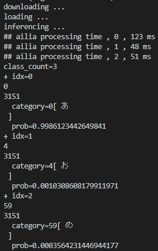
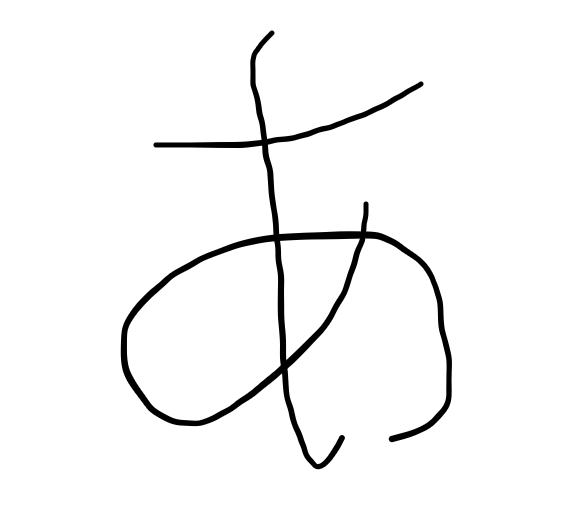
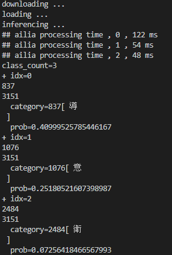
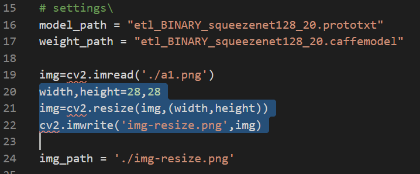
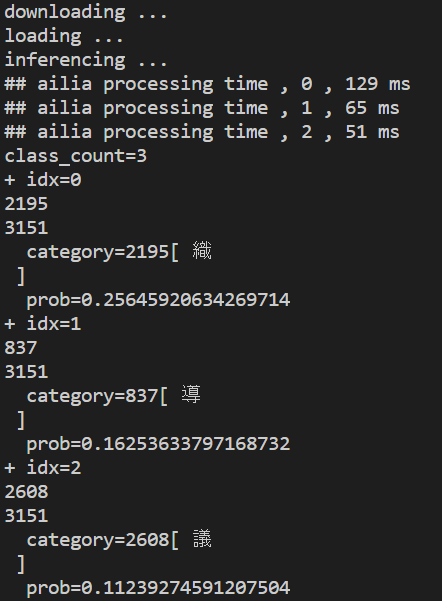
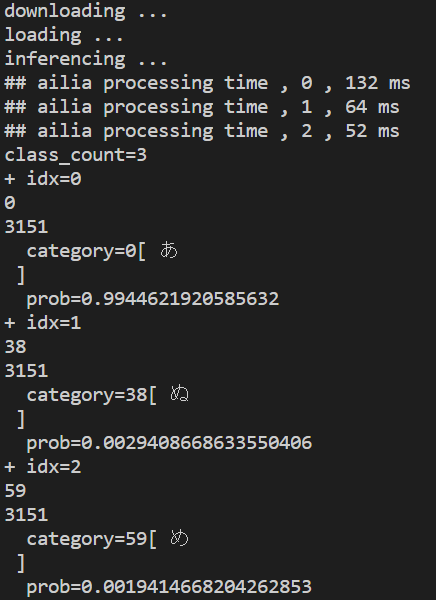
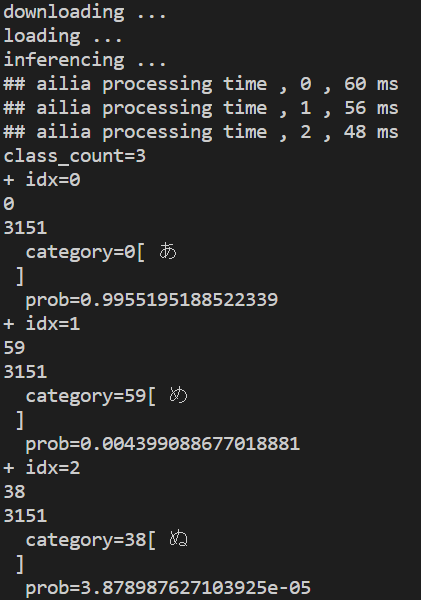
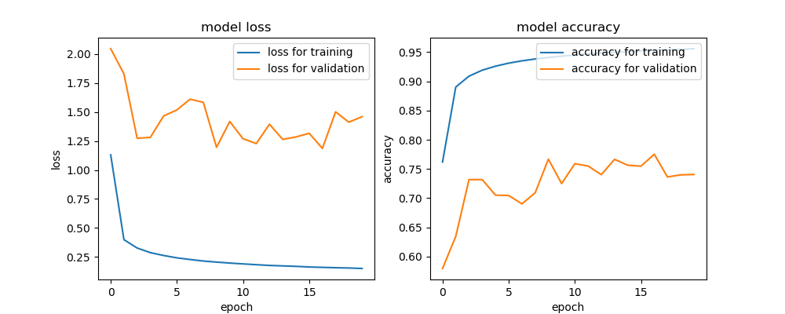

# etl : 日本語の文字を認識する機械学習モデル

# etl : 日本語の文字を認識する機械学習モデル

[Tsukasa Sekiya](/@sekiya_99379?source=post_page---byline--412ee389a8ef---------------------------------------)

Mar 31, 2020

--

Share

[ailia SDK](https://ailia.jp/)で使用できる機械学習モデルである「[etl](https://github.com/axinc-ai/ailia-models/tree/master/etl)」のご紹介です。エッジ向け推論フレームワークである[ailia SDK](https://ailia.jp/)と[ailia MODELS](https://github.com/axinc-ai/ailia-models)に公開されている機械学習モデルを使用することで、簡単にAIの機能をアプリケーションに実装することができます。

---

## ETLの概要

[etl](https://github.com/axinc-ai/ailia-models/tree/master/etl)は、画像に書かれている文字を、学習に使用した文字（約3000の英数漢字）の中で、どの文字との合致率が高いかを計算し予測することができるAIです。（etlは、e:extract・抽出、t:transform・変換、l:load・書き出し、の略称）このetlは学習に[etlデータセット](http://etlcdb.db.aist.go.jp/?lang=ja)を使用しています。etlでは文字列を認識することはできず、一つの文字のみを認識します。また、英字も認識することができますが、筆記体などの形を崩したフォントでは認識の精度が落ちます。

[## axinc-ai/ailia-models

### Ailia input shape: (1, 1, 28, 28) Range: [0, 1] 3189 character Automatically downloads the onnx and prototxt files on…

github.com](https://github.com/axinc-ai/ailia-models/tree/master/text_recognition/etl?source=post_page-----412ee389a8ef---------------------------------------)

## 使用方法

学習に使用した文字のラベルをテキストファイルから読み込みます。その後、学習済みモデルをローカルファイルにコピーします。次に、画像の分類用のクラス(ailia Classifier)にパラメータをセットし、画像を読み込める状態を作ります。次に画像を8ビット画像として読み込みOpenCVを使い文字を認識させます。OpenCVでは以下のファイルを取り扱うことができます。（jpg,jpeg,jpe,jp2,png,webp,bmp,pbm,pgm,ppm,pxm,pnm,sr,ras,tiff,tif,exr,hdr,pic,dib）  
最後に合致する可能性のある文字、etlのテキストファイルの何番目の文字か、出力される3つの文字の中で、の合致する比率をコンソール上に表示させて終了です。

試しに、画像の文字を認識させてみようと思います。

読み込ませる画像

まず最初に「あ」の文字を認識させてみようと思います。実行結果は以下のようになります。(大きさ：135×135、サイズ7.82KB)

実行結果１

結果としては、第一候補が「あ」で、「あ」である比率が99％と表示されているため認識成功です。

次に,手書きで書いた「あ」の画像を入力してみます。

読み込ませる画像

画像の詳細(大きさ:564×516、サイズ:19.4KB)

実行結果は以下のようになります。

実行結果

実行結果は、第一候補が「導」となってしまい、認識は失敗です。この原因は、このetlの画像解像度が28×28画素しかないため、画像サイズが大きすぎたために起こったエラーだと考えられます。

なので、今回の画像を28×28画素に直して、読み込ませてみようと思います。リサイズをして、いったん出力するコードを書き加えてみようと思います。

Press enter or click to view image in full size

選択した部分を追加する

この選択した部分のコードを付け加えることによって、etlのファイルの中にimg-resize.pngというサイズが28×28に直された画像ファイルが出力されます。実行をすると、次のような画像ファイルと実行結果が出力されます。

出力されたimg-resize.png

実行結果

出力された、img-resize.pngからもわかるように、リサイズされた画像がほぼ点線になってしまいます。この画像を読み込んだ結果、先ほどのような結果が出力されたと考えられます。

では、次にリサイズされても点線にならないように太い線で描かれた「あ」の文字を読み込ませてみようと思います。（リサイズのコードは追加したままです）

読み込ませる画像

リサイズされて出力された画像

実行結果

リサイズされた画像が、点線ではなく「あ」の文字として目でも認識はできるようになりました。実行結果は「あ」である比率が9割を超えているので実行結果は成功と言えます。

次は、リサイズのコードを消して先ほどの「あ」の画像を読み込ませてみようと思います。

読み込ませる画像

実行結果

実行結果から、リサイズしなくてもetlのモデル自身で自動的に入力されたファイルをリサイズして読み込んでいることがわかります。

## 学習について

etlはax株式会社で学習を行っています。モデルはConv、Relu、BatchNorm、Conv、Relu、BatchNorm、MaxPoolingを2回重ねた後、GlobalAveragePoolingを行うシンプルなものです。

今回、ETLデータセットはETL1、ETL2、ETL3、ETL4、ETL5、ETL6、ETL7、ETL8G、ETL9Gを混合して使用しており、正規化のために大津の2値化法によって2値化を行った上で、学習に使用しています。

学習結果のAccuracyは下記になります。TrainingSetは産総研のETL、ValidationSetはfontToolsで動的に生成した文字列となっています。

Press enter or click to view image in full size

---

ax株式会社はAIを実用化する会社として、クロスプラットフォームでGPUを使用した高速な推論を行うことができるailia SDKを開発しています。ax株式会社ではコンサルティングからモデル作成、SDKの提供、AIを利用したアプリ・システム開発、サポートまで、 AIに関するトータルソリューションを提供していますのでお気軽にお問い合わせください。