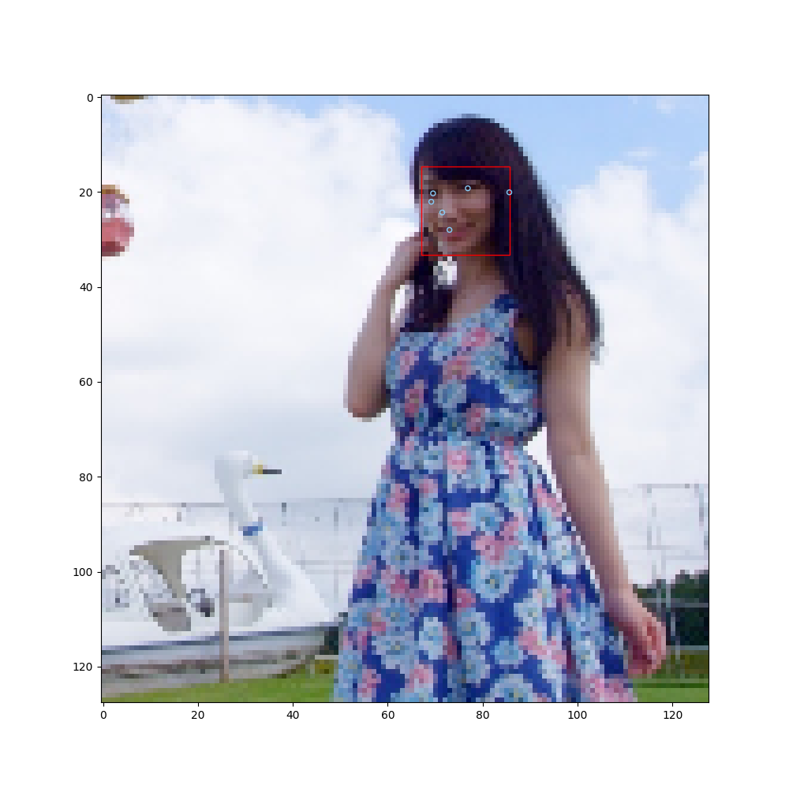
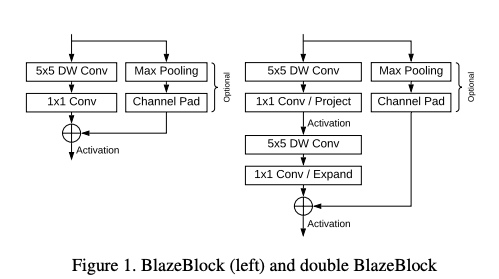

# BlazeFace : 顔の位置とキーポイントを高速に検出する機械学習モデル

# BlazeFace : 顔の位置とキーポイントを高速に検出する機械学習モデル

[](/@kyakuno?source=post_page---byline--e851c348a32b---------------------------------------)

[Kazuki Kyakuno](/@kyakuno?source=post_page---byline--e851c348a32b---------------------------------------)

Apr 4, 2020

--

Share

[ailia SDK](https://ailia.jp/)で使用できる機械学習モデルである「BlazeFace」のご紹介です。エッジ向け推論フレームワークである[ailia SDK](https://ailia.jp/)と[ailia MODELS](https://github.com/axinc-ai/ailia-models)に公開されている機械学習モデルを使用することで、簡単にAIの機能をアプリケーションに実装することができます。

---

## BlazeFaceの概要

BlazeFaceはGoogleが開発した高速に顔の位置とキーポイントを検出する機械学習モデルです。

[## BlazeFace: Sub-millisecond Neural Face Detection on Mobile GPUs

### We present BlazeFace, a lightweight and well-performing face detector tailored for mobile GPU inference. It runs at a…

arxiv.org](https://arxiv.org/abs/1907.05047?source=post_page-----e851c348a32b---------------------------------------)

認識結果は次のようになります。顔の位置と、顔のキーポイントを同時に取得可能です。キーポイントは、目、鼻、耳、口の6ポイントです。また、複数人を同時に検出可能です。

Press enter or click to view image in full size



BlazeFaceの認識結果

元々はGoogleの提供するMediaPipe向けのモデルだったのですが、Pytorchにコンバートしたバージョンが提供されており、ailia SDKではこちらのリポジトリからエクスポートしたモデルを使用することができます。

[## hollance/BlazeFace-PyTorch

### BlazeFace is a fast, light-weight face detector from Google Research. Read more, Paper on arXiv A pretrained model is…

github.com](https://github.com/hollance/BlazeFace-PyTorch?source=post_page-----e851c348a32b---------------------------------------)

## BlazeFaceのモデルアーキテクチャ

BlazeFaceはモバイルGPUでとても高速に推論できるように設計されています。具体的に、MobileNetV2-SSDに比べて、2.3倍近く高速に動作します。


（出典：<https://arxiv.org/abs/1907.05047>）

BlazeFaceはMobileNetをベースに改良されたネットワークを使用しています。著者らは、iPhoneXにおいて56x56x128 Tensorの3x3のdepthwise convolutionが0.07ms消費するのに対して、128 to 128 channelの1x1のチャンネル方向畳み込みが0.3ms消費することを元に、3x3のdepthwise convolutionを5x5のdepthwise convolutionに置き換える代わりに、深さを浅くすることで高速化を行なっています。



（出典：<https://arxiv.org/abs/1907.05047>）

また、GPUにおいては固定のシェーダのDispatchコストがかかっており、MobileNetV1では4.9msのうち、実際にカーネルを計算している時間は3.9msであることを示しています。アンカーの計算のDispatchコストを下げるために、アンカー計算の階層数を抑制しています。


（出典：<https://arxiv.org/abs/1907.05047>）

## Anchorの生成

BlazeFaceの入力は(1,3,128,128)、出力は(1,896,1)のconfidenceと、(1,896,16)のregressionです。BlazeFaceはSSDベースのアーキテクチャであり、regressionからBoundingBoxの計算を行うにはAnchorが必要です。

MediaPipeではpbtxtで定義したSsdAnchorsCalculatorノードからAnchorが生成されます。同等のAnchorを計算するためには、BlazeFace-PytorchのAnchors.ipynbを使用可能です。

[## hollance/BlazeFace-PyTorch

### The BlazeFace face detector model implemented in PyTorch - hollance/BlazeFace-PyTorch

github.com](https://github.com/hollance/BlazeFace-PyTorch/blob/master/Anchors.ipynb?source=post_page-----e851c348a32b---------------------------------------)

## BlazeFaceの種類

BlazeFaceにはフロントカメラ用の128x128解像度を入力するモデルと、バックカメラ用の256x256解像度を入力するモデルの二種類があります。

## ailia SDKからの使用

ailia SDKでBlazeFaceを使用するには下記のサンプルを利用します。

[## axinc-ai/ailia-models

### (Image from https://github.com/hollance/BlazeFace-PyTorch/blob/master/3faces.png) Ailia input shape: (1, 3, 128, 128)…

github.com](https://github.com/axinc-ai/ailia-models/tree/master/face_detection/blazeface?source=post_page-----e851c348a32b---------------------------------------)

下記のコマンドでWEBカメラから認識することができます。

```
$ python3 blazeface.py -v 0
```

下記のコマンドで画像から認識することができます。

```
$ python3 blazeface.py -i person.jpg
```

デフォルトではフロントカメラモデルを使用します。 — backオプションを付けることでバックカメラモデルを使用することができます。

```
$ python3 blazeface.py -v 0 --back
```

---

ax株式会社はAIを実用化する会社として、クロスプラットフォームでGPUを使用した高速な推論を行うことができるailia SDKを開発しています。ax株式会社ではコンサルティングからモデル作成、SDKの提供、AIを利用したアプリ・システム開発、サポートまで、 AIに関するトータルソリューションを提供していますのでお気軽に[お問い合わせ](https://axinc.jp/)ください。