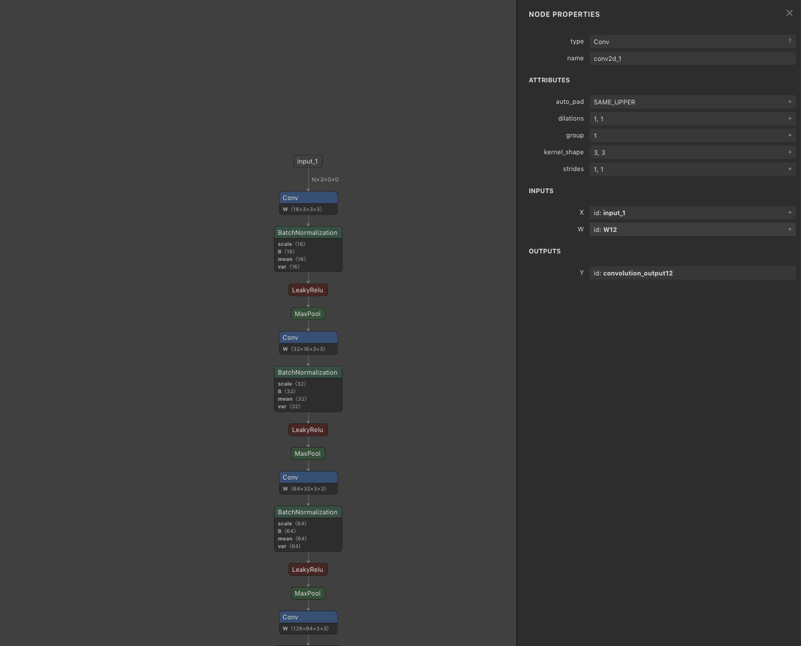
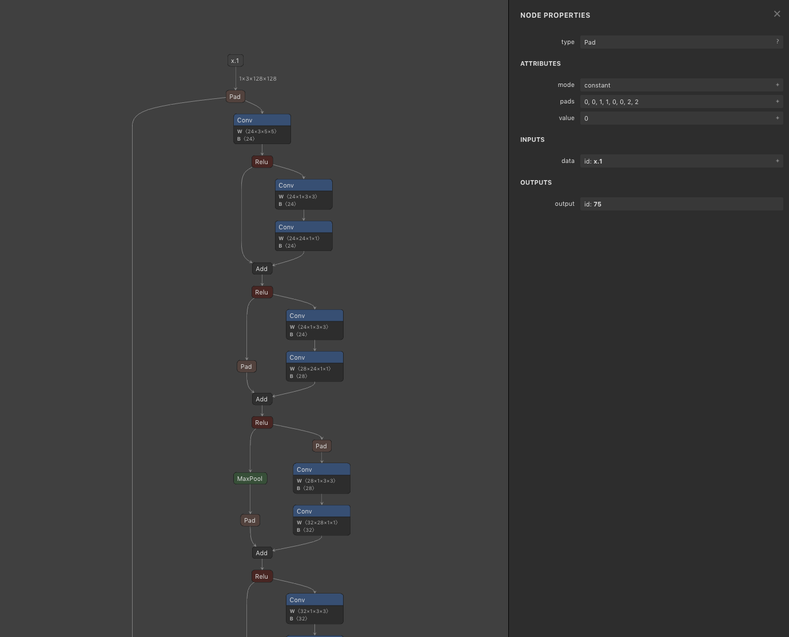

# Netronを使用したONNX モデルのビジュアライズ

# Netronを使用したONNX モデルのビジュアライズ

[Kazuki Kyakuno](https://kyakuno.medium.com/?source=post_page---byline--84487cb6ae35---------------------------------------)

Apr 5, 2020

--

Share

エッジ向け推論フレームワークである[ailia SDK](https://ailia.jp/)ではONNXを使用してGPUを使用した高速な推論を行うことができます。この記事では、[ailia SDK](https://ailia.jp/)の開発の過程で得られたONNXモデルのビジュアライズの知見を紹介します。

## Netronについて

Netronはブラウザを含むクロスプラットフォームで動作する機械学習モデルのビジュアライズツールです。ONNXファイルやPrototxtをアップロードするだけでモデルの構造をビジュアライズすることができます。

公式リポジトリは下記です。

[## lutzroeder/netron

### Netron is a viewer for neural network, deep learning and machine learning models. Linux: Download the .AppImage file or…

github.com](https://github.com/lutzroeder/netron?source=post_page-----84487cb6ae35---------------------------------------)

## Netronの使い方

下記のブラウザ版のURLを開きます。

[## Netron

lutzroeder.github.io](https://lutzroeder.github.io/netron/?source=post_page-----84487cb6ae35---------------------------------------)

Open Modelをクリックして、ONNXもしくはPrototxtを指定します。

Press enter or click to view image in full size

解析が終わるとグラフがビジュアライズされて表示されます。レイヤーをクリックすることで、Convolutionのカーネルサイズや、INPUTSやOUTPUTSのBlobの名称を確認することができます。

Press enter or click to view image in full size

## URLからモデルを解析する

隠し機能的な使い方として、URLパラメータからモデルを開くこともできます。

## Get Kazuki Kyakuno’s stories in your inbox

Join Medium for free to get updates from this writer.

Subscribe

Subscribe

Remember me for faster sign in

例えば、下記のようにurl=としてprototxtのURLを与えることで、URLからモデルを開くことができます。

> [https://netron.app/?url=https://storage.googleapis.com/ailia-models/blazeface/blazeface.onnx.prototxt](https://netron.app/?url=https%3A%2F%2Fstorage.googleapis.com%2Failia-models%2Fblazeface%2Fblazeface.onnx.prototxt)

実際に、Blazefaceのモデルを開いてみましょう。

[## Netron — Blazeface

netron.app](https://netron.app/?url=https%3A%2F%2Fstorage.googleapis.com%2Failia-models%2Fblazeface%2Fblazeface.onnx.prototxt&source=post_page-----84487cb6ae35---------------------------------------)

問題なく開けました。

Press enter or click to view image in full size

ailia MODELSのリポジトリのREADMEからはResNet50やYOLOv3など、各種モデルのNetronリンクを提供していますので、モデルアーキテクチャの解析に、ぜひ、ご利用ください。

Press enter or click to view image in full size

[## axinc-ai/ailia-models

### The collection of pre-trained, state-of-the-art models. ailia SDK is a cross-platform high speed inference SDK. The…

github.com](https://github.com/axinc-ai/ailia-models?source=post_page-----84487cb6ae35---------------------------------------)

ax株式会社はAIを実用化する会社として、クロスプラットフォームでGPUを使用した高速な推論を行うことができるailia SDKを開発しています。ax株式会社ではコンサルティングからモデル作成、SDKの提供、AIを利用したアプリ・システム開発、サポートまで、 AIに関するトータルソリューションを提供していますのでお気軽に[お問い合わせ](https://axinc.jp/)ください。